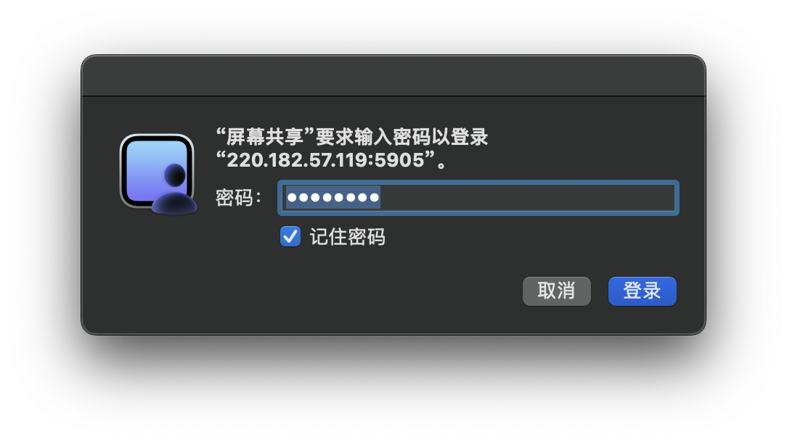
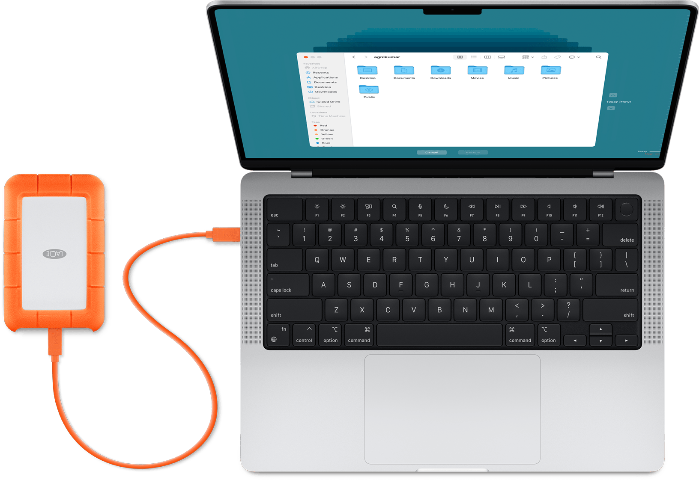
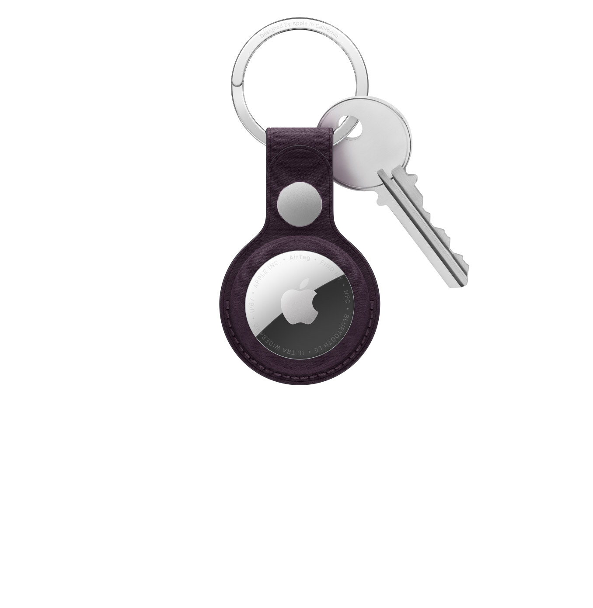

# 1.5 macOS Ventura

macOS 和 Linux 本质上都属于 UNIX 家族，一般把源于 UNIX 的系统叫做”类 UNIX“系统。

【注】本章部分特性可能仅 macOS Ventura 独占。[点击这里了解更多](https://www.apple.com.cn/newsroom/2022/10/macos-ventura-is-now-available/)。

<figure><figcaption></figcaption></figure>


## 使用快捷键提高效率

* **Command-Backspace**：删除文件。
* **Control-A**：光标移动至行首。
* **Control-E**：光标移动至行尾。
* **Control-D**：向后删除字符。
* **Control-K**：删除光标之后的一行或一段的所有文本。
* **Command-Option-Shift-V**：仅文本粘贴。
* **Command-I**：查看文件信息；**Option-Command-W**：关闭打开的所有信息窗口<mark style="color:$success;">（这在不小心打开多个文件信息窗口时非常有用）</mark>；
* **Option-Command-I**：文件信息窗口汇总打开。
* **Control-Command-空格键（或 Fn-E）**：打开字符检视器，你可以从中选取[表情符号和其他符号](https://support.apple.com/guide/mac-help/mchlp1560/mac)。如六角括号〔 〕。
* **Command-Shift-句号（.）**：显示或隐藏隐藏的文件或文件夹。
* **Fn-Delete**：Word 中清除表格内容而不删除表格。或删除光标后一个字符。
* **Shift-单机触控板**：选中 Word 中表格内容。
*   **Command-Option（Alt）-Esc**：打开程序退出窗口，选择需要退出的程序。

    <div align="center"></div>

**参考：**

* [Mac 键盘快捷键](https://support.apple.com/zh-cn/102650)


## 删除远程连接记录

<div align="left"></div>

查询终端已有的链接记录：

```shell
defaults read /Users/用户名/Library/Preferences/com.apple.Terminal.plist PreviousCommands
efaults delete /Users/用户名/Library/Preferences/com.apple.Terminal.plist PreviousCommands
```

即可删除记录。e.g.

```shell
MacBook-Pro:publishNature zhangzh$ defaults read /Users/zhangzh/Library/Preferences/com.apple.Terminal.plist PreviousCommands
(
    "ssh zhangzihao@lxslc7.ihep.ac.cn",
    "ssh zhangzihao@lxslc.ihep.ac.cn"
)
MacBook-Pro:publishNature zhangzh$ defaults delete /Users/zhangzh/Library/Preferences/com.apple.Terminal.plist PreviousCommands
MacBook-Pro:publishNature zhangzh$ 
```

<div align="left"></div>


## 使用 VNC 连接其他主机

在浏览器中输入 VNC 主机地址：

```bash
vnc://220.182.57.119:5905
```

输入主机密码后即可开启 VNC 连接。

<div align="left"></div>


## Homebrew 使用

`Homebrew` 是一款包管理工具，支持 `macOS` 和 `Linux` 系统。更多了解参考[官网](https://brew.sh)及[homebrew论坛](https://brew.idayer.com)。

### **快速安装**

```bash
/bin/bash -c "$(curl -fsSL https://gitee.com/ineo6/homebrew-install/raw/master/install.sh)"
```

将命令粘贴至终端。脚本内置镜像，让 Homebrew 安装的更快。

### **快速更新**

```bash
brew update
```

### **快速卸载**

```bash
/bin/bash -c "$(curl -fsSL https://gitee.com/ineo6/homebrew-install/raw/master/uninstall.sh)"
```

### 使用 Homebrew 安装工具

```bash
$ brew install git
```

#### 命令汇总

```bash
brew -v                 查看homebrew安装版本
brew --help             简洁命令帮助
man brew                完整命令帮助
brew search git         搜索软件包
brew install git        安装软件包
brew uninstall git      卸载安装包
brew list               显示已安装的所有软件包
brew list git           查看安装软件包的安装地址
brew pin git            锁定不想更新的软件包
brew unpin git          取消锁定不想更新的软件包
brew outdated           查看已安装的哪些软件包需要更新以及更新情况
brew update             同步远程最新更新情况，对本机已经安装并有更新的软件用*标明
brew upgrade git        更新单个软件包
brew info git           查看软件包信息
brew home git           访问软件包的官方网站
brew cleanup -n         查看可清理的旧版本包，不执行实际操作
brew cleanup            清理所有已安装软件包的历史版本
brew cleanup git        清理单个已安装软件包的历史版本
```

#### Homebrew 安装路径

```
/usr/local/Cellar       所有homebrew安装的程序,都以[程序名/版本号]存放于本目录下
/usr/local/bin          用于存放所有安装程序的启动链接（相当于快捷方式）
/usr/local/etc          安装程序的配置文件默认存放路径
/usr/local/opt          homebrew下载软件包存放路径
/usr/local/Homebrew     homebrew自身存放文件夹    
```

<mark style="color:$warning;">不要随意的、轻易的更新任何软件包，正所谓“代码能跑就不要乱动”，避免引入新的错误、节约时间和资源、保持系统稳定才是最重要的。</mark>


## 使用 XQuartz 调用 GUI 界面

在 Win 中，如果我们想远程使用服务器的 GUI 界面，常用的软件有 [XShell](https://www.xshell.com/zh/xshell/)、Powershell，而在 Mac 中，我们使用开源的 [XQuartz](https://www.xquartz.org) 软件实现上面的功能，在官网上下载安装包 [XQuartz-2.8.5.pkg](https://github.com/XQuartz/XQuartz/releases/download/XQuartz-2.8.5/XQuartz-2.8.5.pkg)。

#### **在 Ubutun 服务器上打开 X11 转发功能**

编辑 `/etc/ssh/sshd_config`（ssh 的服务端配置文件，注意区别于 `/etc/ssh/ssh_config`）：

```bash
X11Forwarding yes
X11DisplayOffset 10
```

#### **重启 ssh 服务**

```bash
# service sshd restart 
```

#### **配置 Mac 上的 ssh 开启转发功能**

编辑 `/private/etc/ssh/ssh_config`（注意是 `ssh_config`，这是 ssh 的客户端配置）：

```bash
Host *
   SendEnv LANG LC_*
    ForwardX11 yes
Host *
    XAuthLocation /opt/X11/bin/xauth
```

编辑 Mac 上用户目录下的 `.ssh/config` 文件，将文件修改成如下：

```bash
Host *
    ControlMaster auto
    #ControlPath ~/.ssh/cm_socket/%r@%h:%p
    ControlPersist 2h
    ConnectTimeout 50
    StrictHostKeyChecking no
    ServerAliveInterval 10
    ForwardX11Trusted yes
```

连接服务器。e.g.

```bash
$ ssh -XY -p 8022 zhangzh@222.19.64.20
```

这里，可以使用[别称](1.1-xi-tong-guan-li-lei-ming-ling.md#pei-zhi-bie-ming)来避免每次繁琐的输入这些复杂的指令。

【注】登录时可能出现如下错误：服务器提示 `/usr/bin/xauth: timeout in locking authority file /afs/ihep.ac.cn/users/y/yyguo/.Xauthority`，且无法正常启动 X11 服务。请删除 `.Xauthority` 之后重新登录，亦或执行 `kinit && aklog`。


## 在 Mac 或移动硬盘上安装其他系统

参考哔哩哔哩博主「黄杨ME」的[视频投稿](https://www.bilibili.com/video/BV1EX4y1Y7wZ/?spm_id_from=333.999.0.0\&vd_source=745889680230532a09ad7b768ffb84d1)。


## 修复预览.app注释消失的问题

使用 [PDF Annotation Recovery](https://julihoh.github.io/pdf_annotation_fix/web-app/dist/index.html) 在线工具。


## 关闭 Mac 开机界面的其他用户

终端中输入命令以关闭开机界面的其他用户：

```
sudo defaults write /Library/Preferences/com.apple.loginwindow SHOWOTHERUSERS_MANAGED -bool FALSE
```


## 正确跳转 Wi-Fi 认证网页

在需要进行入网认证的地方，Mac 可能出现无法正常跳转认证界面的问题。这通常只需要刷新 DNS 缓存即可。清除 DNS 缓存，需要在终端中并执行命令：

```
sudo killall -HUP mDNSResponder
```

这个过程会因 macOS 版本而有所不同。其他版本命令参考[博文](https://www.sysgeek.cn/flush-dns-cache/)。


**DNS（域名系统）缓存是记录应用程序（例如 Web 浏览器）向 DNS 服务器发出的所有查询的临时数据库**。

在 Web 浏览器中输入 URL 时，浏览器会向 DNS 服务器发出请求，以获取该 URL 域名的 IP地址。浏览器在接收到 IP地址 后，即可在窗口中加载网站。

默认情况下，大多数操作系统（例如 Win 或 macOS）会将 IP地址 和域名系统（DNS）记录缓存起来，以便更快地满足未来的请求。这就是 DNS 缓存。

DNS 缓存可以避免浏览器发出不必要的新请求，而是使用已经存储的信息来加载网站。这减少了服务器响应时间，从而使网站加载更快。

刷新 DNS 缓存会清除缓存中的所有 IP 地址 和 DNS 记录。这有助于解决安全、网络连接和其他问题。

例如，当在浏览器的地址栏中首次输入 [https://www.sysgeek.cn](https://www.sysgeek.cn/) 时，浏览器必须向 DNS 服务器询问该网站的 IP 位置。一旦获取了这些信息，浏览器就可以将其存储在本地缓存中。当下一次再输入该网址时，浏览器将首先在本地缓存中查找其 DNS 信息，以便更快地访问该网站。

问题在于，有时可能会缓存不安全的 IP地址 或已经失效的 IP 结果，这时就需要将其删除。DNS 缓存还可能影响您连接到 Internet 的能力或引起其他问题。

无论出于什么原因，所有主要操作系统都允许用户强制清除此缓存的过程，也就是「刷新 DNS 缓存」。



## 修改程序坞调出时间

调整呼出等待时长为 0 秒钟：

```bash
defaults write com.apple.dock "autohide-delay" -float "0" && killall Dock
```

恢复默认：

```bash
defaults delete com.apple.dock "autohide-delay" && killall Dock
```


## 不重启修复 Mac 的 BUG

点击安装 [FixTim](https://github.com/Lakr233/FixTim/) 软件。


## 让 vim 读取系统剪切板

在 `.vimrc` 中启动：`set clipboard=unnamed` 选项（或添加这行命令）。


## 将 Time Machine 转移到新硬盘

<div align="left"><figure><figcaption><p>参考「谷中望月」的<a href="https://kukmoon.github.io/75f44950511b/">博文</a>。</p></figcaption></figure></div>


## 查看 iPhone 上的隐藏文件

* 下载 [iSH Shell](https://apps.apple.com/us/app/ish-shell/id1436902243) 。
* 使用命令 `mount -t ios ./mnt` 将 iPhone 挂载到 `./mnt` 目录。
* 使用命令 `cd /mnt` 进入挂载的目录。
* 使用命令 `ls -a` 列出挂载目录下的所有文件和文件夹。

**参考**：

* [\[Mobile\] IOS : App to work with hidden folder](https://forum.obsidian.md/t/mobile-ios-app-to-work-with-hidden-folder/25741)


## 查看 Wi-Fi 密码

在终端中输入：

```shell
MacBook-Pro-3:~ zhangzh$ security find-generic-password -wa [wifi name]
```


## 在压缩中剔除 macOS 配置文件

访达默认压缩后，会包含 `.DS_Store` 、 `__MACOSX` 等配置文件，目的是为了 macOS 用户之间的浏览一致性。但给其他系统的用户带了很大困扰。

* `.DS_Store` 记录了文件夹图标的位置、窗口、排序偏好；`__MACOSX` 用于文件备份。

这个问题可以通过「自动操作」来避免：

* 新建自动操作。
* 点击「新建文稿」。
* 选择「快速操作」。
* 工作流程选择「文件及文件夹」，位于「访达」，左侧选择「运行 shell 脚本」。
* 双击添加。
* ```bash
  cd "$(dirname "$1")"
  if [ $# -eq 1 ]; then
      zip -r "$(basename "$1").zip" "$(basename "$1")" \
          -x "*/\\.*" -x "\\.*" -x "*/.DS_Store" -x "*/__MACOSX*"
  else
      zip_args=()
      for f in "$@"; do
          zip_args+=("$(basename "$f")")
      done
      zip -r "归档.zip" "${zip_args[@]}" \
          -x "*/\\.*" -x "\\.*" -x "*/.DS_Store" -x "*/__MACOSX*"
  fi
  ```
* `command-S` 保存，并在任意需要压缩的文件上右击，选择在「快速操作」中使用该自动操作。


## 重置文件关联图标

安装某些软件后（如 WPS），文件图标会被强制修改，如需恢复默认样式，使用下面命令重置：

```bash
sudo rm -rf /Library/Caches/com.apple.iconservices.store
```


## 同步歌单至 Apple music

使用在线工具 [Soundiiz](https://soundiiz.com/)。


## 虚拟音频控制

删除多余的声音输入输出（虚拟）设备：

* 前往 `cd /Library/Audio/Plug-Ins/HAL/`，`rm -rf` 删除对应驱动。
* 输入 `sudo killall coreaudiod` 重启服务。


## 在访达中挂载服务器

<div align="left"><figure><figcaption></figcaption></figure></div>

通过安装 macFUSE 和 SSHFS，可以在 macOS 的访达中直接挂载远程服务器的目录。挂载成功后，远程目录会像本机外接硬盘或 U盘 一样显示在桌面上，用户甚至可以使用任意图形化编辑器直接编辑服务器上的代码，如同使用本机硬盘一样方便。

1. 下载并安装 [macFUSE](https://macfuse.github.io/)；
2. 在设置中选择「启用系统扩展」，并在关机后长按 Touch ID 键进入启动项；
3. 选择「选项」，点击「继续」；
4. 点击左上角「实用工具」->「启动安全性实用工具」，将安全策略设置为「降低安全性」，并选择「允许用户管理来自被认可开发者的内核扩展」；
5. 重启电脑，返回设置隐私与安全性选项，选择允许并重启；
6. 下载并安装 [SSHFS](https://macfuse.github.io/)；
7. 挂载服务器目录：

```bash
mkdir ~/remote
sshfs -p 22 guochenhui@172.25.73.13:/ ~/remote
```

8. 完成。
