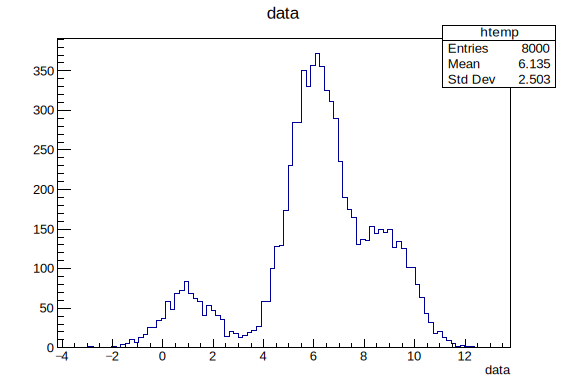

# 2.1 数据处理

## ROOT 中的基本概念

### 树 TTree

Tree 是 ROOT 中的一个重要概念，它是一种用 Branch 存储和处理大量结构化数据的数据结构。TTree 可以看作是一个表格，其中每一行代表一个事件或数据点，每一列代表一个变量或数据字段。

它是 ROOT 数据分析和可视化的基础，与其他 ROOT 库中的功能和工具相结合，进行数据分析、表达和模拟等操作。在命令行模式中使用`.ls`和 Tree 的成员函数查看 Tree 的结构和 Branch：

```bash
->Show()   # 使用该命令可以指定查看某个编号下的branch，例如Show(24)
           # 注意：展示的数据只会保留6位有效数字，在root中仍以本身的数值存储
->Print()  # 依次打印出每个branch的数据
->Scan()   # 每次扫描25行tree中的数据
           # ->用于通过指针访问对象的成员，这三个函数都是Tree这个类的成员函数
```

### 枝 TBranch

TBranch 是 TTree 中存储数据的基本单位，每个分支对应 TTree 中的一列数据。

每个分支都有一个名称（Branch Name），用于唯一标识该分支。分支还有一个数据类型（Data Type），用于指定存储在该分支中的数据类型，如整数、浮点数、字符串等。此外，分支还可以有一个或多个维度（Dimension），用于存储数组类型的数据。

<details>

<summary>创建和使用分支的步骤：</summary>

* 创建分支：使用 TTree 的`Branch()`创建一个分支，并指定分支的名称、数据类型和维度等信息。例如，可以创建一个名为`energy`的分支，存储浮点数类型的能量数据。

<!---->

* 填充数据：通过函数`Fill()`将数据填充到分支中。每次调用`Fill()`，都会将当前的变量值添加到分支中，并进入下一个事件或数据点。

<!---->

* 读取数据：使用 TTree 的`SetBranchAddress()`设置分支的地址，以便在读取数据时将数据存储到指定的变量中。通过调用`GetEntry()`读取 TTree 中的事件或数据点，并将数据填充到指定的变量中。

通过使用分支，可以将大量的结构化数据存储在 TTree 中，并以高效的方式进行读写和访问。分支的概念使得数据的存储和处理更加灵活和高效，适用于大型数据集的存储和分析。

</details>

<details>

<summary>E.g. 查看 Branch 的几种方法</summary>

```bash
[zhangzh@node01 cernstaff]$ rl cernstaff.root 
root [0] 
Attaching file cernstaff.root as _file0...
(TFile *) 0x265e9c0
root [1] .ls
TFile**		cernstaff.root	
 TFile*		cernstaff.root	
  KEY: TTree	T;1	CERN 1988 staff data    // perform Tree or Branch name
root [2] T->Scan()
************************************************************************************************************
*    Row   * Category. * Flag.Flag *   Age.Age * Service.S * Children. * Grade.Gra * Step.Step * Hrweek.Hr *
************************************************************************************************************
*        0 *       202 *        15 *        58 *        28 *         0 *        10 *        13 *        40 *
*        1 *       530 *        15 *        63 *        33 *         0 *         9 *        13 *        40 *
*        2 *       316 *        15 *        56 *        31 *         2 *         9 *        13 *        40 *
*        3 *       361 *        15 *        61 *        35 *         0 *         9 *         7 *        40 *
*        4 *       302 *        15 *        52 *        24 *         2 *         9 *         8 *        40 *
*        5 *       303 *        15 *        60 *        33 *         0 *         7 *        13 *        40 *
*        6 *       302 *        15 *        53 *        25 *         1 *         9 *         9 *        40 *
*        7 *       361 *        15 *        60 *        32 *         1 *         8 *         5 *        40 *
*        8 *       340 *        15 *        51 *        28 *         0 *         8 *        13 *        40 *
*        9 *       361 *        15 *        56 *        32 *         1 *         7 *        13 *        40 *
*       10 *       361 *        15 *        51 *        29 *         0 *         7 *        13 *        40 *
*       11 *       303 *        15 *        54 *        31 *         2 *         8 *        13 *        40 *
*       12 *       302 *        15 *        54 *        29 *         0 *         7 *        13 *        40 *
*       13 *       300 *        15 *        46 *        25 *         0 *         8 *         6 *        40 *
*       14 *       361 *        15 *        54 *        26 *         1 *         7 *        13 *        40 *
*       15 *       361 *        15 *        57 *        29 *         0 *         7 *        13 *        40 *
*       16 *       316 *        11 *        55 *        28 *         0 *         8 *        11 *        40 *
*       17 *       303 *        15 *        55 *        26 *         1 *         7 *        13 *        40 *
*       18 *       361 *        15 *        57 *        29 *         1 *         7 *         8 *        40 *
*       19 *       361 *        15 *        51 *        28 *         2 *         7 *        13 *        40 *
*       20 *       419 *        13 *        54 *        29 *         0 *         5 *        13 *        40 *
*       21 *       202 *        15 *        57 *        26 *         1 *        12 *        13 *        40 *
*       22 *       304 *        15 *        63 *        29 *         1 *        10 *        13 *        40 *
*       23 *       204 *        15 *        56 *        27 *         0 *        11 *         9 *        40 *
*       24 *       204 *        15 *        49 *        27 *         0 *         9 *         9 *        40 *
Type <CR> to continue or q to quit ==> q
************************************************************************************************************
(long long) 25
root [3] T->Show(24)
======> EVENT:24
 Category        = 204
 Flag            = 15
 Age             = 49
 Service         = 27
 Children        = 0
 Grade           = 9
 Step            = 9
 Hrweek          = 40
 Cost            = 0
 Division        = 
 Nation          = 
 root [4] T->Print()
******************************************************************************
*Tree    :T         : CERN 1988 staff data                                   *
*Entries :     3354 : Total =          175563 bytes  File  Size =      47246 *
*        :          : Tree compression factor =   3.69                       *
******************************************************************************
*Br    0 :Category  : Category/I                                             *
*Entries :     3354 : Total  Size=      13989 bytes  File Size  =       4919 *
*Baskets :        1 : Basket Size=      32000 bytes  Compression=   2.74     *
*............................................................................*
*Br    1 :Flag      : Flag/i                                                 *
*Entries :     3354 : Total  Size=      13969 bytes  File Size  =       2165 *
*Baskets :        1 : Basket Size=      32000 bytes  Compression=   6.23     *
*............................................................................*
*Br    2 :Age       : Age/I                                                  *
*Entries :     3354 : Total  Size=      13964 bytes  File Size  =       3489 *
*Baskets :        1 : Basket Size=      32000 bytes  Compression=   3.86     *
*............................................................................*
*Br    3 :Service   : Service/I                                              *
*Entries :     3354 : Total  Size=      13984 bytes  File Size  =       2214 *
*Baskets :        1 : Basket Size=      32000 bytes  Compression=   6.09     *
*............................................................................*
*Br    4 :Children  : Children/I                                             *
*Entries :     3354 : Total  Size=      13989 bytes  File Size  =       2110 *
*Baskets :        1 : Basket Size=      32000 bytes  Compression=   6.39     *
*............................................................................*
*Br    5 :Grade     : Grade/I                                                *
*Entries :     3354 : Total  Size=      13974 bytes  File Size  =       2676 *
*Baskets :        1 : Basket Size=      32000 bytes  Compression=   5.04     *
*............................................................................*
*Br    6 :Step      : Step/I                                                 *
*Entries :     3354 : Total  Size=      13969 bytes  File Size  =       2889 *
*Baskets :        1 : Basket Size=      32000 bytes  Compression=   4.67     *
*............................................................................*
*Br    7 :Hrweek    : Hrweek/I                                               *
*Entries :     3354 : Total  Size=      13979 bytes  File Size  =        642 *
*Baskets :        1 : Basket Size=      32000 bytes  Compression=  21.01     *
*............................................................................*
*Br    8 :Cost      : Cost/I                                                 *
*Entries :     3354 : Total  Size=      13965 bytes  File Size  =       6939 *
*Baskets :        1 : Basket Size=      32000 bytes  Compression=   1.94     *
*............................................................................*
*Br    9 :Division  : Division/C                                             *
*Entries :     3354 : Total  Size=      25238 bytes  File Size  =      10048 *
*Baskets :        2 : Basket Size=      32000 bytes  Compression=   2.46     *
*............................................................................*
*Br   10 :Nation    : Nation/C                                               *
*Entries :     3354 : Total  Size=      24123 bytes  File Size  =       7928 *
*Baskets :        2 : Basket Size=      32000 bytes  Compression=   2.98     *
*............................................................................*
```

</details>

### 画布 Canvas

画布是用来承载绘图的窗口或者页面。在画布上可以绘制一个或多个图形，并设置标题、坐标轴、图例等元素。画布可以个性化，如调整坐标轴的形式、范围、标题名称、轴名称等等：

<details>

<summary>Canvas 类的成员函数</summary>

```c
root [0] TCanvas *c1 = new TCanvas("c1","c1",600,600)
(TCanvas *) 0x14d73e360
root [1] c1->
AbsCoordinates
AbsPixeltoX
AbsPixeltoXY
AbsPixeltoY
AbstractMethod
AddExec
AppendPad
AreAllSignalsBlocked
AreSignalsBlocked
AutoExec
BlockAllSignals
BlockSignals
Browse
BuildLegend
ChangedBy
CheckedHash
Class
ClassName
Class_Name
Class_Version
Clear
ClearPadSave
Cleared
Clip
ClipPolygon
ClippingCode
Clone
Close
CloseToolTip
Closed
CollectClassSignalLists
Compare
Connect
Connected
Constructor
Copy
CopyPixmap
CopyPixmaps
CreateToolTip
DeclFileLine
DeclFileName
Delete
DeleteCanvasPainter
DeleteExec
DeleteToolTip
Destroyed
Destructor
Dictionary
Disconnect
DisconnectWidget
Disconnected
DistancetoLine
DistancetoPrimitive
Divide
DivideSquare
Draw
DrawClass
DrawClassObject
DrawClone
DrawClonePad
DrawCollideGrid
DrawColorTable
DrawCrosshair
DrawFrame
Dump
EditorBar
EmbedInto
Emit
EnterLeave
Error
EventPave
Execute
ExecuteEvent
ExecuteEventAxis
Fatal
FeedbackMode
FindObject
Flush
ForceUpdate
GetAbsHNDC
GetAbsWNDC
GetAbsXlowNDC
GetAbsYlowNDC
GetAfile
GetAspectRatio
GetAstat
GetAutoExec
GetBBox
GetBBoxCenter
GetBorderMode
GetBorderSize
GetBottomMargin
GetCanvas
GetCanvasID
GetCanvasImp
GetCanvasPainter
GetCanvasPar
GetClickSelected
GetClickSelectedPad
GetContextMenu
GetCrosshair
GetDISPLAY
GetDoubleBuffer
GetDrawOption
GetDtorOnly
GetEvent
GetEventX
GetEventY
GetFillColor
GetFillStyle
GetFrame
GetFrameBorderMode
GetFrameBorderSize
GetFrameFillColor
GetFrameFillStyle
GetFrameLineColor
GetFrameLineStyle
GetFrameLineWidth
GetGLDevice
GetGridx
GetGridy
GetHNDC
GetHighLightColor
GetIconName
GetLeftMargin
GetLineColor
GetLineStyle
GetLineWidth
GetListOfClassSignals
GetListOfConnections
GetListOfExecs
GetListOfPrimitives
GetListOfSignals
GetLogx
GetLogy
GetLogz
GetMaxPickDistance
GetMother
GetName
GetNumber
GetObjectInfo
GetObjectStat
GetOption
GetPad
GetPadPaint
GetPadPar
GetPadPointer
GetPadSave
GetPainter
GetPhi
GetPixmapID
GetPrimitive
GetRange
GetRangeAxis
GetRightMargin
GetSelected
GetSelectedOpt
GetSelectedPad
GetSelectedX
GetSelectedY
GetShowEditor
GetShowEventStatus
GetShowToolBar
GetShowToolTips
GetTheta
GetTickx
GetTicky
GetTitle
GetTopMargin
GetUniqueID
GetUxmax
GetUxmin
GetUymax
GetUymin
GetView
GetView3D
GetViewer3D
GetVirtCanvas
GetWNDC
GetWh
GetWindowHeight
GetWindowTopX
GetWindowTopY
GetWindowWidth
GetWw
GetX1
GetX2
GetXfile
GetXlowNDC
GetXsizeReal
GetXsizeUser
GetXstat
GetY1
GetY2
GetYfile
GetYlowNDC
GetYsizeReal
GetYsizeUser
GetYstat
HandleInput
HandleTimer
HasConnection
HasCrosshair
HasFixedAspectRatio
HasInconsistentHash
HasMenuBar
HasViewer3D
Hash
HighLight
HighPriority
HighlightConnect
Highlighted
Iconify
ImplFileLine
ImplFileName
IncrementPaletteColor
Info
InheritsFrom
Inspect
InvertBit
IsA
IsBatch
IsBeingResized
IsDestructed
IsDrawn
IsEditable
IsEqual
IsFolder
IsGrayscale
IsModified
IsOnHeap
IsRetained
IsSortable
IsTransparent
IsVertical
IsWeb
IsZombie
LowPriority
MakeDefCanvas
MayNotUse
Message
Modified
Modify
MoveOpaque
NextPaletteColor
Notify
NumberOfConnections
NumberOfSignals
Obsolete
OpaqueMoving
OpaqueResizing
Pad
PadInHighlightMode
PadInSelectionMode
PadtoX
PadtoY
Paint
PaintBorderPS
PaintBox
PaintFillArea
PaintFillAreaHatches
PaintFillAreaNDC
PaintHatches
PaintLine
PaintLine3D
PaintLineNDC
PaintModified
PaintPadFrame
PaintPolyLine
PaintPolyLine3D
PaintPolyLineNDC
PaintPolyMarker
PaintText
PaintTextNDC
Pick
Picked
PixeltoX
PixeltoXY
PixeltoY
PlaceBox
Pop
PopTopLevelSelectable
Print
ProcessedEvent
PushSelectableObject
PushTopLevelSelectable
RaiseWindow
Range
RangeAxis
RangeAxisChanged
RangeChanged
Read
RecordLatex
RecordPave
RecursiveRemove
RedrawAxis
ReleaseViewer3D
ResetAttFill
ResetAttLine
ResetAttPad
ResetBit
ResetDrawn
ResetToolTip
ResetView3D
Resize
ResizeOpaque
ResizePad
Resized
SaveAs
SaveFillAttributes
SaveLineAttributes
SavePrimitive
SaveSource
Selected
SetAfile
SetAstat
SetAttFillPS
SetAttLinePS
SetAttMarkerPS
SetAttTextPS
SetBBoxCenter
SetBBoxCenterX
SetBBoxCenterY
SetBBoxX1
SetBBoxX2
SetBBoxY1
SetBBoxY2
SetBatch
SetBit
SetBorderMode
SetBorderSize
SetBottomMargin
SetCanvas
SetCanvasImp
SetCanvasSize
SetClickSelected
SetClickSelectedPad
SetCopyGLDevice
SetCrosshair
SetCursor
SetDoubleBuffer
SetDrawOption
SetDtorOnly
SetEditable
SetFillAttributes
SetFillColor
SetFillColorAlpha
SetFillStyle
SetFixedAspectRatio
SetFolder
SetFrameBorderMode
SetFrameBorderSize
SetFrameFillColor
SetFrameFillStyle
SetFrameLineColor
SetFrameLineStyle
SetFrameLineWidth
SetGLDevice
SetGrayscale
SetGrid
SetGridx
SetGridy
SetHighLightColor
SetLeftMargin
SetLineAttributes
SetLineColor
SetLineColorAlpha
SetLineStyle
SetLineWidth
SetLogx
SetLogy
SetLogz
SetMargin
SetMaxPickDistance
SetName
SetNumber
SetObjectStat
SetPad
SetPadSave
SetPhi
SetRealAspectRatio
SetRetained
SetRightMargin
SetSelected
SetSelectedPad
SetSupportGL
SetTheta
SetTicks
SetTickx
SetTicky
SetTitle
SetToolTipText
SetTopMargin
SetUniqueID
SetVertical
SetView
SetViewer3D
SetWindowPosition
SetWindowSize
SetXfile
SetXstat
SetYfile
SetYstat
Show
ShowGuidelines
ShowMembers
Size
StartEditing
Streamer
StreamerNVirtual
SupportAlpha
SysError
TAttBBox2D
TAttFill
TAttLine
TAttPad
TCanvas
TObject
TPad
TQObject
TVirtualPad
TestBit
TestBits
ToggleAutoExec
ToggleEditor
ToggleEventStatus
ToggleToolBar
ToggleToolTips
UnZoomed
Update
UseCurrentStyle
UseGL
UtoAbsPixel
UtoPixel
VtoAbsPixel
VtoPixel
WaitPrimitive
Warning
Write
XYtoAbsPixel
XYtoPixel
XtoAbsPixel
XtoPad
XtoPixel
YtoAbsPixel
YtoPad
YtoPixel
cd
kAutoExec
kBitMask
kCanDelete
kCannotMove
kCannotPick
kClearAfterCR
kClipFrame
kFraming
kHasUUID
kHori
kInconsistent
kInvalidObject
kIsGrayscale
kIsOnHeap
kIsReferenced
kMenuBar
kMoveOpaque
kMustCleanup
kNoContextMenu
kNotDeleted
kObjInCanvas
kOverwrite
kPrintingPS
kResizeOpaque
kShowEditor
kShowEventStatus
kShowToolBar
kShowToolTips
kSingleKey
kWriteDelete
kZombie
ls
operator delete
operator delete[]
operator new
operator new[]
operator=
x3d
```

</details>

<details>

<summary>E.g. 将多个画布与图片连续保存到一个 PDF 文件中</summary>

```c
{
   TCanvas* canvas = new TCanvas("canvas");
   TH1F* histo = new TH1F("histo","test 1",10,0.,10.);
   histo->SetFillColor(2);
   histo->Fill(2.);
   histo->Draw();
   canvas->Print("plots.pdf(","Title:One bin filled");
   histo->Fill(4.);
   histo->Draw();
   canvas->Print("plots.pdf","Title:Two bins filled");
   histo->Fill(6.);
   histo->Draw();
   canvas->Print("plots.pdf","Title:Three bins filled");
   histo->Fill(8.);
   histo->Draw();
   canvas->Print("plots.pdf","Title:Four bins filled");
   histo->Fill(8.);
   histo->Draw();
   canvas->Print("plots.pdf)","Title:The fourth bin content is 2");
}
```

</details>

### 垫子 Pad

垫子是画布上的一个独立的绘图区域，可以在上面绘制图形、直方图、函数等。画布上可以包含一个或多个图形区域，每个图形区域可以有自己的坐标轴、标题等属性。通过在画布上创建多个图形区域，可以实现多图并列，或绘制复杂的布局。


## 文件串联与合并

* `TChain`函数：用于若干格式一致的 ROOT 文件串联读取：

```bash
TChain* ch = new TChain("TreeName");    // 合并读取/home/username/data/目录下的所有root
ch->Add("/home/username/data/*.root");
```

<details>

<summary>E.g. <code>TChain</code>函数合并 3 个 root 文件并绘制 </summary>

```bash
[zhangzh@node01 tree]$ rl
root [1] TChain *chain = new TChain("tree")
(TChain *) 0x1cb82a0
root [2] chain->Add("file1.root");
root [3] chain->Add("file2.root");
root [4] chain->Add("file3.root");
root [5] chain->Print()
******************************************************************************
*Chain   :tree      : file1.root                                             *
******************************************************************************
******************************************************************************
*Tree    :tree      : my first tree                                          *
*Entries :     1000 : Total =            8915 bytes  File  Size =       7687 *
*        :          : Tree compression factor =   1.10                       *
******************************************************************************
*Br    0 :data      : data/D                                                 *
*Entries :     1000 : Total  Size=       8560 bytes  File Size  =       7314 *
*Baskets :        1 : Basket Size=      32000 bytes  Compression=   1.10     *
*............................................................................*
******************************************************************************
*Chain   :tree      : file2.root                                             *
******************************************************************************
******************************************************************************
*Tree    :tree      : my second tree                                         *
*Entries :     5000 : Total =           40988 bytes  File  Size =      35732 *
*        :          : Tree compression factor =   1.14                       *
******************************************************************************
*Br    0 :data      : data/D                                                 *
*Entries :     5000 : Total  Size=      40631 bytes  File Size  =      35341 *
*Baskets :        2 : Basket Size=      32000 bytes  Compression=   1.14     *
*............................................................................*
******************************************************************************
*Chain   :tree      : file3.root                                             *
******************************************************************************
******************************************************************************
*Tree    :tree      : my third tree                                          *
*Entries :     2000 : Total =           16915 bytes  File  Size =      14404 *
*        :          : Tree compression factor =   1.15                       *
******************************************************************************
*Br    0 :data      : data/D                                                 *
*Entries :     2000 : Total  Size=      16560 bytes  File Size  =      14027 *
*Baskets :        1 : Basket Size=      32000 bytes  Compression=   1.15     *
*............................................................................*
root [6] chain->Draw("data")
```

</details>

<figure><figcaption><p>TChain函数合并 3 个 root 文件并绘制  </p></figcaption></figure>

* `hadd`命令：用于文件合并。 E.g.

```shell
[zhangzh@node01 gamma_4300M_10deg_700m_10GeV]$ hadd total.root nonoise*.root
hadd Target file: total.root
hadd compression setting for all output: 1
hadd Source file 1: nonoise_pix5pe14pmt5_CER100001.root
hadd Source file 2: nonoise_pix5pe14pmt5_CER100002.root
hadd Source file 3: nonoise_pix5pe14pmt5_CER100003.root
hadd Target path: total.root:/
[zhangzh@node01 gamma_4300M_10deg_700m_10GeV]$ ls
nonoise_pix5pe14pmt5_CER100001.root  nonoise_pix5pe14pmt5_CER100005.root  nonoise_pix5pe14pmt5_CER100009.root
nonoise_pix5pe14pmt5_CER100002.root  nonoise_pix5pe14pmt5_CER100006.root  nonoise_pix5pe14pmt5_CER100010.root
nonoise_pix5pe14pmt5_CER100003.root  nonoise_pix5pe14pmt5_CER100007.root  total.root
nonoise_pix5pe14pmt5_CER100004.root  nonoise_pix5pe14pmt5_CER100008.root
```


## 数据读取与写入

root文件也是可以读取和写入的，这和 C语言的用法几乎一致。E.g.

<details>

<summary>E.g. 从root文件中读取数据到文本</summary>

```c
#include <fstream>
#include <string>

int ana(){
    string dir = "/home/users/z/zhangzh/guide/root/example_cernstaff/";
    string name = "cernstaff.root";
    string filename = dir + name;

    int AGE,N;
    TFile *f = new TFile(filename.c_str());    // 以c格式读取
    TTree *my_tree = (TTree*)f->Get("T");
    TBranch *my_age = my_tree->GetBranch("Age");
    my_age->SetAddress(&AGE);

    N =(int)my_tree->GetEntries();
    for(int i=0;i<N;i++){
        my_age->GetEntry(i);
        cout<<AGE<<endl;
    }
    return 0;
}
```

</details>

<details>

<summary>E.g. 从文本中读取数据后绘制</summary>

```c
#include <fstream>

int h1(){
    ifstream read("age.txt");
    ofstream write("age_graph.txt");

    int N=3354;
    int age=1;
    TH1I *h1 = new TH1I("h1","the age distribution in CERN 1988",100,0,100);
    for(int i=0;i<N;i++){
        read >> age;
        h1->Fill(age);
    }

    h1->Draw();
    for(int i=20;i<70;i++){        
    cout<<"the age number of people in the age of "<<i<<" is "<<h1->GetBinContent(i)<<endl;
    write << i << "\t"<<h1->GetBinContent(i) << "\n";
    }
    read.close();
    write.close();
    return 0;
}
```

</details>

<details>

<summary>E.g. 通过指定地址，获取事例数，逐个读取和填充</summary>

```c
void ra_dec(){
    
    TCanvas *c1 = new TCanvas("c1","ra:dec",1200,500);

    static double rera,redec;
    TFile *f1 = new TFile("Rec2017040.root");
    TTree *tr = (TTree*)f1->Get("rst");
    tr->SetBranchAddress("ra",&rera);
    tr->SetBranchAddress("dec",&redec);       // 两种写法，其一
    //TBranch *b1 = tr -> GetBranch("ra");    // 两种写法，其二
    //TBranch *b2 = tr -> GetBranch("dec");
    //b1 -> SetAddress(&rera);
    //b2 -> SetAddress(&redec);

    int nentries = tr->GetEntries();
    TH2D *h1 = new TH2D("h1","ra:dec",360,0,360,150,-60,90);
    for(int i=0;i<nentries;i++){
       tr->GetEntry(i);
       h1->Fill(rera,redec);
    }

    h1->GetXaxis()->SetTitle("ra");
    h1->GetYaxis()->SetTitle("dec");
    gStyle->SetOptStat(0);
    gStyle->SetPalette(53);

    c1->cd(1);
    h1->Draw("colz");
}
```

</details>

<figure><figcaption></figcaption></figure>

<details>

<summary>E.g. 通过输入输出流，快速绘制图案</summary>

```c
    int n = 1000;
    int m = 0;
    double E[n],S[n];
    FILE *fil1 = fopen("./filename.txt","r");while(fscanf(fil1,"%*lf %lf  %lf ",&E[m],&S[m])!=EOF)   { m++;}  m=0; fclose(fil1);
    TGraph *gr1 = new TGraph(n,E,S);
    gr1->Draw();
```

</details>


## 数值处理

### 普通计算

当需要一个基础的计算器时，可以使用 root。E.g.

```bash
root [0] 2+3
(int) 5
root [1] pow(3,05)
(double) 243.00000
root [2] pow(3,5)
(double) 243.00000
root [3] pow(3,0.5)
(double) 1.7320508
root [4] 4/6       # 需要区分整形还是浮点型
(int) 0
root [5] 4./6      # 输入小数点后默认浮点型
(double) 0.66666667
root [6] sqrt(3)
(double) 1.7320508
root [7] TMath::Pi() # ::是作用域解析操作符，用于访问命名空间、类、结构体或全局作用域中的成员
(double) 3.141593
root [8] TMath::Erf(.2)
(double) 0.222703
root [9] 6%4
(int) 2
```

### 插值计算 Eval

**Eval(,,)函数** 可以很方便的帮我们计算出给定数列的差值结果。其中第一个参数是差值的位置，第二个参数有0,1,2三种，分别表示线性插值方法、样条插值方法多项式插值方法。第三个参数`R`：使用线性插值方法进行插值计算，并且对结果进行平滑处理。`Q`：使用快速线性插值方法进行插值计算。这种方法通常速度更快，但可能不够精确。`C`：使用使用三次样条插值方法进行插值计算。`S`表示插值计算时不进行平滑处理

<details>

<summary>E.g. 插值计算</summary>

```c
#include <iostream>
#include <TCanvas.h>
#include <TGraph.h>
#include <TAxis.h>

int main() {
    // 已知数据
    double x_known[] = {0.01, 0.03, 0.05, 0.1, 0.3, 0.5, 1, 3, 5, 10};
    double y_known[] = {1.10640001, 0.66946668, 0.57107761, 0.47266803, 0.38906572, 0.36085572, 0.32498436, 0.30465693, 0.32960366, 0.3301555};

    TGraph graph(10, x_known, y_known);    // 创建TGraph对象
    TCanvas canvas("canvas", "Smooth Curve", 800, 600);
    graph.Draw("AC");

    // 获取插值结果并输出
    double W_bin_eg = 0.1; // W_bin_eg的值，根据实际情况进行修改
    double eVTTeV = 1.0; // eVTTeV的值，根据实际情况进行修改
    for (int i = 0; i < 70; i++) {
        double x_interpolate = pow(10, 10 + (i + 0.5) * W_bin_eg) * eVTTeV;
        double y_interpolate = graph.Eval(x_interpolate, 0, "S");
        std::cout << "x_interpolate = " << x_interpolate << ", y_interpolate = " << y_interpolate << std::endl;
    }

    canvas.Update();    // 显示绘制结果
    canvas.SaveAs("smooth_curve.png");

    return 0;
}
```

</details>


### 条件判选 Cut

数据处理过程往往需要为数据添加一些限制条件，使结果达到希望呈现的样子，在脚本中，按照C语言规范正常添加即可，在命令行模式中添加限制条件，写法如下：

```shell
->Draw("数据名","限制条件","图型")
```

**E.g.**

```shell
root [11] T->Draw("Nation:Children","Children==2","colz")    //孩子为2的国家
Info in <TCanvas::MakeDefCanvas>:  created default TCanvas with name c1
(long long) 903
```

多个限制条件之间使用`&&`符号相连，或则为`||`

```shell
root [13] TCut a_cut = "Age>30 && Age<40"
(TCut &) Name: CUT Title: Age>30 && Age<40
root [14] TCut c_cut = "Children == 1"
(TCut &) Name: CUT Title: Children == 1
root [21] T->Draw("Age",a_cut && c_cut && "Nation ==\"FR\"","")
(long long) 53
```

### 拟合 Fiting


[2.2.3-wu-cha-yu-ni-he.md](2.2.3-wu-cha-yu-ni-he.md)


### 洛伦兹不变量 TLorentzVector

_参考：_

[_http://www.yinghuofly.com/knowledge-base/roottutorial4/_](http://www.yinghuofly.com/knowledge-base/roottutorial4/)

[_https://root.cern.ch/doc/master/classTLorentzVector.html_](https://root.cern.ch/doc/master/classTLorentzVector.html)


## 批量处理模式

批量模式意味着图片将不会以 GUI 的窗口形式出现，而是在后台完成一系列操作，这非常适用于长时间大作业的处理，打开方式是`gROOT->SetBatch(kTRUE)`。


## 展示数据信息

`ToggleEventStatus()`是 canvas 的成员函数。用于展示指针处的数据状态，打开后，指针所在位置的数据信息会被呈现在面板下方。


