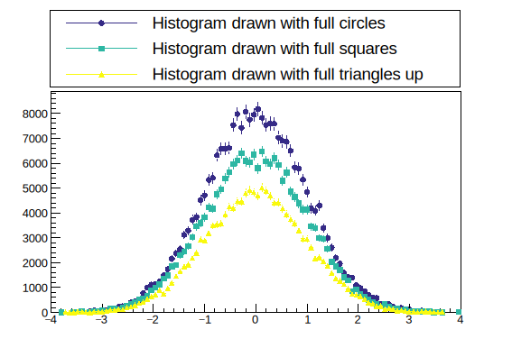

# 2.1 数据分析

## 文件串联与合并

* `TChain`函数：用于若干格式一致的 ROOT 文件串联读取。E.g.

```bash
TChain* ch = new TChain("TreeName");    // 合并读取/home/username/data/目录下的所有root
ch->Add("/home/username/data/*.root");
```

* `hadd`命令：用于文件合并。E.g.

```shell
[zhangzh@node01 gamma_4300M_10deg_700m_10GeV]$ hadd total.root nonoise*.root
hadd Target file: total.root
hadd compression setting for all output: 1
hadd Source file 1: nonoise_pix5pe14pmt5_CER100001.root
hadd Source file 2: nonoise_pix5pe14pmt5_CER100002.root
hadd Source file 3: nonoise_pix5pe14pmt5_CER100003.root
hadd Target path: total.root:/
[zhangzh@node01 gamma_4300M_10deg_700m_10GeV]$ ls
nonoise_pix5pe14pmt5_CER100001.root  nonoise_pix5pe14pmt5_CER100005.root  nonoise_pix5pe14pmt5_CER100009.root
nonoise_pix5pe14pmt5_CER100002.root  nonoise_pix5pe14pmt5_CER100006.root  nonoise_pix5pe14pmt5_CER100010.root
nonoise_pix5pe14pmt5_CER100003.root  nonoise_pix5pe14pmt5_CER100007.root  total.root
nonoise_pix5pe14pmt5_CER100004.root  nonoise_pix5pe14pmt5_CER100008.root
```


## 数据读取与写入

<details>

<summary>E.g. 向一个root文件中写入数据</summary>

```c
void skymapMCroot() {
	
	double xx,yy;
	TFile *file = new TFile("data.root", "RECREATE");
	TTree *tree = new TTree("tree", "Random Data Tree");
	tree->Branch("xx", &xx, "x/D");
	tree->Branch("yy", &yy, "y/D");

	for (int i=0; i<5.20587e+5; i++) {
		xx = gRandom->Uniform(0,360);
		yy = gRandom->Uniform(0, 60);
		tree->Fill();
	}

	file->Write();
	file->Close();
	delete file; // 释放内存
}
```

</details>

<details>

<summary>E.g. 从root文件中读取数据到文本</summary>

```c
#include <fstream>
#include <string>

int ana(){

    string dir = "/home/users/z/zhangzh/guide/root/example_cernstaff/";
    string name = "cernstaff.root";
    string filename = dir + name;

    int AGE,N;
    TFile *f = new TFile(filename.c_str());    // 以c格式读取
    TTree *my_tree = (TTree*)f->Get("T");
    TBranch *my_age = my_tree->GetBranch("Age");
    my_age->SetAddress(&AGE);

    N =(int)my_tree->GetEntries();
    for(int i=0;i<N;i++){
        my_age->GetEntry(i);
        cout<<AGE<<endl;
    }
    return 0;
}
```

</details>

<details>

<summary>E.g. 从文本中读取数据后绘制</summary>

```c
#include <fstream>

int h1(){
    ifstream read("age.txt");
    ofstream write("age_graph.txt");

    int N=3354;
    int age=1;
    TH1I *h1 = new TH1I("h1","the age distribution in CERN 1988",100,0,100);
    for(int i=0;i<N;i++){
        read >> age;
        h1->Fill(age);
    }

    h1->Draw();
    for(int i=20;i<70;i++){        
    cout<<"the age number of people in the age of "<<i<<" is "<<h1->GetBinContent(i)<<endl;
    write << i << "\t"<<h1->GetBinContent(i) << "\n";
    }
    read.close();
    write.close();
    return 0;
}
```

</details>

<details>

<summary>E.g. 通过指定地址，获取事例数，逐个读取和填充</summary>

```c
void ra_dec(){
    
    TCanvas *c1 = new TCanvas("c1","ra:dec",1200,500);

    static double rera,redec;
    TFile *f1 = new TFile("Rec2017040.root");
    TTree *tr = (TTree*)f1->Get("rst");
    tr->SetBranchAddress("ra",&rera);
    tr->SetBranchAddress("dec",&redec);       // 两种写法，其一
    //TBranch *b1 = tr -> GetBranch("ra");    // 两种写法，其二
    //TBranch *b2 = tr -> GetBranch("dec");
    //b1 -> SetAddress(&rera);
    //b2 -> SetAddress(&redec);

    int nentries = tr->GetEntries();
    TH2D *h1 = new TH2D("h1","ra:dec",360,0,360,150,-60,90);
    for(int i=0;i<nentries;i++){
       tr->GetEntry(i);
       h1->Fill(rera,redec);
    }

    h1->GetXaxis()->SetTitle("ra");
    h1->GetYaxis()->SetTitle("dec");
    gStyle->SetOptStat(0);
    gStyle->SetPalette(53);

    c1->cd(1);
    h1->Draw("colz");
}
```

</details>

<figure><figcaption></figcaption></figure>

<details>

<summary>E.g. 通过输入输出流，快速绘制图案</summary>

```c
    
    std::ifstream file("./filename.txt");
    long int n = 0;
    std::string line;

    while (std::getline(file, line)) {
        n++;
    }
    file.close();
 //======================== 自动获取行数  
    
    for (int i = 0; i < 5; i++) {
        char line[1000];
        fgets(line, sizeof(line), fil1);
    }
    
//========================= 忽略前5行输出
    
//    int n = 1000;
    int m = 0;
    double E[n],S[n];
    FILE *fil1 = fopen("./filename.txt","r");while(fscanf(fil1,"%lf  %lf",&E[m],&S[m])!=EOF)   { m++;}  m=0; fclose(fil1);
    TGraph *gr1 = new TGraph(n,E,S);
    gr1->Draw();
```


动态数组c

```c
#include <iostream>
#include <fstream>
#include <vector>
#include <cstdio>

int test() {

    std::ifstream file("filename.txt");
    std::vector<double> E, S; 
    double e, s;
    while (file >> e >> s) {
        E.push_back(e);
        S.push_back(s);
    }
    file.close();

    TGraph *gr1 = new TGraph(E.size(), &E[0], &S[0]);
    gr1->Draw("APL");

    return 0;
}

```

</details>


## 数值处理

### 基本运算

当需要一个基础的计算器时，可以使用 root。E.g.

```bash
root [0] 2+3
(int) 5
root [1] pow(3,05)
(double) 243.00000
root [2] pow(3,5)
(double) 243.00000
root [3] pow(3,0.5)
(double) 1.7320508
root [4] 4/6       # 需要区分整形还是浮点型
(int) 0
root [5] 4./6      # 输入小数点后默认浮点型
(double) 0.66666667
root [6] sqrt(3)
(double) 1.7320508
root [7] TMath::Pi() # ::是作用域解析操作符，用于访问命名空间、类、结构体或全局作用域中的成员
(double) 3.141593
root [8] TMath::Erf(.2)
(double) 0.222703
root [9] 6%4
(int) 2
```

### 插值计算

<table data-full-width="false"><thead><tr><th width="226">拟合参数</th><th>含义</th></tr></thead><tbody><tr><td>kLINEAR </td><td>线性插值</td></tr><tr><td>kPOLYNOMIAL </td><td>多项式插值，用于少量点，因为会引入较大的振荡</td></tr><tr><td>kCSPLINE </td><td>具有自然边界条件的三次样条</td></tr><tr><td>kCSPLINE_PERIODIC </td><td>具有周期边界条件的三次样条</td></tr><tr><td>kAKIMA </td><td>具有自然边界条件的 Akima 样条（至少需要 5 个点）</td></tr><tr><td>kAKIMA_PERIODIC </td><td>具有周期边界的 Akima 样条（至少需要 5 个点）</td></tr></tbody></table>


**Eval(,,)函数** 可以很方便的帮我们计算出给定数列的差值结果。其中第一个参数是差值的位置，第二个参数有0,1,2三种，分别表示线性插值方法、样条插值方法多项式插值方法。第三个参数`R`：使用线性插值方法进行插值计算，并且对结果进行平滑处理。`Q`：使用快速线性插值方法进行插值计算。这种方法通常速度更快，但可能不够精确。`C`：使用使用三次样条插值方法进行插值计算。`S`表示插值计算时不进行平滑处理

TGraph::Eval

[使用TSpline](https://root.cern/doc/v630/classTSpline.html)在此图中在 x 处插入点。

* 如果 spline==0 且 option="" 则计算靠近 x 的两个点之间的线性插值。如果 x 超出图形范围，则计算线性外推法。
* 如果 spline==0 且 option="S"使用此图创建[TSpline3](https://root.cern/doc/v630/classTSpline3.html)对象，并返回样条线的插值。内部创建的样条线在返回时被删除。
*   如果指定了样条线，则它用于返回插值。

    如果点在 X 中排序，则使用二分搜索（明显更快），需要在调用 TGraph:: [Eval](https://root.cern/doc/v630/classTGraph.html#a894faf9f0d66fa7f0b795be7567298c1)之前设置位 TGraph::SetBit(TGraph::kIsSortedX)以指示图在 X 中排序。

<details>

<summary>E.g. Eval 插值计算</summary>

```c
#include <iostream>
#include <TCanvas.h>
#include <TGraph.h>
#include <TAxis.h>

int main() {
    // 已知数据
    double x_known[] = {0.01, 0.03, 0.05, 0.1, 0.3, 0.5, 1, 3, 5, 10};
    double y_known[] = {1.10640001, 0.66946668, 0.57107761, 0.47266803, 0.38906572, 0.36085572, 0.32498436, 0.30465693, 0.32960366, 0.3301555};

    TGraph graph(10, x_known, y_known);    // 创建TGraph对象
    TCanvas canvas("canvas", "Smooth Curve", 800, 600);
    graph.Draw("AC");

    // 获取插值结果并输出
    double W_bin_eg = 0.1; // W_bin_eg的值，根据实际情况进行修改
    double eVTTeV = 1.0; // eVTTeV的值，根据实际情况进行修改
    for (int i = 0; i < 70; i++) {
        double x_interpolate = pow(10, 10 + (i + 0.5) * W_bin_eg) * eVTTeV;
        double y_interpolate = graph.Eval(x_interpolate, 0, "S");
        std::cout << "x_interpolate = " << x_interpolate << ", y_interpolate = " << y_interpolate << std::endl;
    }

    canvas.Update();    // 显示绘制结果
    canvas.SaveAs("smooth_curve.png");

    return 0;
}
```

</details>

`TH::Interpolate(x) or TH::Interpolate(x, y) or TH::Interpolate(x, y, z)`

在直方图中进行线性插值来估计某个点的值，而不局限于直方图的bin中心的值。支持1维、2维、3维。


### 积分 Integral

* `TGraph::Integral(first, last)`

[请注意，此函数计算TGraph](https://root.cern/doc/master/classTGraph.html)的点所包围的多边形的面积。由[TGraph](https://root.cern/doc/master/classTGraph.html)的点定义的多边形段不需要形成闭合多边形，因为闭合多边形的最后一个多边形段被视为连接最后一个[TGraph](https://root.cern/doc/master/classTGraph.html)点与第一个点的线。很明显，点的顺序对于定义多边形至关重要。另请注意，线段不应相交。

如果last=-1（默认）last 设置为最后一个点。

如果 (first < 0)，则采用第一个点 (0)。

* `TH1::Integral(binx1, binx2, option="")`

默认情况下，积分计算为范围内 bin 内容的总和。如果指定了选项“width”，则积分是 bin 内容乘以 x 中的 bin 宽度之和。


### 条件判选 Cut

数据处理过程往往需要为数据添加一些限制条件，使结果达到希望呈现的样子，在脚本中，按照C语言规范正常添加即可，在命令行模式中添加限制条件，写法如下：

```shell
->Draw("数据名","限制条件","图型")
```

**E.g.**

```shell
root [11] T->Draw("Nation:Children","Children==2","colz")    //孩子为2的国家
Info in <TCanvas::MakeDefCanvas>:  created default TCanvas with name c1
(long long) 903
```

多个限制条件之间使用`&&`符号相连，或则为`||`，也可以使用`TCut`类合并。

```shell
root [13] TCut a_cut = "Age>30 && Age<40"
(TCut &) Name: CUT Title: Age>30 && Age<40
root [14] TCut c_cut = "Children == 1"
(TCut &) Name: CUT Title: Children == 1
root [21] T->Draw("Age",a_cut && c_cut && "Nation ==\"FR\"","")
(long long) 53
```

### 拟合 Fiting


[2.2.5-wu-cha-yu-ni-he.md](2.2.5-wu-cha-yu-ni-he.md)


### 洛伦兹不变量 TLorentzVector

_参考：_

[_http://www.yinghuofly.com/knowledge-base/roottutorial4/_](http://www.yinghuofly.com/knowledge-base/roottutorial4/)

[_https://root.cern.ch/doc/master/classTLorentzVector.html_](https://root.cern.ch/doc/master/classTLorentzVector.html)


## 蒙特卡洛与随机样本

蒙特卡洛的介绍参考章节：


[5.4-tian-wen-xue-zhong-de-gai-shuai-tong-ji.md](../5.-cosmic-rays-and-particle-physics/5.4-tian-wen-xue-zhong-de-gai-shuai-tong-ji.md)


**在 root 中产生随机样本的方法是使用随机数生成器**

root 生成随机函数的基类有很多，例如 TRandom3、[TRandomRanluxpp](https://root.cern/doc/master/TRandomGen_8h.html#a2ff32c3c0c95530bafbb80ca5116b679)、[TRandomMixMax](https://root.cern/doc/master/group__Random.html#ga01fce66c4b5b2bb82196539b3c974cec)、[TRandom2](https://root.cern/doc/master/classTRandom2.html) 等等。综合来讲 TRandom3 是最佳的选择，此生成器提供具有 32 位随机比特的数字，<mark style="color:red;">这对于一些基于双精度或扩展精度的应用可能不足够</mark>。该生成器在 ROOT 中被用来实例化指向 ROOT 生成器的全局指针 gRandom。

```c
// 常用的内置随机函数
gRandom->Binomial(ntot,p)    // 二项分布
gRandom->Exp(tau)            // 指数分布
gRandom->Gaus(mean,sigma)    // 高斯分布
gRandom->Rndm()              // (0,1]均匀分布
gRandom->Poisson(mean)       // 泊松分布
gRandom->Landau(mean,sigma)  // 朗道分布
gRandom->Uniform(x1,x2)      // (x1,x2]均匀分布
gRandom->Rannor (Double_t &a, Double_t &b)    // 返回两个符合Gaus(0, 1)分布的数
gRandom->Circle (Double_t &x, Double_t &y, Double_t r)    // 生成随机向量，均匀分布在给定半径的圆上
gRandom->Sphere (Double_t &x, Double_t &y, Double_t &z, Double_t r)    // 生成随机向量，均匀分布在给定半径的球体表面上
```

还可以根据 TF1、TF2 或 TF3 对象分布生成随机数：

```c
TF1 *f1 = new TF1("f1","abs(sin(x)/x)*sqrt(x)",0,10);
double r = f1->GetRandom(); 
```

或者使用 UNURAN 包，使用之前需要将 UNURAN 初始化：

```c
TUnuran u;
u.Init(TUnuranDistrCont(f1));
double r = u.Sample();
```

<details>

<summary>E.g. 使用基类和全局指针 gRandom 生成随机分布</summary>

```c
void histpalettecolor3()
{
	auto C = new TCanvas();

	gStyle->SetOptTitle(kFALSE);
	gStyle->SetOptStat(0);

	auto h1 = new TH1F("h1", "Histogram drawn with full circles", 100, -4, 4);
	auto h2 = new TH1F("h2", "Histogram drawn with full squares", 100, -4, 4);
	auto h3 = new TH1F("h3", "Histogram drawn with full triangles up", 100, -4, 4);

	TRandom3 rng;
	Double_t px,py,pz;
	for (Int_t i = 0; i < 25000; i++) {
		rng.Rannor(px, py);
		pz = gRandom->Gaus(0, 1);
		h1->Fill(pz,10.);
		h2->Fill(py, 8.);
		h3->Fill(px, 6.);
	}

	h1->SetMarkerStyle(kFullCircle);
	h2->SetMarkerStyle(kFullSquare);
	h3->SetMarkerStyle(kFullTriangleUp);

	h1->Draw("PLC PMC");
	h2->Draw("SAME PLC PMC");
	h3->Draw("SAME PLC PMC");

	gPad->BuildLegend();
}

```

</details>

<figure><figcaption></figcaption></figure>


***

参考


[https://root.cern/doc/master/classTRandom.html](https://root.cern/doc/master/classTRandom.html)


