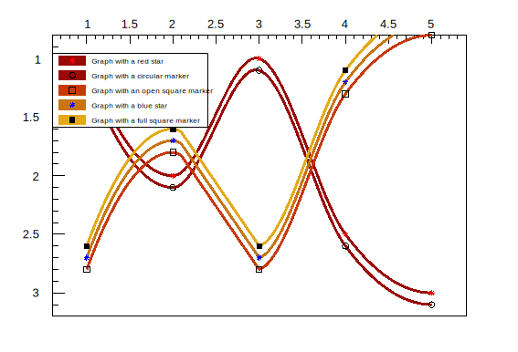
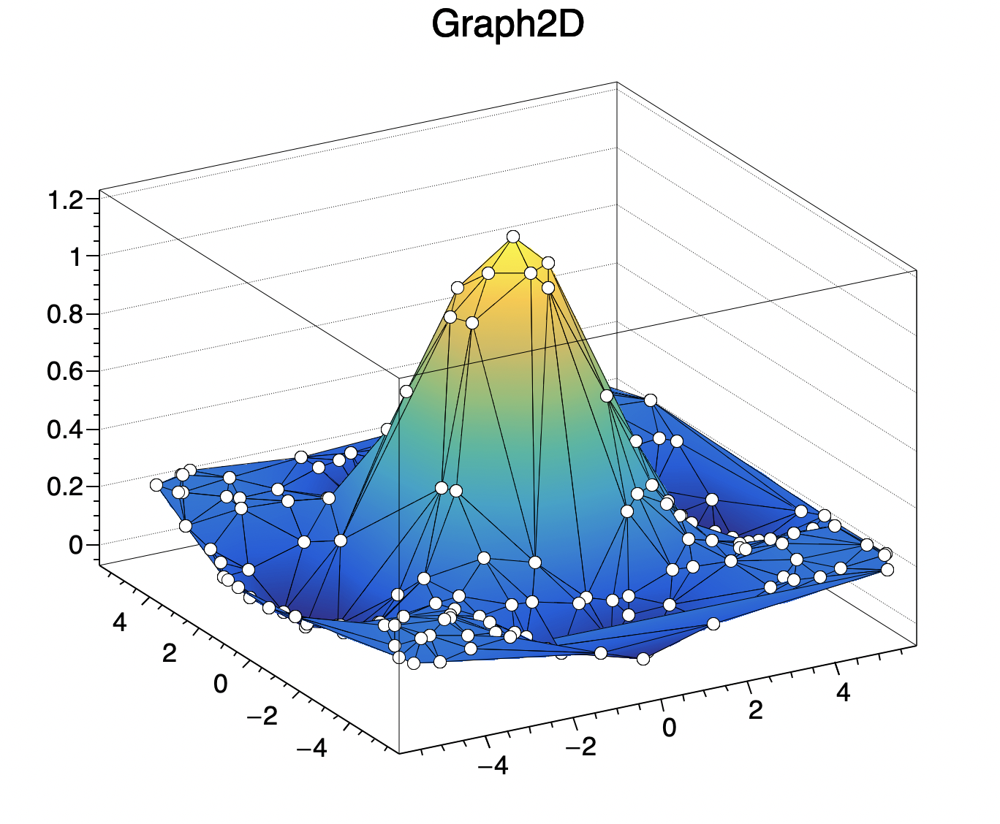
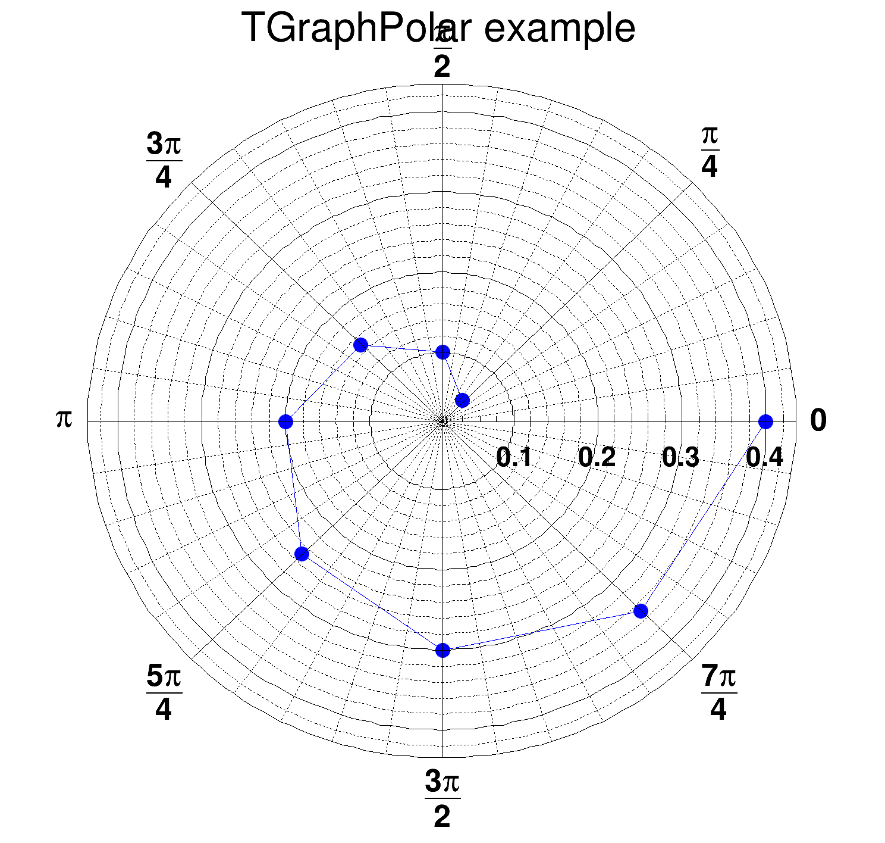
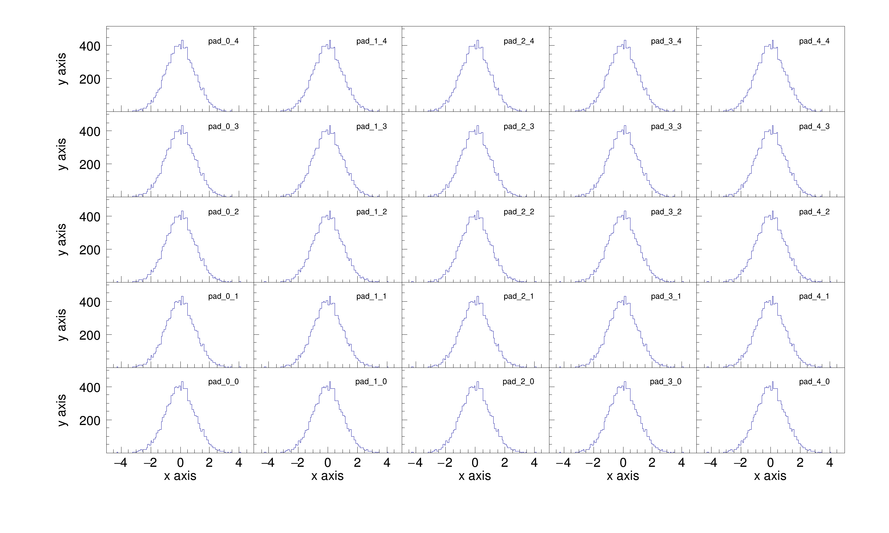

# 2.2.1 图表

## 图表的概念

最基本的数据可视化方法是使用由两个（TGraph）或三个（TGraph2D）数组组成的坐标表示数据的大小或位置，称作 Graph 。这与直方图（Histogram）不同。

ROOT 提供了许多图形类，如`TGraph`图表，`TGraphErrors`具有对称误差线的图表，`TGraph2D`由三个数组 X、Y 和 Z 组成的图表等。


## 图表的使用

`TGraph`支持批量创建和运算，`TGraph`的创建方法是：

```c
// 创建了一个名字是name，标题是title，有n个坐标为x,y的点：
TGraph *gr = new TGraph("name", "title", number, x, y)
TGraph* gr = new TGraph("name", "title", number, x, y)
TGraph *gr = new TGraph(number, x, y)
auto gr = new TGraph(number, x, y)
auto gr = new TGraph()    // 使用AddPoint()函数添加坐标点
auto dt = new TGraph2D()    // 二维图表，其他形式同理
```

绘制图表前需要先定义坐标数组，然后使用`TGraph`构造图形。E.g.&#x20;

```c
   int n = 20;
   double x[n], y[n];
   for (int i=0; i<n; i++) {
      x[i] = i*0.1;
      y[i] = 10*sin(x[i]+0.2);
   }
   auto gr = new TGraph (n, x, y);
```

也支持使用`AddPoint()`函数添加点：

```c
auto gr = new TGraph();
for (int i=0; i<20; i++) gr->AddPoint(i*0.1, 10*sin(i*0.1+0.2));
```

使用`TGraph::Draw()`绘制图形，且有多种[绘图选项](2.2.1-tu-biao.md#hui-tu-xuan-xiang)可选：

```c
   auto gr = new TGraph();
   for (int i=0; i<20; i++) gr->AddPoint(i*0.1, 10*sin(i*0.1+0.2));
   gr->Draw();
```

### 从文件中读取数据

数据的保存格式有很多，常见的是文本格式和 root 格式：

* **文本格式数据绘制 Graph**

<mark style="color:red;">这里要求文件中的坐标中间是空格或者制表符，不可以是逗号。E.g.</mark>

```c
int directdata(){
    TGraph *gr = new TGraph("mydata.txt");
    gr->Draw("AC*");    // 绘出 axis，坐标点以 curve 链接，坐标点形状为 * 型
}
```

### 从图表中读取数据

* **数组模式**

double \*px = gr->GetX(); 将gr1图像中点数据以数组形式输出。

* **指针模式**

`ToggleEventStatus()`是 canvas 的成员函数。用于展示指针处的数据状态，打开后，指针所在位置的数据信息会被呈现在面板下方。

* **高亮模式**

高亮模式适用于`TGraph（和TH1）`类。 当高亮模式打开时，鼠标在点上的移动将以图形表示。 点将突出显示为“点圆”（由标记对象表示）。 此外，任何高亮显示（点变化）都会发出信号`TCanvas::Highlighted()`，允许用户做出反应并调用自己的函数。 为了更好地理解，请参阅教程`$ROOTSYS/tutorials/graphs/hlGraph*.C` 文件。

### 属性设置

图表的轴、标题、颜色均可以进行设置，参考章节：


[2.3-shu-xing-she-zhi.md](2.3-shu-xing-she-zhi.md)


### 绘图选项

使用以下选项绘制图表，在`Draw()`命令中它们不区分大小写，可不间隔的使用多个参数如`Draw("APL")`和`Draw("A p l")`，均表示绘制包涵坐标轴和坐标点的图，并用直线相连：

<table><thead><tr><th width="111">Option </th><th>Description</th></tr></thead><tbody><tr><td>"A" </td><td><mark style="color:green;"><strong>绘制出坐标轴</strong></mark></td></tr><tr><td>"I" </td><td>Combine with option 'A' it draws invisible axis </td></tr><tr><td>"L" </td><td>在点之间使用直线相连，最终呈现的效果是折线</td></tr><tr><td>"F" </td><td>绘制填充区域（“CF”绘制平滑填充区域）</td></tr><tr><td>"C" </td><td><mark style="color:green;"><strong>绘制平滑曲线</strong></mark></td></tr><tr><td>"*" </td><td>每数据点以星号显示</td></tr><tr><td>"P" </td><td>绘制出每个 marker</td></tr><tr><td>"B" </td><td>绘制柱状图/条形图/直方图</td></tr><tr><td>"1" </td><td>当使用柱状图B时，使柱状图从底部开始，否则从0开始</td></tr><tr><td>"X+" </td><td><mark style="color:green;"><strong>X轴在上</strong></mark></td></tr><tr><td>"Y+" </td><td>Y轴在右</td></tr><tr><td>"PFC" </td><td><mark style="color:green;"><strong>调色板填充颜色：图表的填充颜色取自当前调色板中</strong></mark></td></tr><tr><td>"PLC" </td><td><mark style="color:green;"><strong>调色板线条颜色：图形的线条颜色取自当前调色板中</strong></mark></td></tr><tr><td>"PMC" </td><td><mark style="color:green;"><strong>调色板标记颜色：图表的标记颜色取自当前调色板中</strong></mark></td></tr><tr><td>"RX" </td><td><mark style="color:green;"><strong>X轴刻度反转</strong></mark></td></tr><tr><td>"RY" </td><td>Y轴刻度反转</td></tr><tr><td>"HIST"</td><td>以histogram格式绘制/亦或称作阶梯图</td></tr></tbody></table>

<details>

<summary>E.g. X轴在上Y轴反转和自动取色</summary>

```c
void graphpalettecolor () {
 
   gStyle->SetOptTitle(kFALSE);
   gStyle->SetPalette(kSolar);
 
   double x[5]  = {1,2,3,4,5};
   double y1[5] = {1.0,2.0,1.0,2.5,3.0};
   double y2[5] = {1.1,2.1,1.1,2.6,3.1};
   double y3[5] = {1.2,2.2,1.2,2.7,3.2};
   double y4[5] = {1.3,2.3,1.3,2.8,3.3};
   double y5[5] = {1.4,2.4,1.4,2.9,3.4};
 
   TGraph *g1 = new TGraph(5,x,y1); g1->SetTitle("Graph with a red star");
   TGraph *g2 = new TGraph(5,x,y2); g2->SetTitle("Graph with a circular marker");
   TGraph *g3 = new TGraph(5,x,y3); g3->SetTitle("Graph with an open square marker");
   TGraph *g4 = new TGraph(5,x,y4); g4->SetTitle("Graph with a blue star");
   TGraph *g5 = new TGraph(5,x,y5); g5->SetTitle("Graph with a full square marker");
 
   g1->SetLineWidth(3); g1->SetMarkerColor(kRed);
   g2->SetLineWidth(3); g2->SetMarkerStyle(kCircle);
   g3->SetLineWidth(3); g3->SetMarkerStyle(kOpenSquare);
   g4->SetLineWidth(3); g4->SetMarkerColor(kBlue);
   g5->SetLineWidth(3); g5->SetMarkerStyle(kFullSquare);
 
   g1->Draw("CA*x+ry PLC PFC");
   g2->Draw("PCx+ry  PLC PFC");
   g3->Draw("PC  PLC PFC");
   g4->Draw("*C  PLC PFC");
   g5->Draw("PC  PLC PFC");
 
   gPad->BuildLegend();
}
```

</details>

<figure><figcaption><p>X轴在上Y轴反转和自动取色</p></figcaption></figure>

### 成果保存

将分析成果保存并反复展示。root 格式支持保存数据，也支持保存分析图片，而且图片保存为 root 格式后还可以反复打开并进行进一步的美化工作，十分便捷。

Save()

SaveAs()函数，支持

Write()函数

Print()

<details>

<summary>E.g. 将多个画布与图片连续保存到一个 PDF 文件中</summary>

```c
{
   TCanvas* canvas = new TCanvas("canvas");
   TH1F* histo = new TH1F("histo","test 1",10,0.,10.);
   histo->SetFillColor(2);
   histo->Fill(2.);
   histo->Draw();
   canvas->Print("plots.pdf(","Title:One bin filled");
   histo->Fill(4.);
   histo->Draw();
   canvas->Print("plots.pdf","Title:Two bins filled");
   histo->Fill(6.);
   histo->Draw();
   canvas->Print("plots.pdf","Title:Three bins filled");
   histo->Fill(8.);
   histo->Draw();
   canvas->Print("plots.pdf","Title:Four bins filled");
   histo->Fill(8.);
   histo->Draw();
   canvas->Print("plots.pdf)","Title:The fourth bin content is 2");
}
```

</details>


## 误差与拟合


[2.2.5-wu-cha-yu-ni-he.md](2.2.5-wu-cha-yu-ni-he.md)



## 二维图表

使用符合标准的数据可以绘制二维图表。E.g.

```c
{
   auto c = new TCanvas("c","Graph2D example",0,0,700,600);   // 画布距离左上角的距离(0,0)
   double x, y, z, P = 6.;
   int np = 200;
   auto dt = new TGraph2D();
   auto r  = new TRandom();
   for (int N=0; N<np; N++) {
      x = 2*P*(r->Rndm(N))-P;
      y = 2*P*(r->Rndm(N))-P;
      z = (sin(x)/x)*(sin(y)/y)+0.2;
      dt->SetPoint(N,x,y,z);
   }
   dt->Draw("tri1 p0");
}
```

<figure><figcaption><p>二维图表</p></figcaption></figure>


## 极坐标 TGraphPolar

极坐标`TGraphPolar()`的绘图选项有：

<table><thead><tr><th width="155">Option </th><th>Description </th></tr></thead><tbody><tr><td>"O" </td><td>极坐标标签与极坐标图半径正交绘制。</td></tr><tr><td>"P" </td><td>在每个点位置绘制多标记。</td></tr><tr><td>"E" </td><td>绘出误差棒</td></tr><tr><td>"F" </td><td>绘制填充区域（闭合多边形）</td></tr><tr><td>"A" </td><td>即使极坐标图已经存在，也强制重绘轴</td></tr><tr><td>"N" </td><td>禁止显示极坐标标签</td></tr></tbody></table>

<details>

<summary>E.g. 极坐标例子</summary>

```c
{
   auto c46 = new TCanvas("c46","c46",500,500);
   auto grP1 = new TGraphPolar();
   grP1->SetTitle("TGraphPolar example");
 
   grP1->SetPoint(0, (1*TMath::Pi())/4., 0.05);
   grP1->SetPoint(1, (2*TMath::Pi())/4., 0.10);
   grP1->SetPoint(2, (3*TMath::Pi())/4., 0.15);
   grP1->SetPoint(3, (4*TMath::Pi())/4., 0.20);
   grP1->SetPoint(4, (5*TMath::Pi())/4., 0.25);
   grP1->SetPoint(5, (6*TMath::Pi())/4., 0.30);
   grP1->SetPoint(6, (7*TMath::Pi())/4., 0.35);
   grP1->SetPoint(7, (8*TMath::Pi())/4., 0.40);
 
   grP1->SetMarkerStyle(20);
   grP1->SetMarkerSize(1.);
   grP1->SetMarkerColor(4);
   grP1->SetLineColor(4);
   grP1->Draw("ALP");
 
   // Update, otherwise GetPolargram returns 0
   c46->Update();
   grP1->GetPolargram()->SetToRadian();
}
```

</details>

<figure><figcaption><p>极坐标例子</p></figcaption></figure>


## 饼状图 TPie


## 多图绘法

root 支持在一张 canvas 上绘制多幅图表或者直方图。

### 独立绘制

使用`TCanvas::Divide()`函数将 Canvas 分割为不同的 Pad，例如将名为 c1 的 canvas 分为 2 列 3 行写作：`c1->Divide(2,3)`，然后使用`c1->cd()`分别控制不同的 pad，pad 的名称从左向右，从上至下分别是1，2，……，例如可以在 pad1 上绘制 histogram，在 pad2 上绘制 graph。

### 共轴绘制

最简单的共轴画法是在`TCanvas::Divide()`函数中添加参数，例如`c1->Divide(2,3,0)`，但当要进行一些美化工作的时候，就会发现它们的标题大小，marker 大小不再能通过统一的数值控制，这非常影响美观。

所以这里有一个稍微复杂的解决方法，能够使它们的大小保持一致，仅供参考：

<details>

<summary>CanvasPartition <a href="https://root.cern.ch/doc/master/canvas2_8C.html">https://root.cern.ch/doc/master/canvas2_8C.html</a></summary>

```c
 
void CanvasPartition(TCanvas *C,const Int_t Nx = 2,const Int_t Ny = 2,
                     Float_t lMargin = 0.15, Float_t rMargin = 0.05,
                     Float_t bMargin = 0.15, Float_t tMargin = 0.05);
double XtoPad(double x);
double YtoPad(double x);
 
void canvas2()
{
   gStyle->SetOptStat(0);
 
   auto C = (TCanvas*) gROOT->FindObject("C");
   if (C) delete C;
   C = new TCanvas("C","canvas",1024,640);
   C->SetFillStyle(4000);
 
   // Number of PADS
   const Int_t Nx = 5;
   const Int_t Ny = 5;
 
   // Margins
   Float_t lMargin = 0.12;
   Float_t rMargin = 0.05;
   Float_t bMargin = 0.15;
   Float_t tMargin = 0.05;
 
   // Canvas setup
   CanvasPartition(C,Nx,Ny,lMargin,rMargin,bMargin,tMargin);
 
   // Dummy histogram.
   auto h = (TH1F*) gROOT->FindObject("histo");
   if (h) delete h;
   h = new TH1F("histo","",100,-5.0,5.0);
   h->FillRandom("gaus",10000);
   h->GetXaxis()->SetTitle("x axis");
   h->GetYaxis()->SetTitle("y axis");
 
   TPad *pad[Nx][Ny];
 
   for (Int_t i = 0; i < Nx; i++) {
      for (Int_t j = 0; j < Ny; j++) {
         C->cd(0);
 
         // Get the pads previously created.
         pad[i][j] = (TPad*) C->FindObject(TString::Format("pad_%d_%d",i,j).Data());
         pad[i][j]->Draw();
         pad[i][j]->SetFillStyle(4000);
         pad[i][j]->SetFrameFillStyle(4000);
         pad[i][j]->cd();
 
         // Size factors
         Float_t xFactor = pad[0][0]->GetAbsWNDC()/pad[i][j]->GetAbsWNDC();
         Float_t yFactor = pad[0][0]->GetAbsHNDC()/pad[i][j]->GetAbsHNDC();
 
         TH1F *hFrame = (TH1F*) h->Clone(TString::Format("h_%d_%d",i,j).Data());
 
         // y axis range
         hFrame->SetMinimum(0.0001); // do not show 0
         hFrame->SetMaximum(1.2*h->GetMaximum());
 
         // Format for y axis
         hFrame->GetYaxis()->SetLabelFont(43);
         hFrame->GetYaxis()->SetLabelSize(16);
         hFrame->GetYaxis()->SetLabelOffset(0.02);
         hFrame->GetYaxis()->SetTitleFont(43);
         hFrame->GetYaxis()->SetTitleSize(16);
         hFrame->GetYaxis()->SetTitleOffset(2);
 
         hFrame->GetYaxis()->CenterTitle();
         hFrame->GetYaxis()->SetNdivisions(505);
 
         // TICKS Y Axis
         hFrame->GetYaxis()->SetTickLength(xFactor*0.04/yFactor);
 
         // Format for x axis
         hFrame->GetXaxis()->SetLabelFont(43);
         hFrame->GetXaxis()->SetLabelSize(16);
         hFrame->GetXaxis()->SetLabelOffset(0.02);
         hFrame->GetXaxis()->SetTitleFont(43);
         hFrame->GetXaxis()->SetTitleSize(16);
         hFrame->GetXaxis()->SetTitleOffset(1);
         hFrame->GetXaxis()->CenterTitle();
         hFrame->GetXaxis()->SetNdivisions(505);
 
         // TICKS X Axis
         hFrame->GetXaxis()->SetTickLength(yFactor*0.06/xFactor);
 
         // Draw cloned histogram with individual settings
         hFrame->Draw();
 
         TText text;
         text.SetTextAlign(31);
         text.SetTextFont(43);
         text.SetTextSize(10);
         text.DrawTextNDC(XtoPad(0.9), YtoPad(0.8), gPad->GetName());
      }
   }
   C->cd();
}
 
 
 
void CanvasPartition(TCanvas *C,const Int_t Nx,const Int_t Ny,
                     Float_t lMargin, Float_t rMargin,
                     Float_t bMargin, Float_t tMargin)
{
   if (!C) return;
 
   // Setup Pad layout:
   Float_t vSpacing = 0.0;
   Float_t vStep  = (1.- bMargin - tMargin - (Ny-1) * vSpacing) / Ny;
 
   Float_t hSpacing = 0.0;
   Float_t hStep  = (1.- lMargin - rMargin - (Nx-1) * hSpacing) / Nx;
 
   Float_t vposd,vposu,vmard,vmaru,vfactor;
   Float_t hposl,hposr,hmarl,hmarr,hfactor;
 
   for (Int_t i=0;i<Nx;i++) {
 
      if (i==0) {
         hposl = 0.0;
         hposr = lMargin + hStep;
         hfactor = hposr-hposl;
         hmarl = lMargin / hfactor;
         hmarr = 0.0;
      } else if (i == Nx-1) {
         hposl = hposr + hSpacing;
         hposr = hposl + hStep + rMargin;
         hfactor = hposr-hposl;
         hmarl = 0.0;
         hmarr = rMargin / (hposr-hposl);
      } else {
         hposl = hposr + hSpacing;
         hposr = hposl + hStep;
         hfactor = hposr-hposl;
         hmarl = 0.0;
         hmarr = 0.0;
      }
 
      for (Int_t j=0;j<Ny;j++) {
 
         if (j==0) {
            vposd = 0.0;
            vposu = bMargin + vStep;
            vfactor = vposu-vposd;
            vmard = bMargin / vfactor;
            vmaru = 0.0;
         } else if (j == Ny-1) {
            vposd = vposu + vSpacing;
            vposu = vposd + vStep + tMargin;
            vfactor = vposu-vposd;
            vmard = 0.0;
            vmaru = tMargin / (vposu-vposd);
         } else {
            vposd = vposu + vSpacing;
            vposu = vposd + vStep;
            vfactor = vposu-vposd;
            vmard = 0.0;
            vmaru = 0.0;
         }
 
         C->cd(0);
 
         auto name = TString::Format("pad_%d_%d",i,j);
         auto pad = (TPad*) C->FindObject(name.Data());
         if (pad) delete pad;
         pad = new TPad(name.Data(),"",hposl,vposd,hposr,vposu);
         pad->SetLeftMargin(hmarl);
         pad->SetRightMargin(hmarr);
         pad->SetBottomMargin(vmard);
         pad->SetTopMargin(vmaru);
 
         pad->SetFrameBorderMode(0);
         pad->SetBorderMode(0);
         pad->SetBorderSize(0);
 
         pad->Draw();
      }
   }
}
 
double XtoPad(double x)
{
   double xl,yl,xu,yu;
   gPad->GetPadPar(xl,yl,xu,yu);
   double pw = xu-xl;
   double lm = gPad->GetLeftMargin();
   double rm = gPad->GetRightMargin();
   double fw = pw-pw*lm-pw*rm;
   return (x*fw+pw*lm)/pw;
}
 
double YtoPad(double y)
{
   double xl,yl,xu,yu;
   gPad->GetPadPar(xl,yl,xu,yu);
   double ph = yu-yl;
   double tm = gPad->GetTopMargin();
   double bm = gPad->GetBottomMargin();
   double fh = ph-ph*bm-ph*tm;
   return (y*fh+bm*ph)/ph;
}
```

</details>

<figure><figcaption><p>CanvasPartition</p></figcaption></figure>

### 重叠绘制

将多个 graph 绘制在一张 pad 上，只需要在`TGraph::Draw()`函数中使用`same`参数即可。


### 合并绘制

`TMultiGraph::TMultiGraph()`，函数支持将一组图作为单个实体进行操作。且绘制时 X 轴和 Y 轴范围会自动计算，因此所有图形都将可见。[`TMultiGraph::Add`](https://root.cern/doc/master/classTMultiGraph.html#a2e3c69dd70582da81cf1e32414cc5e2d)`()`用于将新图表添加到列表中。E.g.

```c
TGraph *gr1 = new TGraph(...
TGraphErrors *gr2 = new TGraphErrors(...
TMultiGraph *mg = new TMultiGraph();
mg->Add(gr1,"lp");
mg->Add(gr2,"cp");
mg->Draw("a");
```

标题、颜色、统计信息均可使用`TMultiGraph`类中的成员函数，用法与 graph 一致。

单个 graph 通过`mg->GetListOfGraphs()->GetEntries();`方式检索。


## 图例

```
TLegend
```


***

## _参考_

[_https://root.cern/doc/master/classTGaxis.html_](https://root.cern/doc/master/classTGaxis.html)

[https://root.cern/doc/master/classTGraphPainter.html](https://root.cern/doc/master/classTGraphPainter.html)

[https://root.cern.ch/doc/master/classTHistPainter.html](https://root.cern.ch/doc/master/classTHistPainter.html)


