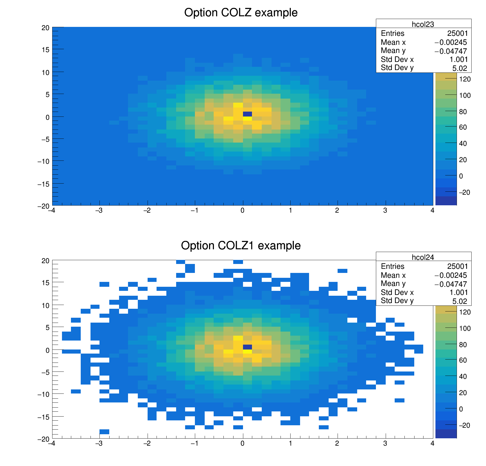

# 2.2.1 直方图

## 直方图的概念

直方图（histogram）与图表（graph）的区别在于使用 bin 分割数据。bin 的原意是垃圾箱或小箱子，在 histogram 中用竖状的 bar 反映数据，这些存放数据的 bar，称为 bin，也就是将整个数据范围划分为一系列统计区间。bin 的宽度取决于数据范围上 bin 的数量。


## 直方图的使用

直方图是一种对数据分布情况的图形表示方式，适合用来表现数量上的差异。直方图支持批量创建和运算。直方图的创建方法有很多：

```cpp
TH1I *h1 = new TH1I("histogram name", "grapg title; x title; unit title", nbins, xmin, xmax)
TH1D* h1 = new TH1D("histogram name", "grapg title; x title; unit title", nbins, xmin, xmax)
TH1F *h1 = new TH1F("histogram name", "grapg title; x title; unit title", , , )
TH1I *h1 = new TH1I("histogram name", "grapg title", , , )
TH1I *h1 = new TH1I("histogram name", "grapg title", nbins, xmin, xmax)
auto *h1 = new TH1F
TH1F *h[n]    // 批量创建
TH1F h3 = h1*h2;
TH1F h3 = 8*h1;
```

`TH1D`是缩写，分别表示`THistogram类、1维、Double型`，同理`TH1F`表示整数型一维直方图，`TH2D`表示双精度浮点型二维直方图。

`"histogram name"`表示直方图名称，直方图存储在本地时，文件名默认使用直方图名称，`"grapg title"`作 histogram 的图表题，`nbins, xmin, xmax`分别表示分 bin 数量和轴范围，即将`xmin-xmax`的范围上分`mbins`个 bin。

<mark style="color:red;">**建立histogram之后，必须向其中填充数据，否则不能正常绘制：**</mark>

```c
h1->Fill(x);         // 填入一个值x
h1->Fill(x, w);      // 以权重为w填入一个值x
h1->Fill(x*0.5+10);  // 进行计算
```

### 控制分 bin

当 canvas 和轴发生变化时，bin 宽（形式上而非数值上）也会发生变化。如`SetLogx`，表示将 x轴设置为对数坐标的形式，此时 bin 宽（形式上）会随 logx 而变化，若要求 bin 宽（形式上）不随 logx 变化，可以参考[这里](https://www.bilibili.com/read/cv6640287/)。

对 bin 的控制能够更加科学和美观的呈现结论。控制 bin 的方法有：

* **标准控制：E.g.**

```c
    TH1 *h1 = new TH1I("h1", "a histogram title",100, 0.0, 4.0)
```

* **自动控制：不指定 bin 及坐标范围（参数位置需要空出），ROOT 会自动匹配。E.g.**

```cpp
   TH1 *h1 = new TH1I("h1", "h1 title", , , );   // 一维整型直方图
```

* **精细控制：数组的大小应为`nbins+1`，因为它包含下范围和上范围的轴值。E.g.**

```cpp
   double binEdges[] = { 0.0, 0.2, 0.5, 1., 2., 4. };
   TH1 *h1 = new TH1D("h1", "h1 title", 6, binEdges );
   TH2 *h2 = new TH2D("h2", "h2 title", 6, binEdges , 30, -1.5, 3.5);
```

* **指定控制：通过符号`>>`控制。E.g.**

```c
    TTree->Draw("TBranch>>(xnbins,xmin,xmax)")
```

二维使用`>>(xnbins,xmin,xmax,ynbins,ymin,ymax)`的语法控制。

* **重新排列：通过函数`Rebin( mergebin, newname, xbins 0 or !0)` 重制。E.g.**

```c
root [1] hist-›Rebin(5)    // 原直方图上的5bins合1bin
root [2] hist-›Rebin()     // 默认2合1
root [3] hist-›Rebin(5, histogram2)     // 创建一个新的histogram2，将原直方图5合1后展示
root [4] hist-›Rebin(5, histogram2, xbins)   // 参考：https://root.cern/doc/master/rebin_8C.html
```

* **查看、获取和更改 bin 中的内容**

`GetBinEntries(i)`，用于获取TProfile对象中第i个bin的数据点数量；

`GetBinContent(i)`，用于获取TProfile对象中第i个bin的内容，即该bin中的数据值；

`GetXaxis()->GetBinCenter(i)`，获取TProfile对象中X轴上第i个bin的中心值；

带有误差条的写入bin&#x20;

```c
histo->SetBinContent(i+1, data[i]); histo->SetBinError(i+1, TMath::Sqrt(data[i])), bin从1开始
```

`GetBinError(i)`，用于获取TProfile对象中第i个bin的（上）误差；

`GetBinErrorLow(i)`，用于获取TProfile对象中第i个bin的下误差；

`GetBinWidth(i)`，用于获取直方图中第i个bin的宽度；

`GetBinXYZ(i, j, k)`，这个函数用于获取多维直方图中（例如TH3）的第(i, j, k)个bin的内容。

`gPad->GetUymax()`, 获取坐标轴的最大值，<mark style="color:red;">在此之前需要运行</mark>`c1->Update()`

`GetQuantiles(nq, yq, xq)`，分为函数，假设我们有一个包含 1000 个随机数的直方图，我们希望计算出它的四分位数（即分位数数量为 4）。以下是一个示例代码：

```c
#include <TH1F.h>
#include <TMath.h>
#include <TRandom3.h>

void calculateQuantiles() {
    // 创建一个一维直方图
    TH1F *histogram = new TH1F("histogram", "Random Numbers", 100, 0, 100);
    // 生成一些随机数并填充到直方图中
    TRandom3 random;
    for (int i = 0; i < 1000; ++i) {
        histogram->Fill(random.Uniform(0, 100));
    }
    // 计算四分位数
    int nq = 4;
    double xq[nq];
    double yq[nq];
    for (int i = 0; i < nq; ++i) {
        xq[i] = double(i + 1) / nq;
    }
    histogram->GetQuantiles(nq, yq, xq);
    // 打印输出计算得到的四分位数
    for (int i = 0; i < nq; ++i) {
        std::cout << "Quantile " << i+1 << " at position " << xq[i] << " is " << yq[i] << std::endl;
    }
}
```

在这个例子中，我们首先创建了一个包含 100 个 bin 的一维直方图，然后生成了 1000 个 0 到 100 之间的随机数，并将它们填充到直方图中。接着，我们计算了四分位数，并将结果存储在数组 `yq` 中。最后，我们打印输出了计算得到的四分位数值。

通过这个例子可以更好地理解`GetQuantiles`函数的作用，以及如何使用它来计算直方图中指定分位数位置的数值。

### 数据填充

histogram 也可以通过数据值/坐标来绘制 **E.g.**

<details>

<summary>E.g. GRB221009A的光变曲线</summary>

```c
#include <iostream>
#include <fstream>
#include <vector>
#include <TCanvas.h>
#include <TH1F.h>

void plot() {
	TCanvas *canvas = new TCanvas("canvas", "Histogram", 800, 800);
	canvas->Divide(1,4,0);
	
	TH1F *h1 = new TH1F("h1", "", 120, 0, 1200);
	std::ifstream file1("lightCurve221009AHxmt.txt");
	double x1, y1;
	while (file1 >> x1 >> y1) {h1->Fill(x1, y1);}
	h1->SetTitle(";;Rate [counts/bin]");
	h1->GetYaxis()->SetTitleSize(0.06);h1->GetYaxis()->CenterTitle();

   	canvas->cd(1);
	gStyle->SetOptStat(0);
	h1->SetFillColor(kYellow-6);
	h1->Draw("HIST");
	TLegend *l1 = new TLegend(0.6,0.6,0.893,0.89,"HXMT HE/Csl");
	l1->AddEntry(h1,"0.6-3MeV");
    	l1->SetBorderSize(0);l1->Draw();
}
```

</details>

这种方式绘制的直方图只是形式上的，不能反映真实的 bin 值，所以这种方法不适用于拟合等操作，所以建议使用`TTree::SetBranchAddress("",&)`函数绘制：

<details>

<summary>E.g. 拟合的坐标点填充</summary>

```c
#include <iostream>
#include <fstream>
#include <vector>
#include <TCanvas.h>
#include <TH1F.h>
#include <TF1.h>

void plot() {
	gStyle->SetOptStat(0);gStyle->SetOptFit(1);
	TCanvas *canvas = new TCanvas("canvas", "Histogram", 800, 800);
	
	TH1F *h1 = new TH1F();
	h1->SetBins(50000,0,50000);
	std::ifstream file1("CH1.csv");
	double x1, y1;
	TTree* t = new TTree();
	int x;
	double y;
	t->ReadFile("CH1.txt","x/I:y/D");
	t->SetBranchAddress("x",&x);
	t->SetBranchAddress("y",&y);
	for (int i=0; i<t->GetEntries();i++)	{
		t->GetEntry(i);
		h1->SetBinContent(x,y);
	}
	
	h1->SetTitle("T;time [ps];counts");
	h1->GetYaxis()->SetTitleSize(0.06);
	h1->GetYaxis()->CenterTitle();
	
	double max;
	int maxbin;
	TF1* func = new TF1();
	double mean,sigma;
	maxbin = h1->GetMaximumBin();
	max = h1->GetBinCenter(maxbin);
	h1->Fit("gaus","","",max-100,max+100);
	func = h1->GetFunction("gaus");
	mean  = func->GetParameter(1);
	sigma  = func->GetParameter(2);
	h1->Fit("gaus","","",mean-1.2*sigma,mean+1.2*sigma);
	func = h1->GetFunction("gaus");
	mean  = func->GetParameter(1);
	sigma  = func->GetParameter(2);
	h1->Fit("gaus","","",mean-1.2*sigma,mean+1.2*sigma);
	func = h1->GetFunction("gaus");
	mean  = func->GetParameter(1);
	sigma  = func->GetParameter(2);
	h1->Fit("gaus","","",mean-1.2*sigma,mean+1.2*sigma);
	func = h1->GetFunction("gaus");
	func = h1->GetFunction("gaus");
	mean  = func->GetParameter(1);
	sigma  = func->GetParameter(2);
	h1->Fit("gaus","","",mean-1.*sigma,mean+1.*sigma);

	canvas->cd(1);
	gStyle->SetOptStat();
	//h1->SetFillColor(kYellow-6);
//	h1->Draw("hist f1");
//	f1->Draw("same");
	h1->GetXaxis()->SetRangeUser(39000,40500);
	canvas->SaveAs("h1.root");
}
```

</details>

### 数据缩放

`THn::Scale()`函数进行纵坐标缩放。E.g.`h1->Scale(1/12)`缩小 12 倍。

### 绘图选项

#### **支持1D和2D直方图的选项**

<table><thead><tr><th width="120.5">Option </th><th>Description </th></tr></thead><tbody><tr><td>"E" </td><td>绘制误差棒.。</td></tr><tr><td>"HIST" </td><td>绘制直方图。</td></tr><tr><td>"FUNC" </td><td>当直方图具有拟合函数时，此选项允许仅绘制拟合结果。</td></tr><tr><td>"SAME" </td><td>叠加在同一垫中的前一张图片上。 </td></tr><tr><td>"SAMES" </td><td><mark style="color:green;">与“SAME”相同，强制绘制统计框。</mark></td></tr><tr><td>"PFC" </td><td>调色板填充颜色：直方图的填充颜色取当前调色板。 </td></tr><tr><td>"PLC" </td><td>调色板线条颜色：直方图的线条颜色取当前调色板。</td></tr><tr><td>"PMC" </td><td>调色板标记颜色：直方图的标记颜色取当前调色板。</td></tr><tr><td>"LEGO" </td><td>绘制去除隐藏线的乐高图。</td></tr><tr><td>"LEGO1" </td><td>绘制隐藏表面移除的乐高图. </td></tr><tr><td>"LEGO2" </td><td>使用颜色绘制乐高图以显示单元格内容 当选项“0”与任何乐高选项一起使用时，不会绘制空箱。</td></tr><tr><td>"LEGO3" </td><td>绘制一个带有隐藏表面去除的乐高图，与乐高1类似，但不绘制每个乐高条的边界线。 </td></tr><tr><td>"LEGO4" </td><td>绘制一个带有隐藏表面去除的乐高图，就像乐高1一样，但每个乐高条上没有阴影效果。 </td></tr><tr><td>"TEXT" </td><td><mark style="color:green;">将 bin 内容绘制为文本（通过 gStyle->SetPaintTextFormat 设置格式）。</mark></td></tr><tr><td>"TEXTnn" </td><td>将 bin 内容绘制为角度 nn (0 &#x3C; nn &#x3C;= 90) 的文本. </td></tr><tr><td>"X+" </td><td>TX 轴绘制在图的顶部。 </td></tr><tr><td>"Y+" </td><td>Y 轴绘制在图的右侧。</td></tr><tr><td>"MIN0" </td><td>将 Y 轴的最小值设置为 0，相当于 gStyle->SetHistMinimumZero()。 </td></tr></tbody></table>

#### **支持1D直方图的选项**

<table><thead><tr><th width="135">Option </th><th width="611">Description </th></tr></thead><tbody><tr><td>"AH" </td><td>绘制无轴直方图。 “A”可以与任何绘图选项组合。 例如，“AC”将直方图绘制为无轴的平滑曲线。</td></tr><tr><td>"][" </td><td>选择此选项时，不会绘制直方图的第一条和最后一条垂直线。</td></tr><tr><td>"B" </td><td>条形图选项。</td></tr><tr><td>"BAR" </td><td>与选项“B”类似，但可以用 3D 效果绘制条形。 </td></tr><tr><td>"HBAR" </td><td><mark style="color:green;">“HBAR” 与选项“BAR”类似，但条形是水平绘制的。</mark> </td></tr><tr><td>"C" </td><td>通过直方图箱绘制平滑曲线。</td></tr><tr><td>"E0" </td><td>绘制误差线。 为内容为 0 的箱绘制标记。 与 E1 或 E2 结合使用可避免误差条剪切。 </td></tr><tr><td>"E1" </td><td>在边缘处用垂直线绘制误差条。</td></tr><tr><td>"E2" </td><td>用矩形绘制误差线。</td></tr><tr><td>"E3" </td><td>通过垂直误差线的端点绘制填充区域。</td></tr><tr><td>"E4" </td><td>通过误差线的端点绘制平滑的填充区域。</td></tr><tr><td>"E5" </td><td>与 E3 类似，但忽略内容为 0 的bin。</td></tr><tr><td>"E6" </td><td>与 E4 类似，但忽略内容为 0 的bin。</td></tr><tr><td>"X0" </td><td>当与“E”选项之一一起使用时，它会像 gStyle->SetErrorX(0) 那样抑制沿 X 的误差条。 </td></tr><tr><td>"L" </td><td>画一条线穿过bin。</td></tr><tr><td>"P" </td><td>在除空箱之外的每个箱处绘制当前标记。</td></tr><tr><td>"P*" </td><td>在除空垃圾箱之外的每个垃圾箱上画一个星形标记。</td></tr><tr><td>"P0" </td><td>在每个仓（包括空仓）处绘制当前标记。y bins. </td></tr><tr><td>"PIE" </td><td>将直方图绘制为饼图。</td></tr><tr><td>"*H" </td><td>在每个 bin 处绘制带有 * 的直方图。</td></tr><tr><td>"LF2" </td><td>像选项“L”一样绘制直方图，但有填充区域。 请注意，如果设置了直方填充颜色，但填充区域对应于直方图轮廓，则“L”也会绘制填充区域。</td></tr></tbody></table>


## 二维直方图

创建 2D histogram 的标准写法是（参数可以省略）：

```c
TH2* h2 = new TH2F("h2", "h2 title; x title; y title", x bins, x min, x max, y bins, y min, y max);
```

### 二维直方图投影

二维直方图的 x 轴、y 轴统计信息支持投影。将 Hist2 的 x 轴统计信息投影给 Hist1：

<pre class="language-c"><code class="lang-c"><strong>aotu Hist1 = new TH1D;
</strong><strong>Hist1 = Hist2->ProjectionX();
</strong></code></pre>

### 二维直方图显示区域

修改二维直方图显示区域使用类`TCutG`。

```c
void h2_cut() {
   const int n = 6;
   Float_t x[6] = { 1, 2,  1, -1, -2, -1 };
   Float_t y[6] = { 2, 0, -2, -2,  0,  2 };
   TCutG *cut = new TCutG("cut", 6, x, y);
   TH2F *hist = new TH2F("hist", "Histogram with cut", 40, -10., 10., 40, -10., 10.);
   for (int i = 0; i < 100000; i++)
      hist->Fill(gRandom->Gaus(0., 3.), gRandom->Gaus(0., 3.));
   TCanvas *c1 = new TCanvas("c1", "Histogram draw with TCutG", 600, 900);
   hist->Draw("col [cut]");
   cut->Draw("l");
}
```

### 绘图选项

#### 支持2D直方图的选项

<table><thead><tr><th width="173.5">Option </th><th>Description </th></tr></thead><tbody><tr><td>"ARR" </td><td><mark style="color:green;">箭头模式。 显示相邻单元格之间的梯度。</mark></td></tr><tr><td>"BOX" </td><td><mark style="color:green;">为每个单元格绘制一个盒子，其表面积与内容的绝对值成比例。 负内容用 X 标记。</mark></td></tr><tr><td>"BOX1" </td><td>为每个单元格绘制一个按钮，其表面与内容的绝对值成比例。 凹陷的按钮表示负值，凸起的按钮表示正值。</td></tr><tr><td>"COLZ" </td><td>为bin绘制颜色与调色板，为0值填充颜色。</td></tr><tr><td>"COL2" </td><td>“COL”的替代渲染算法。 可以显着提高大型非稀疏二维直方图的渲染性能。</td></tr><tr><td>"COLZ2" </td><td>与“COL2”相同。 此外，还绘制了调色板。</td></tr><tr><td>"Z CJUST" </td><td>I与颜色选项“COL”、“CONT0”等结合使用：在颜色边界处对齐调色板中的标签。 有关更多详细信息，请参阅 <a href="https://root.cern.ch/doc/master/classTPaletteAxis.html"><code>TPaletteAxis</code></a></td></tr><tr><td>"CANDLE" </td><td>沿 X 轴绘蜡烛图。</td></tr><tr><td>"CANDLEX" </td><td>与“CANDLE”相同。</td></tr><tr><td>"CANDLEY" </td><td>沿 Y 轴绘制蜡烛图。</td></tr><tr><td>"CANDLEXn" </td><td>沿 X 轴绘制蜡烛图。 n 为 1 到 6 的不同蜡烛样式。</td></tr><tr><td>"CANDLEYn" </td><td>沿 Y 轴绘制蜡烛图。 n 为 1 到 6 的不同蜡烛样式。</td></tr><tr><td>"VIOLIN" </td><td>沿 X 轴绘制小提琴图。is. </td></tr><tr><td>"VIOLINX" </td><td>与“VIOLIN”相同。</td></tr><tr><td>"VIOLINY" </td><td>沿 Y 轴绘制小提琴图。</td></tr><tr><td>"VIOLINXn" </td><td>沿 X 轴绘制小提琴图。 n 为 1 或 2 的不同小提琴风格。</td></tr><tr><td>"VIOLINYn" </td><td>沿 Y 轴绘制小提琴图。 n 为 1 或 2 的不同小提琴风格。</td></tr><tr><td>"CONT" </td><td>D绘制等值线图/等高线图（与 CONT0 相同）。</td></tr><tr><td>"CONT0" </td><td>使用表面颜色绘制等高线图以区分等高线。</td></tr><tr><td>"CONT1" </td><td>使用线条样式绘制等高线图以区分等高线。</td></tr><tr><td>"CONT2" </td><td>对所有等高线使用相同的线条样式绘制等高线图。</td></tr><tr><td>"CONT3" </td><td><mark style="color:green;">使用填充区域颜色绘制等高线图。cont3 colz 合用有奇效</mark></td></tr><tr><td>"CONT4" </td><td>使用表面颜色绘制等高线图。</td></tr><tr><td>"LIST" </td><td>为每个轮廓生成 TGraph 对象的列表。</td></tr><tr><td>"SAME0" </td><td>与“SAME”相同，但不使用第一个图的 z 轴范围。</td></tr><tr><td>"SAMES0" </td><td>与“SAMES”相同，但不使用第一个图的 z 轴范围。</td></tr><tr><td>"CYL" </td><td>使用圆柱坐标。 X 坐标映射在角度上，Y 坐标映射在圆柱长度上。</td></tr><tr><td>"POL" </td><td>使用极坐标。 X 坐标映射在角度上，Y 坐标映射在半径上。</td></tr><tr><td>"SPH" </td><td>使用球坐标。 X 坐标映射在纬度上，Y 坐标映射在经度上。</td></tr><tr><td>"PSR" </td><td>使用 PseudoRapidity/Phi 坐标。 X 坐标映射在 Phi 上。</td></tr><tr><td>"SURF" </td><td>绘制去除隐藏线的曲面图。</td></tr><tr><td>"SURF1" </td><td>绘制去除隐藏曲面的曲面图。</td></tr><tr><td>"SURF2" </td><td>使用颜色绘制曲面图以显示单元内容。 </td></tr><tr><td>"SURF3" </td><td>与 SURF 相同，但在顶部绘制了轮廓视图。</td></tr><tr><td>"SURFn" </td><td><mark style="color:green;">使用 Gouraud 着色绘制表面,4,5,6,7。</mark></td></tr></tbody></table>


<details>

<summary>E.g. COLZ与COLZ1的区别在于是否为空bin上色</summary>

```c
{
   auto c1 = new TCanvas("c1","c1",600,600);
   c1->Divide(1,2);
   auto hcol23 = new TH2F("hcol23","Option COLZ example ",40,-4,4,40,-20,20);
   auto hcol24 = new TH2F("hcol24","Option COLZ1 example ",40,-4,4,40,-20,20);
   float px, py;
   for (Int_t i = 0; i < 25000; i++) {
      gRandom->Rannor(px,py);
      hcol23->Fill(px,5*py);
      hcol24->Fill(px,5*py);
   }
   hcol23->Fill(0.,0.,-200.);
   hcol24->Fill(0.,0.,-200.);
   c1->cd(1); hcol23->Draw("COLZ");
   c1->cd(2); hcol24->Draw("COLZ1");
}
```



</details>

<details>

<summary>E.g. POL</summary>

```c
{
   auto c1 = new TCanvas("c1","c1",600,400);
   auto hcol1 = new TH2F("hcol1","Option COLor combined with POL",40,-4,4,40,-4,4);
   float px, py;
   for (Int_t i = 0; i < 25000; i++) {
      gRandom->Rannor(px,py);
      hcol1->Fill(px,py);
   }
   hcol1->Draw("COLZPOL");
}
```


</details>

<details>

<summary>E.g. COUNTZ</summary>

```c
{
   auto c1 = new TCanvas("c1","c1",600,400);
   auto hcontz = new TH2F("hcontz","Option CONTZ example ",40,-4,4,40,-20,20);
   float px, py;
   for (Int_t i = 0; i < 25000; i++) {
      gRandom->Rannor(px,py);
      hcontz->Fill(px-1,5*py);
      hcontz->Fill(2+0.5*px,2*py-10.,0.1);
   }
   hcontz->Draw("CONTZ");
}
```


</details>

<details>

<summary>E.g. LEGO2Z</summary>

```c
{
   auto c2 = new TCanvas("c2","c2",600,400);
   auto hlego2 = new TH2F("hlego2","Option LEGO2Z example ",40,-4,4,40,-20,20);
   float px, py;
   for (Int_t i = 0; i < 25000; i++) {
      gRandom->Rannor(px,py);
      hlego2->Fill(px-1,5*py);
      hlego2->Fill(2+0.5*px,2*py-10.,0.1);
   }
   hlego2->Draw("LEGO2Z");
}
```


</details>

<details>

<summary>E.g. SURF1</summary>

```c
{
   auto c2 = new TCanvas("c2","c2",600,400);
   auto hsurf1 = new TH2F("hsurf1","Option SURF1 example ",30,-4,4,30,-20,20);
   float px, py;
   for (Int_t i = 0; i < 25000; i++) {
      gRandom->Rannor(px,py);
      hsurf1->Fill(px-1,5*py);
      hsurf1->Fill(2+0.5*px,2*py-10.,0.1);
   }
   hsurf1->Draw("SURF1");
}
```


</details>


### TProfile

`TProfile`可以看作是`THistogram`的一种特殊情况，用于处理两个变量之间的关系。在实际使用中，`THistogram`通常用于表示数据的分布情况，而`TProfile`用于表示两个变量之间的关系。

### 属性设置与成果保存

同`TGraph`。


## 直方图运算

<details>

<summary>E.g. XY双高斯2维histogram</summary>

```c
{
   TH2D h2("h2","Histogram filled with random numbers",40,-4,4,40,-20,20);
   float px, py;
   for (int i = 0; i < 25000; i++) {
      gRandom->Rannor(px,py);
      h2.Fill(px,5*py);
   }
   h2.DrawCopy("LEGO1");
}
```

</details>

<figure><figcaption><p>XY双高斯2维histogram</p></figcaption></figure>

<details>

<summary>E.g. 1维高斯和2维高斯投影，及多种2维展示风格</summary>

```c
void histogram2D(){
    TCanvas *c = new TCanvas("c","c",800,1200);
    c->Divide(2,3); 
    //新建画布800*1200，布局为2*3，横*高，主函数名需与文件名一致，即该文件名为"histogram3D.c"
    float x,y;
    TH1F *h1 = new TH1F("h1","1D histogram",50,-10,10);
    TH2F *h2 = new TH2F("h2","2D histogram",50,-10,10,50,-10,10);
    TH2F *h3 = new TH2F("h3","2D histogram",50,-10,10,50,-10,10);
    TH1D *ph;   //一维投影
 
    for (int i=0;i<30000;i++){
        x=gRandom->Gaus(0,0.5);
        y=gRandom->Gaus(0,1);
        h1->Fill(3*x);
        h2->Fill(x,y);
        h3->Fill(x,y);
    }

    c->cd(1);
    h1->Draw();
    c->cd(2);
    h2->Draw("lego");
    c->cd(3);
    h3->Draw("lego2");
    c->cd(4);
    ph = h2->ProjectionX();
    ph->SetTitle("The projection of n2 on X");
    ph->Draw();
}
```

</details>

<div>

<figure><figcaption><p>1维高斯和2维高斯投影，及多种2维展示风格</p></figcaption></figure>

 

<figure><figcaption><p>为现有画布新建图像</p></figcaption></figure>

</div>

#### 命令行中也可以对画布进行操作，例如为现有画布新建图像

```shell
root [1] c->cd(5)
(TVirtualPad *) 0x376dbd0
root [2] TF1 *f1 = new TF1("f1","sin(x)/x",-10,10)
(TF1 *) 0x3b2d290
root [3] f1->Draw()
root [4] 
```


## 统计面板

统计面板会统计一些图形信息并展示在画布上，默认绘制，当不需要展示时，使用`TH::SetStats(0)或TStyle::SetOptStat(0)`函数关闭。

```c
TH1F *hist = new TH1F("hist", "Histogram", 100, 0, 100); // 创建一个直方图
hist->SetStats(0); // 关闭统计面板
```

### 统计面板选项

直方图统计框中打印的信息类型可以通过参数模式选择。

参数模式可以是= ksiourmen和数字。

K = 1：峰度打印；K = 2：打印kurtosis和kurtosis错误，峰度是描述概率分布形状尖峭程度的统计量。

S = 1：偏度打印；S = 2：打印偏度和偏度错误，[参考](https://www.cnblogs.com/zwt20120701/p/10872243.html)。

I = 1：打印垃圾箱的积分；I = 2：打印选项“宽度”的垃圾箱积分。

O = 1：打印溢出数。

U = 1：打印下溢出数。

R = 1：rms打印；R = 2：rms和rms错误打印。

M = 1：打印的平均值；M = 2：打印平均值和平均误差值。

E = 1：打印事例数。

N = 1：打印直方图的名称。

示例：`gStyle->SetOptStat（11）`，仅打印直方图名称和条目数量。`gStyle->SetOptStat(1101)`，显示直方图名称、平均值和RMS。

**备注：**

切勿调用`SetOptStat(000111)`，而应该使用`SetOptStat(111)`。

`SetOptStat(1)`是允许设置最常见的情况的快捷方式，并被视为`SetOptStat(1111)`（用于与旧版本的向后兼容）。 如果只想打印直方图的名称，请调用`SetOptStat(1000000001)`。

对于二维直方图，当仅选择下溢出`(10000)`或溢出`(100000)`时，统计框将显示下溢出/溢出的所有组合，而不仅仅是一个数字！

### 统计面板位置

<mark style="color:green;">当使用选项“SAME”绘制直方图时，root 不会绘制新的统计框。强制绘制必须使用参数“SAMES”。</mark>如果新的统计框隐藏了前一个统计框，则可以使用以下行更改其位置（“`h`”是指向直方图的指针）：

```c
    TPaveStats *st = (TPaveStats*)h->FindObject("stats")
    st->SetX1NDC(newx1); //new x start position
    st->SetX2NDC(newx2); //new x end position
```

TStyle::SetStatTextColor（[颜色\_t](https://root.cern.ch/doc/master/RtypesCore\_8h.html#a414970423bfdbf425d0cfccd12d6bee1) _颜色_=`1`）


***

## _参考_

[https://root.cern.ch/doc/master/classTHistPainter.html](https://root.cern.ch/doc/master/classTHistPainter.html)
