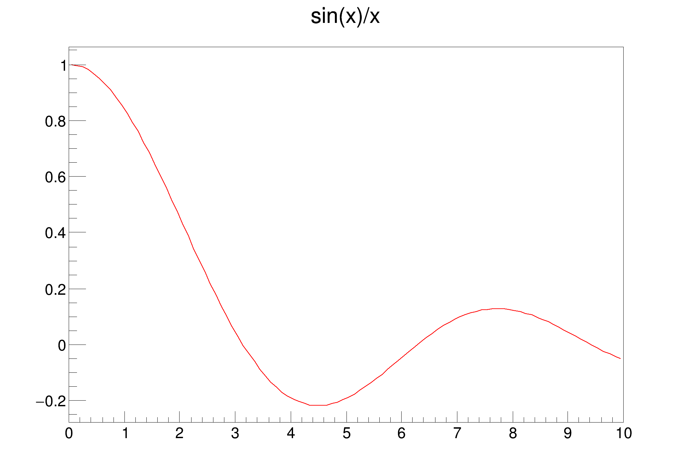

# 2.2.3 函数与图形

## 基本函数表达

#### root中的函数表达和C语言重合，例如:

* `sin(x)/x`
* `[0]*sin(x) + [1]*exp(-[2]*x)`
* `x + y**2`
* `x^2 + y^2`
* `[0]*pow([1],4)`
* `2*pi*sqrt(x/y)`
* `gaus(0)*expo(3) + ypol3(5)*x`
* `gausn(0)*expo(3) + ypol3(5)*x`
* `gaus(x, [0..2]) + expo(y, [3..4])`

In the last examples above:

* `gaus(0)` is a substitute for `[0]*exp(-0.5*((x-[1])/[2])**2)` and (0) means start numbering parameters at 0
* `gausn(0)` is a substitute for `[0]*exp(-0.5*((x-[1])/[2])**2)/(sqrt(2*pi)*[2]))` and (0) means start numbering parameters at 0
* `expo(3)` is a substitute for `exp([3]+[4]*x)`
* `pol3(5)` is a substitute for `par[5]+par[6]*x+par[7]*x**2+par[8]*x**3` (`PolN` stands for Polynomial of degree N)
* `gaus(x, [0..2])` is a more explicit way of writing `gaus(0)`
* `expo(y, [3..4])` is a substitute for `exp([3]+[4]*y)`

See below the [full list of predefined functions](https://root.cern/doc/master/classTFormula.html#FormulaFuncs) which can be used as shortcuts in [TFormula](https://root.cern/doc/master/classTFormula.html).

[`TMath`](https://root.cern/doc/master/namespaceTMath.html) 作为表达式的一部分:

* `TMath::Landau(x)*sin(x)`
* `TMath::Erf(x)`

Formula may contain constants, eg:

* `sqrt2`
* `e`
* `pi`
* `ln10`
* `infinity`

and more.


```c
{
   auto fa1 = new TF1("fa1","sin(x)/x",0,10);
   fa1->Draw();
}
```

<figure><figcaption></figcaption></figure>


```c
{
    auto f2 = new TF2("f2","sin(x)*sin(y)/(x*y)",0,5,0,5);
    f2->Draw();
}
```

<figure><figcaption></figcaption></figure>

## 积分


## 求和


## 直线

```
root[] l = new TLine(0.2,0.2,0.8,0.3)
root[] l->Draw()
```


## 箭头

```
TArrow *ar = new TArrow(4,0.2,4,4.5,0.02,"|>");ar->SetLineWidth(3); ar->SetArrowSize(0.02);ar->Draw();
```

[https://root.cern/doc/master/classTArrow.html](https://root.cern/doc/master/classTArrow.html)

ar4->[SetAngle](https://root.cern/doc/master/classTArrow.html#ad886bbbcd364d46c38db01fa91080ca5)(60);


默认箭头


## 矩形 TBox


```
b = new TBox(0.2,0.2,0.8,0.3); b->SetFillColor(5); b->SetFillStyle(3001); b->Draw();
```


## 椭圆 TEllipse

TEllipse是很强大的类，它能帮你绘制椭圆、圆、半圆、倾斜的椭圆等，其标准用如下：

```c
TEllipse *ellipse;  // 设置PSF于Pad
        ellipse = new TEllipse(Ra[i]+w2*3/5.,Dec[i]-w*3/5.,R[i]*1.51/cos(Dec[i]/57.3),R[i]*1.51,0,270,60);   // TEllipse(椭圆在Pad中的横坐标,纵坐标,长轴,短轴,phimax,phimin,theta)
        ellipse->SetFillStyle(0);   // 设置PSF的填充风格为0，意为不填充，默认不填充
        ellipse->SetLineWidth(2);   // 设置PSF线宽为2
        ellipse->SetLineColor(3);   // 设置PSF的轮廓色为3，绿色
        ellipse->Draw();    // 将PSF添加至画布

```

## 蜂巢图


```c
void th2polyHoneycomb(){
   TCanvas *C = new TCanvas("C", "C", 1200, 600);
   C->Divide(2,1);
 
   TH2Poly *hc1 = new TH2Poly();
   hc1->Honeycomb(0, 0, .1, 5, 5);
   hc1->SetTitle("Option V (default)");
   hc1->SetStats(0);
   hc1->Fill(.1, .1, 15.);
   hc1->Fill(.4, .4, 10.);
   hc1->Fill(.5, .5, 20.);
 
   TH2Poly *hc2 = new TH2Poly();
   hc2->Honeycomb(0, 0, .1, 5, 5, "h");
   hc2->SetTitle("Option H");
   hc2->SetStats(0);
   hc2->Fill(.1, .1, 15.);
   hc2->Fill(.4, .4, 10.);
   hc2->Fill(.5, .5, 20.);
 
   C->cd(1)->SetGrid();
   hc1->Draw("colz L");
   C->cd(2)->SetGrid();
   hc2->Draw("colz L");
}
```


