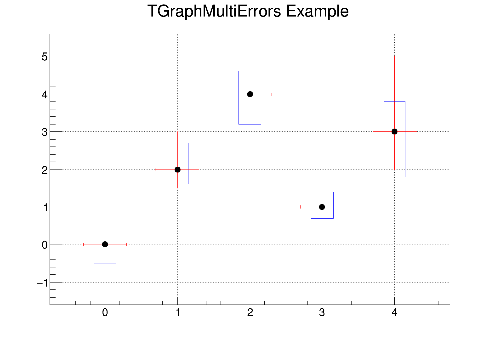

# 2.2.4 误差与拟合

## 误差与拟合的概念

误差（error）是统计样本中某一元素的观测值与其“真值”（未必可直接观测得到）之间的离差的度量。

拟合（fit）是一种构建一个[函数](https://zh.wikipedia.org/wiki/%E5%87%BD%E6%95%B0)[曲线](https://zh.wikipedia.org/wiki/%E5%87%BD%E6%95%B0%E5%9B%BE%E5%BD%A2)，使之最佳地吻合现有[数据点](https://zh.wikipedia.org/w/index.php?title=%E6%95%B8%E6%93%9A%E9%BB%9E\&action=edit\&redlink=1)的过程。

ROOT 中既可以使用`TGraph`描述误差并拟合，也可以使用`TH`类。

<mark style="color:red;">注意：拟合操作应在最后进行，如果宏中的marker属性设置在拟合之后，可能会导致拟合失效</mark>


## 误差棒

误差棒（error bar）在统计图表中起到了传达数据不确定性和可靠性的作用，帮助读者更好地理解数据并做出准确的解释和推断。任何测量都会有误差，使用`TGraphAsymmErrors()`函数绘制误差棒，你甚至可以绘制倾斜的误差棒。

```c
TGraphAsymmErrors *gr = new TGraphAsymmErrors(n,x,y,exl,exh,eyl,eyh)
TGraphAsymmErrors(number of var,x,y,low x,x high,y low,y high)
TGraphAsymmErrors(number of var,x,y,low x,x high,y low, 0)    // 不绘制上误差
auto g = new TGraph2DErrors(np, rx, ry, rz, ex, ey, ez);    // 二维误差棒
```

**设置误差棒的填充颜色：**`SetFillColor()`

**设置误差棒的填充风格：**`SetFillStyle()`

**设置误差棒的颜色：**`SetLineColor()`

**误差棒的样式：**

<details>

<summary>E.g. 包含非对称和倾斜误差棒的图案</summary>

```c
{
   auto c45 = new TCanvas("c45","c45",200,10,600,400);
   const Int_t n = 10;
   Double_t x[n]  = {-0.22, 0.05, 0.25, 0.35, 0.5, 0.61,0.7,0.85,0.89,0.95};
   Double_t y[n]  = {1,2.9,5.6,7.4,9,9.6,8.7,6.3,4.5,1};
   Double_t exl[n] = {.05,.1,.07,.07,.04,.05,.06,.07,.08,.05};
   Double_t eyl[n] = {.8,.7,.6,.5,.4,.4,.5,.6,.7,.8};
   Double_t exh[n] = {.02,.08,.05,.05,.03,.03,.04,.05,.06,.03};
   Double_t eyh[n] = {.6,.5,.4,.3,.2,.2,.3,.4,.5,.6};
   Double_t exld[n] = {.0,.0,.0,.0,.0,.0,.0,.0,.0,.0};
   Double_t eyld[n] = {.0,.0,.05,.0,.0,.0,.0,.0,.0,.0};
   Double_t exhd[n] = {.0,.0,.0,.0,.0,.0,.0,.0,.0,.0};
   Double_t eyhd[n] = {.0,.0,.0,.0,.0,.0,.0,.0,.05,.0};
   auto gr = new TGraphBentErrors(n,x,y,exl,exh,eyl,eyh,exld,exhd,eyld,eyhd);
   gr->SetTitle("A graph with bend errors");
   gr->SetMarkerColor(4);
   gr->SetMarkerStyle(21);
   gr->Draw("ALP");
}
```

</details>

<figure><figcaption><p>包含非对称和倾斜误差棒的图案</p></figcaption></figure>


## 误差带

误差带（error band）是在统计图表中用来表示数据的不确定性或误差范围的一种方式，与误差棒类似，但是误差带通常是用来表示连续数据或函数的误差范围。

<details>

<summary>E.g. 折线误差带和光滑误差带</summary>

```c
{
   auto c41 = new TCanvas("c41","c41",200,10,600,300);
   c41->Divide(2,1);
   double x[] = {0, 1, 2, 3, 4};
   double y[] = {0, 2, 4, 1, 3};
   double ex[] = {0.1, 0.2, 0.3, 0.4, 0.5};
   double ey[] = {1, 0.5, 1, 0.5, 1};
   auto ge = new TGraphErrors(5, x, y, ex, ey);
   ge->SetTitle("Errors as a band");
   ge->SetFillColor(4);
   ge->SetFillStyle(3010);
   c41->cd(1);
   ge->Draw("a3");
   c41->cd(2);
   ge->SetFillColor(6);
   ge->SetFillStyle(3005);
   ge->Draw("a4");
}
```

</details>

<figure><figcaption><p>折线误差带和光滑误差带</p></figcaption></figure>

选项“4”与选项“3”相似，只是表带是平滑的。 如上图所示，<mark style="color:red;">**应谨慎使用此选项，因为平滑算法可能会显示一些（巨大的）“弹跳”效果。 在某些情况下，它看起来比选项“3”更好（因为它很光滑），但它可能会具有误导性。svg和其他保存格式在显示上会略有差异，这里只做示意。论坛上关于弹跳的提问与解答**</mark>[<mark style="color:red;">**https://root-forum.cern.ch/t/confidence-band-on-tf1-fit/34514**</mark>](https://root-forum.cern.ch/t/confidence-band-on-tf1-fit/34514)


## 多重误差

`TMultiErrors`是一个类，用于处理多个测量值的误差。它是ROOT数据分析框架中的一部分，用于处理数据的不确定性和误差。

<details>

<summary>E.g. 绘制多重误差</summary>

```c
{
   auto c1 = new TCanvas("c1", "A Simple Graph with multiple y-errors", 200, 10, 700, 500);
   c1->SetGrid();
   c1->GetFrame()->SetBorderSize(12);
   const Int_t np = 5;
   Double_t x[np]       = {0, 1, 2, 3, 4};
   Double_t y[np]       = {0, 2, 4, 1, 3};
   Double_t exl[np]     = {0.3, 0.3, 0.3, 0.3, 0.3};
   Double_t exh[np]     = {0.3, 0.3, 0.3, 0.3, 0.3};
   Double_t eylstat[np] = {1, 0.5, 1, 0.5, 1};
   Double_t eyhstat[np] = {0.5, 1, 0.5, 1, 2};
   Double_t eylsys[np]  = {0.5, 0.4, 0.8, 0.3, 1.2};
   Double_t eyhsys[np]  = {0.6, 0.7, 0.6, 0.4, 0.8};
   auto gme = new TGraphMultiErrors("gme", "TGraphMultiErrors Example", np, x, y, exl, exh, eylstat, eyhstat);
   gme->AddYError(np, eylsys, eyhsys);
   gme->SetMarkerStyle(20);
   gme->SetLineColor(kRed);
   gme->GetAttLine(0)->SetLineColor(kRed);
   gme->GetAttLine(1)->SetLineColor(kBlue);
   gme->GetAttFill(1)->SetFillStyle(0);
   gme->Draw("APS ; Z ; 5 s=0.5");
}
```


</details>

<figure><figcaption><p>绘制多重误差</p></figcaption></figure>


## 多维误差

`TGraphMultiErrors`的工作方式与`TGraphAsymmErrors`基本相同。 它有可能定义多个y-Errors的类型/维度。 如果你想同时绘制统计和系统错误，这非常有用。


## 内置函数拟合

```c--
hist.Fit("gaus");
```


## 自定义拟合

root 支持用户自定义拟合函数。

```c
#include <fstream>
int fit(){
    TGraph *gr = new TGraph("data1.txt");
    double pi=3.14159265;
    TF1 *f1 = new TF1("f1","[0]*sin([1]*pi*x)*exp([2]*x)+[3]",0,10);

    f1->SetParameter(0,1);    // 第零个参数的参考值
    f1->SetParameter(1,1);
    f1->SetParameter(2,-1);
    f1->SetParameter(3,0.5);
    // be equal in value with below
    // fi->SetParameters(1,1,-1,0.5);
    gr->Fit("f1");
    gr->Draw();

}
```

root会打印出其拟合参数的精确值：

```shell
[zhangzh@node01 test]$ rl fit.c 
root [0] 
Processing fit.c...

****************************************
Minimizer is Minuit / Migrad
Chi2                      =       0.1458
NDf                       =           96
Edm                       =  3.61433e-08
NCalls                    =          123
p0                        =      1.00186   +/-   0.0254347   
p1                        =      1.30098   +/-   0.00369848  
p2                        =    -0.482759   +/-   0.0172724   
p3                        =     0.498504   +/-   0.00393919  
Info in <TCanvas::MakeDefCanvas>:  created default TCanvas with name c1
(int) 0
```

<figure><figcaption></figcaption></figure>


## 拟合参数

`TF1::SetParLimit(parnumber, parvalue);`

`TF1::SetParLimits(parvalue1, parvalue2, parvalue3);`

## 参数获得

`TF1::GetChisquare()`

`TF1::GetNDF()`

`TF1::GetParameter(int i)`

`TF1::GetParError(int i)`

`TF1::GetParErrorLow(int i),GetParErrorUp(int i)`


## 多Graph拟合

#### 合并拟合

用不同的marker表征不同的实验结果，但x轴范围不一致，那么拟合哪一段的数据最为准确？

使用`TMultiGraph::TMultiGraph()`函数，将多个 graph 合并，既能保留不同 marker 的个性，也能让所有数据点参与拟合。

#### 分别拟合

<details>

<summary>E.g. 多条拟合线绘制在一张graph上</summary>

```c
void multigraph()
{
   gStyle->SetOptFit();
   auto c1 = new TCanvas("c1","multigraph",700,500);
   c1->SetGrid();
 
   // draw a frame to define the range
   auto mg = new TMultiGraph();
 
   // create first graph
   const Int_t n1 = 10;
   Double_t px1[] = {-0.1, 0.05, 0.25, 0.35, 0.5, 0.61,0.7,0.85,0.89,0.95};
   Double_t py1[] = {-1,2.9,5.6,7.4,9,9.6,8.7,6.3,4.5,1};
   Double_t ex1[] = {.05,.1,.07,.07,.04,.05,.06,.07,.08,.05};
   Double_t ey1[] = {.8,.7,.6,.5,.4,.4,.5,.6,.7,.8};
   auto gr1 = new TGraphErrors(n1,px1,py1,ex1,ey1);
   gr1->SetMarkerColor(kBlue);
   gr1->SetMarkerStyle(21);
 
   gr1->Fit("gaus","q");
   auto func1 = (TF1 *) gr1->GetListOfFunctions()->FindObject("gaus");
   func1->SetLineColor(kBlue);
 
   mg->Add(gr1);
 
   // create second graph
   const Int_t n2 = 10;
   Float_t x2[]  = {-0.28, 0.005, 0.19, 0.29, 0.45, 0.56,0.65,0.80,0.90,1.01};
   Float_t y2[]  = {2.1,3.86,7,9,10,10.55,9.64,7.26,5.42,2};
   Float_t ex2[] = {.04,.12,.08,.06,.05,.04,.07,.06,.08,.04};
   Float_t ey2[] = {.6,.8,.7,.4,.3,.3,.4,.5,.6,.7};
   auto gr2 = new TGraphErrors(n2,x2,y2,ex2,ey2);
   gr2->SetMarkerColor(kRed);
   gr2->SetMarkerStyle(20);
 
   gr2->Fit("pol5","q");
   auto func2 = (TF1 *) gr2->GetListOfFunctions()->FindObject("pol5");
   func2->SetLineColor(kRed);
   func2->SetLineStyle(2);
 
   mg->Add(gr2);
 
   mg->Draw("ap");
 
   //force drawing of canvas to generate the fit TPaveStats
   c1->Update();
 
   auto stats1 = (TPaveStats*) gr1->GetListOfFunctions()->FindObject("stats");
   auto stats2 = (TPaveStats*) gr2->GetListOfFunctions()->FindObject("stats");
 
   if (stats1 && stats2) {
      stats1->SetTextColor(kBlue);
      stats2->SetTextColor(kRed);
      stats1->SetX1NDC(0.12); stats1->SetX2NDC(0.32); stats1->SetY1NDC(0.82);
      stats2->SetX1NDC(0.72); stats2->SetX2NDC(0.92); stats2->SetY1NDC(0.75);
      c1->Modified();
   }
}
```

</details>

<figure><figcaption><p>多条拟合线绘制在一张graph上</p></figcaption></figure>

## 分段拟合

<details>

<summary>e.g.</summary>

```c
#include <TCanvas.h>
#include <TRandom.h>
#include <TF1Convolution.h>
#include <TF1.h>
#include <TH1F.h>
 
void fitConvolution()
{
   // Construction of histogram to fit.
   TH1F *h_ExpGauss = new TH1F("h_ExpGauss", "Exponential convoluted by Gaussian", 100, 0., 5.);
   for (int i = 0; i < 1e6; i++) {
      // Gives a alpha of -0.3 in the exp.
      double x = gRandom->Exp(1. / 0.3);
      x += gRandom->Gaus(0., 3.);
      // Probability density function of the addition of two variables is the
      // convolution of two density functions.
      h_ExpGauss->Fill(x);
   }
 
   TF1Convolution *f_conv = new TF1Convolution("expo", "gaus", -1, 6, true);
   f_conv->SetRange(-1., 6.);
   f_conv->SetNofPointsFFT(1000);
   TF1 *f = new TF1("f", *f_conv, 0., 5., f_conv->GetNpar());
   f->SetParameters(1., -0.3, 0., 1.);
 
   // Fit.
   h_ExpGauss->Fit("f");
}
```

</details>

## 排除点拟合

<details>

<summary>e.g.</summary>

```c
#include <TH1.h>
#include <TF1.h>
#include <TROOT.h>
 
bool reject;
double fline(double *x, double *par)
{
    if (reject && x[0] > 2.5 && x[0] < 3.5) {
      TF1::RejectPoint();
      return 0;
   }
   return par[0] + par[1]*x[0];
}
 
void fitExclude() {
   //Create a source function
   TF1 *f1 = new TF1("f1","[0] +[1]*x +gaus(2)",0,5);
   f1->SetParameters(6,-1,5,3,0.2);
   // create and fill histogram according to the source function
   TH1F *h = new TH1F("h","background + signal",100,0,5);
   h->FillRandom("f1",2000);
   TF1 *fl = new TF1("fl",fline,0,5,2);
   fl->SetParameters(2,-1);
   //fit only the linear background excluding the signal area
   reject = true;
   h->Fit(fl,"0");
   reject = false;
   //store 2 separate functions for visualization
   TF1 *fleft = new TF1("fleft",fline,0,2.5,2);
   fleft->SetParameters(fl->GetParameters());
   h->GetListOfFunctions()->Add(fleft);
   gROOT->GetListOfFunctions()->Remove(fleft);
   TF1 *fright = new TF1("fright",fline,3.5,5,2);
   fright->SetParameters(fl->GetParameters());
   h->GetListOfFunctions()->Add(fright);
   gROOT->GetListOfFunctions()->Remove(fright);
   h->Draw();
}
```

</details>

## 多段拟合

<details>

<summary>e.g.</summary>

```c
#include "TMultiGraph.h"
#include "TRandom.h"
#include "TF1.h"
#include "TGraphErrors.h"
#include "TCanvas.h"
#include "TMath.h"
 
void fitMultiGraph()
{
   int n = 30;
   double *xvalues1 = new double[n];
   double *xvalues2 = new double[n];
   double *xvalues3 = new double[n];
   double *yvalues1 = new double[n];
   double *yvalues2 = new double[n];
   double *yvalues3 = new double[n];
   double *evalues1 = new double[n];
   double *evalues2 = new double[n];
   double *evalues3 = new double[n];
 
   //generate the data for the graphs
   TRandom r;
   int i;
   for (i=0; i<n; i++) {
      xvalues1[i] = r.Uniform(0.1, 5);
      xvalues2[i] = r.Uniform(3, 8);
      xvalues3[i] = r.Uniform(9, 15);
      yvalues1[i] = 3 + 2*xvalues1[i] + xvalues1[i]*xvalues1[i] + r.Gaus();
      yvalues2[i] = 3 + 2*xvalues2[i] + xvalues2[i]*xvalues2[i] + r.Gaus()*10;
      evalues1[i] = 1;
      evalues2[i] = 10;
      evalues3[i] = 20;
      yvalues3[i] = 3 + 2*xvalues3[i] + xvalues3[i]*xvalues3[i] + r.Gaus()*20;
   }
 
   //create the graphs and set their drawing options
   TGraphErrors *gr1 = new TGraphErrors(n, xvalues1, yvalues1, nullptr, evalues1);
   TGraphErrors *gr2 = new TGraphErrors(n, xvalues2, yvalues2, nullptr, evalues2);
   TGraphErrors *gr3 = new TGraphErrors(n, xvalues3, yvalues3, nullptr, evalues3);
   gr1->SetLineColor(kRed);
   gr2->SetLineColor(kBlue);
   gr2->SetMarkerStyle(24);
   gr2->SetMarkerSize(0.3);
   gr3->SetLineColor(kGreen);
   gr3->SetMarkerStyle(24);
   gr3->SetMarkerSize(0.3);
 
   //add the graphs to the multigraph
   TMultiGraph *mg=new TMultiGraph("mg",
      "TMultiGraph of 3 TGraphErrors");
   mg->Add(gr1);
   mg->Add(gr2);
   mg->Add(gr3);
 
   TCanvas *myc = new TCanvas("myc",
      "Fitting a MultiGraph of 3 TGraphErrors");
   myc->SetGrid();
 
   mg->Draw("ap");
 
   //fit
   mg->Fit("pol2", "F");
 
   //access to the fit function
   TF1 *fpol = mg->GetFunction("pol2");
   fpol->SetLineWidth(1);
 
}
 
void fitminuit()
{
   int n = 30;
   double *xvalues1 = new double[n];
   double *xvalues2 = new double[n];
   double *xvalues3 = new double[n];
   double *yvalues1 = new double[n];
   double *yvalues2 = new double[n];
   double *yvalues3 = new double[n];
   double *evalues1 = new double[n];
   double *evalues2 = new double[n];
   double *evalues3 = new double[n];
   double *xtotal = new double[n*3];
   double *ytotal = new double[n*3];
   double *etotal = new double[n*3];
 
   TRandom r;
   int i;
   for (i=0; i<n; i++) {
      xvalues1[i] = r.Uniform(-3, -1);
      xvalues2[i] = r.Uniform(-1, 1);
      xvalues3[i] = r.Uniform(1, 3);
      yvalues1[i] = TMath::Gaus(xvalues1[i], 0, 1);
      yvalues2[i] = TMath::Gaus(xvalues2[i], 0, 1);
      evalues1[i] = 0.00001;
      evalues2[i] = 0.00001;
      evalues3[i] = 0.00001;
      yvalues3[i] = TMath::Gaus(xvalues3[i], 0, 1);
   }
   for (i=0; i<n; i++)
      {xtotal[i]=xvalues1[i]; ytotal[i]=yvalues1[i]; etotal[i]=0.00001;}
   for (i=n; i<2*n; i++)
      {xtotal[i] = xvalues2[i-n]; ytotal[i]=yvalues2[i-n]; etotal[i]=0.00001;}
   for (i=2*n; i<3*n; i++)
      {xtotal[i] = xvalues3[i-2*n]; ytotal[i]=yvalues3[i-2*n]; etotal[i]=0.00001;}
 
   //create the graphs and set their drawing options
   TGraphErrors *gr1 = new TGraphErrors(n, xvalues1, yvalues1, nullptr, evalues1);
   TGraphErrors *gr2 = new TGraphErrors(n, xvalues2, yvalues2, nullptr, evalues2);
   TGraphErrors *gr3 = new TGraphErrors(n, xvalues3, yvalues3, nullptr, evalues3);
   TGraphErrors *grtotal = new TGraphErrors(n*3, xtotal, ytotal, nullptr, etotal);
   TMultiGraph *mg=new TMultiGraph("mg", "TMultiGraph of 3 TGraphErrors");
   mg->Add(gr1);
   mg->Add(gr2);
   mg->Add(gr3);
   //mg->Draw("ap");
   //TF1 *ffit = new TF1("ffit", "TMath::Gaus(x, [0], [1], [2])", -3, 3);
   //ffit->SetParameters(0, 1, 0);
   //mg->Fit(ffit);
 
   grtotal->Fit("gaus");
   mg->Fit("gaus");
}
```

</details>

## 含本底拟合

<details>

<summary>E.g. 含本底拟合</summary>

```c
#include <Fit/Fitter.h>
#include <Fit/BinData.h>
#include <Fit/Chi2FCN.h>
#include <TH1.h>
#include <Math/WrappedMultiTF1.h>
#include <HFitInterface.h>
#include <TCanvas.h>
#include <TStyle.h>
 
// definition of shared parameter
// background function
int iparB[2] = {
   0, // exp amplitude in B histo
   2  // exp common parameter
};
 
// signal + background function
int iparSB[5] = {
   1, // exp amplitude in S+B histo
   2, // exp common parameter
   3, // Gaussian amplitude
   4, // Gaussian mean
   5  // Gaussian sigma
};
 
// Create the GlobalCHi2 structure
 
struct GlobalChi2 {
   GlobalChi2(ROOT::Math::IMultiGenFunction &f1, ROOT::Math::IMultiGenFunction &f2) : fChi2_1(&f1), fChi2_2(&f2) {}
 
   // parameter vector is first background (in common 1 and 2)
   // and then is signal (only in 2)
   double operator()(const double *par) const
   {
      double p1[2];
      for (int i = 0; i < 2; ++i)
         p1[i] = par[iparB[i]];
 
      double p2[5];
      for (int i = 0; i < 5; ++i)
         p2[i] = par[iparSB[i]];
 
      return (*fChi2_1)(p1) + (*fChi2_2)(p2);
   }
 
   const ROOT::Math::IMultiGenFunction *fChi2_1;
   const ROOT::Math::IMultiGenFunction *fChi2_2;
};
 
void combinedFit()
{
 
   TH1D *hB = new TH1D("hB", "histo B", 100, 0, 100);
   TH1D *hSB = new TH1D("hSB", "histo S+B", 100, 0, 100);
 
   TF1 *fB = new TF1("fB", "expo", 0, 100);
   fB->SetParameters(1, -0.05);
   hB->FillRandom("fB");
 
   TF1 *fS = new TF1("fS", "gaus", 0, 100);
   fS->SetParameters(1, 30, 5);
 
   hSB->FillRandom("fB", 2000);
   hSB->FillRandom("fS", 1000);
 
   // perform now global fit
 
   TF1 *fSB = new TF1("fSB", "expo + gaus(2)", 0, 100);
 
   ROOT::Math::WrappedMultiTF1 wfB(*fB, 1);
   ROOT::Math::WrappedMultiTF1 wfSB(*fSB, 1);
 
   ROOT::Fit::DataOptions opt;
   ROOT::Fit::DataRange rangeB;
   // set the data range
   rangeB.SetRange(10, 90);
   ROOT::Fit::BinData dataB(opt, rangeB);
   ROOT::Fit::FillData(dataB, hB);
 
   ROOT::Fit::DataRange rangeSB;
   rangeSB.SetRange(10, 50);
   ROOT::Fit::BinData dataSB(opt, rangeSB);
   ROOT::Fit::FillData(dataSB, hSB);
 
   ROOT::Fit::Chi2Function chi2_B(dataB, wfB);
   ROOT::Fit::Chi2Function chi2_SB(dataSB, wfSB);
 
   GlobalChi2 globalChi2(chi2_B, chi2_SB);
 
   ROOT::Fit::Fitter fitter;
 
   const int Npar = 6;
   double par0[Npar] = {5, 5, -0.1, 100, 30, 10};
 
   // create before the parameter settings in order to fix or set range on them
   fitter.Config().SetParamsSettings(6, par0);
   // fix 5-th parameter
   fitter.Config().ParSettings(4).Fix();
   // set limits on the third and 4-th parameter
   fitter.Config().ParSettings(2).SetLimits(-10, -1.E-4);
   fitter.Config().ParSettings(3).SetLimits(0, 10000);
   fitter.Config().ParSettings(3).SetStepSize(5);
 
   fitter.Config().MinimizerOptions().SetPrintLevel(0);
   fitter.Config().SetMinimizer("Minuit2", "Migrad");
 
   // fit FCN function directly
   // (specify optionally data size and flag to indicate that is a chi2 fit)
   fitter.FitFCN(6, globalChi2, nullptr, dataB.Size() + dataSB.Size(), true);
   ROOT::Fit::FitResult result = fitter.Result();
   result.Print(std::cout);
 
   TCanvas *c1 = new TCanvas("Simfit", "Simultaneous fit of two histograms", 10, 10, 700, 700);
   c1->Divide(1, 2);
   c1->cd(1);
   gStyle->SetOptFit(1111);
 
   fB->SetFitResult(result, iparB);
   fB->SetRange(rangeB().first, rangeB().second);
   fB->SetLineColor(kBlue);
   hB->GetListOfFunctions()->Add(fB);
   hB->Draw();
 
   c1->cd(2);
   fSB->SetFitResult(result, iparSB);
   fSB->SetRange(rangeSB().first, rangeSB().second);
   fSB->SetLineColor(kRed);
   hSB->GetListOfFunctions()->Add(fSB);
   hSB->Draw();
}
```

</details>

<figure><figcaption></figcaption></figure>


## 拟合误差

拟合误差是用来描述实际观测值与拟合模型（如线性回归、曲线拟合等）之间的差异或偏差，即拟合模型对真实数据的逼近程度。

拟合误差通常以各种统计指标来表示，比如残差平方和（residual sum of squares）、平均绝对误差（mean absolute error）、均方根误差（root mean square error）等。

<details>

<summary>E.g. 拟合误差棒和拟合误差带</summary>

```c
#include "TGraphErrors.h"
#include "TGraph2DErrors.h"
#include "TCanvas.h"
#include "TF2.h"
#include "TH1.h"
#include "TVirtualFitter.h"
#include "TRandom.h"
 
void ConfidenceIntervals()
{
   TCanvas *myc = new TCanvas("myc","Confidence intervals on the fitted function",1000, 500);
   myc->Divide(3,1);
 
//### 1. A graph
   //Create and fill a graph
   int ngr = 100;
   TGraph *gr = new TGraph(ngr);
   gr->SetName("GraphNoError");
   double x, y;
   int i;
   for (i=0; i<ngr; i++){
      x = gRandom->Uniform(-1, 1);
      y = -1 + 2*x + gRandom->Gaus(0, 1);
      gr->SetPoint(i, x, y);
   }
   //Create the fitting function
   TF1 *fpol = new TF1("fpol", "pol1", -1, 1);
   fpol->SetLineWidth(2);
   gr->Fit(fpol, "Q");
 
   /*Create a TGraphErrors to hold the confidence intervals*/
   TGraphErrors *grint = new TGraphErrors(ngr);
   grint->SetTitle("Fitted line with .95 conf. band");
   for (i=0; i<ngr; i++)
      grint->SetPoint(i, gr->GetX()[i], 0);
   /*Compute the confidence intervals at the x points of the created graph*/
   (TVirtualFitter::GetFitter())->GetConfidenceIntervals(grint);
   //Now the "grint" graph contains function values as its y-coordinates
   //and confidence intervals as the errors on these coordinates
   //Draw the graph, the function and the confidence intervals
   myc->cd(1);
   grint->SetLineColor(kRed);
   grint->Draw("ap");
   gr->SetMarkerStyle(5);
   gr->SetMarkerSize(0.7);
   gr->Draw("psame");
 
//### 2. A histogram
   myc->cd(2);
   //Create, fill and fit a histogram
   int nh=5000;
   TH1D *h = new TH1D("h",
      "Fitted Gaussian with .95 conf.band", 100, -3, 3);
   h->FillRandom("gaus", nh);
   TF1 *f = new TF1("fgaus", "gaus", -3, 3);
   f->SetLineWidth(2);
   h->Fit(f, "Q");
   h->Draw();
 
   /*Create a histogram to hold the confidence intervals*/
   TH1D *hint = new TH1D("hint","Fitted Gaussian with .95 conf.band", 100, -3, 3);
   (TVirtualFitter::GetFitter())->GetConfidenceIntervals(hint,0.68);
   //Now the "hint" histogram has the fitted function values as the
   //bin contents and the confidence intervals as bin errors
   hint->SetStats(false);
   hint->SetFillColor(2);
   hint->Draw("e3 same");
 
//### 3. A 2d graph
   //Create and fill the graph
   int ngr2 = 100;
   double z, rnd, e=0.3;
   TGraph2D *gr2 = new TGraph2D(ngr2);
   gr2->SetName("Graph2DNoError");
   TF2  *f2 = new TF2("f2","1000*(([0]*sin(x)/x)*([1]*sin(y)/y))+250",-6,6,-6,6);
   f2->SetParameters(1,1);
   for (i=0; i<ngr2; i++){
      f2->GetRandom2(x,y);
      // Generate a random number in [-e,e]
      rnd = 2*gRandom->Rndm()*e-e;
      z = f2->Eval(x,y)*(1+rnd);
      gr2->SetPoint(i,x,y,z);
   }
   //Create a graph with errors to store the intervals
   TGraph2DErrors *grint2 = new TGraph2DErrors(ngr2);
   for (i=0; i<ngr2; i++)
      grint2->SetPoint(i, gr2->GetX()[i], gr2->GetY()[i], 0);
 
   //Fit the graph
   f2->SetParameters(0.5,1.5);
   gr2->Fit(f2, "Q");
   /*Compute the confidence intervals*/
   (TVirtualFitter::GetFitter())->GetConfidenceIntervals(grint2);
   //Now the "grint2" graph contains function values as z-coordinates
   //and confidence intervals as their errors
   //draw
   myc->cd(3);
   f2->SetNpx(30);
   f2->SetNpy(30);
   f2->SetFillColor(kBlue);
   f2->Draw("surf4");
   grint2->SetNpx(20);
   grint2->SetNpy(20);
   grint2->SetMarkerStyle(24);
   grint2->SetMarkerSize(0.7);
   grint2->SetMarkerColor(kRed);
   grint2->SetLineColor(kRed);
   grint2->Draw("E0 same");
   grint2->SetTitle("Fitted 2d function with .95 error bars");
 
   myc->cd();
}
```

</details>

<figure><figcaption><p>拟合误差棒和拟合误差带</p></figcaption></figure>


## 拟合面板

设置直方图拟合框`TStyle::SetOptFit(pcev)`。

```
p = 1；打印概率
c = 1; 打印卡方/自由度数
e = 1; 打印误差（如果 e = 1，v 必须为 1）
v = 1；打印参数名称/值
```

`gStyle->SetOptFit(1)`表示“默认值”，等价于`gStyle->SetOptFit(111)`，`gStyle->SetOptFit(0)`表示关闭面板。

### 拟合面板位置

适用于打开多个拟合面板

`TPave::SetX1 (x1)`设置拟合框的左下角的值为x1。

`TPave::`[`SetX1NDC`](https://root.cern.ch/doc/master/classTPave.html#af36439e4ac62f16ba7b9287df0d24ffe)`(newx1)`设置拟合框相对位置，取值范围`(0,1)`。

TPave::[SetX2NDC](https://root.cern.ch/doc/master/classTPave.html#af58f6c51e395aebc994af3a3ce52b5e1)(newx2); TPave::[SetY1NDC](https://root.cern.ch/doc/master/classTPave.html#af58f6c51e395aebc994af3a3ce52b5e1)(newx2);TPave::[SetY2NDC](https://root.cern.ch/doc/master/classTPave.html#af58f6c51e395aebc994af3a3ce52b5e1)(newx2);同理。

### 拟合参数名

修改参数名称可以让你的拟合结果更加清晰，`TF1::SetParNames("parname", "", "parname")`最多支持10位的参数名称重制，空字符串会被跳过。

或另外单独控制：`TF1::SetParName(number, parname)`。

### 参数范围

`TF1::SetParLimits(number, parmin, parmax)`


## **Associated errors**

By default, for each bin, the sum of weights is computed at fill time. You can also call [TH1::Sumw2()](https://root.cern/doc/master/classTH1.html#aefa4ee94f053ec3d217f3223b01fa014) to force the storage and computation of the sum of the square of weights per bin. If `Sumw2()` has been called, the error per bin is computed as the `sqrt(sum of squares of weights)`. Otherwise, the error is set equal to the \`sqrt(bin content).

To return the error for a given bin number, use:

```c--
double error = h->GetBinError(bin);
```

Empty bins are excluded in the fit when using the Chi-square fit method. When fitting an histogram representing counts (that is with Poisson statistics) it is recommended to use the Log-Likelihood method (option `L` or `WL`), particularly in case of low statistics.


## 参数返回

```c--
// TFitResultPtr contains only the fit status.
int fitStatus = hist->Fit(myFunction);

// TFitResultPtr contains the TFitResult.
TFitResultPtr r = hist->Fit(myFunction,"S");

// Access the covariance matrix.
TMatrixDSym cov = r->GetCovarianceMatrix();

// Retrieve the fit chi2.
double chi2 = r->Chi2();

// Retrieve the value for the parameter 0.
double par0 = r->Parameter(0);

// Retrieve the error for the parameter 0.
double err0 = r->ParError(0);

// Print the full information of the fit including covariance matrix.
r->Print("V");

// Store the result in a ROOT file.
r->Write();
```


***

## 参考

* [classTMultiGraph](https://root.cern.ch/doc/master/classTMultiGraph.html)


