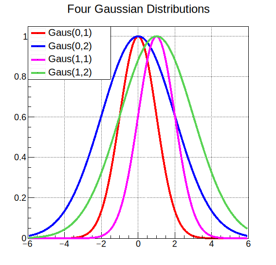

# 2.3 属性设置

`TStyle`是用来定义绘图风格的类，它包含所有元素的各种属性设置，如颜色、宽度、填充、字体等，从而创建出符合用户需求的效果。但是<mark style="color:red;">**`TStyle`**</mark><mark style="color:red;">**是用于设置全局绘图样式的类，在局部设置中，全局设置**</mark><mark style="color:red;">**`TStyle`**</mark><mark style="color:red;">**会被覆盖，导致**</mark><mark style="color:red;">**`TStyle`**</mark><mark style="color:red;">**的设置不生效。所以本章介绍的成员函数均以局部设置的类下呈现。**</mark>

**TStyle的成员函数：**

```c
root [1] TStyle::Set
SetAxisColor                // 设置轴线颜色
SetBarOffset
SetBarWidth
SetBit
SetCanvasBorderMode        // 设置画布边框形式
SetCanvasBorderSize
SetCanvasColor            // 设置画布颜色
SetCanvasDefH
SetCanvasDefW
SetCanvasDefX
SetCanvasDefY
SetCanvasPreferGL
SetCapLinePS
SetColorModelPS
SetDateX
SetDateY
SetDrawBorder
SetDrawOption
SetDtorOnly
SetEndErrorSize
SetErrorX
SetFillAttributes
SetFillColor
SetFillColorAlpha
SetFillStyle
SetFitFormat
SetFrameBorderMode
SetFrameBorderSize
SetFrameFillColor        // 设置框架内部填充色
SetFrameFillStyle        // 设置框架内部填充风格
SetFrameLineColor
SetFrameLineStyle
SetFrameLineWidth
SetFuncColor
SetFuncStyle
SetFuncWidth
SetGridColor
SetGridStyle
SetGridWidth
SetHatchesLineWidth
SetHatchesSpacing
SetHeaderPS
SetHistFillColor        // 设置直方图填充色
SetHistFillStyle        // 设置直方图填充风格
SetHistLineColor
SetHistLineStyle
SetHistLineWidth
SetHistMinimumZero
SetHistTopMargin
SetImageScaling
SetIsReading
SetJoinLinePS
SetLabelColor
SetLabelFont
SetLabelOffset
SetLabelSize
SetLegendBorderSize
SetLegendFillColor
SetLegendFont
SetLegendTextSize
SetLegoInnerR
SetLineAttributes
SetLineColor
SetLineColorAlpha
SetLineScalePS
SetLineStyle
SetLineStyleString
SetLineWidth
SetMarkerAttributes
SetMarkerColor
SetMarkerColorAlpha
SetMarkerSize
SetMarkerStyle
SetName
SetNameTitle
SetNdivisions
SetNumberContours
SetObjectStat
SetOptDate
SetOptFile
SetOptFit
SetOptLogx
SetOptLogy
SetOptLogz
SetOptStat            // 设置图例的内容
SetOptTitle
SetPadBorderMode
SetPadBorderSize
SetPadBottomMargin
SetPadColor
SetPadGridX
SetPadGridY
SetPadLeftMargin
SetPadRightMargin
SetPadTickX
SetPadTickY
SetPadTopMargin
SetPaintTextFormat
SetPalette
SetPaperSize
SetScreenFactor
SetStatBorderSize
SetStatColor
SetStatFont
SetStatFontSize
SetStatFormat
SetStatH
SetStatStyle
SetStatTextColor
SetStatW
SetStatX
SetStatY
SetStripDecimals
SetTextAlign
SetTextAngle
SetTextAttributes
SetTextColor
SetTextColorAlpha
SetTextFont
SetTextSize
SetTextSizePixels
SetTickLength
SetTimeOffset
SetTitle
SetTitleAlign
SetTitleBorderSize
SetTitleColor
SetTitleFillColor
SetTitleFont
SetTitleFontSize
SetTitleH
SetTitleOffset
SetTitlePS
SetTitleSize
SetTitleStyle
SetTitleTextColor
SetTitleW
SetTitleX
SetTitleXOffset
SetTitleXSize
SetTitleY
SetTitleYOffset
SetTitleYSize
SetUniqueID
```

填充属性包括填充颜色、填充风格、调色板等内容的设置：


[2.3.1-tian-chong-shu-xing.md](2.3.1-tian-chong-shu-xing.md)


坐标轴属性设置包括轴线、刻度、轴标题等内容的设置：


[2.3.2-zuo-biao-zhou-shu-xing.md](2.3.2-zuo-biao-zhou-shu-xing.md)


文字属性包括颜色、字体等内容的设置：


[2.3.3-wen-zi-shu-xing.md](2.3.3-wen-zi-shu-xing.md)



## 线的属性

线的属性设置通常包含颜色、宽度、风格，可以分别通过下面的命令来分别设置：

**风格：`SetLineStyle()`，**<mark style="color:red;">**风格style的重要性体现在如果不先设置风格属性，那么其他属性，如颜色、大小，可能不会生效。**</mark>

<figure><figcaption></figcaption></figure>

**颜色：`SetLineColor()`，参考**[**2.5.1**](2.3.1-tian-chong-shu-xing.md#ji-ben-yan-se)

**宽度：`SetLineWidth()`，**<mark style="color:green;">**线宽通常宜设置为 2**</mark>

<figure><figcaption></figcaption></figure>

<mark style="color:green;">**当然，如果你需要一个带状区域时，也可以简单的使用线宽来调整：**</mark>

```
gr3->SetLineWidth(-802);    // ffll;ff=fill;ll=li
```


## 记号属性

记号的属性设置通常包含颜色、风格、线宽、大小，可以分别通过下面的命令来分别设置：

#### **风格：`SetMarkerStyle()`**

<figure><figcaption></figcaption></figure>


**注意：**

在绘图时应小心使用非对称符号。 这个图表显示了符号的误导性！这两个绘图代表相同的数据集，但由于符号选择不当，顶部的两个绘图看起来比底部示例相距更远。


<figure><figcaption></figcaption></figure>

#### **颜色：`SetMarkerColor()`，**参考[2.5.1](2.3.1-tian-chong-shu-xing.md#ji-ben-yan-se)

#### **线宽：`SetMarkerStyle()`**

通常情况下，你不需要额外设置记号的线宽，但是当你需要着重标注的时候，可以使用`SetMarkerStyle()`来设置线宽，50 - 67线宽为2、68 - 85线宽为3，以此类推：

<figure><figcaption></figcaption></figure>

#### 大小：`SetMarkerSize()`

下图显示了各种标记尺寸。默认标记大小=1显示在左上角。可以指定小于1的标记大小。标记大小不指任何坐标系，它是一个绝对值。因此，<mark style="color:green;">**标记大小不受TPad比例变化的影响。等于1的标记大小对应于8像素**</mark>。

<figure><figcaption></figcaption></figure>


## 图例用法

图例可以用来解释图中的各个部分的名称，他的用法是：`TLegend *l = new TLegend(,,,,"")`，意为新建一个名为`l`的图例，参数前四位是相对于画布的归一化坐标，`(0,0)`表示画布的左下角，`(1,1)`表示画布的右上角。

#### 增加图例内容

使用`l->AddEntry(,"")`函数为你的图例添加新的解释：

<details>

<summary> <em><strong>E.g.</strong></em><strong> 介绍四个高斯函数的图例</strong></summary>

```c
void ex3_gaus(){
    
    TCanvas *c = new TCanvas("c","Four Gaussian Distributions",600,600);
    c->SetGrid();

    TF1 *f1 = new TF1("f1","TMath::Gaus(x,0,1)",-6,6);
    TF1 *f2 = new TF1("f2","TMath::Gaus(x,0,2)",-6,6);
    TF1 *f3 = new TF1("f3","TMath::Gaus(x,1,1)",-6,6);
    TF1 *f4 = new TF1("f4","TMath::Gaus(x,1,2)",-6,6);
    
    TLegend *leg = new TLegend(0.1,0.7,0.4,0.9,"");
    leg->AddEntry(f1,"Gaus(0,1)");
    leg->AddEntry(f2,"Gaus(0,2)");
    leg->AddEntry(f3,"Gaus(1,1)");
    leg->AddEntry(f4,"Gaus(1,2)");

    f1->SetLineColor(2);
    f1->SetLineWidth(4);
    f1->Draw();   

    f2->SetLineColor(4);
    f2->SetLineWidth(4);
    f2->Draw("same");
    
    f3->SetLineColor(6);
    f3->SetLineWidth(4);
    f3->Draw("same");
    
    f4->SetLineColor(8);
    f4->SetLineWidth(4);
    f4->Draw("same");
    
    f1->SetTitle("Four Gaussian Distributions");
    leg->Draw();

    c->SaveAs("ex3_gaus.pdf");
    c->SaveAs("ex3_gaus.svg");

}
```

</details>

<figure><figcaption></figcaption></figure>

#### 修改图例框

使用`SetBorderSize(0)`命令**关闭图例框**在某些情况下图像更加美观

<mark style="color:red;">添加阴影</mark>

<mark style="color:red;">修改位置</mark>


## 画布属性

gPad->SetMargin(,,,)

四个参数分别表示左边距、右边距、下边距和上边距的大小


## 画板属性


