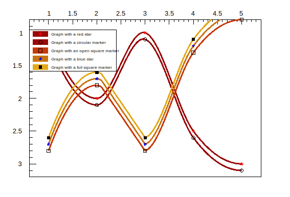

# 2.3 图表 Graphs

TGraph 类常用于绘制其它类型的图形，如平面绘图、方程、复杂图形等

## 图表 Graphs

### **一个简单的Graph**

我们常常会把一些坐标输出到某个文本文件中，方便查看和保存，当我们想要快速的绘制该文件的坐标时，可以使用下面这段命令快速开始绘制：

<mark style="color:red;">这里要求文件中的坐标中间是空格或者制表符，不可以是逗号。</mark>

在命令行中，这两行命令依然生效。

```c
int directdata(){
    TGraph *gr = new TGraph("mydata.txt");
    gr->Draw("AC*");    // 绘出axis，坐标点以curve链接，坐标点形状为*型
}
```

### **一个复杂的Graph**

我们可以使用TGraph函数完成更加复杂的图形

<details>

<summary>E.g. </summary>

```c
void exclusion(){
    
    TCanvas *c1 = new TCanvas( "c1","Exclusion graph example",200,10,700,500 );
    c1->SetGrid();

    TMultiGraph *mg = new TMultiGraph();    // combining from graph
    mg->SetTitle( "Exclusion graphs" ); 


    const int n = 35;
    double x1[n],x2[n],x3[n],y1[n],y2[n],y3[n];

    for (int i=0;i<n;i++){
        x1[i]=i*0.1;y1[i]=10*sin(x1[i]);
        x2[i]=x1[i];y2[i]=10*cos(x1[i]);
        x3[i]=x1[i]+0.5;y3[i]=10*sin(x1[i])-2;
    }

    TGraph *gr1 = new TGraph( n,x1,y1 );
    gr1->SetLineColor(7);
    gr1->SetLineWidth(1504);    // ffll;ff=fill;ll=linewidth
    gr1->SetFillColor(kBlack);
    gr1->SetFillStyle(3003);    // fill style [3001,3020]

    TGraph *gr2 = new TGraph( n,x2,y2 );
    gr2->SetLineColor(4);
    gr2->SetLineWidth(-2002);
    gr2->SetFillColor(9);
    gr2->SetFillStyle(3003);

    TGraph *gr3 = new TGraph( n,x3,y3 );
    gr3->SetLineColor(5);
    gr3->SetLineWidth(-802);    // ffll;ff=fill;ll=linewidth
    gr3->SetFillColor(2);
    gr3->SetFillStyle(3003);

    gr1->Draw("AC");
    gr2->Draw("CP");
    gr3->Draw("CP");
}
```

</details>

<figure><figcaption></figcaption></figure>

## 绘制多图

当需要分别使用多张graph来表示数据变化或者相互对比时，常用多图绘制的方法。

### 分别绘制

使用`Divide()`函数将Canvas分割为不同的Pad，例如将名为c1的canvas分为2列3行写作：`c1->Divide(2,3)`，然后使用`c1->cd()`分别控制不同的Pad，pad的名称从左向右，从上至下分别是1，2，……，例如你可以在pad1上绘制histogram，在pad2上绘制graph。

### 共轴画法

最简单的共轴画法是在`Divide()`函数中添加参数，例如`c1->Divide(2,3,0)`，但当要进行一些美化工作的时候，就会发现它们的标题大小，marker大小似乎是独立变化的，这非常影响美观。

所以这里有一个稍微复杂的解决方法仅供参考：


### 合并绘制

将多个histogram或graph绘制在一张pad上，只需要在`Draw()`函数中使用`same`参数：


## 图像拟合 Fit


## 绘图选项

使用以下选项绘制图表，在`Draw()`命令中它们不区分大小写，可不间隔的使用多个参数如`Draw("APL")`和`Draw("A p l")`等价，均表示绘制包涵坐标轴和坐标点的图，并用直线相连：

<table><thead><tr><th width="117">Option </th><th>Description</th></tr></thead><tbody><tr><td>"A" </td><td><mark style="color:green;"><strong>绘制出坐标轴</strong></mark></td></tr><tr><td>"I" </td><td>Combine with option 'A' it draws invisible axis </td></tr><tr><td>"L" </td><td>在点之间使用直线相连，最终呈现的效果是折线</td></tr><tr><td>"F" </td><td>绘制填充区域（“CF”绘制平滑填充区域）</td></tr><tr><td>"C" </td><td><mark style="color:green;"><strong>绘制平滑曲线</strong></mark></td></tr><tr><td>"*" </td><td>每数据点以星号显示</td></tr><tr><td>"P" </td><td>绘制出每个 marker</td></tr><tr><td>"B" </td><td>绘制柱状图/条形图/直方图</td></tr><tr><td>"1" </td><td>当使用柱状图B时，使柱状图从底部开始，否则从0开始</td></tr><tr><td>"X+" </td><td><mark style="color:green;"><strong>X轴在上</strong></mark></td></tr><tr><td>"Y+" </td><td>Y轴在右</td></tr><tr><td>"PFC" </td><td><mark style="color:green;"><strong>调色板填充颜色：图表的填充颜色取自当前调色板中</strong></mark></td></tr><tr><td>"PLC" </td><td><mark style="color:green;"><strong>调色板线条颜色：图形的线条颜色取自当前调色板中</strong></mark></td></tr><tr><td>"PMC" </td><td><mark style="color:green;"><strong>调色板标记颜色：图表的标记颜色取自当前调色板中</strong></mark></td></tr><tr><td>"RX" </td><td><mark style="color:green;"><strong>X轴刻度反转</strong></mark></td></tr><tr><td>"RY" </td><td>Y轴刻度反转</td></tr><tr><td>"HIST"</td><td>以histogram格式绘制/亦或称作阶梯图</td></tr></tbody></table>

<details>

<summary>E.g. 包含X轴在上Y轴反转和自动取色的例子</summary>

```c
void graphpalettecolor () {
 
   gStyle->SetOptTitle(kFALSE);
   gStyle->SetPalette(kSolar);
 
   double x[5]  = {1,2,3,4,5};
   double y1[5] = {1.0,2.0,1.0,2.5,3.0};
   double y2[5] = {1.1,2.1,1.1,2.6,3.1};
   double y3[5] = {1.2,2.2,1.2,2.7,3.2};
   double y4[5] = {1.3,2.3,1.3,2.8,3.3};
   double y5[5] = {1.4,2.4,1.4,2.9,3.4};
 
   TGraph *g1 = new TGraph(5,x,y1); g1->SetTitle("Graph with a red star");
   TGraph *g2 = new TGraph(5,x,y2); g2->SetTitle("Graph with a circular marker");
   TGraph *g3 = new TGraph(5,x,y3); g3->SetTitle("Graph with an open square marker");
   TGraph *g4 = new TGraph(5,x,y4); g4->SetTitle("Graph with a blue star");
   TGraph *g5 = new TGraph(5,x,y5); g5->SetTitle("Graph with a full square marker");
 
   g1->SetLineWidth(3); g1->SetMarkerColor(kRed);
   g2->SetLineWidth(3); g2->SetMarkerStyle(kCircle);
   g3->SetLineWidth(3); g3->SetMarkerStyle(kOpenSquare);
   g4->SetLineWidth(3); g4->SetMarkerColor(kBlue);
   g5->SetLineWidth(3); g5->SetMarkerStyle(kFullSquare);
 
   g1->Draw("CA*x+ry PLC PFC");
   g2->Draw("PCx+ry  PLC PFC");
   g3->Draw("PC  PLC PFC");
   g4->Draw("*C  PLC PFC");
   g5->Draw("PC  PLC PFC");
 
   gPad->BuildLegend();
}
```

</details>

<figure><figcaption></figcaption></figure>


## 极坐标图案 GraphPolar

极坐标图`TGraphPolar()`的绘图选项如下：

<table><thead><tr><th width="155">Option </th><th>Description </th></tr></thead><tbody><tr><td>"O" </td><td>Polar labels are drawn orthogonally to the polargram radius. </td></tr><tr><td>"P" </td><td>Polymarker are drawn at each point position. </td></tr><tr><td>"E" </td><td>绘出误差棒</td></tr><tr><td>"F" </td><td>绘制填充区域（闭合多边形）</td></tr><tr><td>"A" </td><td>即使极坐标图已经存在，也强制重绘轴</td></tr><tr><td>"N" </td><td>禁止显示极坐标标签</td></tr></tbody></table>

<details>

<summary>E.g. 极坐标</summary>

```c
{
   auto c46 = new TCanvas("c46","c46",500,500);
   auto grP1 = new TGraphPolar();
   grP1->SetTitle("TGraphPolar example");
 
   grP1->SetPoint(0, (1*TMath::Pi())/4., 0.05);
   grP1->SetPoint(1, (2*TMath::Pi())/4., 0.10);
   grP1->SetPoint(2, (3*TMath::Pi())/4., 0.15);
   grP1->SetPoint(3, (4*TMath::Pi())/4., 0.20);
   grP1->SetPoint(4, (5*TMath::Pi())/4., 0.25);
   grP1->SetPoint(5, (6*TMath::Pi())/4., 0.30);
   grP1->SetPoint(6, (7*TMath::Pi())/4., 0.35);
   grP1->SetPoint(7, (8*TMath::Pi())/4., 0.40);
 
   grP1->SetMarkerStyle(20);
   grP1->SetMarkerSize(1.);
   grP1->SetMarkerColor(4);
   grP1->SetLineColor(4);
   grP1->Draw("ALP");
 
   // Update, otherwise GetPolargram returns 0
   c46->Update();
   grP1->GetPolargram()->SetToRadian();
}
```

</details>

<figure><figcaption></figcaption></figure>


## 高亮模式

高亮模式适用于`TGraph（和TH1）`类。 当高亮模式打开时，鼠标在点上的移动将以图形表示。 点将突出显示为“点圆”（由标记对象表示）。 此外，任何高亮显示（点变化）都会发出信号`TCanvas::Highlighted()`，允许用户做出反应并调用自己的函数。 为了更好地理解，请参阅教程`$ROOTSYS/tutorials/graphs/hlGraph*.C` 文件。


## 饼状图 TPie




## 数据读出

double \*px = gr->GetX(); 将gr1图像中点数据以数组形式输出


## 条件判断

<figure><figcaption></figcaption></figure>


## _参考_

[https://root.cern/doc/master/classTGraphPainter.html](https://root.cern/doc/master/classTGraphPainter.html)

[https://root.cern.ch/doc/master/classTHistPainter.html](https://root.cern.ch/doc/master/classTHistPainter.html)


