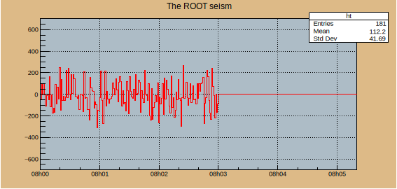
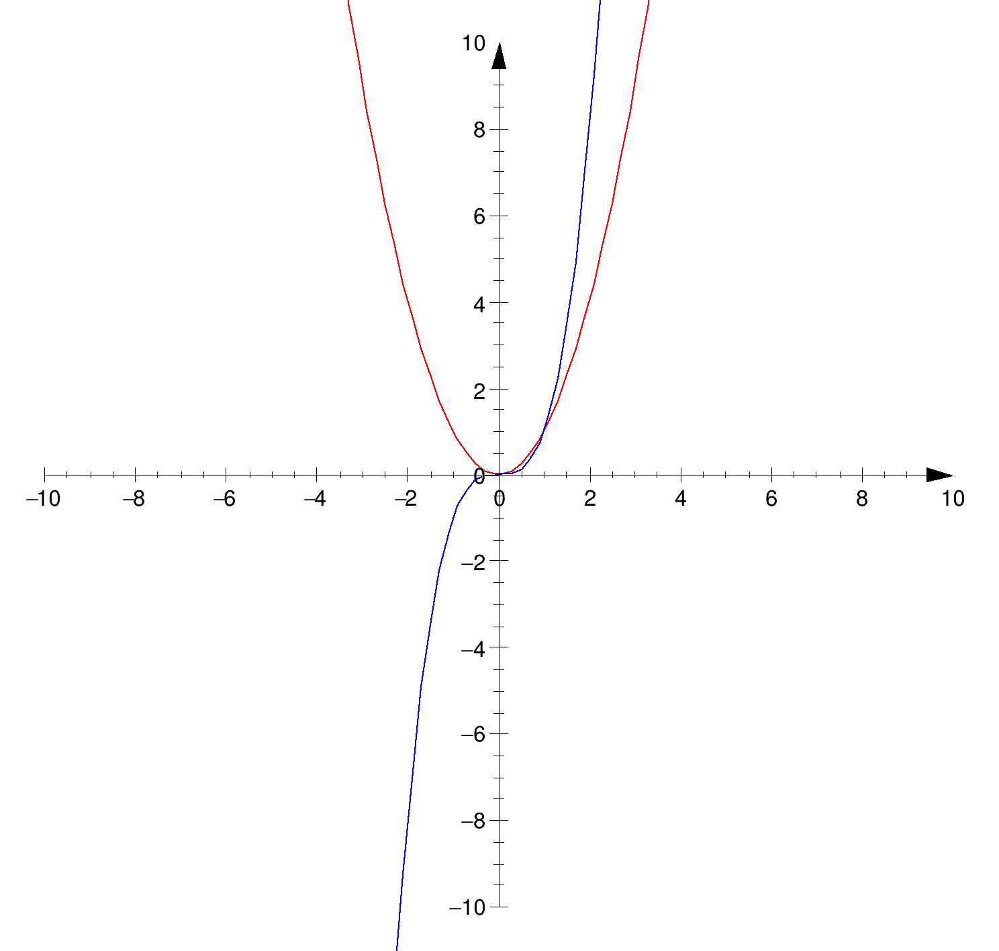

# 2.4.2 坐标轴属性

## 坐标轴的概念

坐标轴由轴线（axisLine）、刻度（Ticket）、刻度标签（Label）、轴标题（Title）四个部分组成。

```c
root [0] TAxis::Set
SetAlphanumeric
SetAxisColor
SetBinLabel
SetBit
SetCanExtend
SetDecimals
SetDefaults
SetDrawOption
SetDtorOnly
SetLabelColor            // 设置刻度标签颜色
SetLabelFont             // 设置刻度标签字体
SetLabelOffset           // 设置刻度标签偏移量，
SetLabelSize             // 设置刻度标签大小
SetLimits
SetMaxDigits
SetMoreLogLabels
SetName
SetNameTitle
SetNdivisions
SetNoAlphanumeric
SetNoExponent
SetObjectStat
SetParent
SetRange
SetRangeUser
SetTickLength
SetTickSize
SetTicks
SetTimeDisplay
SetTimeFormat
SetTimeOffset
SetTitle
SetTitleColor
SetTitleFont
SetTitleOffset
SetTitleSize
SetUniqueID
```

## 坐标轴的轴线

**颜色：**`TStyle::SetAxisColor(,)` E.g. `gStyle->SetAxisColor(2,"xy")`设置 x、y 轴为红色。


## 坐标轴的标题

标题支持 LaTeX 语法。

设置标题的方法是`GetX/Yaxis->SetTitle("name")`，也可以同时设置标题、x轴标题、y轴标题方法是`SetTitle("graph tittle; x tittle; y tilttle")`

同时标题支持自定义：

**颜色：**`SetTitleColor()`

**大小：**`SetTitleSize()`

**字体：**`SetTextFont()`

**距离：**`SetTitleOffset()` 设置轴和轴标题之间的距离。

**位置：**`CenterTitle(true)`

偏移量=1使用标准位置，该位置根据标签偏移量和尺寸计算；偏移量=1.2将使标准偏移量增加20%。

hist->GetXaxis()->SetRange(0.02);&#x20;

hist->GetYaxis()->SetLabelOffset(0.02);

#### **标题偏移量**

hist->GetXaxis()->SetLabelOffset(0.02);&#x20;

hist->GetYaxis()->SetLabelOffset(0.02);


## 坐标轴的范围

合理控制的轴范围，能够更好表达数据变化。root 可以自动选取轴的范围，如果自动的呈现效果不满意，root 也支持手动调整。

对于未分 bin 的数据，例如图表，更改轴范围使用`TAxis::SetLimits(xmin, xmax)`函数；

而直方图轴范围使用`TAxis::SetRange(number bin1, number bin2)`函数修改，参数是分 bin 的编号的位置：

```cpp
{
   TFile f("hsimple.root");
   hpxpy->Draw("colz");
   hpxpy->GetYaxis()->SetRange(22,23);
   hpxpy->GetXaxis()->SetRange(18,19);
}
```

使用“用户坐标”而不是 bin 编号来设置范围更方便。且允许用户直接在直方图对象上`TH::SetAxisRange(min, max, "axis")`设置轴范围，而无需使用`Get[XYZ]axis()`。E.g.

```c
   hpxpy->GetYaxis()->SetRangeUser(0., 3.);
```

等价于：

```c
   hpxpy->SetAxisRange(0., 3.,"Y");
```

**支持绘制图形后更改轴范围：**

```cpp
{
   auto c = new TCanvas("c","A Zoomed Graph",200,10,700,500);

   int n = 10;
   double x[10] = {-.22,.05,.25,.35,.5,.61,.7,.85,.89,.95};
   double y[10] = {1,2.9,5.6,7.4,9,9.6,8.7,6.3,4.5,1};

   auto gr = new TGraph(n,x,y);
   gr->SetMarkerColor(4);
   gr->SetMarkerStyle(20);
   gr->Draw("ALP");
   gr->GetXaxis()->SetRangeUser(0, 0.5);
   gr->GetYaxis()->SetRangeUser(1, 8);
}
```

也可以绘制图表框架`TCanvas::DrawFrame(,,,)`。此方法允许指定比原始范围更大的轴范围。E.g.

```cpp
{
   auto c = new TCanvas("c","A Zoomed Graph",200,10,700,500);
   c->DrawFrame(0,1,0.5,8);

   int n = 10;
   double x[10] = {-.22,.05,.25,.35,.5,.61,.7,.85,.89,.95};
   double y[10] = {1,2.9,5.6,7.4,9,9.6,8.7,6.3,4.5,1};

   auto gr = new TGraph(n,x,y);
   gr->SetMarkerColor(4);
   gr->SetMarkerStyle(20);
   gr->Draw("LP");
}
```

#### 调整坐标极值

下限：`TGraph::SetMinimum();TH::SetMinimum()`

上限：`TGraph::SetMaximum();TH::SetMaximum()`。


## 坐标轴的刻度

偏移量：TStyle::SetLabelOffset(,"")偏移量以pad高度的百分比表示。 axis 指定哪个轴 ("x","y","z")，如果 axis="xyz" 设置所有 3 个轴，则默认 = "x"

字体：TStyle::SetLabelFont(,"")\
SetLabelColor(,"")


## 坐标轴的标签

标签大小：

SetLabelSize(0.05,"xy");

设置轴标签的大小。

尺寸以焊盘高度的百分比表示。 axis 指定哪个轴 ("x","y","z")，如果 axis="xyz" 设置所有 3 个轴，则默认 = "x"

刻度值的位数

```
TGaxis::SetMaxDigits(6);
```

刻度线

TStyle::SetNdivisions

设置绘制轴的分割数。

ndiv ：分区数。

[n](https://root.cern.ch/doc/master/legend1\_8C.html#a747f799d89a43a33a1ad6488a9fe2b8b) = N1 + 100\*N2 + 10000\*N3N1=初级分区的数量。N2=二级划分的数量。N3=第三分区的数量。[例如](https://root.cern.ch/doc/master/RSha256\_8hxx.html#af62772e2f383ddbe93a93eff2a5f543a)：nndi=0 --> 无刻度线。nndi=2 --> 2 个分区，中间有一个刻度线轴的。

axis 指定哪个轴 ("x","y","z")，如果 axis="xyz" 设置所有 3 个轴，则默认 = "x"

TStyle::SetTickLength

设置轴的刻度线长度。

axis 指定哪个轴 ("x","y","z")，如果 axis="xyz" 设置所有 3 个轴，则默认 = "x"


## **双轴画法**

双轴画法是一种作图技巧，通过在画面中同时运用两个或多个对称轴，以达到对称和平衡或突出、方便对比等效果。最简单的呈现效果是使用`gPad`：

```bash
gPad->SetTicks(,)    // 两个参数分别控制x、y轴的对轴
                     // 0 表示不绘制对轴
                     // 1 表示绘制对轴的刻度
                     // 2 表绘制对轴及对应坐标值
                     // 例如gPad->SetTicks(1,2)表示绘制右轴和上轴及上轴对应的坐标值
```


gPad->SetMargin(10,10,10,10)  看不见？？


## **反轴画法**

参考2.3节图形的[绘图选项](2.2-shu-ju-ke-shi-hua.md#tu-xing-de-hui-tu-xuan-xiang)


## 多轴画法


## 断轴画法




## 共用轴/拼接轴画法

共轴画法是一种常见的绘图技巧，在同一张 canvas 中绘制多图并共享 X 轴或 Y 轴。这种方式常用于比较不同数据集之间的趋势或关系。最简单的共轴画法是`TCanvas::Divide(numberx, numbery, 0)`。

参考[数据可视化多图画法](2.2-shu-ju-ke-shi-hua.md#duo-tu-hui-fa)。


## 对数轴画法

<mark style="color:green;">对数轴是Tcanvas的类，所以设置对数轴，需要先建立画布。</mark>

使用`SetLogx()`和`SetLogy()`命令来设置画布的X轴和Y轴为对数坐标轴。_**E.g.**_

```c
TCanvas *c1 = new TCanvas("c1", "Example", 800, 600);
    c1->SetLogx(0);
    c1->SetLogy(1);
    c1->Update();
```

`SetLogx(0)`和`SetLogy(1)`分别表示取消x对数轴和设置y轴为对数轴，不含参数默认设置对数轴。


## **时间轴画法**

<details>

<summary><em>E.g.</em> 模拟地震波随时间变化的图案</summary>

```c
void seism(){

    //TStopwatch sw;sw.Start();
    //TDatime dtime;
    //gStyle->SetTimeOffset( dtime.Convert() ); // replace axis with timeaxis

    //cout << dtime.Convert() << endl;

    TCanvas *c1 = new TCanvas("seism","Time on axis",0,0,1000,500);        
    // TCanvas("canvas name","canvas title",the pixel coordinates of the top left corner of canvas,same as above,size of pixel along X,size of pixel along Y)
   
    c1->SetFillColor( 42 ); // fill background color
    c1->SetFrameFillColor( 33 ); // color in frame
    c1->SetGrid();  // add grid in the frame

    Float_t bintime =1; // set one bin = 1 second. change it to set time scale,don't chenge real time
    TH1F *ht = new TH1F("ht","The ROOT seism",10,0,10*bintime);
    // TH1 = 1D histogram;F = float;("name","title",bin,Xmin,Xmax)
    Float_t signal = 700;
    // c/c++ : int , float , double
    // POOT :int_t , float_t , double_t

    ht->SetMaximum( signal );
    ht->SetMinimum( -signal );
    ht->SetStats( 1 );  // set statistic pad,1=display,0=hide
    ht->SetLineColor( 2 );
    ht->GetXaxis()->SetTimeDisplay( 1 );    // settimedisplay,1=display,0=hide
    ht->GetYaxis()->SetNdivisions( 220 );   // n1n2n3,n1 = a bin in the bin;n2n3 = ???
    ht->Draw();

    for(int i=0;i<200;i++){
        // build a signal ; noisy damped sine
        Float_t noise = gRandom->Gaus(0,120);
        if(i>100){ noise = noise + sin((i-700)*6.28/30)*exp((700-i)/300); }
        ht->SetBinContent(i,noise); // the ith content is noise
        c1->Modified();
        c1->Update();
        gSystem->ProcessEvents();
    }
    
    //printf("real time =%8.3fs,cpu time =%8.3fsn", sw.RealTime(), sw.CpuTime());
    return 0;
}
```

</details>




## 极坐标轴画法

参考2.3节图形的[极坐标图案](2.2-shu-ju-ke-shi-hua.md#ji-zuo-biao-tu-an-graphpolar)


## 笛卡尔坐标系

```c
{
   auto c = new TCanvas("c","c",0,0,500,500);
   c->Range(-11,-11,11,11);
 
   auto f2 = new TF1("x2","x*x",-10,10);
   f2->SetLineColor(kRed);
   f2->Draw("same");
 
   auto f3 = new TF1("x3","x*x*x",-10,10);
   f3->SetLineColor(kBlue);
   f3->Draw("same");
 
   // Draw the axis with arrows
   auto ox = new TGaxis(-10,0,10,0,-10.,10.,510,"+-S>");
   ox->SetTickSize(0.009);
   ox->SetLabelFont(42);
   ox->SetLabelSize(0.025);
   ox->Draw();
   auto oy = new TGaxis(0,-10,0,10,-10,10,510,"+-S>");
   oy->SetTickSize(0.009);
   oy->SetLabelFont(42);
   oy->SetLabelSize(0.025);
   oy->Draw();
}
```

<figure><figcaption></figcaption></figure>


## 画面留白

c1 = new TCanvas("c1","A Simple Graph ",300,0,750,560); c1->SetLeftMargin(0.12);, c1->SetBottomMargin(0.10);


## 坐标轴网格

颜色：`TStyle::SetGridColor()`

样式：`TStyle::SetGridStyle()`

宽度：`TStyle::SetGridWidth()`


## 坐标轴边框

与坐标轴对应的位置是边框，TCanvas::？？？？

设置帧边框模式()TStyle::SetFrameBorderMode

设置框架边框大小()无效 TStyle::SetFrameBorderSize

颜色：TStyle::SetFrameFillColor

样式：TStyle::SetFrameFillStyle

颜色：TStyle::SetFrameLineColor

线条：TStyle::SetFrameLineStyle

TStyle::SetFrameLineWidth


***

参考

[**https://root.cern/doc/master/classTGaxis.html**](https://root.cern/doc/master/classTGaxis.html)

[https://root-forum.cern.ch/t/using-setlimits-changes-the-histogram/43194/6](https://root-forum.cern.ch/t/using-setlimits-changes-the-histogram/43194/6)

[https://root.cern.ch/doc/master/classTStyle.html#a906e5f9060357a95f893701b3bed57a2](https://root.cern.ch/doc/master/classTStyle.html#a906e5f9060357a95f893701b3bed57a2)

[https://root.cern/doc/v630/classTH1.html#afd36e57d93056e578d73291ae3e1bb01](https://root.cern/doc/v630/classTH1.html#afd36e57d93056e578d73291ae3e1bb01)


