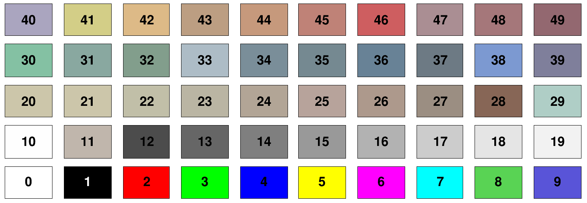
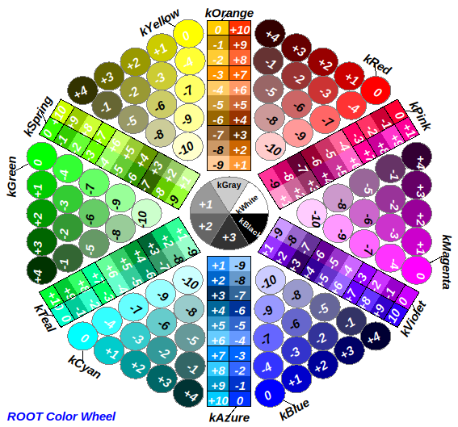
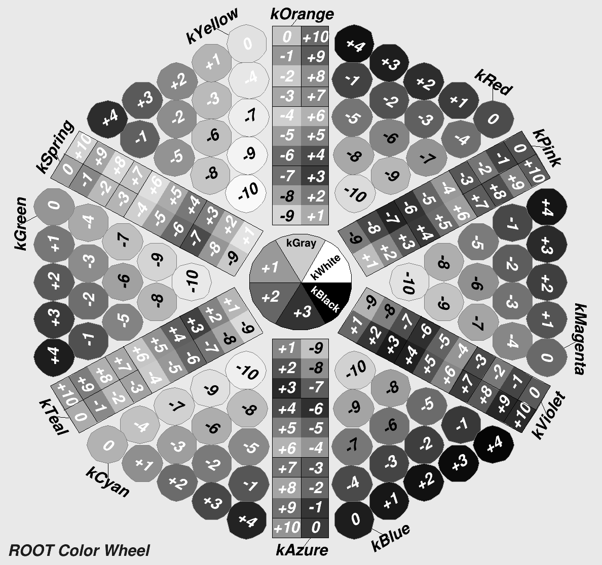
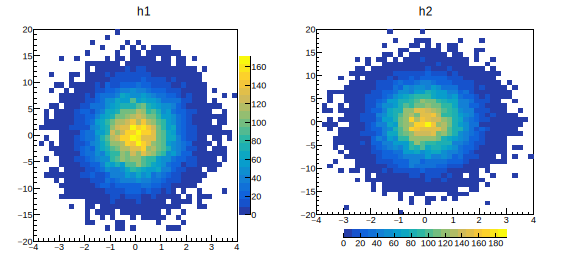

# 2.6.1 颜色属性

## 基本颜色

root中有50种（1-50）基本颜色，你可以通过数字使用它们：

<figure><figcaption></figcaption></figure>


## 明亮颜色

root支持Web应用程序的216种颜色。 通过kRed、kBlue、kYellow、kPink等字符或kRed+5等使用。

<figure><figcaption></figcaption></figure>

完整的颜色与数字对应如下：

```c
kWhite  = 0,   kBlack  = 1,   kGray    = 920,  kRed    = 632,  kGreen  = 416,
kBlue   = 600, kYellow = 400, kMagenta = 616,  kCyan   = 432,  kOrange = 800,
kSpring = 820, kTeal   = 840, kAzure   =  860, kViolet = 880,  kPink   = 900
```


## 透明视图

此函数也用于`SetFillColorAlpha()、SetLineColorAlpha()、SetMarkerColorAlpha()`和`SetTextColorAlpha()`。&#x20;

```c
h1->SetFillColorAlpha(kBlue, 0.35);
```

在示例中，直方图的填充色为蓝色，不透明度为35%。


## 灰度视图

使用`TCanvas::SetGrayscale()`在灰度预览和常规彩色模式之间切换。&#x20;

```c
{
   TColorWheel *w = new TColorWheel();
   cw = new TCanvas("cw","cw",0,0,400,400);
   cw->GetCanvas()->SetGrayscale();
   w->SetCanvas(cw);
   w->Draw();
}
```

<figure><figcaption></figcaption></figure>

## 调色板/色带

用颜色的变化表示变量非常有用：这就是“调色板”的概念，设置调色板的函数是：

```c
gStyle->SetPalette();
```

默认风格为57，还有其他风格63种：

```c
kDeepSea=51,          kGreyScale=52,    kDarkBodyRadiator=53,
kBlueYellow= 54,      kRainBow=55,      kInvertedDarkBodyRadiator=56,
kBird=57,             kCubehelix=58,    kGreenRedViolet=59,
kBlueRedYellow=60,    kOcean=61,        kColorPrintableOnGrey=62,
kAlpine=63,           kAquamarine=64,   kArmy=65,
kAtlantic=66,         kAurora=67,       kAvocado=68,
kBeach=69,            kBlackBody=70,    kBlueGreenYellow=71,
kBrownCyan=72,        kCMYK=73,         kCandy=74,
kCherry=75,           kCoffee=76,       kDarkRainBow=77,
kDarkTerrain=78,      kFall=79,         kFruitPunch=80,
kFuchsia=81,          kGreyYellow=82,   kGreenBrownTerrain=83,
kGreenPink=84,        kIsland=85,       kLake=86,
kLightTemperature=87, kLightTerrain=88, kMint=89,
kNeon=90,             kPastel=91,       kPearl=92,
kPigeon=93,           kPlum=94,         kRedBlue=95,
kRose=96,             kRust=97,         kSandyTerrain=98,
kSienna=99,           kSolar=100,       kSouthWest=101,
kStarryNight=102,     kSunset=103,      kTemperatureMap=104,
kThermometer=105,     kValentine=106,   kVisibleSpectrum=107,
kWaterMelon=108,      kCool=109,        kCopper=110,
kGistEarth=111,       kViridis=112,     kCividis=113
```

<figure><figcaption></figcaption></figure>

### 调色板反置

如果调色板的色彩呈现你不满意，可以尝试调色板反置`TColor::InvertPalette`_**E.g.**_

```c
{
   auto c  = new TCanvas("c","c",0,0,600,400);
   TF2 *f2 = new TF2("f2","0.1+(1-(x-2)*(x-2))*(1-(y-2)*(y-2))",0.999,3.002,0.999,3.002);
   f2->SetContour(99); gStyle->SetPalette(kCherry);
   TColor::InvertPalette();
   f2->Draw("surf2Z"); f2->SetTitle("kCherry inverted");
}
```

<figure><figcaption></figcaption></figure>

### 调色板上下限

在绘制图像或热力图时，色带用于表示不同数值范围的颜色。通过设置色带的下限和上限，可以控制绘制图像时所使用的颜色范围。

`SetMinimum()`将色带的下限设置为某值，确保最小值的数据点在图像中不以颜色显示。

`SetMaximum()`将色带的上限设置为某值，这意味着色带中最高的数值对应的颜色将被映射为绘制图像中的最高颜色。通过设置上限，可以控制图像中最大值的数据点所显示的颜色。

通过设置色带的下限和上限，可以调整图像的对比度和颜色映射，以更好地展示数据的分布和变化。

使用`gPad->SetLogz()`设置调色板为log的形式展示

### 调色板位置

<details>

<summary><em>E.g.</em> </summary>

```c
void movepalette()
{
   auto c = new TCanvas("", "",0,0,1100,550);
   c->Divide(2,1);
   gStyle->SetOptStat(0);

   auto h1 = new TH2D("h1","h1",40,-4,4,40,-20,20);
   auto h2 = new TH2D("h2","h2",40,-4,4,40,-20,20);
   float px, py;
   for (int i = 0; i < 25000; i++) {
      gRandom->Rannor(px,py); h1->Fill(px,5*py);
      gRandom->Rannor(px,py); h2->Fill(px,5*py);
   }

   TPad *p1 = (TPad *)c->cd(1);
   TPad *p2 = (TPad *)c->cd(2);

   p1->SetRightMargin(0.15);
   auto palette1 = new TPaletteAxis(4.05,-15,4.5,15,h1);
   h1->GetListOfFunctions()->Add(palette1);

   p2->SetBottomMargin(0.2);
   auto palette2 = new TPaletteAxis(-3.,-25,3.,-23,h2);
   h2->GetListOfFunctions()->Add(palette2);

   p1->cd(); h1->Draw("colz");
   p2->cd(); h2->Draw("colz");
}
```

</details>

<figure><figcaption></figcaption></figure>

### 调色板刻度

加密和疏松或者单独控制调色板刻度均使用`SetContour()`函数，例如加密刻度可以使用`SetContour(100)`。

<details>

<summary>E.g. 独立控制刻度范围</summary>

```c
{
   gStyle->SetOptStat(0);
   auto c = new TCanvas("c","exa_CJUST",300,10,400,400);
   auto hpxpy = new TH2F("hpxpy","py vs px",40,-4,4,40,-4,4);
   // Fill histograms randomly
   TRandom3 randomNum;
   Float_t px, py;
   for (Int_t i = 0; i < 25000; i++) {
      randomNum.Rannor(px,py);
      hpxpy->Fill(px,py);
   }
   hpxpy->SetMaximum(200);
   Double_t zcontours[5] = {0, 20, 40, 80, 120};
   hpxpy->SetContour(5, zcontours);
   hpxpy->GetZaxis()->SetTickSize(0.01);
   hpxpy->GetZaxis()->SetLabelOffset(0.01);
   gPad->SetRightMargin(0.13);
   hpxpy->SetTitle("User contours, CJUST");
   hpxpy->Draw("COL Z CJUST");
}
```

</details>

<figure><figcaption></figcaption></figure>

### 平调色板颜色

使用的颜色表以当前样式定义。

如果直方图的最小值和最大值相同（平面直方图），则无法绘制颜色图，因此没有绘制任何东西。 要绘制平面直方图，只需设置与垃圾箱内容不同的直方图最小值（TH1::SetMinimum（））。

用于绘制单元格的默认颜色级别数为20。 它可以使用TH1::SetContour()或TStyle::SetNumberContours()进行更改。 这个数字越高，单元格之间的颜色变化就越平滑。

TStyle中的调色板可以通过gStyle->SetPalette（）进行修改。

所有非空垃圾箱都涂上了油漆。 除非一些垃圾箱有负面内容，否则不会油漆空垃圾箱，因为在这种情况下，空垃圾箱可能不是空的。


or

&#x20;f2->SetContour(nb);

### 刻度线长短

h\_myHisto->GetZaxis()->SetTickLength(0.35);


### 移除bin的边框

hpxpy->SetLineColorAlpha(10, 0.) hpxpy->Draw("colz pol")


## 填充风格 Fill Area style

任何类的填充区域样式都可以使用`SetFillStyle()`方法进行更改。

<figure><figcaption></figcaption></figure>


## 自动填充颜色

参考[2.3图表](2.3-tu-biao.md#hui-tu-xuan-xiang)绘图选项

## 在其他Pad上绘制调色板

> Palette Axis on a different pad.

```rust
{
   hpxpy->Draw("colz");
   gPad->Update();
   TPaletteAxis *palette = (TPaletteAxis*)hpxpy->GetListOfFunctions()->FindObject("palette");
   TCanvas *c2 = new TCanvas();
   c2->cd();
   palette->Draw();
}
```
