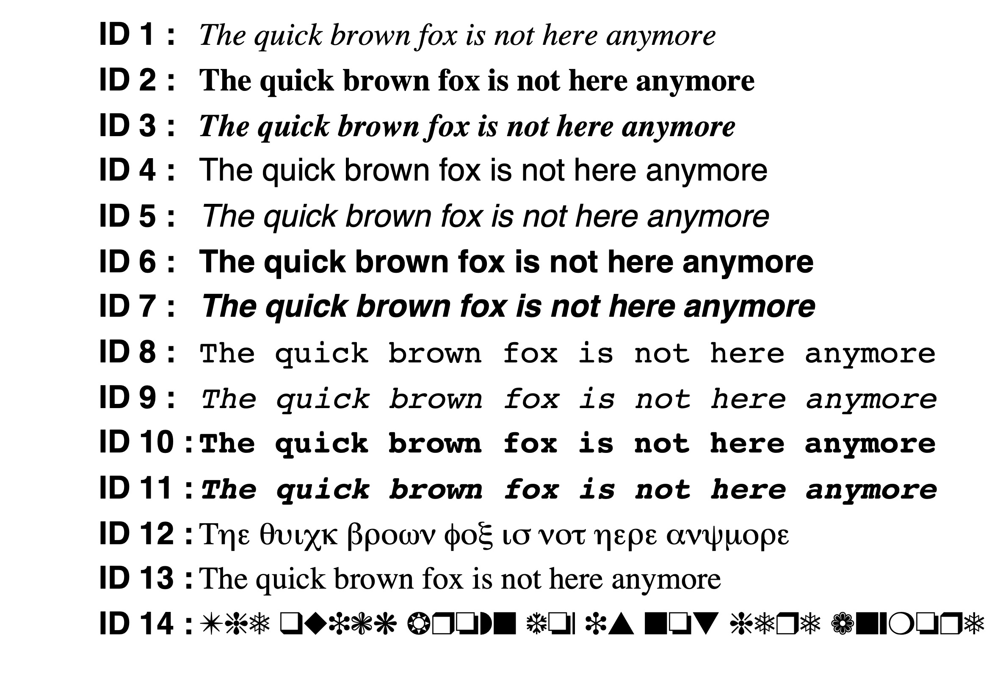
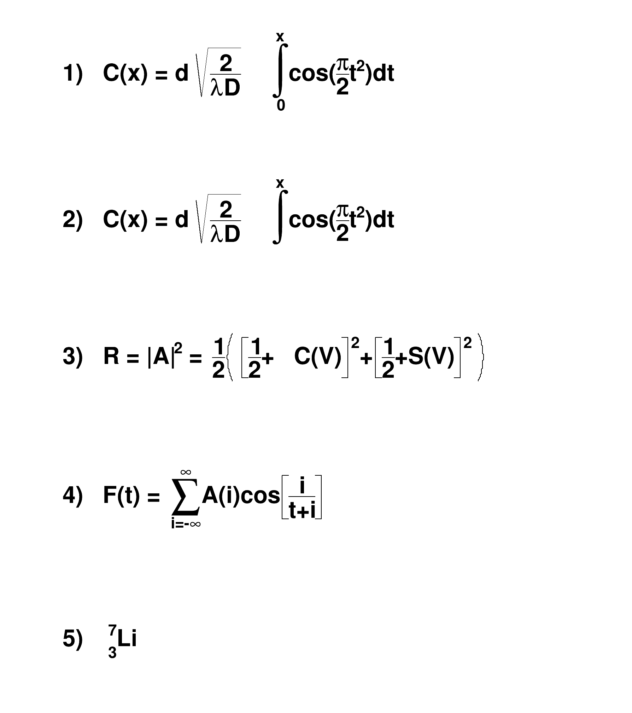

# 2.6.3 文字属性 TAttText & TLatex

## 文字属性

SetTextAttributes

颜色：SetTextColorAlpha()

大小：SetTextSize()

&#x20;           SetTextSizePixels()

字体：SetTextFont()

角度：SetTextAngle(305);

对齐：SetTextAlign(12);


## 公式文字 TLatex

使用`SetTextAlign()`函数设置文本的对齐方式；

使用`SetTextSize()`函数设置文本的大小；

使用`SetTextColor()`函数来设置文本的颜色，参考[2.5.1](2.6.1-yan-se-shu-xing-tattcolor.md#ji-ben-yan-se)。


## 文字种类

使用`SetTextFont`设置字体。 参数为字体代码，它结合了字体和精度：`font = 10 * fontID + precision`。如：`root[] la->SetTextFont(62)`

字体 ID 必须介于 1 和 14 之间。精度可以是：

0：快速字体（大小步长）

1：可扩展且可旋转的硬件字体

2：可扩展且可旋转的硬件字体。

当使用精度0时，为仅使用原始的非缩放系统字体。 这些字体速度快且质量好，但只支持4-37像素大小的文字，而且不能旋转。 1 和 2 字体具有不同的行为，具体取决于是否使用 True Type 字体 (TTF)。 如果使用 TTF，您总是会获得质量非常好的可缩放和可旋转字体。 然而，TTF速度很慢。 对于精度1，文本对某些特殊字符使用旧约定来绘制下标和上标或希腊文本。精度为2 时，“PostScript”特殊字符将按此绘制。

<details>

<summary>E.g. 包含ID展示不同字体效果</summary>

```c
{
    TCanvas *textc = new TCanvas("textc","Example of text",1);
    char cid[8]; // 使用固定大小的数组来代替动态分配内存
    TLatex *lid;
    TLatex *l;
    for (int i=1; i<15; i++) {
        snprintf(cid, 8, "ID %d :", i); // 使用snprintf代替sprintf
        lid = new TLatex(0.1, 1-(double)i/15, cid);
        lid->SetTextFont(62);
        lid->Draw();

        l = new TLatex(.2, 1-(double)i/15, "The quick brown fox is not here anymore");
        l->SetTextFont(i*10+2);
        l->Draw();
    }
}
```

</details>

<figure><figcaption></figcaption></figure>

其他字符，比如日语、俄语、汉字：

<details>

<summary>E.g.</summary>

```c
{
   TCanvas *c1 = new TCanvas("c1");

   TMathText l;
   l.SetTextAlign(23);
   l.SetTextSize(0.06);
   l.DrawMathText(0.50, 1.000, "\\prod_{j\\ge0} \\left(\\sum_{k\\ge0} a_{jk}z^k\\right) = \\sum_{n\\ge0} z^n \\left(\\sum_{k_0,k_1,\\ldots\\ge0\\atop k_0+k_1+\\cdots=n} a_{0k_0}a_{1k_1} \\cdots \\right)");
   l.DrawMathText(0.50, 0.800, "W_{\\delta_1\\rho_1\\sigma_2}^{3\\beta} = U_{\\delta_1\\rho_1\\sigma_2}^{3\\beta} + {1\\over 8\\pi^2} \\int_{\\alpha_1}^{\\alpha_2} d\\alpha_2^\\prime \\left[ {U_{\\delta_1\\rho_1}^{2\\beta} - \\alpha_2^\\prime U_{\\rho_1\\sigma_2}^{1\\beta} \\over U_{\\rho_1\\sigma_2}^{0\\beta}} \\right]");
   l.DrawMathText(0.50, 0.600, "d\\Gamma = {1\\over 2m_A} \\left( \\prod_f {d^3p_f\\over (2\\pi)^3} {1\\over 2E_f} \\right) \\left| \\mathscr{M} \\left(m_A - \\left\\{p_f\\right\\} \\right) \\right|^2 (2\\pi)^4 \\delta^{(4)} \\left(p_A - \\sum p_f \\right)");
   l.DrawMathText(0.50, 0.425, "4\\mathrm{Re}\\left\\{{2\\over 1-\\Delta\\alpha} \\chi(s) \\left[ \\^{g}_\\nu^e \\^{g}_\\nu^f (1 + \\cos^2\\theta) + \\^{g}_a^e \\^{g}_a^f \\cos\\theta \\right] \\right\\}");
   l.DrawMathText(0.50, 0.330, "p(n) = {1\\over\\pi\\sqrt{2}} \\sum_{k = 1}^\\infty \\sqrt{k} A_k(n) {d\\over dn} {\\sinh \\left\\{ {\\pi\\over k} \\sqrt{2\\over 3} \\sqrt{n - {1\\over 24}} \\right\\} \\over \\sqrt{n - {1\\over 24}}}");
   l.DrawMathText(0.13, 0.150, "{(\\ell+1)C_{\\ell}^{TE} \\over 2\\pi}");
   l.DrawMathText(0.27, 0.110, "\\mathbb{N} \\subset \\mathbb{R}");
   l.DrawMathText(0.63, 0.100, "\\RHIC スピン物理 数学 Нью-Йорк");

   return c1;
}
```

</details>


## 公式语法

CERN root提供了支持LaTeX语法的文本绘制功能。你可以使用`TLatex`类来在绘图中输入LaTeX表达式(Latex语法中的\需要替换为#)。以下是一个示例代码：

```cpp
#include <iostream>
#include <TCanvas.h>
#include <TLatex.h>

void drawLatex() {
   TCanvas *c1 = new TCanvas("c1", "Latex Example", 800, 600);
   c1->cd();
   
   // Create a TLatex object and set the position and text
   TLatex *latex = new TLatex(0.5, 0.5, "This is a LaTeX expression: #frac{1}{2} #int_{0}^{#infty} e^{-x} dx");
   latex->SetTextAlign(22);
   latex->SetTextSize(0.04);
   
   // Draw the latex expression
   latex->Draw();
   
   c1->Update();
}
```

在上面的代码中，`TLatex`对象被创建并设置了位置和文本内容。

使用`SetTextAlign()`函数设置文本的对齐方式；

使用`SetTextSize()`函数设置文本的大小；

使用`SetTextColor()`函数来设置文本的颜色。

然后，使用`Draw()`函数将LaTeX表达式绘制出来。

<details>

<summary><em><strong>E.g.</strong></em><strong> 只含公式的文字绘制</strong></summary>

```c
void latex() {
   TCanvas *c1 = new TCanvas("c1","test",600,700);
   // write formulas
   TLatex l;
   l.SetTextAlign(12);
   l.SetTextSize(0.04);
   l.DrawLatex(0.1,0.9,"1)   C(x) = d #sqrt{#frac{2}{#lambdaD}}#int^{x}_{0}cos(#frac{#pi}{2}t^{2})dt");
   l.DrawLatex(0.1,0.7,"2)   C(x) = d #sqrt{#frac{2}{#lambdaD}}#int^{x}cos(#frac{#pi}{2}t^{2})dt");
   l.DrawLatex(0.1,0.5,"3)   R = |A|^{2} = #frac{1}{2}#left(#[]{#frac{1}{2}+C(V)}^{2}+#[]{#frac{1}{2}+S(V)}^{2}#right)");
   l.DrawLatex(0.1,0.3,"4)   F(t) = #sum_{i=-#infty}^{#infty}A(i)cos#[]{#frac{i}{t+i}}");
   l.DrawLatex(0.1,0.1,"5)   {}_{3}^{7}Li");
}
```

</details>

<figure><figcaption></figcaption></figure>


参考


[https://root.cern.ch/doc/master/classTAttText.html#ATTTEXT5](https://root.cern.ch/doc/master/classTAttText.html#ATTTEXT5)
