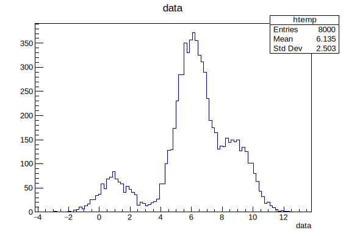
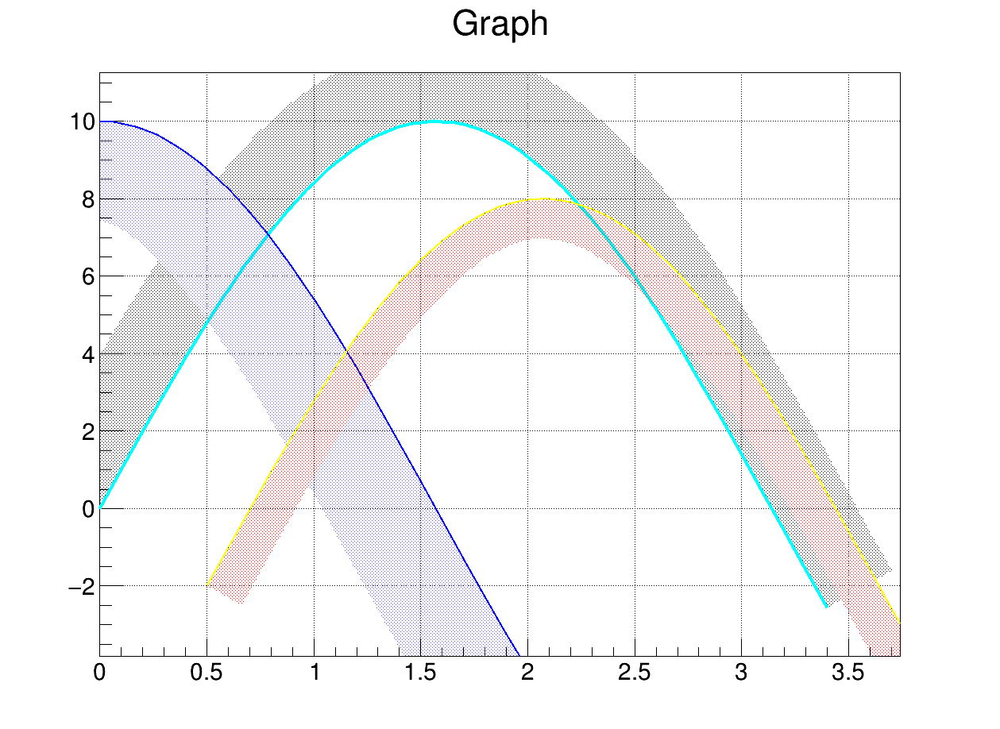
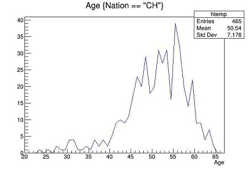
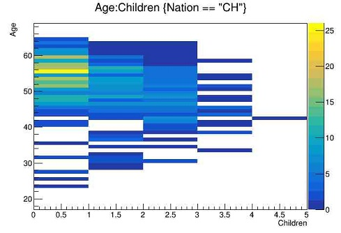
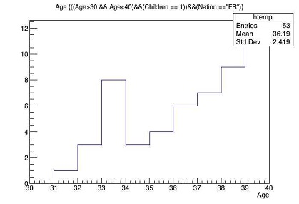
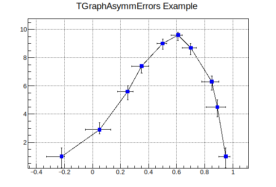

# 2. ROOT Guide

如过想要系统的学习ROOT的用法，你可以通过[ROOT官网](https://root.cern.ch)及手册来查阅ROOT的使用方法：



***

## 基本命令

```shell
.ls    //查看
.x     //执行
.q     //退出
Tab    //补全
```

**查看 tree 中的数据**



show原意展示，使用该命令可以指定查看某个编号下的branch，注意！show的数据只会保留6位有效数字

```
root [3] T->Show(24)
======> EVENT:24
 Category        = 204
 Flag            = 15
 Age             = 49
 Service         = 27
 Children        = 0
 Grade           = 9
 Step            = 9
 Hrweek          = 40
 Cost            = 0
 Division        = 
 Nation          = 
```



print原意打印，会依次打印出每个branch的数据

```
root [4] T->Print()
******************************************************************************
*Tree    :T         : CERN 1988 staff data                                   *
*Entries :     3354 : Total =          175563 bytes  File  Size =      47246 *
*        :          : Tree compression factor =   3.69                       *
******************************************************************************
*Br    0 :Category  : Category/I                                             *
*Entries :     3354 : Total  Size=      13989 bytes  File Size  =       4919 *
*Baskets :        1 : Basket Size=      32000 bytes  Compression=   2.74     *
*............................................................................*
*Br    1 :Flag      : Flag/i                                                 *
*Entries :     3354 : Total  Size=      13969 bytes  File Size  =       2165 *
*Baskets :        1 : Basket Size=      32000 bytes  Compression=   6.23     *
*............................................................................*
*Br    2 :Age       : Age/I                                                  *
*Entries :     3354 : Total  Size=      13964 bytes  File Size  =       3489 *
*Baskets :        1 : Basket Size=      32000 bytes  Compression=   3.86     *
*............................................................................*
*Br    3 :Service   : Service/I                                              *
*Entries :     3354 : Total  Size=      13984 bytes  File Size  =       2214 *
*Baskets :        1 : Basket Size=      32000 bytes  Compression=   6.09     *
*............................................................................*
*Br    4 :Children  : Children/I                                             *
*Entries :     3354 : Total  Size=      13989 bytes  File Size  =       2110 *
*Baskets :        1 : Basket Size=      32000 bytes  Compression=   6.39     *
*............................................................................*
*Br    5 :Grade     : Grade/I                                                *
*Entries :     3354 : Total  Size=      13974 bytes  File Size  =       2676 *
*Baskets :        1 : Basket Size=      32000 bytes  Compression=   5.04     *
*............................................................................*
*Br    6 :Step      : Step/I                                                 *
*Entries :     3354 : Total  Size=      13969 bytes  File Size  =       2889 *
*Baskets :        1 : Basket Size=      32000 bytes  Compression=   4.67     *
*............................................................................*
*Br    7 :Hrweek    : Hrweek/I                                               *
*Entries :     3354 : Total  Size=      13979 bytes  File Size  =        642 *
*Baskets :        1 : Basket Size=      32000 bytes  Compression=  21.01     *
*............................................................................*
*Br    8 :Cost      : Cost/I                                                 *
*Entries :     3354 : Total  Size=      13965 bytes  File Size  =       6939 *
*Baskets :        1 : Basket Size=      32000 bytes  Compression=   1.94     *
*............................................................................*
*Br    9 :Division  : Division/C                                             *
*Entries :     3354 : Total  Size=      25238 bytes  File Size  =      10048 *
*Baskets :        2 : Basket Size=      32000 bytes  Compression=   2.46     *
*............................................................................*
*Br   10 :Nation    : Nation/C                                               *
*Entries :     3354 : Total  Size=      24123 bytes  File Size  =       7928 *
*Baskets :        2 : Basket Size=      32000 bytes  Compression=   2.98     *
*............................................................................*

```



scan原意扫描，指以列表形式查Tree

```
[zhangzh@node01 cernstaff]$ rl cernstaff.root 
root [0] 
Attaching file cernstaff.root as _file0...
(TFile *) 0x265e9c0
root [1] .ls
TFile**		cernstaff.root	
 TFile*		cernstaff.root	
  KEY: TTree	T;1	CERN 1988 staff data    // perform Tree or Branch name
root [2] T->Scan()
************************************************************************************************************
*    Row   * Category. * Flag.Flag *   Age.Age * Service.S * Children. * Grade.Gra * Step.Step * Hrweek.Hr *
************************************************************************************************************
*        0 *       202 *        15 *        58 *        28 *         0 *        10 *        13 *        40 *
*        1 *       530 *        15 *        63 *        33 *         0 *         9 *        13 *        40 *
*        2 *       316 *        15 *        56 *        31 *         2 *         9 *        13 *        40 *
*        3 *       361 *        15 *        61 *        35 *         0 *         9 *         7 *        40 *
*        4 *       302 *        15 *        52 *        24 *         2 *         9 *         8 *        40 *
*        5 *       303 *        15 *        60 *        33 *         0 *         7 *        13 *        40 *
*        6 *       302 *        15 *        53 *        25 *         1 *         9 *         9 *        40 *
*        7 *       361 *        15 *        60 *        32 *         1 *         8 *         5 *        40 *
*        8 *       340 *        15 *        51 *        28 *         0 *         8 *        13 *        40 *
*        9 *       361 *        15 *        56 *        32 *         1 *         7 *        13 *        40 *
*       10 *       361 *        15 *        51 *        29 *         0 *         7 *        13 *        40 *
*       11 *       303 *        15 *        54 *        31 *         2 *         8 *        13 *        40 *
*       12 *       302 *        15 *        54 *        29 *         0 *         7 *        13 *        40 *
*       13 *       300 *        15 *        46 *        25 *         0 *         8 *         6 *        40 *
*       14 *       361 *        15 *        54 *        26 *         1 *         7 *        13 *        40 *
*       15 *       361 *        15 *        57 *        29 *         0 *         7 *        13 *        40 *
*       16 *       316 *        11 *        55 *        28 *         0 *         8 *        11 *        40 *
*       17 *       303 *        15 *        55 *        26 *         1 *         7 *        13 *        40 *
*       18 *       361 *        15 *        57 *        29 *         1 *         7 *         8 *        40 *
*       19 *       361 *        15 *        51 *        28 *         2 *         7 *        13 *        40 *
*       20 *       419 *        13 *        54 *        29 *         0 *         5 *        13 *        40 *
*       21 *       202 *        15 *        57 *        26 *         1 *        12 *        13 *        40 *
*       22 *       304 *        15 *        63 *        29 *         1 *        10 *        13 *        40 *
*       23 *       204 *        15 *        56 *        27 *         0 *        11 *         9 *        40 *
*       24 *       204 *        15 *        49 *        27 *         0 *         9 *         9 *        40 *
Type <CR> to continue or q to quit ==> q
************************************************************************************************************
(long long) 25
```




## 图形界面

<mark style="color:green;">以cernstaff文件为例，</mark>通常，我们不使用ROOT的图形化功能，因为这会使你遗忘很多类的使用

```shell
root [1] TBrowser t    // 同样可以通过->StartViewer()指令打开图形界面 
(TBrowser &) Name: Browser Title: ROOT Object Browser
```


## 文件处理

### 串联合并

**TChain命令** 常用于若干格式一致的ROOT文件的串联读取，但并不推荐使用该命令读取大量root文件

<details>

<summary>E.g.</summary>

```bash
/[zhangzh@node01 tree]$ pwd
/home/users/z/zhangzh/tree/cernstaff/test/tree
[zhangzh@node01 tree]$ ls
age_graph.txt  chain.jpg   file3.root  gdr3.c     mytest.root
age.txt        file1.root  gdr1.c      guan.root  TLegend
ana.c          file2.root  gdr2.c      h1.c       tree.c
[zhangzh@node01 tree]$ rl
root [0] .x gdr1.c 
******************************************************************************
*Tree    :tree      : my first tree                                          *
*Entries :     1000 : Total =            8923 bytes  File  Size =       7687 *
*        :          : Tree compression factor =   1.10                       *
******************************************************************************
*Br    0 :data      : data/D                                                 *
*Entries :     1000 : Total  Size=       8568 bytes  File Size  =       7314 *
*Baskets :        1 : Basket Size=      32000 bytes  Compression=   1.10     *
*............................................................................*
(int) 0
root [1] TChain *chain = new TChain("tree")
(TChain *) 0x1cb82a0
root [2] chain->Add("file1.root");
root [3] chain->Add("file2.root");
root [4] chain->Add("file3.root");
root [5] chain->Print()
******************************************************************************
*Chain   :tree      : file1.root                                             *
******************************************************************************
******************************************************************************
*Tree    :tree      : my first tree                                          *
*Entries :     1000 : Total =            8915 bytes  File  Size =       7687 *
*        :          : Tree compression factor =   1.10                       *
******************************************************************************
*Br    0 :data      : data/D                                                 *
*Entries :     1000 : Total  Size=       8560 bytes  File Size  =       7314 *
*Baskets :        1 : Basket Size=      32000 bytes  Compression=   1.10     *
*............................................................................*
******************************************************************************
*Chain   :tree      : file2.root                                             *
******************************************************************************
******************************************************************************
*Tree    :tree      : my second tree                                         *
*Entries :     5000 : Total =           40988 bytes  File  Size =      35732 *
*        :          : Tree compression factor =   1.14                       *
******************************************************************************
*Br    0 :data      : data/D                                                 *
*Entries :     5000 : Total  Size=      40631 bytes  File Size  =      35341 *
*Baskets :        2 : Basket Size=      32000 bytes  Compression=   1.14     *
*............................................................................*
******************************************************************************
*Chain   :tree      : file3.root                                             *
******************************************************************************
******************************************************************************
*Tree    :tree      : my third tree                                          *
*Entries :     2000 : Total =           16915 bytes  File  Size =      14404 *
*        :          : Tree compression factor =   1.15                       *
******************************************************************************
*Br    0 :data      : data/D                                                 *
*Entries :     2000 : Total  Size=      16560 bytes  File Size  =      14027 *
*Baskets :        1 : Basket Size=      32000 bytes  Compression=   1.15     *
*............................................................................*
root [6] chain->Draw("data")
```

</details>

```bash
TChain* ch = new TChain("TreeName");    // 合并读取/home/username/data/目录下的所有root
ch->Add("/home/username/data/*.root");
```

**hadd**命令 常用于合并文件，但通常在大(size)文件下，不建议使用该命令处理，建议生成列表后遍历

```shell
[zhangzh@node01 gamma_4300M_10deg_700m_10GeV]$ hadd total.root nonoise*.root
hadd Target file: total.root
hadd compression setting for all output: 1
hadd Source file 1: nonoise_pix5pe14pmt5_CER100001.root
hadd Source file 2: nonoise_pix5pe14pmt5_CER100002.root
hadd Source file 3: nonoise_pix5pe14pmt5_CER100003.root
hadd Target path: total.root:/
[zhangzh@node01 gamma_4300M_10deg_700m_10GeV]$ ls
nonoise_pix5pe14pmt5_CER100001.root  nonoise_pix5pe14pmt5_CER100005.root  nonoise_pix5pe14pmt5_CER100009.root
nonoise_pix5pe14pmt5_CER100002.root  nonoise_pix5pe14pmt5_CER100006.root  nonoise_pix5pe14pmt5_CER100010.root
nonoise_pix5pe14pmt5_CER100003.root  nonoise_pix5pe14pmt5_CER100007.root  total.root
nonoise_pix5pe14pmt5_CER100004.root  nonoise_pix5pe14pmt5_CER100008.root
```

<figure><figcaption></figcaption></figure>

合并完成后，通常会在一个root文件中出现多个tree，如果想要调用不同的tree之间的branch进行绘图，使用的命令是：

`root [0] TTree1->Draw("tree1.branch1:tree2.branch2", "cut", "style")`

### 读取写入

ROOT文件也是可以读取和写入的，本节数据以`/home/users/z/zhangzh/guide/root/example_cernstaff/cernstaff.root`为例

```c
#include <iostream>
#include <fstream>
#include <string>

int ana(){
    
    string dir = "/home/users/z/zhangzh/guide/root/example_cernstaff/";
    string name = "cernstaff.root";
    string filename = dir + name;

    int AGE;
    int N;
    TFile *f = new TFile(filename.c_str());
    TTree *my_tree = (TTree*)f->Get("T");
    TBranch *my_age = my_tree->GetBranch("Age");
    my_age->SetAddress(&AGE);

    N =(int)my_tree->GetEntries();
    for(int i=0;i<N;i++){
        my_age->GetEntry(i);
        cout<<AGE<<endl;
    }
    return 0;
}
    // 读取cernstaff.root文件中的branch
```

```c
#include <fstream>

int h1(){
    
    ifstream read("age.txt");
    ofstream write("age_graph.txt");

    int N=3354;
    int age=1;
    TH1I *h1 = new TH1I("h1","the age distribution in CERN 1988",100,0,100);
    for(int i=0;i<N;i++){
        read >> age;
        h1->Fill(age);
    }

    h1->Draw();
    for(int i=20;i<70;i++){        
    cout<<"the age number of people in the age of "<<i<<" is "<<h1->GetBinContent(i)<<endl;
    write << i << "\t"<<h1->GetBinContent(i) << "\n";
    }

    read.close();
    write.close();
    return 0;
}
```

```c
void ra_dec(){
    
    TCanvas *c1 = new TCanvas("c1","ra:dec",1200,500);
    //c1->Divide(2,1);

    static double rera,redec;
    TFile *f1 = new TFile("Rec2017040.root");
    TTree *tr = (TTree*)f1->Get("rst");
    tr->SetBranchAddress("ra",&rera);
    tr->SetBranchAddress("dec",&redec);       // 两种写法，其一
    //TBranch *b1 = tr -> GetBranch("ra");    // 两种写法，其二
    //TBranch *b2 = tr -> GetBranch("dec");
    //b1 -> SetAddress(&rera);
    //b2 -> SetAddress(&redec);

    int nentries = tr->GetEntries();
    TH2D *h1 = new TH2D("h1","ra:dec",360,0,360,150,-60,90);
    for(int i=0;i<nentries;i++){
       tr->GetEntry(i);
       h1->Fill(rera,redec);
    }

    h1->GetXaxis()->SetTitle("ra");
    h1->GetYaxis()->SetTitle("dec");
    gStyle->SetOptStat(0);
    gStyle->SetPalette(53);

    c1->cd(1);
    h1->Draw("colz");
}

```

```c
    int n = 1000;
    int m = 0;
    double E[n],S[n];
    FILE *fil1 = fopen("./filename.txt","r");while(fscanf(fil1,"%lf  %lf ",&E[m],&S[m])!=EOF)   { m++;}  m=0; fclose(fil1);
    TGraph *gr1 = new TGraph(n,E,S);
    gr1->Draw();
```


## 统计直方 Histogram

Histogram是一种对数据分布情况的图形表示，以长条图（bar）的形式具体表现。因为直方图的长度及宽度很适合用来表现数量上的变化，所以较容易解读差异小的数值。

histogram常用类的标准形式是`THn` _**E.g.**_

```cpp
   TH1* h1 = new TH1I("h1", "h1 title", 100, 0.0, 4.0);   // 一维整型直方图
   TH2* h2 = new TH2F("h2", "h2 title", 40, 0.0, 2.0, 30, -1.5, 3.5);
   TH3* h3 = new TH3D("h3", "h3 title");
   // histogram 之间可以完成简单的运算
   TH1F h3 = h1*h2;
   TH1F h3 = 8*h1;
```

### 箱的概念 bin

在前一个例子中，你会看到`TH1I("h1", "h1 title",100,0.0,4.0)`中的参数，如`"h1"`表示将图片存为文件时，文件名为`h1`，`"h1 title"`指该histogram的标题为`h1 title`，`100,0.0,4.0`分别表示分bin数量`(nbins)`和轴范围`(xlow,xup)`，即将`0.0-4.0`的范围上分`100`个`bin`

那么什么是bin，<mark style="color:green;">bin的原意是垃圾箱或小箱子</mark>，在histogram中，我们将存放数据的bar，称为一个bin，bin的宽度取决于分bin数量及坐标轴的形式，如SetLogx：对x轴取对数坐标的形式，bin的大小随log变化，如果要求bin宽不随`logx`变化，可以参考[这里](https://www.bilibili.com/read/cv6640287/)

当不指定bin及坐标轴范围时（参数位置需要空出），ROOT会自动帮你匹配，<mark style="color:red;">自动的通常很丑</mark>

```cpp
   TH1* h1 = new TH1I("h1", "h1 title", , , );   // 一维整型直方图
```

<mark style="color:red;">同样，我们也可以精细控制分bin，此时请注意，数组的大小应为</mark><mark style="color:red;">`nbins+1`</mark><mark style="color:red;">，因为它包含下范围和上范围的轴值</mark> <mark style="color:red;"></mark>_<mark style="color:red;">**E.g.**</mark>_

```cpp
   double binEdges[] = { 0.0, 0.2, 0.5, 1., 2., 4. };
   TH1* h1 = new TH1D("h1", "h1 title", 6, binEdges );
   TH2* h2 = new TH2D("h2", "h2 title", 6, binEdges , 30, -1.5, 3.5);
```

在命令行模式下，我们也可以通过下面的命令来完成简单的分bin：

`root [0] TTree->Draw("TBranch>>(nbin,xlim,xup)")`

### 随机函数 gRandom

```c
// 常用的内置随机函数
gRandom->Binomial(ntot,p)    // 二项分布
gRandom->Exp(tau)            // 指数分布
gRandom->Gaus(mean,sigma)    // 高斯分布
gRandom->Rndm()              // (0,1]均匀分布
gRandom->Poisson(mean)       // 泊松分布
gRandom->Landau(mean,sigma)  // 朗道分布
gRandom->Uniform(x1,x2)      // (x1,x2]均匀分布
```

<details>

<summary><strong>E.g. 创建Gaus数据</strong> </summary>

<pre class="language-cpp"><code class="lang-cpp"><strong>#include &#x3C;fstream>  // 当用到文件输入输出流时需要添加该头文件
</strong>
void create_data(){    // 在ROOT中，文件名与主函数名 
    float data=0.0;
    ofstream write; // out of file stream;stream name
    write.open("data.txt"); 

    for (int i=0; i&#x3C;30000;i++){
        data = gRandom -> Gaus (2,0.3);    // gaus分布的均值和宽度
        write &#x3C;&#x3C; data &#x3C;&#x3C;"\n";   // data write in stream
    }
    for (int k=0;k&#x3C;30000;k++){
        data = gRandom -> Gaus (-2,0.5);
        write &#x3C;&#x3C; data &#x3C;&#x3C;"\n";
    }
    write.close();
    cout &#x3C;&#x3C; "completed!"&#x3C;&#x3C;endl;
}
</code></pre>

</details>

### 填充数据 Fill

如果不将读取的数据填充进histogram，将无法正常绘制

```c
   // For 1-D histograms
   h1->Fill(x);
   h1->Fill(x,w); // with weight
   // For 2-D histograms and TProfile:
   h2->Fill(x,y);
   p2->Fill(x,y);
   h2->Fill(x,y,w);  // with weights
   p2->Fill(x,y,w);
   // For 3-D histograms and TProfile2D:
   h3->Fill(x,y,z);
   h3->Fill(x,y,z,w); // with weights
```

<details>

<summary>E.g. 填充和绘制Gaus <strong>histogram</strong></summary>

<pre class="language-c"><code class="lang-c"><strong>#include &#x3C;fstream>  // file stream
</strong>
void ana(){
    TH1F *h1 = new TH1F("h1","Histogram Gaus",1000,-5,8);
    // Type Histogram 1D Float(example:TH1D = Type Histogram 1D Double)
    float data = 0.0;

    ifstream read; // input file stream
    read.open("data.txt");

    while(read.is_open()){
        read >> data;
        h1->Fill(data);
        if(read.eof()) break;   // .eof() = end of file()
    }
    h1->Draw();
}
</code></pre>

</details>

_**执行创建的程序**_

在终端中，程序所在的目录下，输入`root git`或`root -l git`，后者的`-l`参数可以为你省略版本信息，当然你也可以用[别名](0.-linux-commands.md#pei-zhi-bie-ming)配置你喜欢的命令

<figure><figcaption></figcaption></figure>

### 二维直方 Histogram 2D

现在我们可以用上面的例子生成一幅二维直方图

<details>

<summary>E.g.1</summary>

```c
{
   TH2D h2("h2","Histogram filled with random numbers",40,-4,4,40,-20,20);
   float px, py;
   for (int i = 0; i < 25000; i++) {
      gRandom->Rannor(px,py);
      h2.Fill(px,5*py);
   }
   h2.DrawCopy("LEGO1");
}
```

</details>

<figure><figcaption></figcaption></figure>

<details>

<summary>E.g.2</summary>

<pre class="language-c"><code class="lang-c"><strong>void histogram3D(){
</strong>    TCanvas *c = new TCanvas("c","c",800,1200);
    c->Divide(2,3); 
    //新建画布800*1200，布局为2*3，横*高，主函数名需与文件名一致，即该文件名为"histogram3D.c"
    float x,y;
    TH1F *h1 = new TH1F("h1","1D histogram",50,-10,10);
    TH2F *h2 = new TH2F("h2","2D histogram",50,-10,10,50,-10,10);
    TH2F *h3 = new TH2F("h3","2D histogram",50,-10,10,50,-10,10);
    TH1D *ph;   //一维投影
 
    for (int i=0;i&#x3C;30000;i++){
        x=gRandom->Gaus(0,0.5);
        y=gRandom->Gaus(0,1);
        h1->Fill(3*x);
        h2->Fill(x,y);
        h3 -> Fill(x,y);
    }

    c->cd(1);
    h1->Draw();

    c->cd(2);
    h2->Draw("lego");

    c->cd(3);
    h3->Draw("lego2");

    c->cd(4);
    ph = h2->ProjectionX();
    ph->SetTitle("The projection of n2 on X");
    ph->Draw();
}
</code></pre>

</details>

<figure><figcaption></figcaption></figure>

你同样可以在ROOT的命令行中，在现有画布内新建图像

```shell
root [1] c->cd(5)
(TVirtualPad *) 0x376dbd0
root [2] TF1 *f1 = new TF1("f1","sin(x)/x",-10,10)
(TF1 *) 0x3b2d290
root [3] f1->Draw()
root [4] 
```

<figure><figcaption></figcaption></figure>

## 图形方程 TGraph

TGraph 类常用于绘制其它类型的图形，如平面绘图、方程、复杂图形等

TGraph 是由两个数组X和Y组成的对象，每个数组都有n个点

<mark style="color:green;">TGraph构造函数没有TGraph标题和名称作为参数。 TGraph具有默认标题和名称“Graph”。 要更改默认标题和名称，创建后应在TGraph上调用SetTitle和SetName</mark>

_**一个简单的Graph**_

```c
int directdata(){
    TGraph *gr = new TGraph("mydata.txt");
    gr->Draw("AC*");    // 绘出axis，坐标点以curve链接，坐标点形状为*型
    return 0;
}
```

<details>

<summary>E.g. <em><strong>一个复杂的Graph</strong></em></summary>

```c
void exclusion(){
    
    TCanvas *c1 = new TCanvas( "c1","Exclusion graph example",200,10,700,500 );
    c1->SetGrid();

    // create the multigraph
    TMultiGraph *mg = new TMultiGraph();    // combining from graph
    mg->SetTitle( "Exclusion graphs" ); 

    // create the graph points
    const int n = 35;
    double x1[n],x2[n],x3[n],y1[n],y2[n],y3[n];

    for (int i=0;i<n;i++){
        x1[i]=i*0.1;y1[i]=10*sin(x1[i]);
        x2[i]=x1[i];y2[i]=10*cos(x1[i]);
        x3[i]=x1[i]+0.5;y3[i]=10*sin(x1[i])-2;
    }

    // create the 1st TGraph
    TGraph *gr1 = new TGraph( n,x1,y1 );
    gr1->SetLineColor(7);
    gr1->SetLineWidth(1504);    // ffll;ff=fill;ll=linewidth
    gr1->SetFillColor(kBlack);
    gr1->SetFillStyle(3003);    // fill style [3001,3020]

    TGraph *gr2 = new TGraph( n,x2,y2 );
    gr2->SetLineColor(4);
    gr2->SetLineWidth(-2002);
    gr2->SetFillColor(9);
    gr2->SetFillStyle(3003);

    TGraph *gr3 = new TGraph( n,x3,y3 );
    gr3->SetLineColor(5);
    gr3->SetLineWidth(-802);    // ffll;ff=fill;ll=linewidth
    gr3->SetFillColor(2);
    gr3->SetFillStyle(3003);

    // gr.Draw()
    
    //mg->Add(gr1);
    //mg->Add(gr2);
    //mg->Add(gr3);

    //mg->Draw("AC");   // be equal in value with below

    gr1->Draw("AC");
    gr2->Draw("CP");
    gr3->Draw("CP");
}
```

</details>

<figure><figcaption></figcaption></figure>

### 坐标轴 Axis

**Time on Axis**

```c
void seism(){

    //TStopwatch sw;sw.Start();
    //TDatime dtime;
    //gStyle->SetTimeOffset( dtime.Convert() ); // replace axis with timeaxis

    //cout << dtime.Convert() << endl;

    TCanvas *c1 = new TCanvas("seism","Time on axis",0,0,1000,500);        
    // TCanvas("canvas name","canvas title",the pixel coordinates of the top left corner of canvas,same as above,size of pixel along X,size of pixel along Y)
   
    c1->SetFillColor( 42 ); // fill background color
    c1->SetFrameFillColor( 33 ); // color in frame
    c1->SetGrid();  // add grid in the frame

    Float_t bintime =1; // set one bin = 1 second. change it to set time scale,don't chenge real time
    TH1F *ht = new TH1F("ht","The ROOT seism",10,0,10*bintime);
    // TH1 = 1D histogram;F = float;("name","title",bin,Xmin,Xmax)
    Float_t signal = 700;
    // c/c++ : int , float , double
    // POOT :int_t , float_t , double_t

    ht->SetMaximum( signal );
    ht->SetMinimum( -signal );
    ht->SetStats( 1 );  // set statistic pad,1=display,0=hide
    ht->SetLineColor( 2 );
    ht->GetXaxis()->SetTimeDisplay( 1 );    // settimedisplay,1=display,0=hide
    ht->GetYaxis()->SetNdivisions( 220 );   // n1n2n3,n1 = a bin in the bin;n2n3 = ???
    ht->Draw();

    for(int i=0;i<200;i++){
        // build a signal ; noisy damped sine
        Float_t noise = gRandom->Gaus(0,120);
        if(i>100){ noise = noise + sin((i-700)*6.28/30)*exp((700-i)/300); }
        ht->SetBinContent(i,noise); // the ith content is noise
        c1->Modified();
        c1->Update();
        gSystem->ProcessEvents();
    }
    
    //printf("real time =%8.3fs,cpu time =%8.3fsn", sw.RealTime(), sw.CpuTime());
    return 0;
}
```


### 限制条件 Cut

> 添加限制条件

```shell
root [6] T->Draw("Nation:Children","","colz")    //T->Draw("纵坐标:横坐标","限制条件","图案")
(long long) 3354
```

```shell
root [11] T->Draw("Nation:Children","Children==2","colz")    //孩子为2的国家
Info in <TCanvas::MakeDefCanvas>:  created default TCanvas with name c1
(long long) 903
```

```shell
root [6] T->Draw("Age")
```

```shell
root [8] T->Draw("Age","Nation == \"CH\"","L")    // \"转义字符
(long long) 465
```



```shell
root [12] T->Draw("Age:Children","Nation == \"CH\"","colz")
(long long) 465
```



```shell
root [13] TCut a_cut = "Age>30 && Age<40"
(TCut &) Name: CUT Title: Age>30 && Age<40
root [14] TCut c_cut = "Children == 1"
(TCut &) Name: CUT Title: Children == 1
root [21] T->Draw("Age",a_cut && c_cut && "Nation ==\"FR\"","")
(long long) 53
```



### 图像拟合 Fit

```c
#include <fstream>

int fit(){
    
    ifstream read("data1.txt");
    TGraph *gr = new TGraph("data1.txt");

    double pi=3.14159265;
    TF1 *f1 = new TF1("f1","[0]*sin([1]*pi*x)*exp([2]*x)+[3]",0,10);

    f1->SetParameter(0,1);    // 第零个参数的参考值
    f1->SetParameter(1,1);
    f1->SetParameter(2,-1);
    f1->SetParameter(3,0.5);
    // be equal in value with below
    // fi->SetParameter(1,1,-1,0.5);
    gr->Fit("f1");
    gr->Draw();

    return 0;
}
```

在root中，会给出其拟合参数的精确值

```shell
[zhangzh@node01 test]$ rl fit.c 
root [0] 
Processing fit.c...

****************************************
Minimizer is Minuit / Migrad
Chi2                      =       0.1458
NDf                       =           96
Edm                       =  3.61433e-08
NCalls                    =          123
p0                        =      1.00186   +/-   0.0254347   
p1                        =      1.30098   +/-   0.00369848  
p2                        =    -0.482759   +/-   0.0172724   
p3                        =     0.498504   +/-   0.00393919  
Info in <TCanvas::MakeDefCanvas>:  created default TCanvas with name c1
(int) 0
```

<figure><figcaption></figcaption></figure>

### 误差棒 Error Bar

上下左右误差不相同时，可以使用TGraphAsymmErrors函数

_**格式**_

```root
TGraphAsymmErrors *gr = new TGraphAsymmErrors(n,x,y,exl,exh,eyl,eyh)
TGraphAsymmErrors(number of var,x,y,low x,x high,y low,y high)
```

_**示例**_

```C
int error(){

    TCanvas *c1 = new TCanvas("c1","A Simple Graph with error bars",200,10,700,500);
    c1->SetGrid();
// create the arrays for the points
    Int_t n = 10;
    Double_t x[] = {-.22,.05,.25,.35,.5, .61,.7,.85,.89,.95};
    Double_t y[] = {1,2.9,5.6,7.4,9,9.6,8.7,6.3,4.5,1};
// create the arrays with high and low errors
    Double_t exl[] = {.11,.1,.07,.07,.04,.05,.06,.07,.08,.05};
    Double_t eyl[] = {.8,.3,.6,.5,.4,.4,.5,.6,.7,.8};
    Double_t exh[] = {.02,.08,.04,.05,.03,.03,.04,.05,.06,.03};
    Double_t eyh[] = {.6,.5,.4,.05,.3,.2,.3,.4,.5,.6};
// create TGraphAsymmErrors with the arrays
    TGraphAsymmErrors *gr = new TGraphAsymmErrors(n,x,y,exl,exh,eyl,eyh);
    gr->SetTitle("TGraphAsymmErrors Example");
    gr->SetMarkerColor(4);
    gr->SetMarkerStyle(21);
    gr->Draw("ALP");
}
```



###

##

##

##

## 美化工作

### 图例用法 TLegend

```c
#include <iostream>

int leg(){
    
    TF1 *f1 = new TF1("f1","sin(x)/x",-20,20);
    TF1 *f2 = new TF1("f2","(sin(x)/x)^2",-20,20);
    TF1 *f3 = new TF1("f3","(sin(x)/x)^3",-20,20);
    TF1 *f4 = new TF1("f4","(sin(x)/x)^4",-20,20);
    TLegend *leg = new TLegend(0.6,0.6,0.893,0.89,"sin function");
    // (左下角坐标：横轴70%的位置，纵轴70%，右上角坐标：横轴89.3%，纵轴89%)

    leg->AddEntry(f1,"sinc function");
    leg->AddEntry(f2,"sinc function sqaure");
    leg->AddEntry(f3,"sinc function cubic");
    leg->AddEntry(f4,"sinc function quadratic");

    f1->GetYaxis()->SetNdivisions(1005);

    f1->GetYaxis()->SetRangeUser(-0.5,1.5);
    f1->SetLineColor(1);
    f1->SetLineWidth(4);
    f1->Draw();

    f2->SetLineColor(2);
    f2->SetLineWidth(4);
    f2->Draw("same");

    f3->SetLineColor(3);
    f3->SetLineWidth(4);
    f3->Draw("same");

    f4->SetLineColor(4);
    f4->SetLineWidth(4);
    f4->Draw("same");

    leg->Draw();
    return 0;
}
```

### 设置风格 gStyle

> 通过指针[gStyle](https://root-forum.cern.ch/t/what-is-gstyle/2203)，修改graph风格，详细请参考root手册

```shell
root [3] gStyle->Set
SetAxisColor
SetBarOffset
SetBarWidth
SetBit
SetCanvasBorderMode
SetCanvasBorderSize
SetCanvasColor
SetCanvasDefH
SetCanvasDefW
SetCanvasDefX
SetCanvasDefY
SetCanvasPreferGL
SetCapLinePS
SetColorModelPS
SetDateX
SetDateY
SetDrawBorder
SetDrawOption
SetDtorOnly
SetEndErrorSize
SetErrorX
SetFillAttributes
SetFillColor
SetFillColorAlpha
SetFillStyle
SetFitFormat
SetFrameBorderMode
SetFrameBorderSize
SetFrameFillColor
SetFrameFillStyle
SetFrameLineColor
SetFrameLineStyle
SetFrameLineWidth
SetFuncColor
SetFuncStyle
SetFuncWidth
SetGridColor
SetGridStyle
SetGridWidth
SetHatchesLineWidth
SetHatchesSpacing
SetHeaderPS
SetHistFillColor
SetHistFillStyle
SetHistLineColor
SetHistLineStyle
SetHistLineWidth
SetHistMinimumZero
SetHistTopMargin
SetImageScaling
SetIsReading
SetJoinLinePS
SetLabelColor
SetLabelFont
SetLabelOffset
SetLabelSize
SetLegendBorderSize
SetLegendFillColor
SetLegendFont
SetLegendTextSize
SetLegoInnerR
SetLineAttributes
SetLineColor
SetLineColorAlpha
SetLineScalePS
SetLineStyle
SetLineStyleString
SetLineWidth
SetMarkerAttributes
SetMarkerColor
SetMarkerColorAlpha
SetMarkerSize
SetMarkerStyle
SetName
SetNameTitle
SetNdivisions
SetNumberContours
SetObjectStat
SetOptDate
SetOptFile
SetOptFit
SetOptLogx
SetOptLogy
SetOptLogz
SetOptStat            // 设置图例的内容，参考手册3.8.5 Statistics Display
SetOptTitle
SetPadBorderMode
SetPadBorderSize
SetPadBottomMargin
SetPadColor
SetPadGridX
SetPadGridY
SetPadLeftMargin
SetPadRightMargin
SetPadTickX
SetPadTickY
SetPadTopMargin
SetPaintTextFormat
SetPalette
SetPaperSize
SetScreenFactor
SetStatBorderSize
SetStatColor
SetStatFont
SetStatFontSize
SetStatFormat
SetStatH
SetStatStyle
SetStatTextColor
SetStatW
SetStatX
SetStatY
SetStripDecimals
SetTextAlign
SetTextAngle
SetTextAttributes
SetTextColor
SetTextColorAlpha
SetTextFont
SetTextSize
SetTextSizePixels
SetTickLength
SetTimeOffset
SetTitle
SetTitleAlign
SetTitleBorderSize
SetTitleColor
SetTitleFillColor
SetTitleFont
SetTitleFontSize
SetTitleH
SetTitleOffset
SetTitlePS
SetTitleSize
SetTitleStyle
SetTitleTextColor
SetTitleW
SetTitleX
SetTitleXOffset
SetTitleXSize
SetTitleY
SetTitleYOffset
SetTitleYSize
SetUniqueID
```

_**SetPalette()实例**_

```shell
gStyle->SetPalette(51)
```

```shell
gStyle->SetPalette(53)
```

### 添加文字 TLatex


### 线 Line class

root 中 Line 的属性通常包含颜色、宽度、风格，可以分别通过下面的命令来分别设置：`SetLineColor() and SetLineWidth() and SetLineStyle()`

**Line Color**



<figure><figcaption></figcaption></figure>



```csharp
{
   TCanvas *c = new TCanvas("c","Line colors",0,0,500,200);
   c.DrawColorTable();
   return c;
}
```



**Line Width**



<figure><figcaption></figcaption></figure>



```cpp
{
   TCanvas *Lw = new TCanvas("Lw","test",500,200);
   TText  t;
   t.SetTextAlign(32);
   t.SetTextSize(0.08);
   Int_t i=1;
   for (float s=0.1; s<1.0 ; s+=0.092) {
      TLine *lh = new TLine(0.15,s,.85,s);
      lh->SetLineWidth(i);
      t.DrawText(0.1,s,Form("%d",i++));
      lh->Draw();
   }
   return Lw;
}
```



**Line Style**



<figure><figcaption></figcaption></figure>



```cpp
{
   TCanvas *Ls = new TCanvas("Ls","test",500,200);
   TText  t;
   t.SetTextAlign(32);
   t.SetTextSize(0.08);
   Int_t i=1;
   for (float s=0.1; s<1.0 ; s+=0.092) {
      TLine *lh = new TLine(0.15,s,.85,s);
      lh->SetLineStyle(i);
      t.DrawText(0.1,s,Form("%d",i++));
      lh->Draw();
   }
   return Ls;
}
```



**Draw**

* “L”在点之间使用直线相连，最终呈现的效果是折线
* “F”填充
* “A”绘制出坐标轴
* “C”绘制平滑曲线
* “\*”每数据点以星号显示
* “P”绘制出每个marker
* “B”柱状图
* “1” 当使用柱状图B时，使柱状图从底部开始，否则从0开始
* “x+”x轴在上
* “Y+”Y轴在右
* “PFC” graph填充颜色从当前调色板获取
* “PLC” graph线条颜色从当前调色板获取
* "PMC” graph marker颜色从当前调色板获取
* “RX” X轴反转
* “RY” Y轴反转

以上不区分大小写


### 记号 Marker class

如果不先设置marker的类型，则无法更改marker的大小

<figure><figcaption></figcaption></figure>

### 填充风格 Fill Style

<figure><figcaption></figcaption></figure>

### 共轴画法


##
