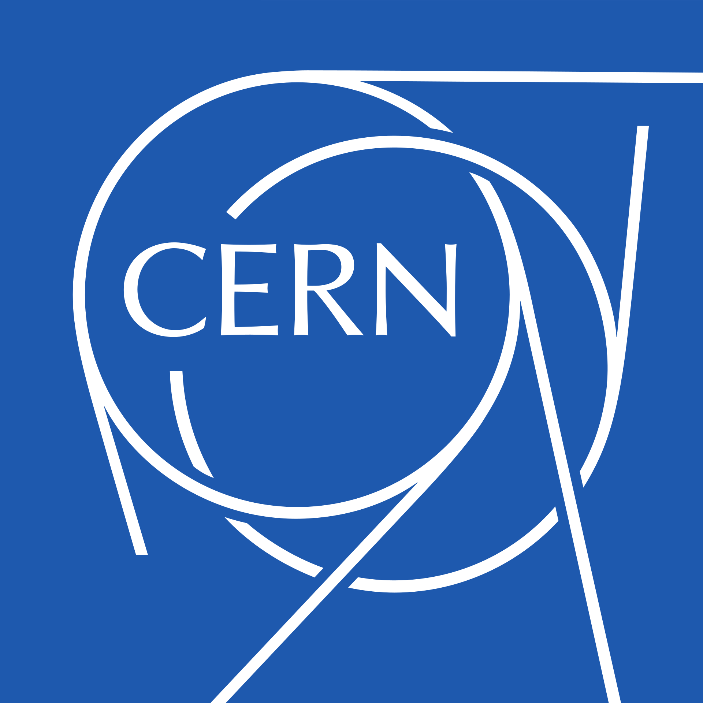

# 2.0 安装与使用

ROOT是CERN开发的科学分析PB级数据的强大工具，初学者可以通过[ROOT官网](https://root.cern.ch)和[查阅手册](2.0.-an-zhuang-yu-shi-yong.md#root-jiao-cheng-ji-he)来学习。

<div align="left">

<figure><figcaption></figcaption></figure>

</div>


## ROOT的安装和使用

ROOT在全平台可用，在MacOS使用[homebrew](../0.-linux-commands/3.-mac-terminal.md#shi-yong-homebrew-an-zhuang-mac-ruan-jian)安装ROOT，其他操作系统的安装方式参考[官方说明](https://root.cern/install/#macos-package-managers)：

```bash
$ brew install root
```

ROOT有<mark style="color:orange;">**命令行模式、脚本模式、图形界面模式**</mark>，经常使用图形界面会使你很快遗忘各种类的名称和使用方法，这对于使用脚本模式处理大型数据时是非常不利的。

### 基本命令

安装ROOT之后（有可能需要配置路径），在终端中输入`root`命令打开，并用`.q`命令退出：

```sh
[zhangzh@node01 ~]$ root
   ------------------------------------------------------------------
  | Welcome to ROOT 6.22/02                        https://root.cern |
  | (c) 1995-2020, The ROOT Team; conception: R. Brun, F. Rademakers |
  | Built for linuxx8664gcc on Aug 17 2020, 12:46:52                 |
  | From tags/v6-22-02@v6-22-02                                      |
  | Try '.help', '.demo', '.license', '.credits', '.quit'/'.q'       |
   ------------------------------------------------------------------
root [0] .q
[zhangzh@node01 ~]$ 
```

root命令也有参数可以选择，如：

**`-l`：**忽略版本信息直接进入root

**`-q`：**在执行完脚本后自动退出到shell

```bash
[zhangzh@node01 ~]$ root -l -q <filename>
waiting...
[zhangzh@node01 ~]$
```

终端中输入`root <filename>`打开root格式文件或运行root脚本，并root中查看或运行：

```bash
root [0] .ls            # 查看root文件结构
root [1] .x <filename>  # 执行<filename>
```

root中同样可以使用系统命令：

```bash
root [0] .!<OS_command> # 如.!ls或者.!pwd
```

### 多命令行

在root中执行多行命令，请在先键入`{`

```c
root [0] {
root [1]   int j = 0;
root [2]   for (int i = 0; i < 3; i++)
root [3]   {
root [4]     j = j + i;
root [5]     std::cout << "i = " << i << ", j = " << j << std::endl;
root [6]   }
root [7] }
i = 0, j = 0
i = 1, j = 1
i = 2, j = 3
```

### 参数传递

当脚本需要传入参数时，应该将脚本名和参数使用引号（引号包括单引和双引）、参数用括号包裹：

```
root '<filename>(<parameter>)'
```

### 图形界面

root库提供了一个图形界面工具，称为ROOT GUI，用于交互式地进行数据分析、绘图和可视化，使用户可以通过鼠标和键盘与ROOT库进行交互。除了菜单，你可以以图形化查看tree的结构，还可以在canvas上右击任何位置（轴、坐标点、画布、标题等）来查看和更改它们的成员函数。打开UI界面的命令是：

```shell
root [1] TBrowser <treename>    # 同样可以通过->StartViewer()成员函数打开图形界面 
```


## 基本概念

### 树 TTree

TTree是ROOT库中的一个重要概念，它是一种用Branch存储和处理大量结构化数据的数据结构。TTree可以看作是一个表格，其中每一行代表一个事件或数据点，每一列代表一个变量或数据字段。

它是ROOT库中数据分析和可视化的基础，可以与其他ROOT库中的功能和工具相结合，进行数据分析、绘图和模拟等操作。

使用Tree的成员函数查看Branch：

```bash
->Show()   # 使用该命令可以指定查看某个编号下的branch，例如Show(24)
           # 注意：展示的数据只会保留6位有效数字，在root中仍以本身的数值存储
->Print()  # 依次打印出每个branch的数据
->Scan()   # 每次扫描25行tree中的数据
           # ->用于通过指针访问对象的成员，这三个函数都是Tree这个类的成员函数
```

### 枝 TBranch

Branch是TTree中存储数据的基本单位，每个分支对应TTree中的一列数据。

每个分支都有一个名称（Branch Name），用于唯一标识该分支。分支还有一个数据类型（Data Type），用于指定存储在该分支中的数据类型，如整数、浮点数、字符串等。此外，分支还可以有一个或多个维度（Dimension），用于存储数组类型的数据。

<details>

<summary>分支的创建和使用主要有以下几个步骤：</summary>

1. 创建分支：使用TTree的`Branch()`方法可以创建一个新的分支，并指定分支的名称、数据类型和维度等信息。例如，可以创建一个名为"energy"的分支，存储浮点数类型的能量数据。
2. 填充数据：通过调用分支的`Fill()`方法，可以将数据填充到分支中。每次调用`Fill()`方法，都会将当前的变量值添加到分支中，并进入下一个事件或数据点。
3. 读取数据：可以使用TTree的`SetBranchAddress()`方法来设置分支的地址，以便在读取数据时将数据存储到指定的变量中。通过调用TTree的`GetEntry()`方法，可以读取TTree中的下一个事件或数据点，并将数据填充到指定的变量中。

通过使用分支，可以将大量的结构化数据存储在TTree中，并以高效的方式进行读写和访问。分支的概念使得数据的存储和处理更加灵活和高效，适用于大型数据集的存储和分析。

</details>

<details>

<summary>E.g. 查看Branch</summary>

```
[zhangzh@node01 cernstaff]$ rl cernstaff.root 
root [0] 
Attaching file cernstaff.root as _file0...
(TFile *) 0x265e9c0
root [1] .ls
TFile**		cernstaff.root	
 TFile*		cernstaff.root	
  KEY: TTree	T;1	CERN 1988 staff data    // perform Tree or Branch name
root [2] T->Scan()
************************************************************************************************************
*    Row   * Category. * Flag.Flag *   Age.Age * Service.S * Children. * Grade.Gra * Step.Step * Hrweek.Hr *
************************************************************************************************************
*        0 *       202 *        15 *        58 *        28 *         0 *        10 *        13 *        40 *
*        1 *       530 *        15 *        63 *        33 *         0 *         9 *        13 *        40 *
*        2 *       316 *        15 *        56 *        31 *         2 *         9 *        13 *        40 *
*        3 *       361 *        15 *        61 *        35 *         0 *         9 *         7 *        40 *
*        4 *       302 *        15 *        52 *        24 *         2 *         9 *         8 *        40 *
*        5 *       303 *        15 *        60 *        33 *         0 *         7 *        13 *        40 *
*        6 *       302 *        15 *        53 *        25 *         1 *         9 *         9 *        40 *
*        7 *       361 *        15 *        60 *        32 *         1 *         8 *         5 *        40 *
*        8 *       340 *        15 *        51 *        28 *         0 *         8 *        13 *        40 *
*        9 *       361 *        15 *        56 *        32 *         1 *         7 *        13 *        40 *
*       10 *       361 *        15 *        51 *        29 *         0 *         7 *        13 *        40 *
*       11 *       303 *        15 *        54 *        31 *         2 *         8 *        13 *        40 *
*       12 *       302 *        15 *        54 *        29 *         0 *         7 *        13 *        40 *
*       13 *       300 *        15 *        46 *        25 *         0 *         8 *         6 *        40 *
*       14 *       361 *        15 *        54 *        26 *         1 *         7 *        13 *        40 *
*       15 *       361 *        15 *        57 *        29 *         0 *         7 *        13 *        40 *
*       16 *       316 *        11 *        55 *        28 *         0 *         8 *        11 *        40 *
*       17 *       303 *        15 *        55 *        26 *         1 *         7 *        13 *        40 *
*       18 *       361 *        15 *        57 *        29 *         1 *         7 *         8 *        40 *
*       19 *       361 *        15 *        51 *        28 *         2 *         7 *        13 *        40 *
*       20 *       419 *        13 *        54 *        29 *         0 *         5 *        13 *        40 *
*       21 *       202 *        15 *        57 *        26 *         1 *        12 *        13 *        40 *
*       22 *       304 *        15 *        63 *        29 *         1 *        10 *        13 *        40 *
*       23 *       204 *        15 *        56 *        27 *         0 *        11 *         9 *        40 *
*       24 *       204 *        15 *        49 *        27 *         0 *         9 *         9 *        40 *
Type <CR> to continue or q to quit ==> q
************************************************************************************************************
(long long) 25
root [3] T->Show(24)
======> EVENT:24
 Category        = 204
 Flag            = 15
 Age             = 49
 Service         = 27
 Children        = 0
 Grade           = 9
 Step            = 9
 Hrweek          = 40
 Cost            = 0
 Division        = 
 Nation          = 
 root [4] T->Print()
******************************************************************************
*Tree    :T         : CERN 1988 staff data                                   *
*Entries :     3354 : Total =          175563 bytes  File  Size =      47246 *
*        :          : Tree compression factor =   3.69                       *
******************************************************************************
*Br    0 :Category  : Category/I                                             *
*Entries :     3354 : Total  Size=      13989 bytes  File Size  =       4919 *
*Baskets :        1 : Basket Size=      32000 bytes  Compression=   2.74     *
*............................................................................*
*Br    1 :Flag      : Flag/i                                                 *
*Entries :     3354 : Total  Size=      13969 bytes  File Size  =       2165 *
*Baskets :        1 : Basket Size=      32000 bytes  Compression=   6.23     *
*............................................................................*
*Br    2 :Age       : Age/I                                                  *
*Entries :     3354 : Total  Size=      13964 bytes  File Size  =       3489 *
*Baskets :        1 : Basket Size=      32000 bytes  Compression=   3.86     *
*............................................................................*
*Br    3 :Service   : Service/I                                              *
*Entries :     3354 : Total  Size=      13984 bytes  File Size  =       2214 *
*Baskets :        1 : Basket Size=      32000 bytes  Compression=   6.09     *
*............................................................................*
*Br    4 :Children  : Children/I                                             *
*Entries :     3354 : Total  Size=      13989 bytes  File Size  =       2110 *
*Baskets :        1 : Basket Size=      32000 bytes  Compression=   6.39     *
*............................................................................*
*Br    5 :Grade     : Grade/I                                                *
*Entries :     3354 : Total  Size=      13974 bytes  File Size  =       2676 *
*Baskets :        1 : Basket Size=      32000 bytes  Compression=   5.04     *
*............................................................................*
*Br    6 :Step      : Step/I                                                 *
*Entries :     3354 : Total  Size=      13969 bytes  File Size  =       2889 *
*Baskets :        1 : Basket Size=      32000 bytes  Compression=   4.67     *
*............................................................................*
*Br    7 :Hrweek    : Hrweek/I                                               *
*Entries :     3354 : Total  Size=      13979 bytes  File Size  =        642 *
*Baskets :        1 : Basket Size=      32000 bytes  Compression=  21.01     *
*............................................................................*
*Br    8 :Cost      : Cost/I                                                 *
*Entries :     3354 : Total  Size=      13965 bytes  File Size  =       6939 *
*Baskets :        1 : Basket Size=      32000 bytes  Compression=   1.94     *
*............................................................................*
*Br    9 :Division  : Division/C                                             *
*Entries :     3354 : Total  Size=      25238 bytes  File Size  =      10048 *
*Baskets :        2 : Basket Size=      32000 bytes  Compression=   2.46     *
*............................................................................*
*Br   10 :Nation    : Nation/C                                               *
*Entries :     3354 : Total  Size=      24123 bytes  File Size  =       7928 *
*Baskets :        2 : Basket Size=      32000 bytes  Compression=   2.98     *
*............................................................................*
```

</details>

### 画布区域 Canvas

画布是用来承载绘图的窗口或者页面。在画布上可以绘制一个或多个图形区域（Pad），并且可以在画布上设置标题、坐标轴、图例等元素。画布提供了一个整体的绘图区域，可以在一个窗口中同时显示多个图形。画布有很多的类供你个性化你的图标，比如调整坐标轴的形式、范围、标题名称、轴名称等等：

<details>

<summary>Canvas类的成员函数</summary>

```c
root [0] TCanvas *c1 = new TCanvas("c1","c1",600,600)
(TCanvas *) 0x14d73e360
root [1] c1->
AbsCoordinates
AbsPixeltoX
AbsPixeltoXY
AbsPixeltoY
AbstractMethod
AddExec
AppendPad
AreAllSignalsBlocked
AreSignalsBlocked
AutoExec
BlockAllSignals
BlockSignals
Browse
BuildLegend
ChangedBy
CheckedHash
Class
ClassName
Class_Name
Class_Version
Clear
ClearPadSave
Cleared
Clip
ClipPolygon
ClippingCode
Clone
Close
CloseToolTip
Closed
CollectClassSignalLists
Compare
Connect
Connected
Constructor
Copy
CopyPixmap
CopyPixmaps
CreateToolTip
DeclFileLine
DeclFileName
Delete
DeleteCanvasPainter
DeleteExec
DeleteToolTip
Destroyed
Destructor
Dictionary
Disconnect
DisconnectWidget
Disconnected
DistancetoLine
DistancetoPrimitive
Divide
DivideSquare
Draw
DrawClass
DrawClassObject
DrawClone
DrawClonePad
DrawCollideGrid
DrawColorTable
DrawCrosshair
DrawFrame
Dump
EditorBar
EmbedInto
Emit
EnterLeave
Error
EventPave
Execute
ExecuteEvent
ExecuteEventAxis
Fatal
FeedbackMode
FindObject
Flush
ForceUpdate
GetAbsHNDC
GetAbsWNDC
GetAbsXlowNDC
GetAbsYlowNDC
GetAfile
GetAspectRatio
GetAstat
GetAutoExec
GetBBox
GetBBoxCenter
GetBorderMode
GetBorderSize
GetBottomMargin
GetCanvas
GetCanvasID
GetCanvasImp
GetCanvasPainter
GetCanvasPar
GetClickSelected
GetClickSelectedPad
GetContextMenu
GetCrosshair
GetDISPLAY
GetDoubleBuffer
GetDrawOption
GetDtorOnly
GetEvent
GetEventX
GetEventY
GetFillColor
GetFillStyle
GetFrame
GetFrameBorderMode
GetFrameBorderSize
GetFrameFillColor
GetFrameFillStyle
GetFrameLineColor
GetFrameLineStyle
GetFrameLineWidth
GetGLDevice
GetGridx
GetGridy
GetHNDC
GetHighLightColor
GetIconName
GetLeftMargin
GetLineColor
GetLineStyle
GetLineWidth
GetListOfClassSignals
GetListOfConnections
GetListOfExecs
GetListOfPrimitives
GetListOfSignals
GetLogx
GetLogy
GetLogz
GetMaxPickDistance
GetMother
GetName
GetNumber
GetObjectInfo
GetObjectStat
GetOption
GetPad
GetPadPaint
GetPadPar
GetPadPointer
GetPadSave
GetPainter
GetPhi
GetPixmapID
GetPrimitive
GetRange
GetRangeAxis
GetRightMargin
GetSelected
GetSelectedOpt
GetSelectedPad
GetSelectedX
GetSelectedY
GetShowEditor
GetShowEventStatus
GetShowToolBar
GetShowToolTips
GetTheta
GetTickx
GetTicky
GetTitle
GetTopMargin
GetUniqueID
GetUxmax
GetUxmin
GetUymax
GetUymin
GetView
GetView3D
GetViewer3D
GetVirtCanvas
GetWNDC
GetWh
GetWindowHeight
GetWindowTopX
GetWindowTopY
GetWindowWidth
GetWw
GetX1
GetX2
GetXfile
GetXlowNDC
GetXsizeReal
GetXsizeUser
GetXstat
GetY1
GetY2
GetYfile
GetYlowNDC
GetYsizeReal
GetYsizeUser
GetYstat
HandleInput
HandleTimer
HasConnection
HasCrosshair
HasFixedAspectRatio
HasInconsistentHash
HasMenuBar
HasViewer3D
Hash
HighLight
HighPriority
HighlightConnect
Highlighted
Iconify
ImplFileLine
ImplFileName
IncrementPaletteColor
Info
InheritsFrom
Inspect
InvertBit
IsA
IsBatch
IsBeingResized
IsDestructed
IsDrawn
IsEditable
IsEqual
IsFolder
IsGrayscale
IsModified
IsOnHeap
IsRetained
IsSortable
IsTransparent
IsVertical
IsWeb
IsZombie
LowPriority
MakeDefCanvas
MayNotUse
Message
Modified
Modify
MoveOpaque
NextPaletteColor
Notify
NumberOfConnections
NumberOfSignals
Obsolete
OpaqueMoving
OpaqueResizing
Pad
PadInHighlightMode
PadInSelectionMode
PadtoX
PadtoY
Paint
PaintBorderPS
PaintBox
PaintFillArea
PaintFillAreaHatches
PaintFillAreaNDC
PaintHatches
PaintLine
PaintLine3D
PaintLineNDC
PaintModified
PaintPadFrame
PaintPolyLine
PaintPolyLine3D
PaintPolyLineNDC
PaintPolyMarker
PaintText
PaintTextNDC
Pick
Picked
PixeltoX
PixeltoXY
PixeltoY
PlaceBox
Pop
PopTopLevelSelectable
Print
ProcessedEvent
PushSelectableObject
PushTopLevelSelectable
RaiseWindow
Range
RangeAxis
RangeAxisChanged
RangeChanged
Read
RecordLatex
RecordPave
RecursiveRemove
RedrawAxis
ReleaseViewer3D
ResetAttFill
ResetAttLine
ResetAttPad
ResetBit
ResetDrawn
ResetToolTip
ResetView3D
Resize
ResizeOpaque
ResizePad
Resized
SaveAs
SaveFillAttributes
SaveLineAttributes
SavePrimitive
SaveSource
Selected
SetAfile
SetAstat
SetAttFillPS
SetAttLinePS
SetAttMarkerPS
SetAttTextPS
SetBBoxCenter
SetBBoxCenterX
SetBBoxCenterY
SetBBoxX1
SetBBoxX2
SetBBoxY1
SetBBoxY2
SetBatch
SetBit
SetBorderMode
SetBorderSize
SetBottomMargin
SetCanvas
SetCanvasImp
SetCanvasSize
SetClickSelected
SetClickSelectedPad
SetCopyGLDevice
SetCrosshair
SetCursor
SetDoubleBuffer
SetDrawOption
SetDtorOnly
SetEditable
SetFillAttributes
SetFillColor
SetFillColorAlpha
SetFillStyle
SetFixedAspectRatio
SetFolder
SetFrameBorderMode
SetFrameBorderSize
SetFrameFillColor
SetFrameFillStyle
SetFrameLineColor
SetFrameLineStyle
SetFrameLineWidth
SetGLDevice
SetGrayscale
SetGrid
SetGridx
SetGridy
SetHighLightColor
SetLeftMargin
SetLineAttributes
SetLineColor
SetLineColorAlpha
SetLineStyle
SetLineWidth
SetLogx
SetLogy
SetLogz
SetMargin
SetMaxPickDistance
SetName
SetNumber
SetObjectStat
SetPad
SetPadSave
SetPhi
SetRealAspectRatio
SetRetained
SetRightMargin
SetSelected
SetSelectedPad
SetSupportGL
SetTheta
SetTicks
SetTickx
SetTicky
SetTitle
SetToolTipText
SetTopMargin
SetUniqueID
SetVertical
SetView
SetViewer3D
SetWindowPosition
SetWindowSize
SetXfile
SetXstat
SetYfile
SetYstat
Show
ShowGuidelines
ShowMembers
Size
StartEditing
Streamer
StreamerNVirtual
SupportAlpha
SysError
TAttBBox2D
TAttFill
TAttLine
TAttPad
TCanvas
TObject
TPad
TQObject
TVirtualPad
TestBit
TestBits
ToggleAutoExec
ToggleEditor
ToggleEventStatus
ToggleToolBar
ToggleToolTips
UnZoomed
Update
UseCurrentStyle
UseGL
UtoAbsPixel
UtoPixel
VtoAbsPixel
VtoPixel
WaitPrimitive
Warning
Write
XYtoAbsPixel
XYtoPixel
XtoAbsPixel
XtoPad
XtoPixel
YtoAbsPixel
YtoPad
YtoPixel
cd
kAutoExec
kBitMask
kCanDelete
kCannotMove
kCannotPick
kClearAfterCR
kClipFrame
kFraming
kHasUUID
kHori
kInconsistent
kInvalidObject
kIsGrayscale
kIsOnHeap
kIsReferenced
kMenuBar
kMoveOpaque
kMustCleanup
kNoContextMenu
kNotDeleted
kObjInCanvas
kOverwrite
kPrintingPS
kResizeOpaque
kShowEditor
kShowEventStatus
kShowToolBar
kShowToolTips
kSingleKey
kWriteDelete
kZombie
ls
operator delete
operator delete[]
operator new
operator new[]
operator=
x3d
```

</details>

### 图形区域 Pad

图形区域是画布内部的一个独立的绘图区域，可以在上面绘制图形、直方图、函数等。画布上可以包含一个或多个图形区域，每个图形区域可以有自己的坐标轴、标题等属性。通过在画布上创建多个图形区域，可以实现多图并列显示，或者绘制复杂的布局。


## C程序中使用ROOT函数

在编译语句中添加root库：

```bash
g++ `root-config --cflags --libs` sample.cxx -o simple
# 设置r++=g++ `root-config --cflags --libs`后, 可使用r++ sample.cxx -o simple
```


***


## ROOT教程

#### root官方手册：



#### root在线手册：[https://root.cern.ch/root/htmldoc/guides/primer/ROOTPrimer.html](https://root.cern.ch/root/htmldoc/guides/primer/ROOTPrimer.html#graphs)

#### root学习视频：[https://space.bilibili.com/117516132/channel/collectiondetail?sid=345498](https://space.bilibili.com/117516132/channel/collectiondetail?sid=345498)

#### root学习程序：

```
ls $ROOTSYS/tutorials/
```

