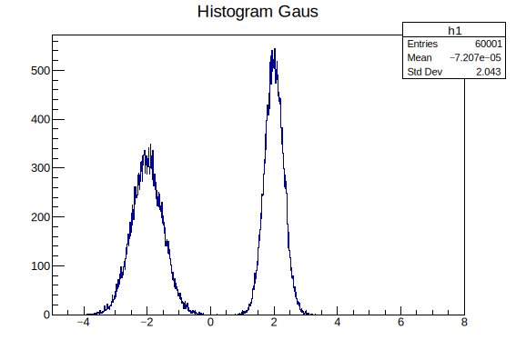
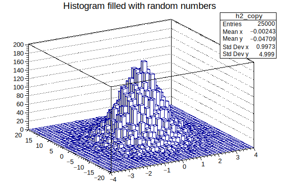
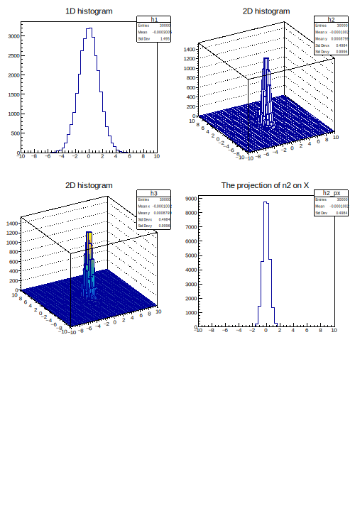

# 2.2. 统计直方 Histogram

## 统计直方 Histogram

Histogram是一种对数据分布情况的图形表示，以长条图（bar）的形式具体表现。因为直方图的长度及宽度很适合用来表现数量上的变化，所以较容易解读差异小的数值。

histogram常用类的标准形式是`THn` _**E.g.**_

```cpp
   TH1* h1 = new TH1I("h1", "h1 title", 100, 0.0, 4.0);   // 一维整型直方图
   TH2* h2 = new TH2F("h2", "h2 title", 40, 0.0, 2.0, 30, -1.5, 3.5);
   TH3* h3 = new TH3D("h3", "h3 title");
   // histogram 之间可以完成简单的运算
   TH1F h3 = h1*h2;
   TH1F h3 = 8*h1;
```

### 箱的概念 bin

在前一个例子中，你会看到`TH1I("h1", "h1 title",100,0.0,4.0)`中的参数，如`"h1"`表示将图片存为文件时，默认文件名为`h1`，`"h1 title"`指该histogram的标题为`h1 title`，`100,0.0,4.0`分别表示分bin数量`(nbins)`和轴范围`(xlow,xup)`，即将`0.0-4.0`的范围上分`100`个`bin`

那么什么是bin？<mark style="color:green;">bin的原意是垃圾箱或小箱子</mark>，在histogram中，我们将存放数据的bar，称为一个bin，bin的宽度取决于分bin数量及坐标轴的形式，如`SetLogx`：对x轴取对数坐标的形式，bin的大小随log变化，如果要求bin宽不随`logx`变化，可以参考[这里](https://www.bilibili.com/read/cv6640287/)

当不指定bin及坐标轴范围时（参数位置需要空出），ROOT会自动帮你匹配，<mark style="color:red;">自动的通常很丑</mark>

```cpp
   TH1* h1 = new TH1I("h1", "h1 title", , , );   // 一维整型直方图
```

<mark style="color:red;">同样，我们也可以精细控制分bin，此时请注意，数组的大小应为</mark><mark style="color:red;">`nbins+1`</mark><mark style="color:red;">，因为它包含下范围和上范围的轴值</mark> <mark style="color:red;"></mark>_<mark style="color:red;">**E.g.**</mark>_

```cpp
   double binEdges[] = { 0.0, 0.2, 0.5, 1., 2., 4. };
   TH1* h1 = new TH1D("h1", "h1 title", 6, binEdges );
   TH2* h2 = new TH2D("h2", "h2 title", 6, binEdges , 30, -1.5, 3.5);
```

<mark style="color:green;">**在命令行模式下，我们也可以通过下面的命令来完成简单的分bin：**</mark>

`root [0] TTree->Draw("TBranch>>(nbin,xlim,xup)")`

<mark style="color:green;">**(二维图使用>>(xbin,xmin,xmax,ybin,ymin,ymax)命令)**</mark>

### 随机函数 gRandom

```c
// 常用的内置随机函数
gRandom->Binomial(ntot,p)    // 二项分布
gRandom->Exp(tau)            // 指数分布
gRandom->Gaus(mean,sigma)    // 高斯分布
gRandom->Rndm()              // (0,1]均匀分布
gRandom->Poisson(mean)       // 泊松分布
gRandom->Landau(mean,sigma)  // 朗道分布
gRandom->Uniform(x1,x2)      // (x1,x2]均匀分布
```

<details>

<summary><strong>E.g. 创建Gaus数据</strong> </summary>

<pre class="language-cpp"><code class="lang-cpp"><strong>#include &#x3C;fstream>  // 当用到文件输入输出流时需要添加该头文件
</strong>
void create_data(){    // 在ROOT中，文件名与主函数名 
    float data=0.0;
    ofstream write; // out of file stream;stream name
    write.open("data.txt"); 

    for (int i=0; i&#x3C;30000;i++){
        data = gRandom -> Gaus (2,0.3);    // gaus分布的均值和宽度
        write &#x3C;&#x3C; data &#x3C;&#x3C;"\n";   // data write in stream
    }
    for (int k=0;k&#x3C;30000;k++){
        data = gRandom -> Gaus (-2,0.5);
        write &#x3C;&#x3C; data &#x3C;&#x3C;"\n";
    }
    write.close();
    cout &#x3C;&#x3C; "completed!"&#x3C;&#x3C;endl;
}
</code></pre>

</details>

### 填充数据 Fill

如果不将读取的数据填充进histogram，将无法正常绘制

```c
   // For 1-D histograms
   h1->Fill(x);
   h1->Fill(x,w); // with weight
   // For 2-D histograms and TProfile:
   h2->Fill(x,y);
   p2->Fill(x,y);
   h2->Fill(x,y,w);  // with weights
   p2->Fill(x,y,w);
   // For 3-D histograms and TProfile2D:
   h3->Fill(x,y,z);
   h3->Fill(x,y,z,w); // with weights
```

<details>

<summary>E.g. 填充和绘制Gaus <strong>histogram</strong></summary>

<pre class="language-c"><code class="lang-c"><strong>#include &#x3C;fstream>  // file stream
</strong>
void ana(){
    TH1F *h1 = new TH1F("h1","Histogram Gaus",1000,-5,8);
    // Type Histogram 1D Float(example:TH1D = Type Histogram 1D Double)
    float data = 0.0;

    ifstream read; // input file stream
    read.open("data.txt");

    while(read.is_open()){
        read >> data;
        h1->Fill(data);
        if(read.eof()) break;   // .eof() = end of file()
    }
    h1->Draw();
}
</code></pre>

</details>

<figure><figcaption></figcaption></figure>

### 二维直方 Histogram 2D

现在我们可以用上面的例子生成一幅二维直方图

<details>

<summary>E.g.1</summary>

```c
{
   TH2D h2("h2","Histogram filled with random numbers",40,-4,4,40,-20,20);
   float px, py;
   for (int i = 0; i < 25000; i++) {
      gRandom->Rannor(px,py);
      h2.Fill(px,5*py);
   }
   h2.DrawCopy("LEGO1");
}
```

</details>

<figure><figcaption></figcaption></figure>

<details>

<summary>E.g.2</summary>

<pre class="language-c"><code class="lang-c"><strong>void histogram3D(){
</strong>    TCanvas *c = new TCanvas("c","c",800,1200);
    c->Divide(2,3); 
    //新建画布800*1200，布局为2*3，横*高，主函数名需与文件名一致，即该文件名为"histogram3D.c"
    float x,y;
    TH1F *h1 = new TH1F("h1","1D histogram",50,-10,10);
    TH2F *h2 = new TH2F("h2","2D histogram",50,-10,10,50,-10,10);
    TH2F *h3 = new TH2F("h3","2D histogram",50,-10,10,50,-10,10);
    TH1D *ph;   //一维投影
 
    for (int i=0;i&#x3C;30000;i++){
        x=gRandom->Gaus(0,0.5);
        y=gRandom->Gaus(0,1);
        h1->Fill(3*x);
        h2->Fill(x,y);
        h3 -> Fill(x,y);
    }

    c->cd(1);
    h1->Draw();

    c->cd(2);
    h2->Draw("lego");

    c->cd(3);
    h3->Draw("lego2");

    c->cd(4);
    ph = h2->ProjectionX();
    ph->SetTitle("The projection of n2 on X");
    ph->Draw();
}
</code></pre>

</details>

<figure><figcaption></figcaption></figure>

你同样可以在ROOT的命令行中，在现有画布内新建图像

```shell
root [1] c->cd(5)
(TVirtualPad *) 0x376dbd0
root [2] TF1 *f1 = new TF1("f1","sin(x)/x",-10,10)
(TF1 *) 0x3b2d290
root [3] f1->Draw()
root [4] 
```

<figure><figcaption></figcaption></figure>

##
