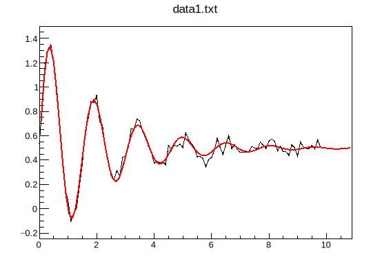

# 2.3. 图表 Graphs

TGraph 类常用于绘制其它类型的图形，如平面绘图、方程、复杂图形等

TGraph 是由两个数组X和Y组成的对象，每个数组都有n个点

<mark style="color:green;">TGraph构造函数没有TGraph标题和名称作为参数。 TGraph具有默认标题和名称“Graph”。 要更改默认标题和名称，创建后应在TGraph上调用SetTitle和SetName</mark>

## 图表 Graphs

### **一个简单的Graph案例**

我们常常会把一些坐标输出到某个文本文件中，这方便你查看和保存，当我们想要快速的绘制该文件的坐标时，可以使用下面这段命令快速开始绘制：

这里要求文件中的坐标中间是空格或者制表符，不可以是逗号。

在命令行中，这两行命令依然生效。

```c
int directdata(){
    TGraph *gr = new TGraph("mydata.txt");
    gr->Draw("AC*");    // 绘出axis，坐标点以curve链接，坐标点形状为*型
}

```

### **一个复杂的Graph案例**

<details>

<summary>E.g. </summary>

```c
void exclusion(){
    
    TCanvas *c1 = new TCanvas( "c1","Exclusion graph example",200,10,700,500 );
    c1->SetGrid();

    // create the multigraph
    TMultiGraph *mg = new TMultiGraph();    // combining from graph
    mg->SetTitle( "Exclusion graphs" ); 

    // create the graph points
    const int n = 35;
    double x1[n],x2[n],x3[n],y1[n],y2[n],y3[n];

    for (int i=0;i<n;i++){
        x1[i]=i*0.1;y1[i]=10*sin(x1[i]);
        x2[i]=x1[i];y2[i]=10*cos(x1[i]);
        x3[i]=x1[i]+0.5;y3[i]=10*sin(x1[i])-2;
    }

    // create the 1st TGraph
    TGraph *gr1 = new TGraph( n,x1,y1 );
    gr1->SetLineColor(7);
    gr1->SetLineWidth(1504);    // ffll;ff=fill;ll=linewidth
    gr1->SetFillColor(kBlack);
    gr1->SetFillStyle(3003);    // fill style [3001,3020]

    TGraph *gr2 = new TGraph( n,x2,y2 );
    gr2->SetLineColor(4);
    gr2->SetLineWidth(-2002);
    gr2->SetFillColor(9);
    gr2->SetFillStyle(3003);

    TGraph *gr3 = new TGraph( n,x3,y3 );
    gr3->SetLineColor(5);
    gr3->SetLineWidth(-802);    // ffll;ff=fill;ll=linewidth
    gr3->SetFillColor(2);
    gr3->SetFillStyle(3003);

    // gr.Draw()
    
    //mg->Add(gr1);
    //mg->Add(gr2);
    //mg->Add(gr3);

    //mg->Draw("AC");   // be equal in value with below

    gr1->Draw("AC");
    gr2->Draw("CP");
    gr3->Draw("CP");
}
```

</details>

<figure><figcaption></figcaption></figure>

```
```

## 图像拟合 Fit

```c
#include <fstream>

int fit(){
    
    ifstream read("data1.txt");
    TGraph *gr = new TGraph("data1.txt");

    double pi=3.14159265;
    TF1 *f1 = new TF1("f1","[0]*sin([1]*pi*x)*exp([2]*x)+[3]",0,10);

    f1->SetParameter(0,1);    // 第零个参数的参考值
    f1->SetParameter(1,1);
    f1->SetParameter(2,-1);
    f1->SetParameter(3,0.5);
    // be equal in value with below
    // fi->SetParameter(1,1,-1,0.5);
    gr->Fit("f1");
    gr->Draw();

    return 0;
}
```

在屏幕上，root会给出其拟合参数的精确值：

```shell
[zhangzh@node01 test]$ rl fit.c 
root [0] 
Processing fit.c...

****************************************
Minimizer is Minuit / Migrad
Chi2                      =       0.1458
NDf                       =           96
Edm                       =  3.61433e-08
NCalls                    =          123
p0                        =      1.00186   +/-   0.0254347   
p1                        =      1.30098   +/-   0.00369848  
p2                        =    -0.482759   +/-   0.0172724   
p3                        =     0.498504   +/-   0.00393919  
Info in <TCanvas::MakeDefCanvas>:  created default TCanvas with name c1
(int) 0
```

<figure><figcaption></figcaption></figure>

### 误差棒 error bar

上下左右误差不相同时，可以使用TGraphAsymmErrors函数

_**格式**_

```root
TGraphAsymmErrors *gr = new TGraphAsymmErrors(n,x,y,exl,exh,eyl,eyh)
TGraphAsymmErrors(number of var,x,y,low x,x high,y low,y high)
```

_**示例**_

```C
int error(){

    TCanvas *c1 = new TCanvas("c1","A Simple Graph with error bars",200,10,700,500);
    c1->SetGrid();
// create the arrays for the points
    Int_t n = 10;
    Double_t x[] = {-.22,.05,.25,.35,.5, .61,.7,.85,.89,.95};
    Double_t y[] = {1,2.9,5.6,7.4,9,9.6,8.7,6.3,4.5,1};
// create the arrays with high and low errors
    Double_t exl[] = {.11,.1,.07,.07,.04,.05,.06,.07,.08,.05};
    Double_t eyl[] = {.8,.3,.6,.5,.4,.4,.5,.6,.7,.8};
    Double_t exh[] = {.02,.08,.04,.05,.03,.03,.04,.05,.06,.03};
    Double_t eyh[] = {.6,.5,.4,.05,.3,.2,.3,.4,.5,.6};
// create TGraphAsymmErrors with the arrays
    TGraphAsymmErrors *gr = new TGraphAsymmErrors(n,x,y,exl,exh,eyl,eyh);
    gr->SetTitle("TGraphAsymmErrors Example");
    gr->SetMarkerColor(4);
    gr->SetMarkerStyle(21);
    gr->Draw("ALP");
}
```


### 误差带

```c
#include "TGraphErrors.h"
#include "TGraph2DErrors.h"
#include "TCanvas.h"
#include "TF2.h"
#include "TH1.h"
#include "TVirtualFitter.h"
#include "TRandom.h"
 
void ConfidenceIntervals()
{
   TCanvas *myc = new TCanvas("myc",
      "Confidence intervals on the fitted function",1000, 500);
   myc->Divide(3,1);
 
//### 1. A graph
   //Create and fill a graph
   int ngr = 100;
   TGraph *gr = new TGraph(ngr);
   gr->SetName("GraphNoError");
   double x, y;
   int i;
   for (i=0; i<ngr; i++){
      x = gRandom->Uniform(-1, 1);
      y = -1 + 2*x + gRandom->Gaus(0, 1);
      gr->SetPoint(i, x, y);
   }
   //Create the fitting function
   TF1 *fpol = new TF1("fpol", "pol1", -1, 1);
   fpol->SetLineWidth(2);
   gr->Fit(fpol, "Q");
 
   /*Create a TGraphErrors to hold the confidence intervals*/
   TGraphErrors *grint = new TGraphErrors(ngr);
   grint->SetTitle("Fitted line with .95 conf. band");
   for (i=0; i<ngr; i++)
      grint->SetPoint(i, gr->GetX()[i], 0);
   /*Compute the confidence intervals at the x points of the created graph*/
   (TVirtualFitter::GetFitter())->GetConfidenceIntervals(grint);
   //Now the "grint" graph contains function values as its y-coordinates
   //and confidence intervals as the errors on these coordinates
   //Draw the graph, the function and the confidence intervals
   myc->cd(1);
   grint->SetLineColor(kRed);
   grint->Draw("ap");
   gr->SetMarkerStyle(5);
   gr->SetMarkerSize(0.7);
   gr->Draw("psame");
 
//### 2. A histogram
   myc->cd(2);
   //Create, fill and fit a histogram
   int nh=5000;
   TH1D *h = new TH1D("h",
      "Fitted Gaussian with .95 conf.band", 100, -3, 3);
   h->FillRandom("gaus", nh);
   TF1 *f = new TF1("fgaus", "gaus", -3, 3);
   f->SetLineWidth(2);
   h->Fit(f, "Q");
   h->Draw();
 
   /*Create a histogram to hold the confidence intervals*/
   TH1D *hint = new TH1D("hint",
      "Fitted Gaussian with .95 conf.band", 100, -3, 3);
   (TVirtualFitter::GetFitter())->GetConfidenceIntervals(hint,0.68);
   //Now the "hint" histogram has the fitted function values as the
   //bin contents and the confidence intervals as bin errors
   hint->SetStats(false);
   hint->SetFillColor(2);
   hint->Draw("e3 same");
 
//### 3. A 2d graph
   //Create and fill the graph
   int ngr2 = 100;
   double z, rnd, e=0.3;
   TGraph2D *gr2 = new TGraph2D(ngr2);
   gr2->SetName("Graph2DNoError");
   TF2  *f2 = new TF2("f2",
      "1000*(([0]*sin(x)/x)*([1]*sin(y)/y))+250",-6,6,-6,6);
   f2->SetParameters(1,1);
   for (i=0; i<ngr2; i++){
      f2->GetRandom2(x,y);
      // Generate a random number in [-e,e]
      rnd = 2*gRandom->Rndm()*e-e;
      z = f2->Eval(x,y)*(1+rnd);
      gr2->SetPoint(i,x,y,z);
   }
   //Create a graph with errors to store the intervals
   TGraph2DErrors *grint2 = new TGraph2DErrors(ngr2);
   for (i=0; i<ngr2; i++)
      grint2->SetPoint(i, gr2->GetX()[i], gr2->GetY()[i], 0);
 
   //Fit the graph
   f2->SetParameters(0.5,1.5);
   gr2->Fit(f2, "Q");
   /*Compute the confidence intervals*/
   (TVirtualFitter::GetFitter())->GetConfidenceIntervals(grint2);
   //Now the "grint2" graph contains function values as z-coordinates
   //and confidence intervals as their errors
   //draw
   myc->cd(3);
   f2->SetNpx(30);
   f2->SetNpy(30);
   f2->SetFillColor(kBlue);
   f2->Draw("surf4");
   grint2->SetNpx(20);
   grint2->SetNpy(20);
   grint2->SetMarkerStyle(24);
   grint2->SetMarkerSize(0.7);
   grint2->SetMarkerColor(kRed);
   grint2->SetLineColor(kRed);
   grint2->Draw("E0 same");
   grint2->SetTitle("Fitted 2d function with .95 error bars");
 
   myc->cd();
}
```

<figure><figcaption></figcaption></figure>

## 图形的绘图选项

可以使用以下选项绘制图表，在`Draw()`命令中它们不区分大小写，可不间隔的使用多个参数如`Draw("APL")`和`Draw("A p l")`等价，均表示绘制包涵坐标轴和坐标点的图，并用直线相连：

<table><thead><tr><th width="117">Option </th><th>Description</th></tr></thead><tbody><tr><td>"A" </td><td>绘制出坐标轴</td></tr><tr><td>"I" </td><td>Combine with option 'A' it draws invisible axis </td></tr><tr><td>"L" </td><td>在点之间使用直线相连，最终呈现的效果是折线</td></tr><tr><td>"F" </td><td>绘制填充区域（“CF”绘制平滑填充区域）</td></tr><tr><td>"C" </td><td>绘制平滑曲线</td></tr><tr><td>"*" </td><td>每数据点以星号显示</td></tr><tr><td>"P" </td><td>绘制出每个 marker</td></tr><tr><td>"B" </td><td>绘制柱状图/条形图/直方图</td></tr><tr><td>"1" </td><td>当使用柱状图B时，使柱状图从底部开始，否则从0开始</td></tr><tr><td>"X+" </td><td>x轴在上</td></tr><tr><td>"Y+" </td><td>Y轴在右</td></tr><tr><td>"PFC" </td><td>调色板填充颜色：图表的填充颜色取自当前调色板中</td></tr><tr><td>"PLC" </td><td>调色板线条颜色：图形的线条颜色取自当前调色板中</td></tr><tr><td>"PMC" </td><td>调色板标记颜色：图表的标记颜色取自当前调色板中</td></tr><tr><td>"RX" </td><td>X轴反转</td></tr><tr><td>"RY" </td><td>Y轴反转</td></tr><tr><td>"HIST"</td><td>以histogram格式绘制/亦或称作阶梯图</td></tr></tbody></table>
