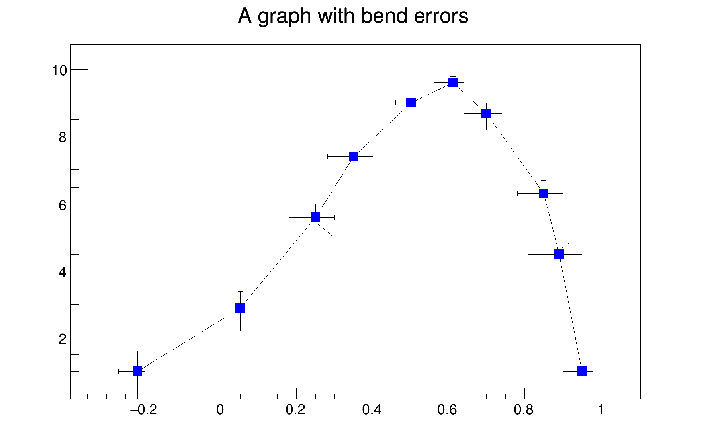

# 2.3.1 拟合与误差 Fitting and Errors

## 拟合函数 fit function

```c
#include <fstream>

int fit(){
    
    ifstream read("data1.txt");
    TGraph *gr = new TGraph("data1.txt");

    double pi=3.14159265;
    TF1 *f1 = new TF1("f1","[0]*sin([1]*pi*x)*exp([2]*x)+[3]",0,10);

    f1->SetParameter(0,1);    // 第零个参数的参考值
    f1->SetParameter(1,1);
    f1->SetParameter(2,-1);
    f1->SetParameter(3,0.5);
    // be equal in value with below
    // fi->SetParameter(1,1,-1,0.5);
    gr->Fit("f1");
    gr->Draw();

    return 0;
}
```

在屏幕上，root会给出其拟合参数的精确值：

```shell
[zhangzh@node01 test]$ rl fit.c 
root [0] 
Processing fit.c...

****************************************
Minimizer is Minuit / Migrad
Chi2                      =       0.1458
NDf                       =           96
Edm                       =  3.61433e-08
NCalls                    =          123
p0                        =      1.00186   +/-   0.0254347   
p1                        =      1.30098   +/-   0.00369848  
p2                        =    -0.482759   +/-   0.0172724   
p3                        =     0.498504   +/-   0.00393919  
Info in <TCanvas::MakeDefCanvas>:  created default TCanvas with name c1
(int) 0
```

<figure><figcaption></figcaption></figure>


## 误差棒 error bar

误差棒在统计图表中起到了传达数据不确定性和可靠性的作用，帮助读者更好地理解数据并做出准确的解释和推断。任何测量都会有误差，使用`TGraphAsymmErrors()`函数绘制误差棒，你甚至可以绘制倾斜的误差。


auto g1 = new TGraphErrors ("./data.txt","%lg %lg %lg %lg");//x y ex ey&#x20;


```c
TGraphAsymmErrors *gr = new TGraphAsymmErrors(n,x,y,exl,exh,eyl,eyh)
TGraphAsymmErrors(number of var,x,y,low x,x high,y low,y high)
TGraphAsymmErrors(number of var,x,y,low x,x high,y low, 0)    // 不绘制上误差
auto g = new TGraph2DErrors(np, rx, ry, rz, ex, ey, ez);    // 二维误差棒
```

**设置误差棒的填充颜色：**`SetFillColor()`

**设置误差棒的填充风格：**`SetFillStyle()`

**设置误差棒的颜色：**`SetLineColor()`

`误差棒的样式`

<details>

<summary>E.g. 包含非对称和倾斜误差棒的图案</summary>

```c
{
   auto c45 = new TCanvas("c45","c45",200,10,600,400);
   const Int_t n = 10;
   Double_t x[n]  = {-0.22, 0.05, 0.25, 0.35, 0.5, 0.61,0.7,0.85,0.89,0.95};
   Double_t y[n]  = {1,2.9,5.6,7.4,9,9.6,8.7,6.3,4.5,1};
   Double_t exl[n] = {.05,.1,.07,.07,.04,.05,.06,.07,.08,.05};
   Double_t eyl[n] = {.8,.7,.6,.5,.4,.4,.5,.6,.7,.8};
   Double_t exh[n] = {.02,.08,.05,.05,.03,.03,.04,.05,.06,.03};
   Double_t eyh[n] = {.6,.5,.4,.3,.2,.2,.3,.4,.5,.6};
   Double_t exld[n] = {.0,.0,.0,.0,.0,.0,.0,.0,.0,.0};
   Double_t eyld[n] = {.0,.0,.05,.0,.0,.0,.0,.0,.0,.0};
   Double_t exhd[n] = {.0,.0,.0,.0,.0,.0,.0,.0,.0,.0};
   Double_t eyhd[n] = {.0,.0,.0,.0,.0,.0,.0,.0,.05,.0};
   auto gr = new TGraphBentErrors(n,x,y,exl,exh,eyl,eyh,exld,exhd,eyld,eyhd);
   gr->SetTitle("A graph with bend errors");
   gr->SetMarkerColor(4);
   gr->SetMarkerStyle(21);
   gr->Draw("ALP");
}
```

</details>

<figure><figcaption></figcaption></figure>


## 误差带 error band

误差带（英文名为error band）是在统计图表中用来表示数据的不确定性或误差范围的一种方式，与误差棒类似，但是误差带通常是用来表示连续数据或函数的误差范围。

<details>

<summary>E.g. 折线误差带和光滑误差带</summary>

```c
{
   auto c41 = new TCanvas("c41","c41",200,10,600,300);
   c41->Divide(2,1);
   double x[] = {0, 1, 2, 3, 4};
   double y[] = {0, 2, 4, 1, 3};
   double ex[] = {0.1, 0.2, 0.3, 0.4, 0.5};
   double ey[] = {1, 0.5, 1, 0.5, 1};
   auto ge = new TGraphErrors(5, x, y, ex, ey);
   ge->SetTitle("Errors as a band");
   ge->SetFillColor(4);
   ge->SetFillStyle(3010);
   c41->cd(1);
   ge->Draw("a3");
   c41->cd(2);
   ge->SetFillColor(6);
   ge->SetFillStyle(3005);
   ge->Draw("a4");
}
```

</details>

<figure><figcaption></figcaption></figure>

选项“4”与选项“3”相似，只是表带是平滑的。 如上图所示，<mark style="color:red;">**应谨慎使用此选项，因为平滑算法可能会显示一些（巨大的）“弹跳”效果。 在某些情况下，它看起来比选项“3”更好（因为它很光滑），但它可能会具有误导性。svg和其他保存格式在显示上会略有差异，这里只做示意。**</mark>


## 多重误差 MultiErrors

`TMultiErrors`是一个类，用于处理多个测量值的误差。它是ROOT数据分析框架中的一部分，用于处理数据的不确定性和误差。

<details>

<summary>E.g. 绘制多重误差</summary>

```c
{
   auto c1 = new TCanvas("c1", "A Simple Graph with multiple y-errors", 200, 10, 700, 500);
   c1->SetGrid();
   c1->GetFrame()->SetBorderSize(12);
   const Int_t np = 5;
   Double_t x[np]       = {0, 1, 2, 3, 4};
   Double_t y[np]       = {0, 2, 4, 1, 3};
   Double_t exl[np]     = {0.3, 0.3, 0.3, 0.3, 0.3};
   Double_t exh[np]     = {0.3, 0.3, 0.3, 0.3, 0.3};
   Double_t eylstat[np] = {1, 0.5, 1, 0.5, 1};
   Double_t eyhstat[np] = {0.5, 1, 0.5, 1, 2};
   Double_t eylsys[np]  = {0.5, 0.4, 0.8, 0.3, 1.2};
   Double_t eyhsys[np]  = {0.6, 0.7, 0.6, 0.4, 0.8};
   auto gme = new TGraphMultiErrors("gme", "TGraphMultiErrors Example", np, x, y, exl, exh, eylstat, eyhstat);
   gme->AddYError(np, eylsys, eyhsys);
   gme->SetMarkerStyle(20);
   gme->SetLineColor(kRed);
   gme->GetAttLine(0)->SetLineColor(kRed);
   gme->GetAttLine(1)->SetLineColor(kBlue);
   gme->GetAttFill(1)->SetFillStyle(0);
   gme->Draw("APS ; Z ; 5 s=0.5");
}
```


</details>

<figure><figcaption></figcaption></figure>


## 拟合误差

拟合误差是用来描述实际观测值与拟合模型（如线性回归、曲线拟合等）之间的差异或偏差，即拟合模型对真实数据的逼近程度。

拟合误差通常以各种统计指标来表示，比如残差平方和（residual sum of squares）、平均绝对误差（mean absolute error）、均方根误差（root mean square error）等。

<details>

<summary>E.g. 拟合误差棒和拟合误差带</summary>

```c
#include "TGraphErrors.h"
#include "TGraph2DErrors.h"
#include "TCanvas.h"
#include "TF2.h"
#include "TH1.h"
#include "TVirtualFitter.h"
#include "TRandom.h"
 
void ConfidenceIntervals()
{
   TCanvas *myc = new TCanvas("myc","Confidence intervals on the fitted function",1000, 500);
   myc->Divide(3,1);
 
//### 1. A graph
   //Create and fill a graph
   int ngr = 100;
   TGraph *gr = new TGraph(ngr);
   gr->SetName("GraphNoError");
   double x, y;
   int i;
   for (i=0; i<ngr; i++){
      x = gRandom->Uniform(-1, 1);
      y = -1 + 2*x + gRandom->Gaus(0, 1);
      gr->SetPoint(i, x, y);
   }
   //Create the fitting function
   TF1 *fpol = new TF1("fpol", "pol1", -1, 1);
   fpol->SetLineWidth(2);
   gr->Fit(fpol, "Q");
 
   /*Create a TGraphErrors to hold the confidence intervals*/
   TGraphErrors *grint = new TGraphErrors(ngr);
   grint->SetTitle("Fitted line with .95 conf. band");
   for (i=0; i<ngr; i++)
      grint->SetPoint(i, gr->GetX()[i], 0);
   /*Compute the confidence intervals at the x points of the created graph*/
   (TVirtualFitter::GetFitter())->GetConfidenceIntervals(grint);
   //Now the "grint" graph contains function values as its y-coordinates
   //and confidence intervals as the errors on these coordinates
   //Draw the graph, the function and the confidence intervals
   myc->cd(1);
   grint->SetLineColor(kRed);
   grint->Draw("ap");
   gr->SetMarkerStyle(5);
   gr->SetMarkerSize(0.7);
   gr->Draw("psame");
 
//### 2. A histogram
   myc->cd(2);
   //Create, fill and fit a histogram
   int nh=5000;
   TH1D *h = new TH1D("h",
      "Fitted Gaussian with .95 conf.band", 100, -3, 3);
   h->FillRandom("gaus", nh);
   TF1 *f = new TF1("fgaus", "gaus", -3, 3);
   f->SetLineWidth(2);
   h->Fit(f, "Q");
   h->Draw();
 
   /*Create a histogram to hold the confidence intervals*/
   TH1D *hint = new TH1D("hint","Fitted Gaussian with .95 conf.band", 100, -3, 3);
   (TVirtualFitter::GetFitter())->GetConfidenceIntervals(hint,0.68);
   //Now the "hint" histogram has the fitted function values as the
   //bin contents and the confidence intervals as bin errors
   hint->SetStats(false);
   hint->SetFillColor(2);
   hint->Draw("e3 same");
 
//### 3. A 2d graph
   //Create and fill the graph
   int ngr2 = 100;
   double z, rnd, e=0.3;
   TGraph2D *gr2 = new TGraph2D(ngr2);
   gr2->SetName("Graph2DNoError");
   TF2  *f2 = new TF2("f2","1000*(([0]*sin(x)/x)*([1]*sin(y)/y))+250",-6,6,-6,6);
   f2->SetParameters(1,1);
   for (i=0; i<ngr2; i++){
      f2->GetRandom2(x,y);
      // Generate a random number in [-e,e]
      rnd = 2*gRandom->Rndm()*e-e;
      z = f2->Eval(x,y)*(1+rnd);
      gr2->SetPoint(i,x,y,z);
   }
   //Create a graph with errors to store the intervals
   TGraph2DErrors *grint2 = new TGraph2DErrors(ngr2);
   for (i=0; i<ngr2; i++)
      grint2->SetPoint(i, gr2->GetX()[i], gr2->GetY()[i], 0);
 
   //Fit the graph
   f2->SetParameters(0.5,1.5);
   gr2->Fit(f2, "Q");
   /*Compute the confidence intervals*/
   (TVirtualFitter::GetFitter())->GetConfidenceIntervals(grint2);
   //Now the "grint2" graph contains function values as z-coordinates
   //and confidence intervals as their errors
   //draw
   myc->cd(3);
   f2->SetNpx(30);
   f2->SetNpy(30);
   f2->SetFillColor(kBlue);
   f2->Draw("surf4");
   grint2->SetNpx(20);
   grint2->SetNpy(20);
   grint2->SetMarkerStyle(24);
   grint2->SetMarkerSize(0.7);
   grint2->SetMarkerColor(kRed);
   grint2->SetLineColor(kRed);
   grint2->Draw("E0 same");
   grint2->SetTitle("Fitted 2d function with .95 error bars");
 
   myc->cd();
}
```

</details>

<figure><figcaption></figcaption></figure>


## 含本底拟合


## 多维误差

`TGraphMultiErrors`的工作方式与`TGraphAsymmErrors`基本相同。 它有可能定义多个y-Errors的类型/维度。 如果你想同时绘制统计和系统错误，这非常有用。


## 拟合面板


