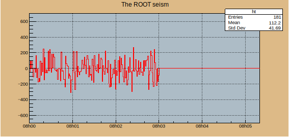

# 2.5. 属性设置 TAtt


## 什么是风格设置 gStyle

CERN ROOT的gStyle类是用于定义绘图风格的类，它包含了绘图元素的各种属性设置，如线条颜色、线条宽度、填充颜色、字体样式等，从而创建出符合需求的图形效果。通过gStyle类，用户可以轻松地实现图形的定制化，使得绘制的图形更加美观和易于理解。

<mark style="color:red;">**风格style的重要性体现在如果不先设置风格属性，那么其他属性，如颜色、大小，可能不会生效。**</mark>

<details>

<summary>gStyle类的成员函数</summary>

```bash
root [3] gStyle->Set
SetAxisColor
SetBarOffset
SetBarWidth
SetBit
SetCanvasBorderMode
SetCanvasBorderSize
SetCanvasColor
SetCanvasDefH
SetCanvasDefW
SetCanvasDefX
SetCanvasDefY
SetCanvasPreferGL
SetCapLinePS
SetColorModelPS
SetDateX
SetDateY
SetDrawBorder
SetDrawOption
SetDtorOnly
SetEndErrorSize
SetErrorX
SetFillAttributes
SetFillColor
SetFillColorAlpha
SetFillStyle
SetFitFormat
SetFrameBorderMode
SetFrameBorderSize
SetFrameFillColor
SetFrameFillStyle
SetFrameLineColor
SetFrameLineStyle
SetFrameLineWidth
SetFuncColor
SetFuncStyle
SetFuncWidth
SetGridColor
SetGridStyle
SetGridWidth
SetHatchesLineWidth
SetHatchesSpacing
SetHeaderPS
SetHistFillColor
SetHistFillStyle
SetHistLineColor
SetHistLineStyle
SetHistLineWidth
SetHistMinimumZero
SetHistTopMargin
SetImageScaling
SetIsReading
SetJoinLinePS
SetLabelColor
SetLabelFont
SetLabelOffset
SetLabelSize
SetLegendBorderSize
SetLegendFillColor
SetLegendFont
SetLegendTextSize
SetLegoInnerR
SetLineAttributes
SetLineColor
SetLineColorAlpha
SetLineScalePS
SetLineStyle
SetLineStyleString
SetLineWidth
SetMarkerAttributes
SetMarkerColor
SetMarkerColorAlpha
SetMarkerSize
SetMarkerStyle
SetName
SetNameTitle
SetNdivisions
SetNumberContours
SetObjectStat
SetOptDate
SetOptFile
SetOptFit
SetOptLogx
SetOptLogy
SetOptLogz
SetOptStat            // 设置图例的内容，参考手册3.8.5 Statistics Display
SetOptTitle
SetPadBorderMode
SetPadBorderSize
SetPadBottomMargin
SetPadColor
SetPadGridX
SetPadGridY
SetPadLeftMargin
SetPadRightMargin
SetPadTickX
SetPadTickY
SetPadTopMargin
SetPaintTextFormat
SetPalette
SetPaperSize
SetScreenFactor
SetStatBorderSize
SetStatColor
SetStatFont
SetStatFontSize
SetStatFormat
SetStatH
SetStatStyle
SetStatTextColor
SetStatW
SetStatX
SetStatY
SetStripDecimals
SetTextAlign
SetTextAngle
SetTextAttributes
SetTextColor
SetTextColorAlpha
SetTextFont
SetTextSize
SetTextSizePixels
SetTickLength
SetTimeOffset
SetTitle
SetTitleAlign
SetTitleBorderSize
SetTitleColor
SetTitleFillColor
SetTitleFont
SetTitleFontSize
SetTitleH
SetTitleOffset
SetTitlePS
SetTitleSize
SetTitleStyle
SetTitleTextColor
SetTitleW
SetTitleX
SetTitleXOffset
SetTitleXSize
SetTitleY
SetTitleYOffset
SetTitleYSize
SetUniqueID

```

</details>


## 线的属性 Line attributes

线的属性设置通常包含颜色、宽度、风格，可以分别通过下面的命令来分别设置：

**线的风格：`SetLineStyle()`**

<figure><figcaption></figcaption></figure>

**线的颜色：`SetMarkerColor()`，参数参考**[**这里**](2.5.1-se-cai-she-zhi-tcolor.md#ji-ben-yan-se)

**线的宽度：`SetLineWidth()`，**<mark style="color:green;">**线宽通常宜设置为 2**</mark>

<figure><figcaption></figcaption></figure>

<mark style="color:green;">**当然，如果你需要一个带状区域时，也可以简单的使用线宽来调整：**</mark>

```
gr3->SetLineWidth(-802);    // ffll;ff=fill;ll=li
```


## 记号属性 Marker attributes

记号的属性设置通常包含颜色、风格、线宽、大小，可以分别通过下面的命令来分别设置：

#### **记号颜色：`SetMarkerColor()`**

#### **记号风格：`SetMarkerStyle()`**

<figure><figcaption></figcaption></figure>


**注意：**

在绘图时应小心使用非对称符号。 这个图表显示了符号的误导性！这两个绘图代表相同的数据集，但由于符号选择不当，顶部的两个绘图看起来比底部示例相距更远。


<figure><figcaption></figcaption></figure>

#### **记号的线宽：`SetMarkerStyle()`**

通常情况下，你不需要额外设置记号的线宽，但是当你需要着重标注的时候，可以使用`SetMarkerStyle()`来设置线宽，50 - 67线宽为2、68 - 85线宽为3，以此类推：

<figure><figcaption></figcaption></figure>

#### 记号大小：`SetMarkerSize()`

下图显示了各种标记尺寸。默认标记大小=1显示在左上角。可以指定小于1的标记大小。标记大小不指任何坐标系，它是一个绝对值。因此，<mark style="color:green;">**标记大小不受TPad比例变化的影响。等于1的标记大小对应于8像素**</mark>。

<figure><figcaption></figcaption></figure>


## 图例用法 TLegend

图例可以用来解释图中的各个部分的名称，他的用法是：`TLegend *l = new TLegend(,,,,"")`，意为新建一个名为`l`的图例，参数前四位是相对于画布的归一化坐标，`(0,0)`表示画布的左下角，`(1,1)`表示画布的右上角。

#### 增加图例内容

使用`l->AddEntry(,"")`函数为你的图例添加新的解释：

<details>

<summary> <em><strong>E.g.</strong></em><strong> 介绍四个高斯函数的图例</strong></summary>

```c
void ex3_gaus(){
    
    TCanvas *c = new TCanvas("c","Four Gaussian Distributions",600,600);
    c->SetGrid();

    TF1 *f1 = new TF1("f1","TMath::Gaus(x,0,1)",-6,6);
    TF1 *f2 = new TF1("f2","TMath::Gaus(x,0,2)",-6,6);
    TF1 *f3 = new TF1("f3","TMath::Gaus(x,1,1)",-6,6);
    TF1 *f4 = new TF1("f4","TMath::Gaus(x,1,2)",-6,6);
    
    TLegend *leg = new TLegend(0.1,0.7,0.4,0.9,"");
    leg->AddEntry(f1,"Gaus(0,1)");
    leg->AddEntry(f2,"Gaus(0,2)");
    leg->AddEntry(f3,"Gaus(1,1)");
    leg->AddEntry(f4,"Gaus(1,2)");

    f1->SetLineColor(2);
    f1->SetLineWidth(4);
    f1->Draw();   

    f2->SetLineColor(4);
    f2->SetLineWidth(4);
    f2->Draw("same");
    
    f3->SetLineColor(6);
    f3->SetLineWidth(4);
    f3->Draw("same");
    
    f4->SetLineColor(8);
    f4->SetLineWidth(4);
    f4->Draw("same");
    
    f1->SetTitle("Four Gaussian Distributions");
    leg->Draw();

    c->SaveAs("ex3_gaus.pdf");
    c->SaveAs("ex3_gaus.svg");

}
```

</details>

<figure><figcaption></figcaption></figure>

#### 修改图例框

使用`SetBorderSize(0)`命令**关闭图例框**在某些情况下图像更加美观

<mark style="color:red;">添加阴影</mark>


## 公式文字 TLatex

使用`SetTextAlign()`函数设置文本的对齐方式；

使用`SetTextSize()`函数设置文本的大小；

使用`SetTextColor()`函数来设置文本的颜色。


## 标题 Title

设置标题的函数是`Graph`或`Histogram`的成员函数。支持root的LaTex语法。

我知道你知道设置标题的函数是`GetX/Yaxis->SetTitle("name")`，但是它也可以同时设置标题、x轴标题、y轴标题。用法是`SetTitle("graph tittle; x tittle; y tilttle")`

同时标题支持自定义：

**颜色：**`SetTitleColor()`

**大小：**`SetTitleSize()`

**字体：**

**距离：**`SetTitleOffset()` 设置轴和轴标题之间的距离。

偏移量=1使用标准位置，该位置根据标签偏移量和尺寸计算；偏移量=1.2将使标准偏移量增加20%。


## 轴 Axis

### **轴的范围**

我们可以人为的控制轴的范围

### **双轴画法**

### **反轴画法**

### 共轴画法

共轴画法非常普遍，一般是用于数据的对比和参照，将两个相关性极强的图表以上下或左右绘制，起补充说明或对照的作用。最简单的共轴画法是`Divide(number x, number y, 0)`，但是这有一个问题，当你的坐标包含起始数字时，第二幅pad会对第一幅pad产生遮挡。

那么这里将展示一个更复杂和精细美观的画法：


### 对数轴 Log

<mark style="color:green;">对数轴是Tcanvas的类，所以设置对数轴，需要先建立画布。</mark>

使用`SetLogx()`和`SetLogy()`命令来设置画布的X轴和Y轴为对数坐标轴。_**E.g.**_

```c
TCanvas *c1 = new TCanvas("c1", "Example", 800, 600);
    c1->SetLogx(0);
    c1->SetLogy(1);
    c1->Update();
```

`SetLogx(0)`和`SetLogy(1)`分别表示取消x对数轴和设置y轴为对数轴，什么都没有为默认设置对数轴。

### **时间轴 Time on Axis**

<details>

<summary><em>E.g.</em> 模拟地震波随时间变化的图案</summary>

```c
void seism(){

    //TStopwatch sw;sw.Start();
    //TDatime dtime;
    //gStyle->SetTimeOffset( dtime.Convert() ); // replace axis with timeaxis

    //cout << dtime.Convert() << endl;

    TCanvas *c1 = new TCanvas("seism","Time on axis",0,0,1000,500);        
    // TCanvas("canvas name","canvas title",the pixel coordinates of the top left corner of canvas,same as above,size of pixel along X,size of pixel along Y)
   
    c1->SetFillColor( 42 ); // fill background color
    c1->SetFrameFillColor( 33 ); // color in frame
    c1->SetGrid();  // add grid in the frame

    Float_t bintime =1; // set one bin = 1 second. change it to set time scale,don't chenge real time
    TH1F *ht = new TH1F("ht","The ROOT seism",10,0,10*bintime);
    // TH1 = 1D histogram;F = float;("name","title",bin,Xmin,Xmax)
    Float_t signal = 700;
    // c/c++ : int , float , double
    // POOT :int_t , float_t , double_t

    ht->SetMaximum( signal );
    ht->SetMinimum( -signal );
    ht->SetStats( 1 );  // set statistic pad,1=display,0=hide
    ht->SetLineColor( 2 );
    ht->GetXaxis()->SetTimeDisplay( 1 );    // settimedisplay,1=display,0=hide
    ht->GetYaxis()->SetNdivisions( 220 );   // n1n2n3,n1 = a bin in the bin;n2n3 = ???
    ht->Draw();

    for(int i=0;i<200;i++){
        // build a signal ; noisy damped sine
        Float_t noise = gRandom->Gaus(0,120);
        if(i>100){ noise = noise + sin((i-700)*6.28/30)*exp((700-i)/300); }
        ht->SetBinContent(i,noise); // the ith content is noise
        c1->Modified();
        c1->Update();
        gSystem->ProcessEvents();
    }
    
    //printf("real time =%8.3fs,cpu time =%8.3fsn", sw.RealTime(), sw.CpuTime());
    return 0;
}
```

</details>



### 极坐标轴 GraphPolar


## 统计面板

统计面板会统计一些有关图形的信息给你，就像上面这个例子的ht

当你不需要展示统计面板的时候，使用命令`gStyle->SetOptStat(0);`


##

##

