# 3.2 Matplotlib

## A simple example

<figure>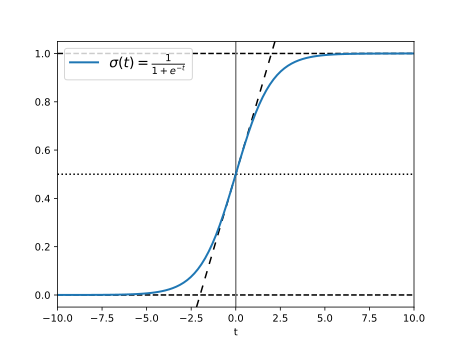<figcaption></figcaption></figure>

```python
import matplotlib.pyplot as plt
import numpy as np

t = np.linspace(-10, 10, 100)
sig = 1 / (1 + np.exp(-t))

fig, ax = plt.subplots()

ax.axhline(y=0, color="black", linestyle="--")
ax.axhline(y=0.5, color="black", linestyle=":")
ax.axhline(y=1.0, color="black", linestyle="--")
ax.axvline(color="grey")
ax.axline((0, 0.5), slope=0.25, color="black", linestyle=(0, (5, 5)))
ax.plot(t, sig, linewidth=2, label=r"$\sigma(t) = \frac{1}{1 + e^{-t}}$")
ax.set(xlim=(-10, 10), xlabel="t")
ax.legend(fontsize=14)
plt.show()
```


## Plot Types

### Normal Plot

```
[0,0] [0,1] [0,2] [0,3]
[1,0] [1,1] [1,2] [1,3]
[2,0] [2,1] [2,2] [2,3]
[3,0] [3,1] [3,2] [3,3]
[4,0] [4,1] [4,2] [4,3]

[0,0] 散点图：呈现数据离散程度或分布，需要传递两位参数 (x, y)
[1,0] 折线图：展示变量随自变量的连续变化趋势，通常传递 (x, y)
[2,0] 阶梯图：折线图的阶梯形式，传递 (x, y)
[3,0] 区域填充图：强调区间不确定性或置信范围，需传递 (x, y1, y2)
[4,0] 误差图：表示测量值及其误差范围，需传递 (x, y, xerr, yerr)
[0,1] 直方图：展示单变量数据的数量分布，所以传递变量 (x)，bar 的高低表述 x 的多少
[1,1] 柱状图：比较多个值的大小，需传递 (x/name, height)
[2,1] 横向柱状图：柱状图的横向形式，适用于类别名称较长或较多的情况
[3,1] 小提琴图：同时展示数据分布形状与概率密度，通常传入多维数据列表
[4,1] 箱线图：展示数据的中位数、四分位数及异常值，通常传入多维数据列表
[0,2] 二维直方图：展示两个变量联合分布的密度，需传递 (x, y)
[1,2] 等高线图：用等值线表示二维函数在平面上的变化，需传递 (X, Y, Z)
[2,2] 网格着色图：基于四边形网格的矢量着色图，需传递二维数组 Z
[3,2] 图像显示：将二维数组直接映射为像素图像，本质是位图
[4,2] 蜂巢图：用六边形统计二维数据密度，适合大规模散点数据
[0,3] 多边形填充：填充由顶点定义的封闭多边形，需传递 (x, y)
[1,3] 阶梯直方图：直方图轮廓的矢量表示，需传递 (heights, edges（数组数量+1）)
[2,3] 堆叠面积图：展示多个类别随时间或索引的累积贡献，需传递 (x, y1, y2, ...)
[3,3] 饼图：展示各类别在整体中的占比，只需传入数据即可，比例由 python 自行分配
[4,3] 箭头图：表示二维向量场的方向与强度，需传递 (x, y, u, v)
```

<details>

<summary>e.g. Normal Plot</summary>

```python
import numpy as np
import matplotlib.pyplot as plt

fig, axs = plt.subplots(5, 4, figsize=(9, 11), layout='constrained')

a = np.linspace(0, 10, 100)
b = np.random.randn(100)
c = np.random.normal(loc=0, scale=1, size=100)

cat_name = ['AF', 'BR', 'CN', 'DK', 'EU', 'FR']
cat = [1, 2, 3, 4, 5, 7]
val= [5, 7, 3, 8, 6, 4]

step = np.linspace(0, 10, 10)
high = np.random.randn(10)

# axs[0, 0] scatter
axs[0, 0].scatter(b, c)
axs[0, 0].set_title('Basic scatter') 

# axs[1, 0] plot
ra = np.exp(-a)*np.sin(a)*a**2
axs[1, 0].plot(a, ra)
axs[1, 0].set_title('Basic plot') 

# axs[2, 0] step
axs[2, 0].step(step, high) 
#axs[2, 0].plot(step, high, drawstyle='setps') 
axs[2, 0].set_title('Basic step')

# axs[3, 0] fill between
err_up = 1 + 4*step/8 + np.random.uniform(0.5, 1, len(step))
err_dw = 1 + 2*step/8 + np.random.uniform(0.0, 0.5, len(step))
axs[3, 0].fill_between(step, err_up, err_dw, alpha=.5)
axs[3, 0].plot(step, (err_up + err_dw)/2, linewidth=2)
axs[3, 0].set_title('Basic fill_between') 

# axs[4, 0] errorplot
axs[4, 0].errorbar(step, high, xerr=err_dw*0.1, yerr=err_up*0.1)
axs[4, 0].set_title('Basic errorplot') 

# axs[0, 1] hist
axs[0, 1].hist(c)
axs[0, 1].set_title('Basic hist') 

# axs[1, 1] bar
axs[1, 1].bar(cat, val)
axs[1, 1].set_title('Basic bar') 

# axs[2, 1] horizontal bar
axs[2, 1].barh(cat_name, val)
axs[2, 1].set_title('basic barh (horizontal bar)')

# axs[3, 1] violinplot
axs[3, 1].violinplot([b, c])
axs[3, 1].set_title('Basic violinplot')

# axs[4, 1] boxplot
box = [a, b, c]
positions = [2, 4, 6]
axs[4, 1].boxplot(box, positions = [2, 4, 6])
axs[4, 1].set_title('Basic boxplot') 

# axs[0, 2] hist2d
rb = b + np.random.randn(100) * 0.5
axs[0, 2].hist2d(b, rb)
axs[0, 2].set_title('Basic hist 2d') 

# axs[1, 2] contour
X, Y = np.meshgrid(a, a)
Z = (np.sin(X) * np.cos(Y) + 
	np.exp(-0.1*(X**2 + Y**2)) * np.cos(2*X) * np.sin(2*Y) + 
	0.5 * np.sin(np.sqrt(X**2 + 2*Y**2)))
axs[1, 2].contour(X, Y, Z)
#axs[1, 2].contour(Z)
axs[1, 2].set_title('Basic contour') 

# axs[2, 2] pcolormesh
axs[2, 2].pcolormesh(Z)
axs[2, 2].set_title('Basic pcolormesh') 

# axs[3, 2] imshow
axs[3, 2].imshow(Z)
axs[3, 2].set_title('Basic imshow Defa. Squa.') 

# axs[4, 2] hexbin
axs[4, 2].hexbin(b, c, gridsize=10,edgecolor='black',    # 边框颜色
               linewidth=0.5)
axs[4, 2].set_title('Basic hexbin')
axs[4, 2].set_xlim(-1.5, 1.5)
axs[4, 2].set_ylim(-1.5/np.sqrt(3)*2, 1.5/np.sqrt(3)*2)

# axs[0, 3] fill
fill_x = [0, 2, 1, 0]
fill_y = [0, 0, 2, 0]
axs[0, 3].fill(fill_x, fill_y)
axs[0, 3].set_title('Basic fill') 

# axs[1, 3] stairs
axs[1, 3].stairs(np.random.rand(10), np.arange(11))
axs[1, 3].set_title('Basic stairs')

# axs[2, 3] stackplot
axs[2, 3].stackplot(
    np.arange(6),
    np.random.rand(3, 6),
    labels=['A', 'B', 'C']
)
axs[2, 3].set_title('Basic stackplot')

# axs[3, 3] pie
axs[3, 3].pie(val)
axs[3, 3].set_title('Basic pie') 

# axs[4, 3] quiver
axs[4, 3].quiver(X[::5, ::5], Y[::5, ::5],
                 np.sin(X)[::5, ::5],
                 np.cos(Y)[::5, ::5])
axs[4, 3].set_title('Basic quiver')

##########################################################

axs[2, 2].annotate(
	'Vector Graphics',
	xy=(75, 80), xycoords='data',
	xytext=(-80, -60), textcoords='offset points',
	arrowprops=dict(arrowstyle="->",
	connectionstyle="angle3,angleA=0,angleB=-90")
)

axs[3, 2].annotate(
	'Bitmap / Pixel',
	xy=(75, 20), xycoords='data',
	xytext=(-80, -60), textcoords='offset points',
	arrowprops=dict(arrowstyle="->",
	connectionstyle="angle3,angleA=0,angleB=-90")
)

from matplotlib.patches import Circle
circle_outer = Circle((75, 80), 6, fill=False, edgecolor='white', linewidth=1, linestyle='--')
circle_inner = Circle((75, 20), 6, fill=False, edgecolor='white', linewidth=1, linestyle='--')
axs[2, 2].add_patch(circle_outer)
axs[3, 2].add_patch(circle_inner)

plt.show()

```

</details>

<figure><figcaption></figcaption></figure>

### Projection Plot

<details>

<summary>e.g.</summary>

```python

import numpy as np
import matplotlib.pyplot as plt
from mpl_toolkits.mplot3d import Axes3D

fig = plt.figure(figsize=(15, 8), layout='constrained')

# data
theta = np.linspace(0, 2*np.pi, 100)
r = 1 + 0.5 * np.sin(4*theta)
x = np.linspace(-np.pi, np.pi, 100)
y = np.sin(x)

# polar
ax1 = fig.add_subplot(2, 4, 1, projection='polar')
ax1.plot(theta, r, color='royalblue')
ax1.set_title("1. Polar")

# Polar bar
N = 20
thet = np.linspace(0.0, 2 * np.pi, N, endpoint=False)
radii = 10 * np.random.rand(N)
width = np.pi / 4 * np.random.rand(N)
colors = plt.colormaps["viridis"](radii / 10.)

ax2 = fig.add_subplot(2, 4, 2, projection='polar')
ax2.bar(thet, radii, width=width, bottom=0.0, color=colors, alpha=0.5)
ax2.set_title("2. Polar Bar")

# Aitoff
ax5 = fig.add_subplot(2, 4, 5, projection='aitoff')
ax5.plot(x, y, color='purple')
ax5.grid(True)
ax5.set_title("5. Aitoff")

# Hammer
ax6 = fig.add_subplot(2, 4, 6, projection='hammer')
ax6.plot(x, y, color='orange')
ax6.grid(True)
ax6.set_title("6. Hammer")

# Mollweide
ax7 = fig.add_subplot(2, 4, 7, projection='mollweide')
ax7.plot(x, y, color='teal')
ax7.grid(True)
ax7.set_title("7. Mollweide")

# 3D project
ax8 = fig.add_subplot(2, 4, 8, projection='3d')
z = np.linspace(0, 1, 100)
ax8.plot(np.sin(theta), np.cos(theta), z, color='darkgreen')
ax8.set_title("8. 3D Plot")

####################################################################

from matplotlib.patches import Circle, RegularPolygon
from matplotlib.path import Path
from matplotlib.projections import register_projection
from matplotlib.projections.polar import PolarAxes
from matplotlib.spines import Spine
from matplotlib.transforms import Affine2D

# 1. 定义
class BaseRadarTransform(PolarAxes.PolarTransform):
    def __init__(self, num_vars, *args, **kwargs):
        self.num_vars = num_vars
        super().__init__(*args, **kwargs)

    def transform_path_non_affine(self, path):
        if path._interpolation_steps > 1:
            path = path.interpolated(self.num_vars)
        return Path(self.transform(path.vertices), path.codes)

class BaseRadarAxes(PolarAxes):
    """公共的雷达图核心逻辑"""
    def __init__(self, *args, **kwargs):
        super().__init__(*args, **kwargs)
        self.set_theta_zero_location('N') 

    def fill(self, *args, closed=True, **kwargs):
        return super().fill(closed=closed, *args, **kwargs)

    def plot(self, *args, **kwargs):
        lines = super().plot(*args, **kwargs)
        for line in lines:
            self._close_line(line)

    def _close_line(self, line):
        x, y = line.get_data()
        if len(x) > 0 and x[0] != x[-1]:
            x = np.append(x, x[0])
            y = np.append(y, y[0])
            line.set_data(x, y)

    def set_varlabels(self, labels, theta):
        self.set_thetagrids(np.degrees(theta), labels)

num_vars = 9  # 9个维度

class CircleRadarAxes(BaseRadarAxes):
    name = 'radar_circle'
    PolarTransform = lambda *args, **kwargs: BaseRadarTransform(num_vars, *args, **kwargs)
    
    def _gen_axes_patch(self):
        return Circle((0.5, 0.5), 0.5)

class PolygonRadarAxes(BaseRadarAxes):
    name = 'radar_polygon'
    PolarTransform = lambda *args, **kwargs: BaseRadarTransform(num_vars, *args, **kwargs)

    def _gen_axes_patch(self):
        return RegularPolygon((0.5, 0.5), num_vars, radius=.5, edgecolor="k")

    def _gen_axes_spines(self):
        spine = Spine(axes=self, spine_type='circle', path=Path.unit_regular_polygon(num_vars))
        spine.set_transform(Affine2D().scale(.5).translate(.5, .5) + self.transAxes)
        return {'polar': spine}

# 注册
register_projection(CircleRadarAxes)
register_projection(PolygonRadarAxes)

# 3. 绘制
def get_clean_data():
    labels = ['Sulfate', 'Nitrate', 'EC', 'OC1', 'OC2', 'OC3', 'OP', 'CO', 'O3']
    case_1 = [0.88, 0.4, 0.63, 0.33, 0.20, 0.16, 0.81, 0.50, 0.30]
    case_2 = [0.57, 0.95, 0.94, 0.55, 0.10, 0.22, 0.31, 0.30, 0.60]
    return labels, [case_1, case_2]

if __name__ == '__main__':
    theta = np.linspace(0, 2*np.pi, num_vars, endpoint=False)
    spoke_labels, cases = get_clean_data()

ax3 = fig.add_subplot(2, 4, 3, projection='radar_circle')
ax3.set_title("3. Circle Frame")
    
ax4 = fig.add_subplot(2, 4, 4, projection='radar_polygon')
ax4.set_title("4. Polygon Frame")

colors = ['royalblue', 'crimson']

for ax in [ax3, ax4]:
	ax.set_rgrids([0.2, 0.4, 0.6, 0.8])
	for d, color in zip(cases, colors):
		ax.plot(theta, d, color=color, linewidth=2)
		ax.fill(theta, d, facecolor=color, alpha=0.2)
		ax.set_varlabels(spoke_labels, theta)

####################################################################

plt.show()
```

</details>

<figure>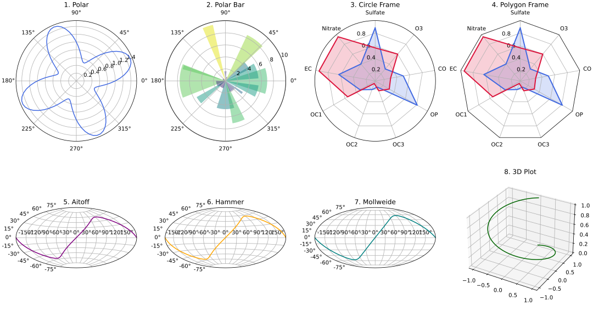<figcaption></figcaption></figure>


## Figure

### Element

<details>

<summary>e.g. Name of several matplotlib elements composing a figure</summary>

```python
import matplotlib.pyplot as plt
import numpy as np

from matplotlib.patches import Circle
from matplotlib.patheffects import withStroke
from matplotlib.ticker import AutoMinorLocator, MultipleLocator

royal_blue = [0, 20/256, 82/256]


# make the figure

np.random.seed(19680801)

X = np.linspace(0.5, 3.5, 100)
Y1 = 3+np.cos(X)
Y2 = 1+np.cos(1+X/0.75)/2
Y3 = np.random.uniform(Y1, Y2, len(X))

fig = plt.figure(figsize=(7.5, 7.5))
ax = fig.add_axes([0.2, 0.17, 0.68, 0.7], aspect=1)

ax.xaxis.set_major_locator(MultipleLocator(1.000))
ax.xaxis.set_minor_locator(AutoMinorLocator(4))
ax.yaxis.set_major_locator(MultipleLocator(1.000))
ax.yaxis.set_minor_locator(AutoMinorLocator(4))
ax.xaxis.set_minor_formatter("{x:.2f}")

ax.set_xlim(0, 4)
ax.set_ylim(0, 4)

ax.tick_params(which='major', width=1.0, length=10, labelsize=14)
ax.tick_params(which='minor', width=1.0, length=5, labelsize=10,
               labelcolor='0.25')

ax.grid(linestyle="--", linewidth=0.5, color='.25', zorder=-10)

ax.plot(X, Y1, c='C0', lw=2.5, label="Blue signal", zorder=10)
ax.plot(X, Y2, c='C1', lw=2.5, label="Orange signal")
ax.plot(X[::3], Y3[::3], linewidth=0, markersize=9,
        marker='s', markerfacecolor='none', markeredgecolor='C4',
        markeredgewidth=2.5)

ax.set_title("Anatomy of a figure", fontsize=20, verticalalignment='bottom')
ax.set_xlabel("x Axis label", fontsize=14)
ax.set_ylabel("y Axis label", fontsize=14)
ax.legend(loc="upper right", fontsize=14)


# Annotate the figure

def annotate(x, y, text, code):
    # Circle marker
    c = Circle((x, y), radius=0.15, clip_on=False, zorder=10, linewidth=2.5,
               edgecolor=royal_blue + [0.6], facecolor='none',
               path_effects=[withStroke(linewidth=7, foreground='white')])
    ax.add_artist(c)

    # use path_effects as a background for the texts
    # draw the path_effects and the colored text separately so that the
    # path_effects cannot clip other texts
    for path_effects in [[withStroke(linewidth=7, foreground='white')], []]:
        color = 'white' if path_effects else royal_blue
        ax.text(x, y-0.2, text, zorder=100,
                ha='center', va='top', weight='bold', color=color,
                style='italic', fontfamily='monospace',
                path_effects=path_effects)

        color = 'white' if path_effects else 'black'
        ax.text(x, y-0.33, code, zorder=100,
                ha='center', va='top', weight='normal', color=color,
                fontfamily='monospace', fontsize='medium',
                path_effects=path_effects)


annotate(3.5, -0.13, "Minor tick label", "ax.xaxis.set_minor_formatter")
annotate(-0.03, 1.0, "Major tick", "ax.yaxis.set_major_locator")
annotate(0.00, 3.75, "Minor tick", "ax.yaxis.set_minor_locator")
annotate(-0.15, 3.00, "Major tick label", "ax.yaxis.set_major_formatter")
annotate(1.68, -0.39, "xlabel", "ax.set_xlabel")
annotate(-0.38, 1.67, "ylabel", "ax.set_ylabel")
annotate(1.52, 4.15, "Title", "ax.set_title")
annotate(1.75, 2.80, "Line", "ax.plot")
annotate(2.25, 1.54, "Markers", "ax.scatter")
annotate(3.00, 3.00, "Grid", "ax.grid")
annotate(3.60, 3.58, "Legend", "ax.legend")
annotate(2.5, 0.55, "Axes", "fig.subplots")
annotate(4, 4.5, "Figure", "plt.figure")
annotate(0.65, 0.01, "x Axis", "ax.xaxis")
annotate(0, 0.36, "y Axis", "ax.yaxis")
annotate(4.0, 0.7, "Spine", "ax.spines")

# frame around figure
fig.patch.set(linewidth=4, edgecolor='0.5')
plt.show()
```

</details>

<figure>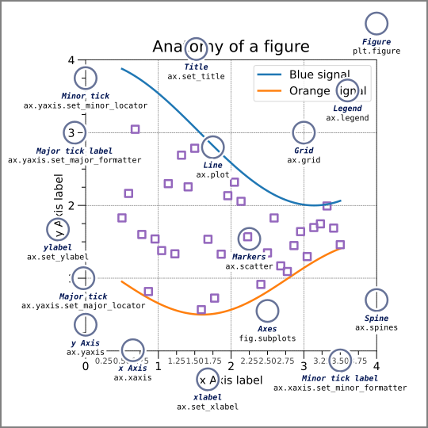<figcaption></figcaption></figure>

### Multi-Plot

<details>

<summary>e.g. Gridspec for multi-column/row subplot layouts</summary>

```
import matplotlib.pyplot as plt
from matplotlib.gridspec import GridSpec

def format_axes(fig):
    for i, ax in enumerate(fig.axes):
        ax.text(0.5, 0.5, "ax%d" % (i+1), va="center", ha="center")
        ax.tick_params(labelbottom=False, labelleft=False)

fig = plt.figure(layout="constrained")

gs = GridSpec(3, 3, figure=fig)
ax1 = fig.add_subplot(gs[0, :])
ax2 = fig.add_subplot(gs[1, :-1])
ax3 = fig.add_subplot(gs[1:, -1])
ax4 = fig.add_subplot(gs[-1, 0])
ax5 = fig.add_subplot(gs[-1, -2])

format_axes(fig)
```

</details>

<details>

<summary>e.g. <mark style="color:$success;">Subplots with structural layouts</mark></summary>

```python
import matplotlib.pyplot as plt

fig, axs = plt.subplots(ncols=3, nrows=3, figsize=(8, 8))
gs = axs[0, 0].get_gridspec()

for ax in axs[0, :].flatten():
    ax.remove()
for ax in axs[1, 0:2].flatten():
    ax.remove()
for ax in axs[1:, 2].flatten():
    ax.remove()

ax1 = fig.add_subplot(gs[0, :])
ax2 = fig.add_subplot(gs[1, 0:2])
ax3 = fig.add_subplot(gs[1:, 2])

ax4 = axs[2, 0]
ax5 = axs[2, 1]

for i, ax in enumerate([ax1, ax2, ax3, ax4, ax5]):
    ax.tick_params(labelbottom=False, labelleft=False)
    ax.text(0.5, 0.5, f"ax{i+1}", va="center", ha="center", fontsize=12)

plt.tight_layout()
plt.show()
```

</details>

<figure>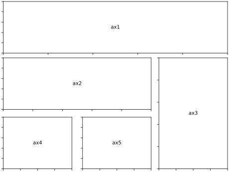<figcaption></figcaption></figure>

<details>

<summary>e.g. fig.add_gridspec()</summary>

```
import matplotlib.pyplot as plt
import numpy as np

fig = plt.figure()
gs = fig.add_gridspec(2, 2, hspace=0, wspace=0)
(ax1, ax2), (ax3, ax4) = gs.subplots(sharex='col', sharey='row')
fig.suptitle('Sharing x per column, y per row')
ax1.plot(x, y)
ax2.plot(x, y**2, 'tab:orange')
ax3.plot(x + 1, -y, 'tab:green')
ax4.plot(x + 2, -y**2, 'tab:red')

for ax in fig.get_axes():
    ax.label_outer()
```

</details>

<details>

<summary>e.g. <mark style="color:$success;">fig.subplots_adjust(hspace=0, wspace=0)</mark></summary>

```
import matplotlib.pyplot as plt
import numpy as np

x = np.linspace(0, 2 * np.pi, 400)
y = np.sin(x**2)

fig, axs = plt.subplots(2, 2, 
#	sharex='col', sharey='row',
	sharex=True, sharey=True,
)

fig.subplots_adjust(hspace=0, wspace=0)
fig.suptitle('Sharing x per column, y per row')

axs[0, 0].plot(x, y)
axs[0, 1].plot(x, y**2, 'tab:orange')
axs[1, 0].plot(x + 1, -y, 'tab:green')
axs[1, 1].plot(x + 2, -y**2, 'tab:red')

axs[0, 0].tick_params(labelbottom=False)
axs[0, 1].tick_params(labelbottom=False)
axs[0, 1].tick_params(labelleft=False)
axs[1, 1].tick_params(labelleft=False)

plt.show()
```

</details>

<figure>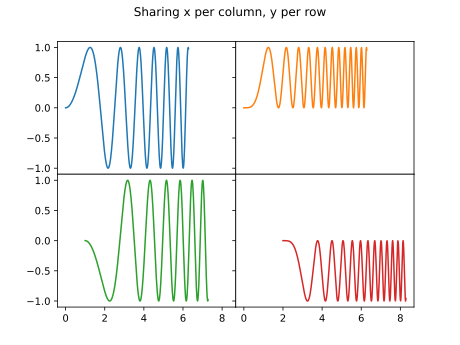<figcaption></figcaption></figure>


## Axis

### Log Axis

<details>

<summary>e.g.</summary>

```python
import matplotlib.pyplot as plt 
import numpy as np 

x = np.linspace(0.01, 0.99, 1000)
y = x

plt.figure(figsize=(6, 5)) 

plt.subplot(221) 
plt.plot(x, y, color='crimson', linewidth=2) 
plt.yscale('linear') 
plt.title('Linear Scale') 
plt.grid(True) 

plt.subplot(222) 
plt.plot(x, y, color='royalblue', linewidth=2) 
plt.yscale('log') 
plt.title('Log Scale') 
plt.grid(True) 

y_sym = y - y.mean()
plt.subplot(223) 
plt.plot(x, y_sym, color='darkgreen', linewidth=2) 
plt.yscale('symlog', linthresh=0.05) 
plt.title('Symmetric Log Scale') 
plt.grid(True) 

plt.subplot(224) 
plt.plot(x, y, color='purple', linewidth=2) 
plt.yscale('logit') 
plt.title('Logit Scale') 
plt.grid(True) 

plt.tight_layout()
plt.show()
```

</details>

<figure>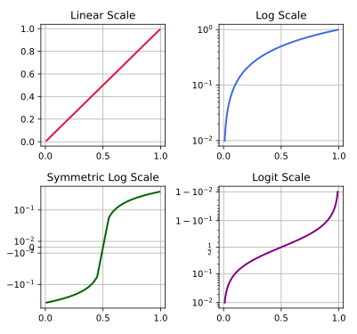<figcaption></figcaption></figure>

### Time Axis

<details>

<summary>e.g.</summary>

```python
import datetime
import matplotlib.dates as mdates
import matplotlib.pyplot as plt
import numpy as np

base = datetime.datetime(2026, 7, 1, 0, 0, 0, 0)
dates = [base + datetime.timedelta(days=i) for i in range(300)]
np.random.seed(42)
y = np.cumsum(np.random.randn(300))

fig, (ax1, ax2, ax3, ax4, ax5, ax6) = plt.subplots(6, 1, figsize=(8, 11), layout='constrained')

ax1.plot(dates, y, color='limegreen', linewidth=1.5)

ax2.plot(dates, y, color='crimson', linewidth=1.5)
ax2.xaxis.set_major_locator(mdates.MonthLocator(bymonth=(1, 4, 7, 10)))
ax2.xaxis.set_minor_locator(mdates.MonthLocator())

ax3.plot(dates, y, color='darkorange', linewidth=1.5)
for label in ax3.get_xticklabels(which='major'):
    label.set(rotation=30, horizontalalignment='right')

ax4.plot(dates, y, color='royalblue', linewidth=1.5)
locator = mdates.AutoDateLocator()
ax4.xaxis.set_major_locator(locator)
ax4.xaxis.set_major_formatter(mdates.ConciseDateFormatter(locator))

ax5.plot(dates, y, color='purple', linewidth=1.5)
ax5.xaxis.set_major_locator(mdates.MonthLocator(bymonthday=(1, 15))) # 每月1号和15号显示主要刻度
ax5.xaxis.set_major_formatter(mdates.DateFormatter('%d'))
sec = ax5.secondary_xaxis(location=-0.12)
sec.xaxis.set_major_locator(mdates.MonthLocator(bymonthday=1))
sec.xaxis.set_major_formatter(mdates.DateFormatter('%b'))
sec.tick_params('x', length=0)
sec.spines['bottom'].set_linewidth(0)

ax1.set_ylabel('rate [%]')
ax2.set_ylabel('rate [%]')
ax3.set_ylabel('rate [%]')
ax4.set_ylabel('rate [%]')
ax5.set_ylabel('rate [%]')

dates2 = [base + datetime.timedelta(minutes=i) for i in range(300)]
ax6.plot(dates2, y, color='deeppink', linewidth=1.5)
locator = mdates.AutoDateLocator()
ax6.xaxis.set_major_locator(locator)
ax6.xaxis.set_major_formatter(mdates.ConciseDateFormatter(locator))
ax6.set_ylabel('rate [%]')

plt.show()
```

</details>

<figure>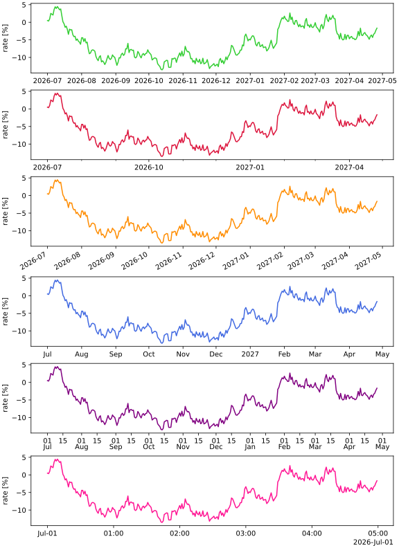<figcaption></figcaption></figure>

### Span\_selector



<figure>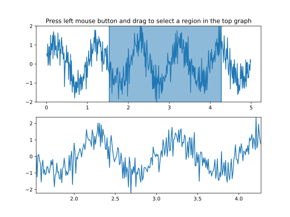<figcaption></figcaption></figure>

## Color

### Color Names

<figure><figcaption></figcaption></figure>

### Color Alpha

<details>

<summary>e.g.</summary>

```python
import matplotlib.pyplot as plt
import numpy as np

np.random.seed(19680801)

fig, (ax1, ax2) = plt.subplots(ncols=2, figsize=(8, 4))

x_values = [n for n in range(20)]
y_values = np.random.randn(20)

facecolors = ['green' if y > 0 else 'red' for y in y_values]
edgecolors = facecolors

ax1.bar(x_values, y_values, color=facecolors, edgecolor=edgecolors, alpha=0.5)
ax1.set_title("Explicit 'alpha' keyword value\nshared by all bars and edges")


abs_y = [abs(y) for y in y_values]
face_alphas = [n / max(abs_y) for n in abs_y]
edge_alphas = [1 - alpha for alpha in face_alphas]

colors_with_alphas = list(zip(facecolors, face_alphas))
edgecolors_with_alphas = list(zip(edgecolors, edge_alphas))

ax2.bar(x_values, y_values, color=colors_with_alphas,
        edgecolor=edgecolors_with_alphas)
ax2.set_title('Normalized alphas for\neach bar and each edge')

plt.show()
```

</details>

<figure>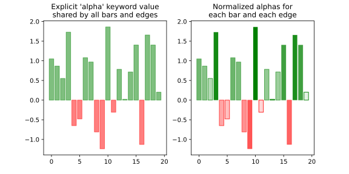<figcaption></figcaption></figure>

### Colorbar

<details>

<summary>e.g.</summary>

```python
import numpy as np
import matplotlib.pyplot as plt
import matplotlib.colors as colors
import matplotlib.ticker as mticker

plt.rcParams["font.family"] = "Times New Roman"
plt.rcParams["font.size"] = 11

fig, axs = plt.subplots(3, 3, 
    figsize=(10, 9.5),
    sharex=True,
    sharey=True,
    layout='constrained',
)
for ax in axs.flat: pcm = ax.pcolormesh(np.random.random((20, 20)))

# [1:, 2] shrink=0.6
cbar= fig.colorbar(pcm, ax=axs[1:, 2], location='right', extend='both',
    shrink=0.6,
    ticks=[0.2, 0.5, 0.8],
    format=mticker.FixedFormatter(['< 0.2', '0.5', '> 0.8']),
 )
labels = cbar.ax.get_yticklabels()
labels[0].set_verticalalignment('top')
labels[-1].set_verticalalignment('bottom')

# [2, 1:] minorticks
cbar =fig.colorbar(pcm, ax=axs[2, 1:], shrink=0.6, location='bottom')
cbar.ax.tick_params(direction='in')
cbar.minorticks_on()
cbar.ax.xaxis.set_tick_params(which='minor', direction='in')
cbar.ax.spines[:].set_linewidth(2)
cbar.ax.tick_params(which='major', width=2, length=6)
cbar.ax.tick_params(which='minor', width=1.5, length=3)

# [0, 0] LogNorm
pcm = axs[0, 0].pcolormesh(
    np.random.random((20, 20)),
    norm=colors.LogNorm(vmin=0.001, vmax=1),
    antialiased=False,
    linewidth=0,
    edgecolor='none'
)
fig.colorbar(pcm, ax=axs[0, 0])
fig.colorbar(pcm, ax=axs[0, 0], location='bottom', label=rf'Set LogNorm')
fig.colorbar(pcm, ax=axs[0, 0], location='left')
fig.colorbar(pcm, ax=axs[0, 0], location='top')

# [1, 0] bounds
bounds = np.array([-1, -0.5, 0, 0.5, 0.8])
norm = colors.BoundaryNorm(boundaries=bounds, ncolors=256)
pcm = axs[1, 0].pcolormesh(
    np.random.random((20, 20)),
    norm=norm
)
fig.colorbar(pcm, ax=axs[1, 0])

# [2, 0] PowerNorm
pcm = axs[2, 0].pcolormesh(
    np.random.random((20, 20)),
    norm=colors.PowerNorm(gamma=0.5)
)
axs[2, 0].set_xlabel('Sharx X axis')
#axs[2, 0].set_ylabel('Share Y axis')
fig.colorbar(pcm, ax=axs[2, 0])

# [0, 1] PowerNorm
pcm = axs[0, 1].pcolormesh(
    np.random.random((20, 20)),
    vmin=0.2,
    vmax=0.8
)
cbar = fig.colorbar(pcm, ax=axs[0, 1], location='bottom')
labels = cbar.ax.get_xticklabels()
labels[0].set_x(0.0)
labels[0].set_horizontalalignment('left')
labels[-1].set_x(1.0)
labels[-1].set_horizontalalignment('right')

cbar.ax.text(
    1., -2.5,
    'Colorbar Title',
    transform=cbar.ax.transAxes,
    ha='right',
    va='top'
)

# [0, 2] set_ticks labels
cbar = fig.colorbar(pcm, ax=axs[0, 2], location='bottom', label=rf'Set ticks labesls')
cbar.set_ticks(ticks=[0.2, 0.5, 0.8], labels=['Low', 'Medium', 'High'])

# [1, 1] colorbar in the fig
cax = axs[1, 1].inset_axes([16, 1, 1, 18], transform=axs[1, 1].transData)
cbar = fig.colorbar(pcm, cax=cax)
cbar.ax.tick_params(color='white')
cbar.ax.tick_params(labelcolor='white')
cbar.ax.spines[:].set_color('white')

plt.savefig('colorbarSet.pdf')
plt.show()

```

</details>

<figure>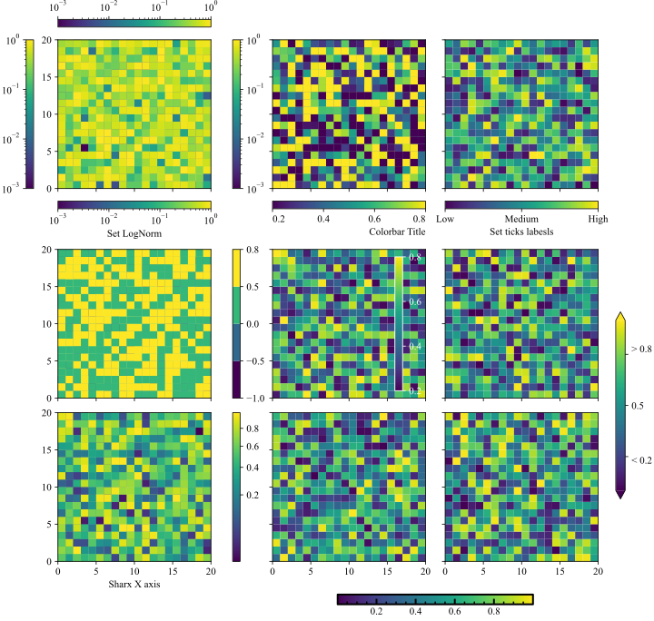<figcaption></figcaption></figure>

参考：

* [Annotated heatmap](https://matplotlib.org/stable/gallery/images_contours_and_fields/image_annotated_heatmap.html)

## Legend

<table data-search="false"><thead><tr><th width="155">参数名称</th><th width="100">默认值</th><th>作用</th></tr></thead><tbody><tr><td><code>loc</code></td><td><code>'best'</code></td><td>图例对齐基准。如 <code>upper left</code>, <code>center</code>。</td></tr><tr><td><code>bbox_to_anchor</code></td><td><code>None</code></td><td>定位锚点，用于坐标轴外的定位（左上角），定位 <code>(x, y, width, height)</code>。</td></tr><tr><td><code>ncols</code> / <code>ncol</code></td><td><code>1</code></td><td>多列展示。</td></tr><tr><td><code>borderpad</code></td><td><code>0.4</code></td><td>图例边框与内部元素的边距。</td></tr><tr><td><code>labelspacing</code></td><td><code>0.5</code></td><td>行距。</td></tr><tr><td><code>handletextpad</code></td><td><code>0.8</code></td><td>图例图标与文本的水平间距。</td></tr><tr><td><code>borderaxespad</code></td><td><code>0.5</code></td><td>图例与坐标轴边界之间的边距。</td></tr><tr><td><code>columnspacing</code></td><td><code>2.0</code></td><td>列间距。</td></tr><tr><td><code>handlelength</code></td><td><code>2.0</code></td><td>图标水平长度。</td></tr><tr><td><code>handleheight</code></td><td><code>0.7</code></td><td>图标垂直高度。</td></tr><tr><td><code>title</code></td><td><code>None</code></td><td>图例标题。</td></tr><tr><td><code>title_fontsize</code></td><td><code>None</code></td><td>图例标题字体大小。</td></tr><tr><td><code>alignment</code></td><td><code>'center'</code></td><td>图例标题和图例内容对齐方式（<code>'left'</code>, <code>'right'</code>, <code>'center'</code>）。</td></tr><tr><td><code>fontsize</code></td><td><code>None</code></td><td>图例标签文字的大小。</td></tr><tr><td><code>markerfirst</code></td><td><code>True</code></td><td><code>True</code> 为图标在左文字在右；<code>False</code> 为文字在左图标在右。</td></tr><tr><td><code>frameon</code></td><td><code>True</code></td><td>是否显示图例的外边框和背景底色。</td></tr><tr><td><code>shadow</code></td><td><code>False</code></td><td>图例框开启复古的三维阴影效果。</td></tr><tr><td><code>facecolor</code></td><td><code>None</code></td><td>指定图例背景的颜色。</td></tr><tr><td><code>edgecolor</code></td><td><code>None</code></td><td>手动指定图例边框线条的颜色。</td></tr><tr><td><code>framealpha</code></td><td><code>0.8</code></td><td>图例背景的透明度。</td></tr><tr><td><code>mode</code></td><td><code>None</code></td><td><code>'expand'</code> 会自动水平撑满。</td></tr></tbody></table>

<details>

<summary>e.g.</summary>

```python
import matplotlib.pyplot as plt
import numpy as np

np.random.seed(19680801)
N = 12
x = np.arange(100)
data = (np.geomspace(1, 10, 100) + np.random.randn(N, 100)).T

fig, ax = plt.subplots(figsize=(9, 5.2))
cmap = plt.cm.coolwarm

for i in range(N):
    line_color = cmap(i / (N - 1))
    ax.plot(x, data[:, i], color=line_color, linewidth=1.5, label=f"{(i+1)*10} ℃")


leg_top = ax.legend(
    bbox_to_anchor=(0., 1.02, 1., .1), loc='lower left',
    ncols=4, mode="expand", borderaxespad=0.
)
ax.add_artist(leg_top)  # 固化上方图例


handles, labels = ax.get_legend_handles_labels()
sub_handles = [handles[0], handles[N // 2], handles[-1]]
sub_labels = ['Cold', 'Medium', 'Hot']
leg_inside = ax.legend(
    handles=sub_handles, 
    labels=sub_labels, 
    loc='upper left'     # 规规矩矩放在图的左上角内部
)
ax.add_artist(leg_inside) # 固化图内图例


ax.legend(
    bbox_to_anchor=(1.01, 1.0), loc='upper left',
    title="Curve Temp", borderaxespad=0.
)


fig.subplots_adjust(right=0.8, top=0.75, left=0.1, bottom=0.1)
ax.grid(True, linestyle='-', alpha=0.3)
plt.show()
```

</details>

<figure>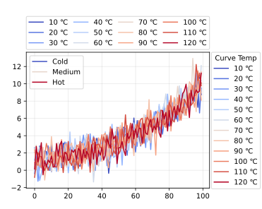<figcaption></figcaption></figure>

## Font

<figure>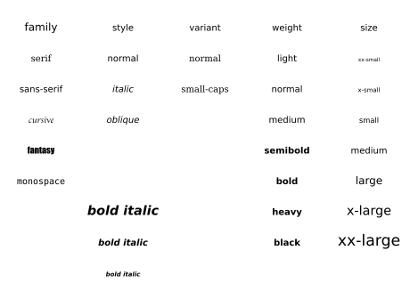<figcaption></figcaption></figure>

### SimSun font

<details>

<summary></summary>

```
import matplotlib.pyplot as plt
import numpy as np

# 中文用宋体（SimSun），英文用Times New Roman
# plt.rcParams['font.sans-serif'] = ['Times New Roman', 'SimSun']
plt.rcParams['font.sans-serif'] = ['SimSun', 'Times New Roman']
# 关闭unicode负号转义，避免负号显示为方块
plt.rcParams['axes.unicode_minus'] = False
# 公式（$...$内的内容）使用STIX字体
plt.rcParams['mathtext.fontset'] = 'stix'

x = np.linspace(0, 15, 200)
y_conj = np.exp(-0.1 * x) * np.sin(2 * x)
y_grad = np.exp(-0.2 * x) * np.cos(2 * x)

fig, ax = plt.subplots(num='1')

# ax.plot(x, y_conj, label='线条1, n=100abc', linewidth=2, color='#FF6B6B')
# ax.plot(x, y_grad, label='线条2, n=200', linewidth=2, color='#4ECDC4')
ax.plot(x, y_conj, label='线条1, ' + r'$n=100$$\text{abc}$', linewidth=2, color='#FF6B6B')
ax.plot(x, y_grad, label=r'线条2, $n=200$', linewidth=2, color='#4ECDC4')

# 添加图表元素（含中英文混合文本）
# ax.set_xlabel('迭代次数 (Iteration)')
# ax.set_ylabel('误差值 (Error Value)')
ax.set_xlabel(r'迭代次数 $\text{(Iteration)}$')
ax.set_ylabel(r'误差值 $\text{(Error Value)}$')
ax.tick_params(axis='both', labelfontfamily='Times New Roman')
ax.grid(alpha=0.3, linestyle='--')
ax.legend(fontsize=11, loc='upper right')

plt.show()
```

</details>

## Line

<details>

<summary>e.g. </summary>

```python
import matplotlib.pyplot as plt
import numpy as np

linestyle_str = [
     ('solid', 'solid'),      # Same as (0, ()) or '-'
     ('dotted', 'dotted'),    # Same as ':'
     ('dashed', 'dashed'),    # Same as '--'
     ('dashdot', 'dashdot')]  # Same as '-.'

linestyle_tuple = [
     ('loosely dotted',        (0, (1, 10))),
     ('dotted',                (0, (1, 5))),
     ('densely dotted',        (0, (1, 1))),

     ('long dash with offset', (5, (10, 3))),
     ('loosely dashed',        (0, (5, 10))),
     ('dashed',                (0, (5, 5))),
     ('densely dashed',        (0, (5, 1))),

     ('loosely dashdotted',    (0, (3, 10, 1, 10))),
     ('dashdotted',            (0, (3, 5, 1, 5))),
     ('densely dashdotted',    (0, (3, 1, 1, 1))),

     ('dashdotdotted',         (0, (3, 5, 1, 5, 1, 5))),
     ('loosely dashdotdotted', (0, (3, 10, 1, 10, 1, 10))),
     ('densely dashdotdotted', (0, (3, 1, 1, 1, 1, 1)))]

def plot_linestyles(ax, linestyles, title):
    X, Y = np.linspace(0, 100, 10), np.zeros(10)
    yticklabels = []

    for i, (name, linestyle) in enumerate(linestyles):
        ax.plot(X, Y+i, linestyle=linestyle, linewidth=1.5, color='black')
        yticklabels.append(name)

    ax.set_title(title)
    ax.set(ylim=(-0.5, len(linestyles)-0.5),
           yticks=np.arange(len(linestyles)),
           yticklabels=yticklabels)
    ax.tick_params(left=False, bottom=False, labelbottom=False)
    ax.spines[:].set_visible(False)

    # For each line style, add a text annotation with a small offset from
    # the reference point (0 in Axes coords, y tick value in Data coords).
    for i, (name, linestyle) in enumerate(linestyles):
        ax.annotate(repr(linestyle),
                    xy=(0.0, i), xycoords=ax.get_yaxis_transform(),
                    xytext=(-6, -12), textcoords='offset points',
                    color="blue", fontsize=8, ha="right", family="monospace")

fig, (ax0, ax1) = plt.subplots(2, 1, figsize=(7, 8), height_ratios=[1, 3],
                               layout='constrained')

plot_linestyles(ax0, linestyle_str[::-1], title='Named linestyles')
plot_linestyles(ax1, linestyle_tuple[::-1], title='Parametrized linestyles')

plt.show()
```

</details>

<figure>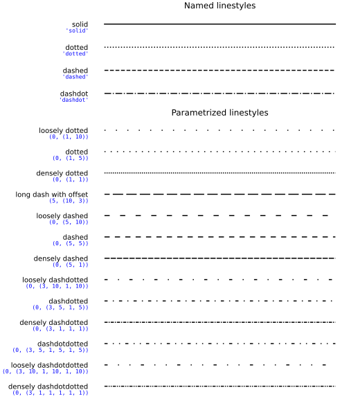<figcaption></figcaption></figure>


## Annotate

### Arrow

<details>

<summary>e.g.</summary>

```python
import matplotlib.pyplot as plt
import numpy as np

fig, ax = plt.subplots(figsize=(15, 7),layout='constrained')
ax.set_xlim(0, 15)
ax.set_ylim(0, 12)
offset = 72

x, y = 0.2, 0.2
tx, ty = 0.7, 0.7

ax.annotate(
    "bosxstyle default, arrowstyle='->'",
    xy = (x, y),
    xytext = (tx, ty),
    bbox = dict(),
    arrowprops = dict(arrowstyle="->")
)
ax.annotate(
    "square",
    xy = (x, y+1),
    xytext = (tx, ty+1),
    bbox = dict(boxstyle="square"),
    arrowprops = dict(arrowstyle="->")
)
ax.annotate(
    "round",
    xy = (x, y+2),
    xytext = (tx, ty+2),
    bbox = dict(boxstyle="round"),
    arrowprops = dict(arrowstyle="->")
)
ax.annotate(
    "round4",
    xy = (x, y+3),
    xytext = (tx, ty+3),
    bbox = dict(boxstyle="round4"),
    arrowprops = dict(arrowstyle="->")
)
ax.annotate(
    "sawtooth",
    xy = (x, y+4),
    xytext = (tx, ty+4),
    bbox = dict(boxstyle="sawtooth"),
    arrowprops = dict(arrowstyle="->")
)
ax.annotate(
    "roundtooth",
    xy = (x, y+5),
    xytext = (tx, ty+5),
    bbox = dict(boxstyle="roundtooth"),
    arrowprops = dict(arrowstyle="->")
)
ax.annotate(
    "ellipse",
    xy = (x, y+9),
    xytext = (tx, ty+9),
    bbox = dict(boxstyle="ellipse"),
    arrowprops = dict(arrowstyle="->")
)
ax.annotate(
    "circle",
    xy = (x, y+10.1),
    xytext = (tx, ty+10.1),
    bbox = dict(boxstyle="circle"),
    arrowprops= dict(arrowstyle="->"),
)
ax.annotate(
    "larrow",
    xy = (x, y+6),
    xytext = (tx, ty+6),
    bbox = dict(boxstyle="larrow"),
    arrowprops= dict(arrowstyle="->"),
)
ax.annotate(
    "rarrow",
    xy = (x, y+7),
    xytext = (tx, ty+7),
    bbox = dict(boxstyle="rarrow"),
    arrowprops= dict(arrowstyle="->"),
)
ax.annotate(
    "darrow",
    xy = (x, y+8),
    xytext = (tx, ty+8),
    bbox = dict(boxstyle="darrow"),
    arrowprops = dict(arrowstyle="->"),
)
ax.annotate(
    "sawtooth,tooth_size=0.3",
    xy = (x+1.5, y+4),
    xytext = (tx+1.5, ty+4),
    bbox = dict(boxstyle="sawtooth,tooth_size=0.3"),
    arrowprops = dict(arrowstyle="->"),
)
ax.annotate(
    "roundtooth,tooth_size=0.3",
    xy = (x+1.5, y+5),
    xytext = (tx+1.5, ty+5),
    bbox = dict(boxstyle="roundtooth,tooth_size=0.3"),
    arrowprops = dict(arrowstyle="->"),
)
ax.annotate(
    "round,rounding_size=0.8",
    xy = (x+1.5, y+2),
    xytext = (tx+1.5, ty+2),
    bbox = dict(boxstyle="round,rounding_size=0.8"),
    arrowprops = dict(arrowstyle="->"),
)
ax.annotate(
    "round4,rounding_size=0.1",
    xy = (x+1.5, y+3),
    xytext = (tx+1.5, ty+3),
    bbox = dict(boxstyle="round4,rounding_size=0.1"),
    arrowprops = dict(arrowstyle="->"),
)
################################

ax.annotate(
    "pad=0.5",
    xy = (x+4, y),
    xytext = (tx+4, ty),
    bbox = dict(boxstyle='square', pad=0.5),
    arrowprops = dict(arrowstyle="->"),
)
ax.annotate(
    "fc=bisque",
    xy = (x+4, y+1),
    xytext = (tx+4, ty+1),
    bbox = dict(fc="bisque"),
    arrowprops = dict(arrowstyle="->"),
)
ax.annotate(
    "ec=bisque",
    xy = (x+4, y+2),
    xytext = (tx+4, ty+2),
    bbox = dict(ec="bisque"),
    arrowprops = dict(arrowstyle="->"),
)
ax.annotate(
    "alpha=0.5",
    xy = (x+4, y+3),
    xytext = (tx+4, ty+3),
    bbox = dict(alpha=0.5),
    arrowprops = dict(arrowstyle="->"),
)
ax.annotate(
    "ls='--'",
    xy = (x+4, y+4),
    xytext = (tx+4, ty+4),
    bbox = dict(ls='--'),
    arrowprops = dict(arrowstyle="->"),
)
ax.annotate(
    "ls=':'",
    xy = (x+4, y+5),
    xytext = (tx+4, ty+5),
    bbox = dict(ls=':'),
    arrowprops = dict(arrowstyle="->"),
)
ax.annotate(
    "lw=1.5",
    xy = (x+4, y+6),
    xytext = (tx+4, ty+6),
    bbox = dict(lw=1.5),
    arrowprops = dict(arrowstyle="->"),
)
ax.annotate(
    "hatch='/'",
    xy = (x+4, y+7),
    xytext = (tx+4, ty+7),
    bbox = dict(hatch='/'),
    arrowprops = dict(arrowstyle="->"),
)
ax.annotate(
    "hatch='.'",
    xy = (x+4, y+7),
    xytext = (tx+4, ty+7),
    bbox = dict(hatch='.'),
    arrowprops = dict(arrowstyle="->"),
)
ax.annotate(
    "hatch='/'",
    xy = (x+4, y+8),
    xytext = (tx+4, ty+8),
    bbox = dict(hatch="/"),
    arrowprops = dict(arrowstyle="->"),
)

################################

ax.annotate(
    "arrowstyle=default",
    xy = (x+5.5, y),
    xytext = (tx+5.5, ty),
    bbox = dict(boxstyle="round4", fc='bisque', alpha=0.5),
    arrowprops = dict()
)
ax.annotate(
    "arrowstyle='-'",
    xy = (x+5.5, y+1),
    xytext = (tx+5.5, ty+1),
    bbox = dict(boxstyle="round4", fc='bisque', alpha=0.5),
    arrowprops = dict(arrowstyle='-')
)
ax.annotate(
    "arrowstyle='->'",
    xy = (x+5.5, y+2),
    xytext = (tx+5.5, ty+2),
    bbox = dict(boxstyle="round4", fc='bisque', alpha=0.5),
    arrowprops = dict(arrowstyle='->')
)
ax.annotate(
    "arrowstyle='<->'",
    xy = (x+5.5, y+3),
    xytext = (tx+5.5, ty+3),
    bbox = dict(boxstyle="round4", fc='bisque', alpha=0.5),
    arrowprops = dict(arrowstyle='<->')
)
ax.annotate(
    "arrowstyle='<-'",
    xy = (x+5.5, y+4),
    xytext = (tx+5.5, ty+4),
    bbox = dict(boxstyle="round4", fc='bisque', alpha=0.5),
    arrowprops = dict(arrowstyle='<-')
)
ax.annotate(
    "arrowstyle='<-['",
    xy = (x+5.5, y+5),
    xytext = (tx+5.5, ty+5),
    bbox = dict(boxstyle="round4", fc='bisque', alpha=0.5),
    arrowprops = dict(arrowstyle='<-[')
)
ax.annotate(
    "arrowstyle='simple'",
    xy = (x+5.5, y+6),
    xytext = (tx+5.5, ty+6),
    bbox = dict(boxstyle="round4", fc='bisque', alpha=0.5),
    arrowprops = dict(arrowstyle='simple')
)
ax.annotate(
    "arrowstyle='wedge'",
    xy = (x+5.5, y+7),
    xytext = (tx+5.5, ty+7),
    bbox = dict(boxstyle="round4", fc='bisque', alpha=0.5),
    arrowprops = dict(arrowstyle='wedge')
)
ax.annotate(
    "arrowstyle='fancy'",
    xy = (x+5.5, y+8),
    xytext = (tx+5.5, ty+8),
    bbox = dict(boxstyle="round4", fc='bisque', alpha=0.5),
    arrowprops = dict(arrowstyle='fancy')
)

################################
ax.annotate(
    "arrowstyle='->',color='red'",
    xy = (x+7.5, y),
    xytext = (tx+7.5, ty),
    bbox = dict(boxstyle="round4", fc='bisque', alpha=0.5),
    arrowprops = dict(arrowstyle='->', color='red')
)
ax.annotate(
    "arrowstyle='->',alpha=0.5",
    xy = (x+7.5, y+1),
    xytext = (tx+7.5, ty+1),
    bbox = dict(boxstyle="round4", fc='bisque', alpha=0.5),
    arrowprops = dict(arrowstyle='->', alpha=0.5)
)
ax.annotate(
    "arrowstyle='->',lw=2.5",
    xy = (x+7.5, y+2),
    xytext = (tx+7.5, ty+2),
    bbox = dict(boxstyle="round4", fc='bisque', alpha=0.5),
    arrowprops = dict(arrowstyle='->', lw=2.5)
)
ax.annotate(
    "arrowstyle='->',ls='--'",
    xy = (x+7.5, y+3),
    xytext = (tx+7.5, ty+3),
    bbox = dict(boxstyle="round4", fc='bisque', alpha=0.5),
    arrowprops = dict(arrowstyle='->', ls='--')
)
ax.annotate(
    "arrowstyle='fancy',fc='red'",
    xy = (x+7.5, y+4),
    xytext = (tx+7.5, ty+4),
    bbox = dict(boxstyle="round4", fc='bisque', alpha=0.5),
    arrowprops = dict(arrowstyle='fancy', fc='red')
)
ax.annotate(
    "arrowstyle='fancy',ec='red'",
    xy = (x+7.5, y+5),
    xytext = (tx+7.5, ty+5),
    bbox = dict(boxstyle="round4", fc='bisque', alpha=0.5),
    arrowprops = dict(arrowstyle='fancy', ec='red')
)
ax.annotate(
    "arrowstyle='->',shrinkA=20",
    xy = (x+7.5, y+6),
    xytext = (tx+7.5, ty+6),
    bbox = dict(boxstyle="round4", fc='bisque', alpha=0.5),
    arrowprops = dict(arrowstyle='->', shrinkA=20)
)
ax.annotate(
    "arrowstyle='->',shrinkB=20",
    xy = (x+7.5, y+7),
    xytext = (tx+7.5, ty+7),
    bbox = dict(boxstyle="round4", fc='bisque', alpha=0.5),
    arrowprops = dict(arrowstyle='->', shrinkB=20)
)

################################
ax.annotate(
    "arrowstyle='->',arc3,rad=0.3",
    xy = (x+10.5, y),
    xytext = (tx+10.5, ty),
    bbox = dict(boxstyle="round4", fc='bisque', alpha=0.5),
    arrowprops = dict(arrowstyle='->',
		connectionstyle="arc3,rad=0.3")
)
ax.annotate(
    "arrowstyle='->',arc3,rad=0.35",
    xy = (x+10.5, y+1),
    xytext = (tx+10.5, ty+4),
    bbox = dict(boxstyle="round4", fc='bisque', alpha=0.5),
    arrowprops = dict(arrowstyle='->',
		connectionstyle="arc3,rad=0.35")
)
ax.annotate(
    "arrowstyle='->',angle,angleA=0,angleB=90,rad=5",
    xy = (x+10.5, y+5),
    xytext = (tx+10.5, ty+5),
    bbox = dict(boxstyle="round4", fc='bisque', alpha=0.5),
    arrowprops = dict(arrowstyle='->',
		connectionstyle="angle,angleA=0,angleB=90,rad=5")
)
ax.annotate(
    "arrowstyle='->',angle,angleA=0,angleB=90,rad=20",
    xy = (x+10.5, y+6),
    xytext = (tx+10.5, ty+6),
    bbox = dict(boxstyle="round4", fc='bisque', alpha=0.5),
    arrowprops = dict(arrowstyle='->',
		connectionstyle="angle,angleA=0,angleB=90,rad=20")
)
ax.annotate(
    "arrowstyle='->',angle,angleA=0,angleB=60,rad=10",
    xy = (x+10.5, y+7),
    xytext = (tx+10.5, ty+7),
    bbox = dict(boxstyle="round4", fc='bisque', alpha=0.5),
    arrowprops = dict(arrowstyle='->',
		connectionstyle="angle,angleA=0,angleB=60,rad=10")
)

ax.annotate(
    "arrowstyle='->',angle3,angleA=0,angleB=-90",
    xy = (x+10.5, y+8),
    xytext = (tx+10.5, ty+10),
    bbox = dict(boxstyle="round4", fc='bisque', alpha=0.5),
    arrowprops = dict(arrowstyle='->',
		connectionstyle="angle3,angleA=0,angleB=-90")
)
ax.annotate(
	"arrowstyle='<->',bar", 
	xy=(11.2, 1.5), xycoords='data',
    xytext=(12, 1.45), textcoords='data',
    arrowprops=dict(arrowstyle="<->",
        connectionstyle="bar")
)
ax.annotate(
	"arrowstyle='<->',bar,armA=5,armB=5", 
	xy=(11.6, 2.7), xycoords='data',
    xytext=(12.1, 2.65), textcoords='data',
    arrowprops=dict(arrowstyle="<->",
        connectionstyle="bar,armA=2,armB=2")
)
ax.annotate(
	"arrowstyle='<->',bar,fraction=-0.2", 
	xy=(11.2, 9.2), xycoords='data',
    xytext=(12, 9.15), textcoords='data',
    arrowprops=dict(arrowstyle="<->",
        connectionstyle="bar,fraction=-0.2")
)
ax.annotate(
	"arrowstyle='<->',bar,angle=30", 
	xy=(7.2, 10.2), xycoords='data',
    xytext=(8, 10.15), textcoords='data',
    arrowprops=dict(arrowstyle="<->",
        connectionstyle="bar,angle=30")
)

plt.show()
```

</details>

<figure>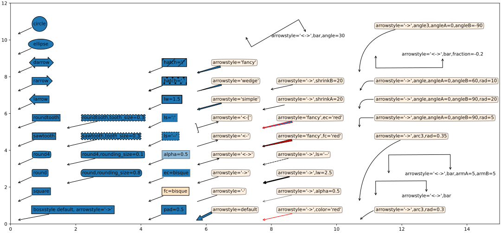<figcaption></figcaption></figure>
