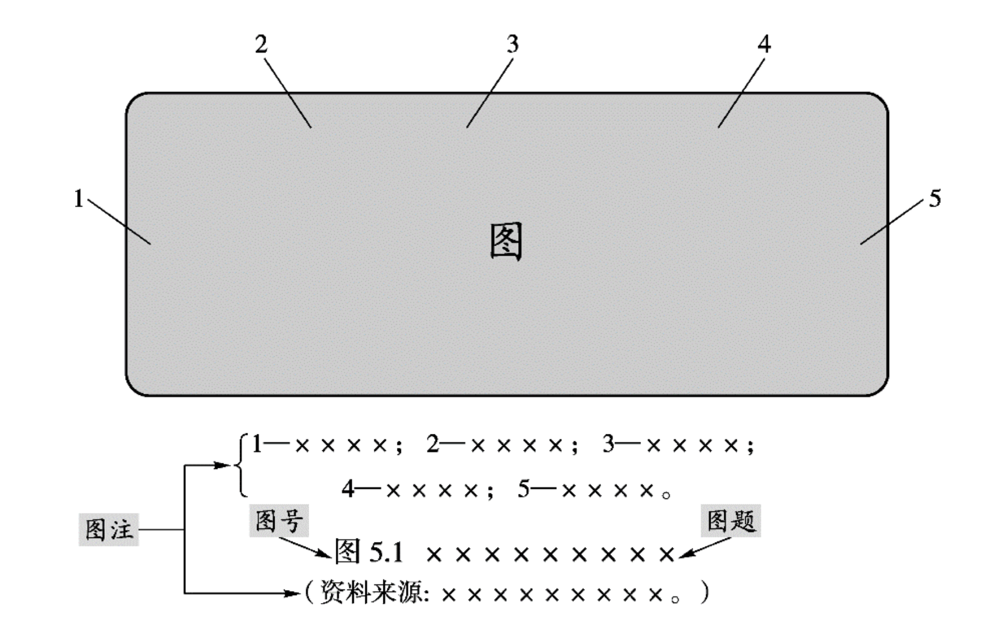
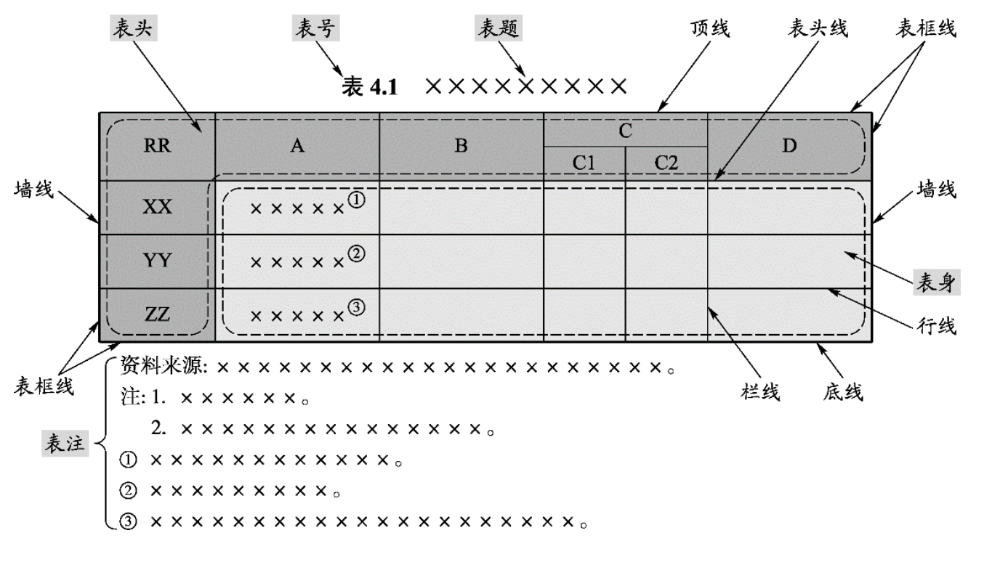
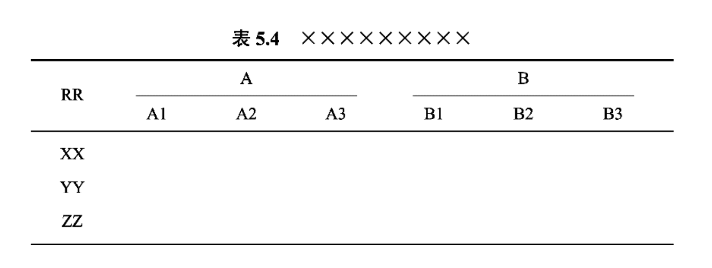

# 4.2 排版规范

## 出版物中插图的使用规范

* **插图**一般由图、图号（图序）、图题和图注四部分组成。

<figure><figcaption></figcaption></figure>

图题是图的名称。插图宜有图题。图题应置于图号后，与图号之间留一字空。<mark style="color:red;">题末不用点号。图题的长度一般不应超过图的宽度。</mark>图题较长需要转行时，应从意义相对完整的停顿处转行。图号和图题宜置于图的正下方。图号和图题字号应小于正文字号。

插图排版的关键是应合理安排插图在版面中的位置，不但要求版面美观，而

且要求便于阅读。插图应随文编排，排在第一次提及该图图号的正文之后，图和相应的正文应尽量靠近。插图不宜截断正文自然段，不应跨章节编排。如果版面无法调整时，可根据情况灵活处理，处理的原则是便于阅读。

插图由几个分图组成，在一个版面排不下时可转页接排。转页接排图可在首页排图号、图题，在转页接排图的各页上重复图号、图题（可选）并加“（续）”。

## 出版物中表格的使用规范

* **表格**由表号、表题、表头、表身、表注等要素组成。

<figure><figcaption></figcaption></figure>

表头和表身构成表格的主体，一般包含行和栏。表格中的横线称为行线，竖线称为栏线。表头与表身之间的线称为表头线。表格四周边线称为表框线，表框线包括顶线、底线和墙线。

表题是表格的名称。表格应有表题。表题应置于表号后，与表号之间留一字空，题末不用点号。表号和表题应置于表格顶线上方，居中或居左排。

表头是对表格各行和各列单元格内容进行概括和提示的栏目。表格应有表头。<mark style="color:red;">表头中不应使用斜线。</mark>表头包括纵表头（纵向排列的对表格各行单元格内容进行概括和提示的栏目）和横表头（横向排列的对表格各列单元格内容进行概括和提示的栏目）。<mark style="color:green;">表头可分为单层和多层，多层表头应体现层级关系。三线表的横表头有第二、 第三层级时，每个层次之间应加细横线分隔，细横线长短以显示清楚上下层的隶属关系为准。</mark>

<figure><figcaption></figcaption></figure>

**参考：**



## 中英文混排的使用规范

正文主体为中文，标点符号使用中文全角字符；正文主体为英文，标点符号使用英文半角字符。其中，中文顿号的形式为“、”；而英文无此标点。示例：

* grateful 这个词用得多好！句末使用中文叹号结尾
* 她说“That’s amazing!”不一定表示赞许。引号使用中文全角引号，叹号使用英文半角字符。
* 从那以后，他再也不说“Very well, sir.”。引号使用中文全角引号，逗号使用英文半角字符。
* 指示牌上 e、i 和 u 这三个字母印得模糊不清。老师把“He went to bed.”“He turned in early.” “He fell asleep.”等句子写在黑板上。中文句子内夹用两个或两个以上关系并列的英文字母、单词或词组时，中间宜使用中文顿号。标有引号的并列成分之间，顿号可以省略。
* 报道中是否删去了“The witness said, ‘Nobody came to help.’”？中文句子内夹用的英文句子内部如需用引号，使用英文单引号。
* 这本小册子是罗杰·威廉斯（Roger Williams, 1946 -）在 2014 年编写的。中文句子内夹用了用以注释、补充或说明的英文句子或语段，该英文句子或语段用中文圆括号标示。
* 中文破折号的形式为“——”，长度相当于两个汉字的长度；英文破折号的形式为“-”，长度相当于M。
* 中文省略号的形式为“......”（居中的六个点）；英文省略号的形式为“...”（底部三个点）。
* 安东尼·G. 普瑞斯顿。中文人名缩略后为中圆点“·”;英文人名缩略后为下脚点“.”。
* 中文句子内夹用普通英文单词或词组，无论其位于中文句子的开头、中间还是末尾，首字母一律 小写；中文句子内夹用完整的英文句子时，无论该英文句子是陈述句、疑问句还是感叹句，无论其位于中文句子中的什么位置，首单词的首字母均应保留其大写形式。
* 中文文本中夹用英文词句时，应根据所选用的中英文字体、字符间距以及排版的视觉效果决定英 文词句与中文文字之间是否留有空格间距。如留空格，应保证体例的统一。
* 中文句子内夹有英文书籍名、报刊名时，不应借用中文书名号，应以英文斜体表示。

**参考：**



## 科学和技术中使用的数学符号

**正体**

* 已有定义的已知函数，如 $$\rm{sin}$$、$$\rm{exp}$$、$$\rm{ln}$$、$$\Gamma$$ 等。
* 其值不变的数学常数和阿拉伯数字，如 $$\rm{\pi}=3.14$$、$$\rm{i}^2=-1$$、$$\rm{e}=2.718$$ 等。
* 物理单位使用正体，且与数字间具有一定的间隙。
* 变量角标只做区分的部分使用正体。

**斜体**

* 变量，例如 $$x, y$$ 等。
* 变动附标，例如 $$\sum_{i}x_{i}$$ 中的 $$i$$。
* 函数，例如 $$f, g$$ 等用斜体字母表示。
* 点 $$A$$、线段 $$AB$$ 及弧 $$CD$$ 用斜体字母表示。在特定场合中视为常数的参数（例如 $$a,b$$ 等）也用斜体字母表示。

**其他注意事项**

* 函数的自变量写在函数符号后的括号中，且函数符号与圆括号之间不留空隙。
* 函数的自变量写在函数符号后的圆括号中，且函数符号与圆括号之间不留空隙，例如 $$f(x)$$, $$\cos(\omega t+\varphi)$$。如果函数的符号由两个或更多的字母组成且自变量不含加、减、乘、点或斜杠等运算时，括于自变量的圆括号可以省略，这时在函数与自变量符号之间应留一空隙，例如 $$\text{ent}\ 2.4$$, $$\sin\ n\pi$$, $$\text{arcosh}\ 2A$$。
* 量值相乘表示面积、体积等时，每个量的单位应重复写出，如 $$40\ \text{m} \times 60\ \text{m}$$ 不应写作 $$40 \times 60\ \text{m}$$ 或 $$40 \times 60\ \text{m}^2$$；
* 单位相同的量值范围，前一个量的单位宜省略，如 $$1.5 \sim 3.6\ \text{mA}$$ 不必写作 $$1.5\ \text{mA} \sim 3.6\ \text{mA}$$，但 $$20\% \sim 30\%$$ 等例外，前一个量的单位不应省略；
* 单位相同的一组量值中，可只保留最末一个量值的单位，如 $$25\ ^\circ\text{C}$$；“$$\%$$”“$$‰$$” 是 $$1$$ 的分数单位符号，“$$\%$$”可用来替代 $$0.01$$ 或 $$10^{-2}$$。

**参考**：



## 一些符号的使用规范

### 括号

括号主要形式是圆括号“( )”，其他形式有方括号“\[ ]”、六角括号“〔 〕”和方头括号“【 】”等。

* 圆括号用于补充说明、表示次序等。
* 标示作者国籍或所属朝代时，可用方括号或六角括号。 如“：\[英] 赫胥黎《进化论与伦理学》”或“〔唐〕杜甫著”。
* 报刊标示电讯、报道的开头，可用方头括号。 如：【新华社南京消息】
* 标示公文发文字号中的发文年份时，标示被注释的词语时，可用六角括号。 如：国发〔2011〕3号文件；〔奇观〕奇伟的景象。

除科技书刊中的数学、逻辑公式外,所有括号（特别是同一形式的括号）应尽量避免套用。必须套用括号时,宜采用不同的括号形式配合使用。

### 连接号

连接号的形式有短横线/连字符“- (U+002D)”、一字线“一 (U+2014)”和浪纹线/全角波浪号“～ (U+FF5E)”三种。注意区分减号“− (U+2212)”

#### **短横线/连字符**

用于：化合物的名称或表格、插图的编号、连接号码，包括门牌号码、电话号码，以及用阿拉伯数字表示年月日、在复合名词中起连接作用等。如：

* 3-戊酮为无色液体，对眼及皮肤有强烈刺激性。
* 参见下页表 2-8、表 2-9。
* 安宁里东路 26 号院 3-2-11 室
* 联系电话：010-88842603
* 2011-02-15
* 吐鲁番-哈密盆地
* WZ-10 直升机具有复杂天气和夜间作战的能力。
* shuōshuō-xiàoxiào（说说笑笑）
* 盎格鲁 - 撒克逊人

#### **一字线**

标示相关项目（如时间、地域等）的起止。如：

* 沈括（1031—1095），宋朝人。
* 2011年2月3日—10日
* 北京—上海特别旅客快车

#### **浪纹线**

标示数值（而非时间，表示时间范围要使用一字线）范围（由阿拉伯数字或汉字数字构成）的起止。如：

* 25 ～ 30 g
* 第五～八课

浪纹线连接号用于标示数值范围时，在不引起歧义的情况下，前一数值附加符号或计量单位可省略。如：

* 5 公斤～100 公斤（正）
* 5～100 公斤（正）

### 约等符号

表达约等的是“波浪”等号。

≈ (U+2248 ≈ unicode 2248)

≃ (U+2243 ≃ unicode 2243)，≈ 和 = 的混合，也用于代表**渐近于**

≅ (U+2245 ≅ unicode 2245)，另一个 ≈ 和 = 的混合，有时用来代表同构、同余关系又或几何学的全等

\~ (U+007E \~ unicode 007e)，有时用来代表正比、和等价关系有关、几何学的相似，又或代表随机变数根据概率分布的分布情况。

≒ (U+2252 ≒ unicode 2252)，用于日本、韩国和台湾

**参考：**





## GB2312 和 GBK 的关系

* GB2312

1980 年，中国发布了第一个汉字编码标准，也即 GB2312 ，全称 《信息交换用汉字编码字符集·基本集》，通常简称 GB （“国标”汉语拼音首字母）， 共收录了 6763 个常用的汉字和字符，此标准于次年5月实施，它满足了日常 99% 汉字的使用需求

* GBK

由于有些汉字是在 GB2312 标准发布之后才简化的，还有一些人名、繁体字、日语和朝鲜语中的汉字也没有包括在内，所以，在 GB2312 的基础上添加了这部分字符，就形成了 GBK ，全称 《汉字内码扩展规范》，共收录了两万多个汉字和字符，它完全兼容 GB2312

GBK 于 1995 年发布，不过它只是 "技术规范指导性文件"，并不属于国家标准

* GB18030

GB18030 全称《信息技术 中文编码字符集》 ，共收录七万多个汉字和字符， 它在 GBK 的基础上增加了中日韩语中的汉字 和 少数名族的文字及字符，完全兼容 GB2312，基本兼容 GBK

GB18030 发布过两个版本，第一版于 2000 年发布，称为 GB18030-2000，第二版于 2005 年发布，称为 GB18030-2005

***

## 参考

* [Unicode 符号表](https://symbl.cc/cn/unicode-table/)
* [中文技术文档写作规范](https://zh-style-guide.readthedocs.io/zh-cn/latest/index.html)
* [Cmd Markdown｜MD 公式规范](https://www.zybuluo.com/codeep/note/163962)
