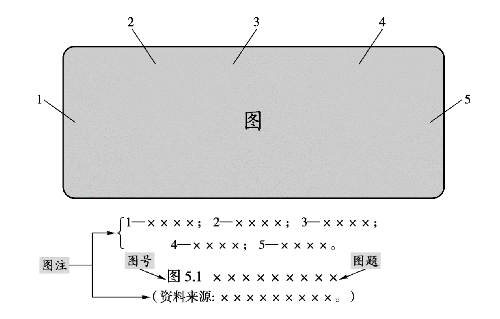
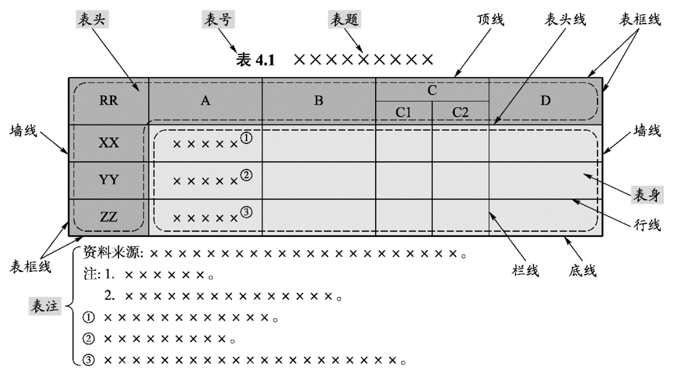
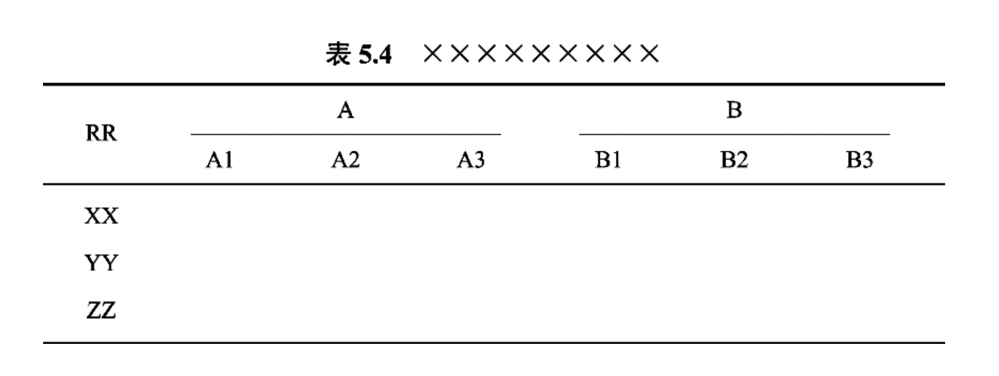

# 4.2 排版规范

## 符号使用规范

### 数学、物理符号

* **正体**
  * 已有定义的已知函数，如 $$\rm{sin}$$、$$\rm{exp}$$、$$\rm{ln}$$、$$\Gamma$$ 等。
  * 其值不变的数学常数和阿拉伯数字，如 $$\rm{\pi}=3.14$$、$$\rm{i}^2=-1$$、$$\rm{e}=2.718$$ 等。
  * 物理单位使用正体，且与数字间具有一定的间隙。
  * 变量角标只做区分的部分使用正体。
* **斜体**
  * 变量，例如 $$x, y$$ 等。
  * 变动附标，例如 $$\sum_{i}x_{i}$$ 中的 $$i$$。
  * 函数，例如 $$f, g$$ 等用斜体字母表示。
  * 点 $$A$$、线段 $$AB$$ 及弧 $$CD$$ 用斜体字母表示。在特定场合中视为常数的参数（如 $$a,b$$ 等）也用斜体字母表示。
* **其他**
  * 函数的自变量写在函数符号后的括号中，函数符号与圆括号之间不留空隙，例如 $$f(x)$$, $$\cos(\omega t+\varphi)$$。如果函数的符号由两个或更多的字母组成且自变量不含加、减、乘、点或斜杠等运算时，括于自变量的圆括号可以省略，这时在函数与自变量符号之间应留一空隙，例如 $$\text{ent}\ 2.4$$, $$\sin\ n\pi$$, $$\text{arcosh}\ 2A$$。
  * 量值相乘表示面积、体积等时，每个量的单位应重复写出，如 $$40\ \text{m} \times 60\ \text{m}$$ 不应写作 $$40 \times 60\ \text{m}$$ 或 $$40 \times 60\ \text{m}^2$$。
  * 单位相同的量值范围，前一个量的单位宜省略，如 $$1.5 \sim 3.6\ \text{mA}$$ 不必写作 $$1.5\ \text{mA} \sim 3.6\ \text{mA}$$，但 $$20\% \sim 30\%$$ 等例外，百分号不是单位。
  * 单位相同的一组量值中，可只保留最末一个量值的单位，如 $$15、25\ ^\circ\text{C}$$。
  * “$$\%$$” “$$‰$$” 是 $$1$$ 的分数单位符号，“$$\%$$” 可用来替代 $$0.01$$ 或 $$10^{-2}$$。
  * 【注】经纬度符号与阿拉伯数字之间不需要空格，如：羊八井国际宇宙线观测站的经纬度坐标是 $$90.522°\text{E},\ 30.102°\text{N}$$。

**参考**：



### 全角半角字符

全角和半角是字符在排版中<mark style="color:violet;">占位宽度</mark>的两种形态。全角字符长宽比为一比一的正方形，半角字符宽度为全角的一半，例如：

* 字母 “<mark style="background-color:$info;">Ｓ</mark>”（U+FF33，全角）和 “<mark style="background-color:$info;">S</mark>”（U+0053，半角）；
* 空格 “　”（U+3000，全角）“ ”（U+0020，半角）；
* 左括号 ”<mark style="background-color:$info;">（</mark>”（U+FF08，全角）“<mark style="background-color:$info;">(</mark>”（U+0028，半角）；
* 数字 “<mark style="background-color:$info;">１</mark>”（U+FF11，全角）“<mark style="background-color:$info;">1</mark>”（U+0031，半角）；
* 数学符号 “<mark style="background-color:$info;">＞</mark>”（U+FF1E，全角）“<mark style="background-color:$info;">></mark>”（U+003E，半角）。

大部分全角和半角的  Unicode 码位不同，也就是说它们是两个完全不同的字符。参见[半角字符与全角字符的比较](https://zh.wikipedia.org/wiki/%E5%85%A8%E5%BD%A2%E5%92%8C%E5%8D%8A%E5%BD%A2)。

**中文语境下应使用全角标点符号**，如：“<mark style="background-color:$info;">，</mark>“、”<mark style="background-color:$info;">。</mark>“，”<mark style="background-color:$info;">（）</mark>“，而不是 ”<mark style="background-color:$info;">,</mark>“、”<mark style="background-color:$info;">.</mark>“、”<mark style="background-color:$info;">()</mark>“ 等等。

#### 占位宽度

但某些字符也存在可以被字体渲染而改变<mark style="color:violet;">占位宽度</mark>的情况，其中最典型的就是弯引号 “ ”、‘ ’（U+201C / U+201D、U+2018 / U+2019），中西文弯引号共用 Unicode 码位，中西文字体它们都是半角，但在中文字体的渲染下，他们会占用全角的宽度。这就是在 Word 排版中，部分符号会被识别为西文字符而被格式化为新罗马字体的原因，这种情况通常需要用户手动修改或使用中文板式排版。

存在类似情况的字符有：

* 弯引号 “ ” 和 ‘ ’
* 中圆点 “·”
* 连字符 “-”
* 货币符号 “¥”
* <mark style="color:$info;">度 “°”，几乎不存在使用中文字体的表达的情况，常见于其他东亚字符。</mark>
* 排版符号 “§” 等等。

还有一些需要额外注意的字符，在中西文字体下，它们的格式有较大差异，如：

* 省略号 “……”：中文字体为六个局中圆点，西文字体为六个句号，且西文语境中省略用 “...” 表示。

**以上这些字符在中文语境下使用时，应使用中文字体。**

【注】在 Gitbook 中，为了界面的现代与统一，这些中西文共用 Unicode 的标点符号的渲染，均为半角，注意甄别。

### 括号

括号主要形式是圆括号 “()” 或 “（）”，其他形式有方括号 “\[ ]”、六角括号 “〔 〕” 和方头括号 “【 】” 等。

* 圆括号用于补充说明、表示次序等。
* 标示作者国籍或所属朝代时，可用方括号或六角括号。 如：“\[英] 赫胥黎《进化论与伦理学》”或“〔唐〕杜甫著”。
* 报刊标示电讯、报道的开头，可用方头括号。 如：【新华社南京消息】
* 标示公文发文字号中的发文年份时，标示被注释的词语时，可用六角括号。 如：国发〔2011〕3号文件；〔奇观〕奇伟的景象。

除科技书刊中的数学、逻辑公式外,所有括号（特别是同一形式的括号）应尽量**避免套用**。必须套用括号时,宜采用不同的括号形式配合使用。

### 连接号

<figure><figcaption></figcaption></figure>

#### -（U+002D）短横线/连字符/计算机负号

* 键盘键：-
* 用于：化合物的名称或表格、插图的编号、连接号码，包括门牌号码、电话号码，以及用阿拉伯数字表示年月日、在复合名词中起连接作用等。在代码运算中可以使用该符号表示负号或者减号。如：
  * 3-戊酮为无色液体，对眼及皮肤有强烈刺激性。
  * 参见下页表 2-8、表 2-9。
  * 安宁里东路 26 号院 3-2-11 室
  * 联系电话：010-88842603
  * 2011-02-15
  * 吐鲁番-哈密盆地
  * WZ-10 直升机具有复杂天气和夜间作战的能力。
  * shuōshuō-xiàoxiào（说说笑笑）
  * 盎格鲁 - 撒克逊人

#### −（U+2212）数学负号

#### –（U+2013）En Dash 连接号

* 键盘键：Option​ + -
* 宽度与字母 n 相同。用于表示英文语境下的数值范围。

#### —（U+2014）Em Dash 破折号（英文）/一字线

* 中文键盘键：Shift + -，再 Delete（两个Em Dash 为中文的破折号）
* 英文键盘键：Option + Shift + -
* 宽度与字母 m 相同。表示相关项目（如时间、地域等）的起止（也可使用浪纹线）。如：
  * 沈括（1031—1095），宋朝人。
  * 2011年2月3日—10日
  * 北京—上海特别旅客快车

#### ～（U+FF5E）浪纹线/全角波浪号

* 标示数值（而非时间，表示时间范围要使用一字线）范围（由阿拉伯数字或汉字数字构成）的起止。**中英文中的浪纹线为同一字符，中文语境下应该使用全角浪纹线**，如：
  * 25～30 g
  * 第五～八课
* 浪纹线连接号用于标示数值范围时，在不引起歧义的情况下，前一数值附加符号或计量单位可省略。如：
  * 5 公斤～100 公斤（正）
  * 5～100 公斤（正）

### 约等符号

≈（U+2248）表约等于。

≃（U+2243）≈ 和 = 的混合，也用于代表**渐近于**。

≅（U+2245）另一个 ≈ 和 = 的混合，有时用来代表同构、同余关系又或几何学的全等。

\~（U+007E）有时用来代表正比、和等价关系有关、几何学的相似，又或代表随机变数根据概率分布的分布情况。

≒（U+2252）用于日本、韩国和台湾。

**参考：**





## 中西文混排规范

* **中西文字符之间需要增加**[**空格**](4.2-pai-ban-gui-fan.md#chang-jian-kong-ge-de-zhong-lei)
  * 在 LeanCloud 上，数据存储是围绕 `AVObject` 进行的。
  * <mark style="color:$info;">「豆瓣FM」等产品名词，按照官方所定义的格式书写。</mark>
  * 【注】Word 默认勾选「自动调整中文和西文 / 阿拉伯数字的间距」选项，因此无需格外注意。
* **中文与数字之间需要增加空格**
  * 今天出去买菜花了 5000 元。
* **数字与西文单位之间需要增加空格，更多规范参见**[#shu-xue-wu-li-fu-hao](4.2-pai-ban-gui-fan.md#shu-xue-wu-li-fu-hao "mention")
  * 我家的光纤入屋宽带有 10 Gbps，SSD 一共有 20 TB
  * <mark style="color:$info;">度数／百分比不是单位，与数字之间不需要增加空格。</mark>
  * 【注】Word 中阿拉伯数字与西文单位之间需要手动增加一个 1/4 空格。
* **全角标点与其他字符之间不加空格**
  * 刚刚买了一部 iPhone，好开心！
* **不重复使用标点符号**
  * ~~德国队竟然战胜了巴西队！！！！！！！！~~
* **正确使用专有名词的缩写和大小写**
* **正文主体为中文，标点符号使用中文全角字符**
* **正文主体为英文，标点符号使用西文半角字符。**&#x4E2D;文顿号为  “、”；西文无此标点。示例：
  * grateful 这个词用得多好！<mark style="color:$warning;">句末使用中文叹号结尾。</mark>
  * 她说 “That’s amazing!” 不一定表示赞许。<mark style="color:$warning;">引号使用中文全角引号，叹号使用英文半角字符。</mark>
  * 从那以后，他再也不说 “Very well, sir.”。<mark style="color:$warning;">引号使用中文全角引号，逗号使用英文半角字符。</mark>
  * 指示牌上 e、i 和 u 这三个字母印得模糊不清。老师把 “He went to bed.” “He turned in early.” “He fell asleep.” 等句子写在黑板上。<mark style="color:$warning;">中文句子内夹用两个或两个以上关系并列的英文字母、单词或词组时，中间宜使用中文顿号。引号并列成分之间，顿号可以省略。</mark>
  * 报道中是否删去了 “The witness said, ‘Nobody came to help.’ ” ？<mark style="color:$warning;">中文句子内夹用的英文句子内部如需用引号，使用英文单引号。</mark>
  * 这本小册子是罗杰·威廉斯（Roger Williams, 1946 -）在 2014 年编写的。<mark style="color:$warning;">中文句子内夹用了用以注释、补充或说明的英文句子或语段，使用中文全角括号标示。</mark>
  * 中文省略号的形式为 “......”（居中的六个点）；英文省略号的形式为 “...”（底部三个点）。
  * 安东尼·G. 普瑞斯顿、尼格·买买提。<mark style="color:$warning;">中文（或翻译）人名间隔号使用全角中圆点；英文人名缩略后为下脚点 “.”。</mark>
  * 中文句子内夹用普通西文单词或词组，无论其位于中文句子的开头、中间还是末尾，首字母一律 小写；中文句子内夹用完整的英文句子时，无论该英文句子是陈述句、疑问句还是感叹句，无论其位于中文句子中的什么位置，首单词的首字母均应保留其大写形式。
  * <mark style="color:$warning;">中文句子内夹有英文书籍名、报刊名时，应以英文斜体表示，而不使用书名号 “《》”。</mark>

**参考：**



**【附】**

* **正确使用 “的、地、得”**
  * 的 + 名词（什么东西）。红红的苹果、可爱的小狗、我的书本、杭州的街道、蓝色的天空。
  * 地 + 动词（做什么动作）。开心地笑、飞快地跑、认真地写字、慢慢地走路、大声地说话。
  * 动词 / 形容词 + 得（怎么样）。跑得很快、笑得开心、长得好看、热得冒汗、累得不行、红得发紫。
* **正确使用大小写**
  * 大写：零、壹、贰、叁、肆、伍、陆、柒、捌、玖、拾、佰、仟、圆
  * 小写：〇、一、二、三、四、五、六、七、八、九、十、百、千、元

## 出版物中插图的使用规范

* **插图**一般由<mark style="color:violet;">图、图号（图序）、图题和图注</mark>四部分组成。

<figure><figcaption></figcaption></figure>

图题是图的名称。插图宜有图题并置于图号后，与图号之间间隔一个全角空格。<mark style="color:$danger;">题末不用句号。</mark>图题的长度一般不超过图的宽度，若图题较长应从意义相对完整的停顿处转行。

图号和图题宜置于图的正下方。图号和图题字号应小于正文字号。图号和图题之间使用一个[全角空格](4.2-pai-ban-gui-fan.md#chang-jian-kong-ge-de-zhong-lei)。

插图应随文编排，通常排在第一次提及该图图号的正文之后并尽量靠近。插图不宜截断正文自然段，不应跨章节编排。插图由几个分图组成、在一个版面排不下时可转页接排。转页接排图可在首页排图号、图题，在转页接排图的各页上重复图号、图题（可选）并加 “（续）”。

## 出版物中表格的使用规范

* **表格**由<mark style="color:violet;">表号、表题、表头、表身、表注</mark>等要素组成。

<figure><figcaption></figcaption></figure>

表头和表身构成表格的主体，表格中的横线称为行线，竖线称为栏线。表头与表身之间的线称为表头线。表格四周边线称为表框线，表框线包括顶线、底线和墙线。

**表题**是表格的名称，并置于表号后，与表号之间留一个全角空格，<mark style="color:$danger;">题末不用句号。</mark>表号和表题应置于表格顶线上方，居中或居左排。

表头是对表格各行和各列单元格内容进行概括和提示的栏目。<mark style="color:$danger;">表头中不应使用斜线。</mark>表头包括纵表头（纵向排列的对表格各行单元格内容进行概括和提示的栏目）和横表头（横向排列的对表格各列单元格内容进行概括和提示的栏目）。

表头可分为单层和多层，多层表头应体现层级关系。三线表的横表头有第二、 第三层级时，每个层次之间应加细横线分隔，细横线长短以显示清楚上下层的隶属关系为准。

<figure><figcaption></figcaption></figure>

**参考：**



## GB2312 和 GBK 的关系

* **GB2312**

1980 年，中国发布了第一个汉字编码标准，也即 GB2312 ，全称《信息交换用汉字编码字符集·基本集》，通常简称 GB （“国标” 汉语拼音首字母），共收录了 6763 个常用的汉字和字符，此标准于次年 5 月实施，它能够满足日常 99% 以上的汉字使用需求。

* **GBK**

由于有些汉字是在 GB2312 标准发布之后才简化的，还有一些人名、繁体字、日语和朝鲜语中的汉字也没有包括在内，所以，在 GB2312 的基础上添加了这部分字符，就形成了 GBK ，全称《汉字内码扩展规范》，共收录了两万多个汉字和字符，它完全兼容 GB2312。

GBK 于 1995 年发布，不过它只是 “技术规范指导性文件”，并不属于国家标准。

* **GB18030**

GB18030 全称《信息技术中文编码字符集》 ，共收录七万多个汉字和字符， 它在 GBK 的基础上增加了中日韩语中的汉字和少数名族的文字及字符，完全兼容 GB2312，基本兼容 GBK。

GB18030 发布过两个版本，第一版于 2000 年发布，称为 GB18030—2000，第二版于 2005 年发布，称为 GB18030—2005。

## 常见空格的种类

<table data-search="false"><thead><tr><th width="129">名称</th><th width="107">Unicode</th><th width="164">宽度</th><th>说明</th></tr></thead><tbody><tr><td><strong>标准空格</strong></td><td><code>U+0020</code></td><td>~1/4 em</td><td>键盘空格键，用于西文单词分隔。Word 显示为一个「·」。</td></tr><tr><td><strong>制表符</strong></td><td><code>U+0009</code></td><td>通常 4/8 字符</td><td>键盘 <strong>Tab 键</strong>，用于代码缩进或表格对齐。Word 显示为右箭头「→」。</td></tr><tr><td><strong>不间断空格</strong></td><td><code>U+00A0</code></td><td>同普通空格</td><td><strong>禁止换行</strong>。用于控制数字和单位、人名和头衔等不得换行，Word 显示为一个「°」。</td></tr><tr><td><strong>头发空格</strong></td><td><code>U+200A</code></td><td>1/24 em​</td><td>极细微调整，几乎不可见，用于字距微调。</td></tr><tr><td><strong>三分之一空格</strong>​</td><td><code>U+2004</code></td><td>1/3 em​</td><td>古籍排版，特殊对齐。</td></tr><tr><td><strong>四分之一空格</strong>​</td><td><code>U+2005</code></td><td>1/4 em​</td><td>类似普通空格，宽度更精确。</td></tr><tr><td><strong>六分之一空格</strong>​</td><td><code>U+2006</code></td><td>1/6 em​</td><td>标点符号专用。</td></tr><tr><td><strong>半宽空格</strong></td><td><code>U+2002</code></td><td>1/2 em​</td><td><strong>中文首行缩进</strong>。</td></tr><tr><td><strong>全宽空格</strong></td><td><code>U+2003</code></td><td>1 em​</td><td>一个汉字宽。</td></tr><tr><td><strong>中等数学空格</strong>​</td><td><code>U+205F</code></td><td>4/18 em​</td><td>数学表达式中的标准间距。</td></tr></tbody></table>

***

## 参考

* [Unicode 符号表](https://symbl.cc/cn/unicode-table/)
* [中文技术文档写作规范](https://zh-style-guide.readthedocs.io/zh-cn/latest/index.html)
* [Cmd Markdown｜MD 公式规范](https://www.zybuluo.com/codeep/note/163962)
