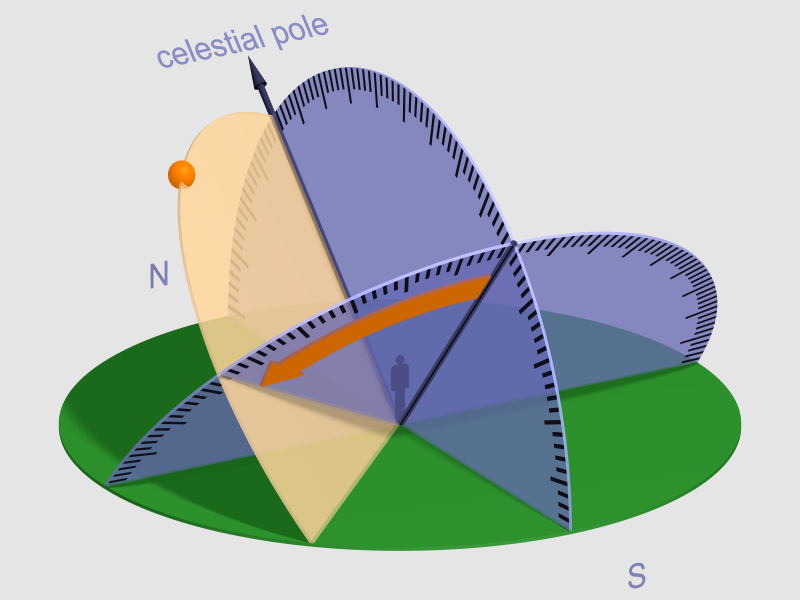
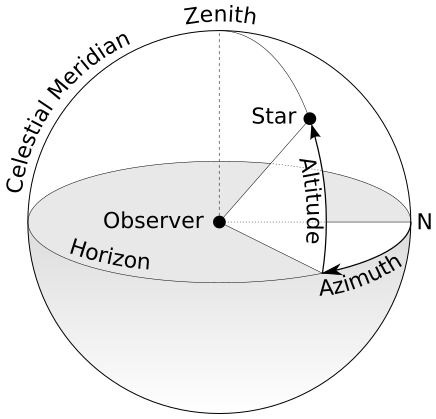
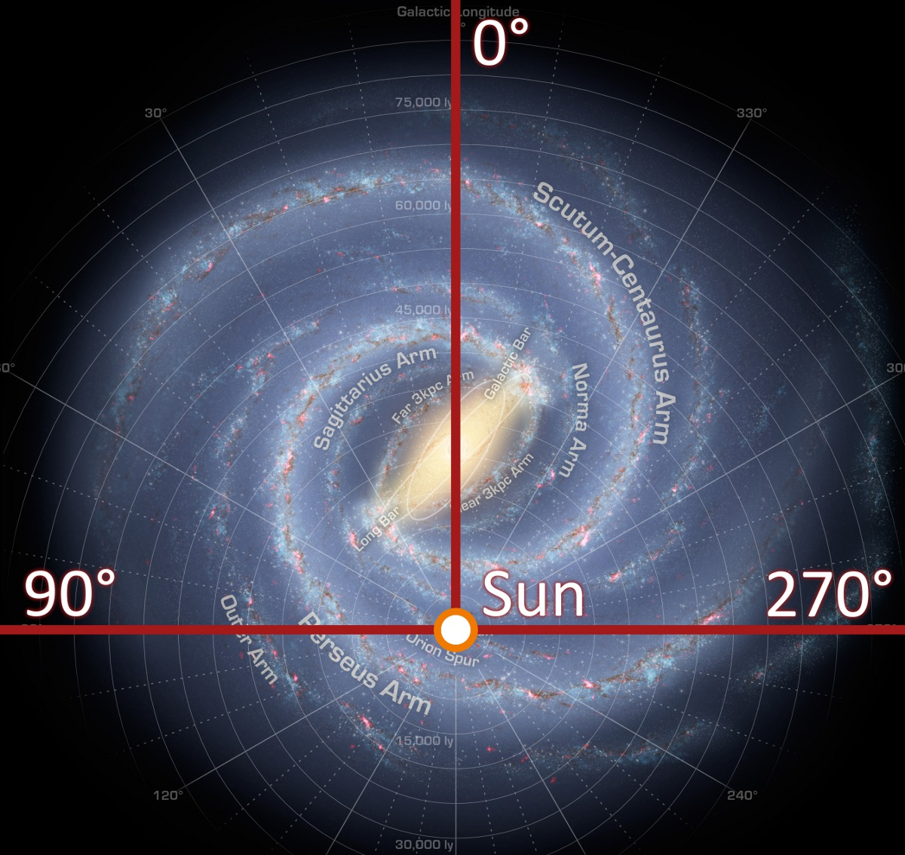

# 5.3 球面天文学

球面天文学也称为位置天文学，是天文学的一个分支，用于确定在任何一个日期和时间由地球上的任意地点所看见的物体在天球上的位置。

## 时间的概念

时间的重要无需多言。目前被接受的最广泛的关于时间的物理理论是爱因斯坦的相对论。即时间不能脱离宇宙及其事件的观察者而独立存在，时间是宇宙与其观察者之间的联系的一个方面。当然时间的本质是什么已经是极少数科学家、哲学家热心研究的课题，对于时间的实际应用，我们按常规理解就够了。

地球自转运动就是个相当不错的天然时钟。天体的东升西落，便被用来当作计时的工具，包括太阳和遥远的恒星（春分点），便诞生了太阳时和恒星时的概念。

### 太阳时

太阳时是一个地方的子午圈与太阳之间的时角。

* 时角（Hour Angle, H）：

即天体所处的子午圈和观察者所处的子午圈所形成的夹角；从观测者所处子午圈起向西（顺时针方向）测量，取值范围以小时为单位从0h - 24h， 每15° 为1h，（有时也可以用角度表示）。

一个天体的时角被定义为该天体的赤经与当地的恒星时的差值。 在天文学和天文航海中，时角是在赤道坐标系中用于给出天球上点的方向的坐标之一。 一个点的时角是两个平面之间的角度：一个平面包含地轴和天顶（子午面），另一个平面是穿过该点与极点（地轴）的球面大圆切圆所形成的平面（赤经圈）。

<figure><figcaption>
时角由<a href="https://zh.wikipedia.org/wiki/%E5%A4%A9%E8%B5%A4%E9%81%93">天赤道</a>平面上的橙色箭头指示。 箭头自天球天赤道的子午面至观测目标所在面的球面大圆处结束，该球面大圆也是赤经圈
</figcaption></figure>

### 太阳日

太阳连续两次经过上中天的时间间隔，称为真太阳日。日晷所表示的时间就是真太阳时。太阳时的基本单位是太阳日。根据开普勒第二定律，地球在轨道上做的是不等速运动，这样每天的真太阳日的长度便不断改变，非常不利于计算，于是又引入平太阳日的概念。&#x20;

平太阳日：天文学上由一个假定的太阳（平太阳）在天赤道上（而不是在黄赤道上）作等速运行，其速度等于运行在黄赤道上真太阳的平均速度，这个假想的平太阳连续两次上中天的时间间隔，叫做一个平太阳日，一个平太阳日是24小时。每个地方的平太阳时称为当地的当地时间。但是每一时刻，全世界的人的当地时并不统一，所以便有了时区的概念。

### 恒星时

恒星时是一个地方的子午圈与天球的春分点之间的时角。

* 春分点

春分和秋分都是中国二十四节气中的两个非常重要的节气，白昼和黑夜将会在这两天中平分，也就是说，白昼和黑夜的时间会各为12小时；在这两天中，太阳将会经过天赤道，也就是说太阳的赤纬将会是0°。在春分之后，太阳的赤纬会逐渐增加（直到夏至），北半球各地白昼开始长于黑夜；在秋分之后，太阳的赤纬会逐渐减少（直到冬至），北半球各地白昼将会短于黑夜。

在古希腊时期，春分和秋分会发生在白羊座和天秤座。由于岁差的原因，现在太阳经过天赤道的时间晚了大概一个月，也就是一个星座，所以现在太阳在春分和秋分时分别位于双鱼座和处女座。

### 恒星日

恒星日是地球真正的自转周期。恒星日目前大约是 23 小时 56 分 4.0916 秒，所以恒星日与太阳日的误差将近4分钟（3.9291884）也就是每一年会差一天。

由于地球的章动春分点在天球上并不固定，而是以 18.6 年的周期围绕着平均春分点摆动。

因此恒星时又分真恒星时和平恒星时。真恒星时是通过直接测量子午线与实际的春分点之间的时角获得的，平恒星时则忽略了地球的章动。真恒星时与平恒星时之间的差异最大可达约 0.4 秒。

### 协调世界时

协调世界时（Coordinated Universal Time, UTC）是包含闰秒机制的世界时间标准，其以原子时的秒长为基础，在时刻上尽量接近于格林威治标准时间（GMT，已废弃）。我们日常生活中使用的都是 UTC，北京时间是 UTC + 8。

### 原子时

定义一秒为铯-133原子基态两个超精细能级间跃迁辐射振荡 9192631770 周所持续的时间。

### 儒略时间

儒略日 (Julian day, JD) 是一种不用年月的长期纪日法, 简写为JD。使用儒略时间的好处就是可以无限延伸到未来，方便天文学家进行各种复杂的推演计算。

系统以公元前 4713（天文学上记为 -4712 年）年 1 月 1 日协调世界时中午 12 时开始, 每一天赋予了一个唯一的数字，向后连续计日。积累到现在，已经是一个很大的数字。例如 2000 年 1 月 1 日地球力学时 12 时的儒略日记法就是 JD2451545.0, 这是一个很重要的时刻, 特别记为 J2000.0。

由于儒略日数字位数太多, 国际天文学联合会于 1973 年采用简化儒略日 (MJD) , 其定义为 MJD=JD-2400000.5。例如 2012 年 08 月 21 日的简化儒略日 MJD = 56160。

### UNIX时间戳

这是基于 `UTC 1970.01.01 00:00:00` 到现在的总秒数/毫秒数，所以这个总秒数/毫秒数全世界都是一样的，也就是说 Unix 时间戳和时区无关，可以在两个不同时区的服务器执行代码来验证，得出的结果会是相同的。

## 第一赤道坐标系-时角坐标系

赤道坐标系是以天赤道（地球赤道平面延伸后与天球相交的大圆）为基本面并且以地球自转轴为基本轴的天球坐标系。可以简单的看作地球经纬度在天球的投影。第一赤道坐标系用两个参量描述天体在天球上的位置：

* 时角。
* 赤纬（Declination, Dec, δ），天体和地心的连线与赤道面的夹角（线面角） ，取值范围为 ±90°。+90° 为北天极，-90° 为南天极，如果天体位于北半球，那么其赤纬就是正数，相反，如果天体为于南半球，那么赤纬就是负数。

## 第二赤道坐标系 Ra-Dec

第二赤道坐标系是和时间、观察者的地理位置无关的赤道坐标系，所以是应用最为广泛的坐标系。第二赤道坐标系忽略春分点的移动，使用赤经赤纬描述天体在天球上的位置：

* 赤经（Right Ascension, Ra, α），从春分点开始向逆时针方向测量。
* 赤纬。

## 地平坐标系 Alt-Az

地平坐标系是一种以观测者为中心，以观测者所在的地平线为基础平面（地平圈）、以观测者正上方为天顶的坐标系。地平坐标系用两个夹角来定义一个天体位置的极座标：

* 高度角（Altitude, Alt）或仰角又称地平纬度，是天体和观测者所在地的地平线的夹角。高度的取值范围为±90°，当高度为正数时，天体位于地平圈以上，也就是可见的天体。与高度角互余的是天顶角（Zenith, Zen），指的是天体与天顶的夹角。
* 方位角（Azimuth, Az）<mark style="color:orange;">**一般是以正北方为 0° 起点**</mark>，顺时钟向东方测量。

<figure><figcaption>
地平坐标系示意图，灰色是因地球遮挡而无法被观测者观测的一半
</figcaption></figure>

与天顶相对的是天底，所有通过天顶和天底的大圆被称为地平经圈，与地平圈平行的圆称为地平纬圈，通过地球自转轴（北天极和南天极）的地平经圈被称作天球子午圈，天球子午圈和地平圈的相交点就被定义为地平坐标系中的北点和南点。

## 黄道坐标系

黄道坐标系是以黄道面为基本面并且以春分点为原点组成的天球坐标系。和第二赤道坐标系一样，黄道坐标系的坐标不随时间或者观察者的地理位置而变化。黄道坐标系用两个夹角来定义一个天体位置的极座标：

* 黄经：从春分点开始向逆时针方向测量（地球公转方向），取0°～360°。
* 黄纬：天体和太阳的连线与黄道面的夹角，取±90°，北正南负。

## 银道坐标系

银道坐标系，是以太阳为中心，并且以银河系明显排列群星的平面为基准的天球坐标系统，它的“赤道”是银河平面。

<figure><figcaption>
银道坐标系
</figcaption></figure>

## 坐标系转换

**参考：**

* [知乎｜天体坐标系 - 天文的第一课](https://zhuanlan.zhihu.com/p/396807910)

## 我们生活在 J2000.00 时代

因为岁差和章动的影响，在相当长的时间间隔下所做的观测，就必须注明所使用的特殊历元，为行星、恒星、星系等等的位置做记录。现在使用的历元是J2000.0分点

***

##
