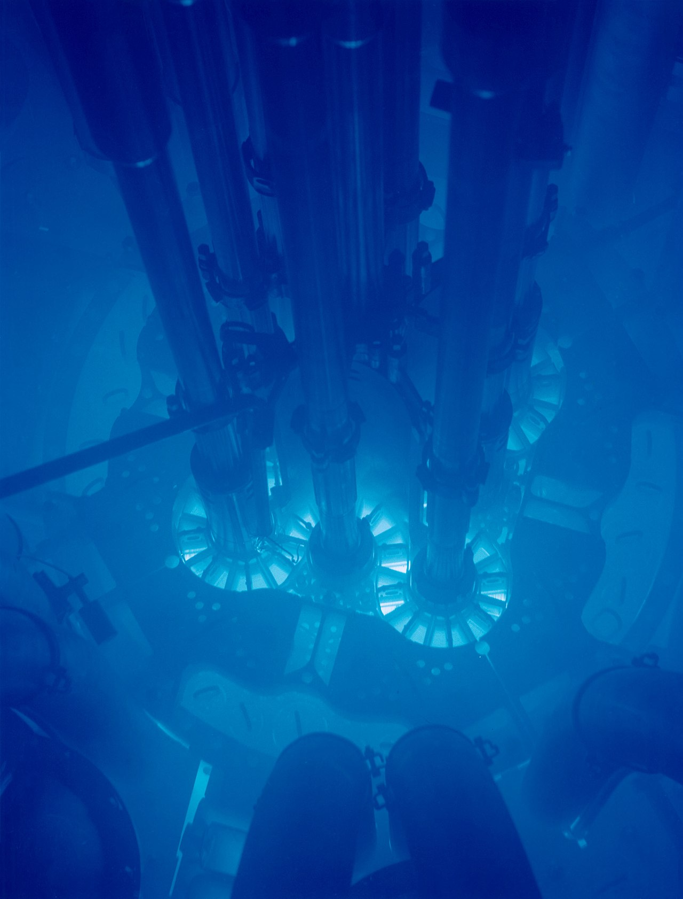
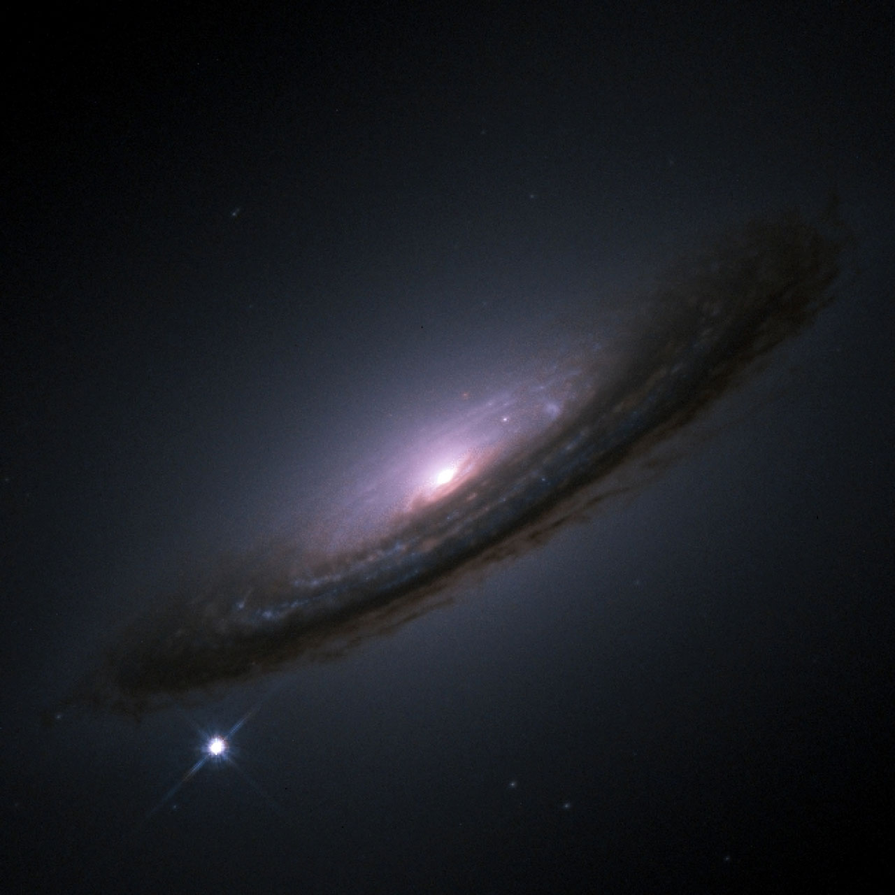

# 5.4 宇宙射线

## 宇宙射线

宇宙射线简称宇宙线（Cosmic Rays,CRs），是太阳系以外唯一的物质样本。自 1912 年赫斯的高空气球实验发现宇宙线以来，围绕其起源、加速、传播这三大基本问题，人类开始了长达 100 多年的探索。

宇宙中到处都是宇宙线，每秒钟每平方米的面积上约有 1000 个宇宙线粒子轰击到地球大气层上。它们都是电离后的原子核，其中有大约 90% 的质子、9% 的 α 粒子，还有其他更重的原子核。在缺少人造粒子加速器的年代，宇宙线为粒子物理与核物理研究提供了唯一的高能粒子源，包括但不限于发现了正电子、π介子、奇异粒子。

广义的宇宙射线包含光子、中微子和其他带电粒子。习惯上我们将这些带电粒子称为宇宙线，而将高能光子称作伽马射线。光子约占宇宙线总成分的 1%。

我国的宇宙线研究几乎与新中国同龄，想要了解这段波澜壮阔的历史，可以阅读马宇蒨所著的[《我国的宇宙线物理研究六十年》](https://wuli.iphy.ac.cn/en/article/pdf/preview/10.7693/wl20130103.pdf)

#### **宇宙线能谱**

宇宙线能谱反映了宇宙线的流强随能量的变化。在低能量（30 GeV以下）时，受太阳活动调制效应影响较大，即流强随太阳活动发生变化（太阳风强大时、宇宙线会被有效的阻止进入太阳邻域）；而高能量的宇宙线受调制效应不明显，能谱呈幂律谱的形式变化（说明宇宙线具有非热谱的性质，且高能粒子更难接收到）。其精细结构具有显著特征：

* 能量在 4 PeV 左右，能谱变软，谱指数由-2.7->-3.1，即“膝”区。
* 能量在 400 PeV 左右，能谱进一步变陡，谱指数由-3.1->-3.3，即“第二膝”。
* 能量在 10 EeV 左右，能谱又变平，谱指数由-3.3->-2.7，称为“踝”区。
* 能量在 60 EeV 附近，能谱发生截断，称为“GZK截断”。

目前对于膝区的成因解释有：银河系内的宇宙线加速源对加速的最高能量有限制；银河系磁场对高能粒子的约束失效；银河系附近的活动星系核贡献；太阳系附近的超新星遗迹（SNR）源的贡献；高能强子的相互作用产生新物理等。

#### 宇宙线起源

卫星试验、高空气球实验、地面大气簇射实验对膝区成分的测量存在差异，从逐个天体源直接研究来回答宇宙线基本问题称为直接而有效的手段，目前分为三大领域：伽马天文、高能中微子天文、极高宇宙线天文。伽马和中微子不带电在宇宙介质中传播不受磁场影响而与源位置高度关联（高能宇宙线径迹也几乎不受磁场影响，所超高能宇宙线探测也是研究宇宙线起源的重要手段），强子过程伴随中微子的产生，如果找到高能中微子源也就直接发现了宇宙线源的证据。

宇宙线及伽马射线的来源可能是超新星及其遗物、快速旋转的脉冲星及风云、活动星系核等，这些来源中，伽马射线的产生机制不同，如同步辐射、轫致辐射、逆康普顿辐射等。

#### 探测

在传播过程中，伽马光子虽然为中性子，但当光子能量较高的时候，伽马光子会与河外背景光碰撞产生正负电子对（EBL吸收），这样探测到的伽马流强就会低于源流强，所以在推算源的流强的时候要加上EBL修正。

由于能谱的幂律属性，越高能粒子越难探测到，在GeV能段，只需要气球或空间飞船搭载小型探测器便足矣区分GeV的宇宙线成分细节。

## 伽马射线

伽马射线（Gamma Rays,GRs）的本质是电磁波（习惯上将高能电磁波称为高能粒子、因为其粒子性更加明显，所以伽马射线是用能量而不是波长来表征，E=hν），电磁波能量越高频率越高。

**同步辐射（高能伽马暴光子的主要产生途径之一）**

是速度接近光速的带电粒子在磁场中沿弧形轨道运动时（受到径向的加速度），沿着偏转轨道切线方向发射连续谱的电磁波。由于是1947年在美国通用电气公司的一个电子同步加速器中意外发现的，因此命名为同步辐射。其主要有如下特征：

<mark style="color:orange;background-color:orange;">**同步辐射光的发散集中在一电子运动方向为中心的一个很窄的圆锥内，张角非常小，几乎是平行的。所以具有很好的准直性和反向性。**</mark>

<mark style="color:orange;background-color:orange;">**同步辐射同时是一个联系可调的波谱，从红外到几千KeV能量的硬X射线均有分布。可根据需要，利用单色器选取不同波长的单色光。具有宽波段和连续可调的特征。**</mark>

<mark style="color:orange;background-color:orange;">**而且同步辐射光源与亮度大，并具有脉冲性或时间结构：电子在环形轨道中的分布不是连续的。是一团一团的电子束做回旋运动。因此，同步光为脉冲光，具有时间结构。同时具有光源洁净无污染等特点。**</mark>

**曲率辐射**

在非常强的磁场中，相对论电子延弯曲磁力线运动时产生的辐射。

**韧致辐射**

指电子在与正离子发生碰撞而速度突然改变时发出的辐射。

**逆康普顿散射**

与康普顿效应相反，使低能光子通过与高能电子相互作用而使低能光子获得能量；

#### π0的衰变

高能状态下，质子可以通过与星际介质作用产生π0，π0很快衰变成两个高能γ。

#### 核相互作用和电子对湮灭

宇宙线粒子与星际介质发生核相互作用，是星际物质的核处于激发态，然后退激辐射出γ，这个过程的辐射一般低于100MeV；正负电子对在飞行过程中发生湮灭，也会辐射出γ，但上述过程对宇宙空间γ的贡献较小。

## 广延大气簇射 EAS

通过对宇宙线的研究，人们发现了很多新的粒子如缪子、K介子等。

### 电磁级联

高能伽马光子进入大气层之后在大气核子的库伦场中产生正负电子对，而 正负电子又在库伦场中通过轫致辐射产生新的光子。这个过程不断的重复使得 光子和正负电子的数目不断的增加，而其能量也相应的减小。由于在这个过程 中只有对产生和轫致辐射这两个相互作用，且都属于电磁相互作用，所以高能 伽马光子引发的级联又称为电磁级联。

次级粒子的能量随着级联的发展而不断的降低。当正负电子的平均能量降 到阈值 Ec=85MeV 之下时，电离能损成为了主要的能损过程而不再是轫致辐 射。所以当所有次级粒子的平均能量为Ec 时，级联发展到极大，而后由于电离 能损次级粒子的数目不断降低。

### 强子级联

### 切伦科夫辐射

介质中运动的电荷速度超过该介质中的光速时所发出的电磁辐射，表现为蓝色辉光。以发现者苏联物理学家切伦科夫的名字命名，并因此获得1958年的诺贝尔物理学奖。

根据狭义相对论，具有静质量的物体运动速度不能超过真空中的光速c，但光在介质中的传播速度是小于c的，例如在水中（折射率_n_≈1.33）光仅以0.75c的相速度在传播，故物体可以被加速到超过介电质中的光相速，加速的来源可以是核反应或者是粒子加速器，亦或者是强烈而复杂的天体活动。

契伦科夫辐射由带电粒子极化介质中的原子与分子并产生脉冲式连续频率谱的光，其主频与带电粒子的运动速度与质量大小有一定的关联性。

切伦科夫辐射角θ=c/nv。当折射率为n，带电粒子的运动速度为v，且v>c/n时，θ才能为大于0的值。也就是只有粒子在介质中的运动速度大于光在介质中的传递速度时，公式才能成立或才有意义。

<figure><figcaption>
爱达荷国家实验室ATR核心发出的切连科夫辐射辉光
</figcaption></figure>

## 宇宙线传播模型

## 宇宙线加速模型

### 加速机制

目前的加速模型主要有：脉冲星模型、超新星（SNR）爆发、活动星系核（AGN）-河外宇宙线源（人们普遍认为，10^17eV 的宇宙线应起源于银河系以外，这是因为银河系的体积和磁场有限，不能束缚 10^17eV 或者更高能量的粒子。近年来实验观测表明，活动星系核在其几个小时、几天甚至几个月的活跃时期有巨大的能量输出，成为了在众多的河外天体中最有可能产生能量 ＞10^17eV 宇宙的候选天体）

### GZK截断

GZK cut-off 由Greisen、Zatsepin、Kuzmin三人提出宇宙线能量超过10^20eV时，将与宇宙微波背景辐射光子（～0.001eV）相互作用，使高能宇宙射线碎裂并减少自身能量，故在理论上预言宇宙线流强将在10^20eV以上急剧减少。

## 点扩散函数 Point Spread Function

即点光源经过系统后形成的光斑。即便是没有像差的理想系统，由于孔径带来的衍射因素，点光源也不能汇聚成一个无穷小的点。

<figure><figcaption>
由具有负球面像差（顶部）、零球面像差（中心）和正球面像差（底部）的系统成像的点源。左侧的图像向内部散焦，右侧的图像向外部散焦。
</figcaption></figure>

在观测天文学中，由于点源（恒星或类星体）充足，PSF 的实验测定通常非常简单。PSF 的形式和来源可能会根据仪器及其使用环境的不同而有很大差异。

对于射电望远镜和衍射极限空间望远镜，PSF 中的主要项可以从傅里叶域中孔径的配置推断出来。实际上，复杂光学系统中的各个组件可能会贡献多个项。PSF 的完整描述还包括探测器中光（或光电子）的扩散，以及航天器或望远镜中的 跟踪误差。

对于地面光学望远镜来说，大气湍流（称为大气视宁）对 PSF 的贡献占主导地位。在高分辨率地基成像中，经常发现 PSF 随图像中的位置而变化（这种效应称为各向异性）。在地基自适应光学系统中，PSF 是系统孔径与剩余未校正大气项的组合。

## 恒星生命的结束

### 超新星

超新星（Supernova）是一些恒星在演化末期时经历的一种剧烈爆炸。这种爆炸过程经常能够照亮其所在的整个星系，并可能持续几周至几个月甚至几年才会逐渐衰减。超新星暴发

一颗超新星所释放的辐射能量可以与太阳在其一生中辐射能量的总和相当。恒星通过爆炸可以将其大部分甚至几乎所有物质以接近十分之一光速的速度向外抛散，并向周围的星际物质辐射激波。这种激波会导致一个由膨胀的气体和尘埃构成的壳状结构形成，这被称作超新星遗迹。超新星是星系引力波潜在的强大来源。初级宇宙射线中很大一部分是来自于超新星。

超新星的耀眼爆发足以使人肉眼可见。东汉中平二年乙丑（185年12月7日），中国天文学家观测到超新星185，这是人类有史记录以来发现的第一颗超新星。

超新星爆炸后所遗留的星际物质与高[质量](https://zh.wikipedia.org/wiki/%E5%8E%9F%E5%AD%90%E9%87%8F)的[化学元素](https://zh.wikipedia.org/wiki/%E5%8C%96%E5%AD%B8%E5%85%83%E7%B4%A0)使宇宙充满各种不同的物质[\[9\]](https://zh.wikipedia.org/wiki/%E8%B6%85%E6%96%B0%E6%98%9F#cite\_note-9)。此外，来自超新星向外膨胀的激波可以触发新恒星的形成[\[10\]](https://zh.wikipedia.org/wiki/%E8%B6%85%E6%96%B0%E6%98%9F#cite\_note-aaa128-10)[\[11\]](https://zh.wikipedia.org/wiki/%E8%B6%85%E6%96%B0%E6%98%9F#cite\_note-11)[\[12\]](https://zh.wikipedia.org/wiki/%E8%B6%85%E6%96%B0%E6%98%9F#cite\_note-12)[\[13\]](https://zh.wikipedia.org/wiki/%E8%B6%85%E6%96%B0%E6%98%9F#cite\_note-13)。

[中微子](https://zh.wikipedia.org/wiki/%E5%BE%AE%E4%B8%AD%E5%AD%90)是一种[微粒](https://zh.wikipedia.org/wiki/%E6%AC%A1%E5%8E%9F%E5%AD%90%E7%B2%92%E5%AD%90)，在超新星爆炸时会大量产生[\[40\]](https://zh.wikipedia.org/wiki/%E8%B6%85%E6%96%B0%E6%98%9F#cite\_note-40)，并且它们不会被星系盘的星际气体和尘埃明显的吸收。

名字是由前缀字_SN_接续发现的年份和一或二个英文字母组成。每年最初的26颗依序使用从_A_到_Z_的字母，之后始用小写的字母：_aa_、_ab_，依序排列。例如，SN 2003C，是2003年发现的第三颗超新星[\[47\]](https://zh.wikipedia.org/wiki/%E8%B6%85%E6%96%B0%E6%98%9F#cite\_note-47)。2005年发现的最后一颗超新星SN 2005nc，是2005年的第367颗[\[nb 1\]](https://zh.wikipedia.org/wiki/%E8%B6%85%E6%96%B0%E6%98%9F#cite\_note-48)。

### 新星

新星是一种白矮星，常由伴星提供物质，吸积在其表面发生剧烈爆炸，原本很暗难以被发现，突然的爆发使其增亮，被误认为是新产生的恒星，因此而得名。

只要伴星能继续的供应氢在白矮星的表面吸积，一颗白矮星就能反复的爆发成为新星，例如[蛇夫座 RS](https://zh.wikipedia.org/wiki/%E8%9B%87%E5%A4%AB%E5%BA%A7\_RS)，就是一颗已经知道有过6次爆发记录的新星（分别在1893、1933、1958、1967、1985和2006年）。再发新星是罕见的。

新星不是[Ia超新星](https://zh.wikipedia.org/wiki/Ia%E8%B6%85%E6%96%B0%E6%98%9F)。

### 星风

星风（Stellar Wind）是恒星表面发出的物质流，是恒星质量流失的一种途径，也是塑造恒星周围环境的途径之一。星风在所有恒星中普遍存在，由太阳发出的星风通常称为太阳风。星风的强度与恒星的质量呈正相关，对于太阳这样的中小质量恒星的演化过程来说，星风造成的质量损失可以忽略不计。而对于大质量恒星，如沃尔夫-拉叶星，星风造成的质量损失率很大，在其一生中质量会发生明显的变化，星风对其演化过程具有很重要的影响。

### 超新星遗迹

超新星遗迹（Supernova remnant,SNR）是超新星爆发时抛出的物质在向外膨胀的过程中与星际介质相互作用而形成的延展天体，形状有云状、壳状等，差异很大。

### 星云

星云（源自[拉丁文](https://zh.wikipedia.org/wiki/%E6%8B%89%E4%B8%81%E6%96%87)的：nebulae、nebulæ或nebulas，意思就是“云”[\[1\]](https://zh.wikipedia.org/wiki/%E6%98%9F%E4%BA%91#cite\_note-1)）是[宇宙尘](https://zh.wikipedia.org/wiki/%E5%AE%87%E5%AE%99%E5%A1%B5)、[氢](https://zh.wikipedia.org/wiki/%E6%B0%AB)气、[氦](https://zh.wikipedia.org/wiki/%E6%B0%A6)气和其他[等离子体](https://zh.wikipedia.org/wiki/%E7%AD%89%E9%9B%A2%E5%AD%90%E9%AB%94)聚集的[星际云](https://zh.wikipedia.org/wiki/%E6%98%9F%E9%9A%9B%E9%9B%B2)。星云通常也是孕育并形成恒星的区域，例如[鹰星云](https://zh.wikipedia.org/wiki/%E9%B7%B9%E6%98%9F%E9%9B%B2)，这个星云刻画出[NASA](https://zh.wikipedia.org/wiki/NASA)最著名的影像，即[创生之柱](https://zh.wikipedia.org/wiki/%E5%89%B5%E7%94%9F%E4%B9%8B%E6%9F%B1)。在这个区域形成的气体、尘埃和其他材料挤在一起，聚集了巨大的质量，这吸引了更多的质量，最后大到足以形成[恒星](https://zh.wikipedia.org/wiki/%E6%81%86%E6%98%9F)。剩余的材料还可以形成[行星](https://zh.wikipedia.org/wiki/%E8%A1%8C%E6%98%9F)和[行星系](https://zh.wikipedia.org/wiki/%E8%A1%8C%E6%98%9F%E7%B3%BB)的其它天体。

大质量恒星抵达生命的终点时会成为[超新星](https://zh.wikipedia.org/wiki/%E8%B6%85%E6%96%B0%E6%98%9F)。当在核心的[核聚变](https://zh.wikipedia.org/wiki/%E6%A0%B8%E8%9E%8D%E5%90%88)停止，恒星会坍缩。坠入内部的气体不是从核心被强烈的反弹就是获得大量的能量，因而导致恒星爆炸性的向外扩展[\[15\]](https://zh.wikipedia.org/wiki/%E6%98%9F%E4%BA%91#cite\_note-shu1982-16)。膨胀的气壳形成[超新星残骸](https://zh.wikipedia.org/wiki/%E8%B6%85%E6%96%B0%E6%98%9F%E6%AE%98%E9%AA%B8)，一种特别的[弥漫星云](https://zh.wikipedia.org/wiki/%E5%BC%A5%E6%BC%AB%E6%98%9F%E4%BA%91)[\[15\]](https://zh.wikipedia.org/wiki/%E6%98%9F%E4%BA%91#cite\_note-shu1982-16)。虽然有许多可见光和[X射线](https://zh.wikipedia.org/wiki/X%E5%B0%84%E7%B7%9A)辐射源自超新星残骸电离的气体，但大量的[电波](https://zh.wikipedia.org/wiki/%E9%9B%BB%E6%B3%A2)发射是来自被称为[同步辐射](https://zh.wikipedia.org/wiki/%E5%90%8C%E6%AD%A5%E8%BC%BB%E5%B0%84)的非热辐射[\[15\]](https://zh.wikipedia.org/wiki/%E6%98%9F%E4%BA%91#cite\_note-shu1982-16)。这种辐射源自高速[电子](https://zh.wikipedia.org/wiki/%E9%9B%BB%E5%AD%90)在[磁场](https://zh.wikipedia.org/wiki/%E7%A3%81%E5%A0%B4)内的振荡。

<figure><figcaption>
鹰星云的部分-创生之柱
</figcaption></figure>

### 脉冲星风云

脉冲星风云（pulsar wind nebula，缩写为PWN，

是由[超新星残骸](https://zh.wikipedia.org/wiki/%E8%B6%85%E6%96%B0%E6%98%9F%E6%AE%98%E9%AA%B8)中心的[脉冲星](https://zh.wikipedia.org/wiki/%E8%84%88%E8%A1%9D%E6%98%9F)产生的脉冲星风提供动力，在其壳体内发现的星云。这种星云是在1976年发现的，当时在超新星残骸中心附近的[无线电波](https://zh.wikipedia.org/wiki/%E7%84%A1%E7%B7%9A%E9%9B%BB%E6%B3%A2)出现衰减的现象[\[1\]](https://zh.wikipedia.org/wiki/%E8%84%89%E5%86%B2%E6%98%9F%E9%A3%8E%E4%BA%91#cite\_note-Weiler1978-1)。之后，它们被发现是[X射线](https://zh.wikipedia.org/wiki/X%E5%B0%84%E7%B7%9A)辐射源[\[2\]](https://zh.wikipedia.org/wiki/%E8%84%89%E5%86%B2%E6%98%9F%E9%A3%8E%E4%BA%91#cite\_note-SafiHarb2012-2)，并且可能是[伽玛射线](https://zh.wikipedia.org/wiki/%E4%BC%BD%E7%91%AA%E5%B0%84%E7%B7%9A)源[\[3\]](https://zh.wikipedia.org/wiki/%E8%84%89%E5%86%B2%E6%98%9F%E9%A3%8E%E4%BA%91#cite\_note-Guetta2003-3)。

随着脉冲星风云年龄的老化，超新星残骸的星云消散和消失。在时间的推移中，脉冲星风云的行为可能会改变，成为围绕着毫秒电波脉冲星，或更老更慢的旋转脉冲星遗迹的星云[\[6\]](https://zh.wikipedia.org/wiki/%E8%84%89%E5%86%B2%E6%98%9F%E9%A3%8E%E4%BA%91#cite\_note-Stappers2003-6)。估计脉冲星风云可以持续15,000年，

<figure><figcaption>
<a href="https://zh.wikipedia.org/wiki/%E8%9F%B9%E7%8B%80%E6%98%9F%E9%9B%B2">蟹状星云</a>的内部。中心部分显示脉冲风星云，中心的偏红色星是<a href="https://zh.wikipedia.org/wiki/%E8%9F%B9%E7%8A%B6%E6%98%9F%E4%BA%91%E8%84%89%E5%86%B2%E6%98%9F">蟹状星云脉冲星</a>。合成影像的可见光是<a href="https://zh.wikipedia.org/wiki/%E5%93%88%E4%BC%AF%E5%A4%AA%E7%A9%BA%E6%9C%9B%E9%81%A0%E9%8F%A1">哈伯太空望远镜</a>的资料（红色），X射线的资料来自<a href="https://zh.wikipedia.org/wiki/%E9%92%B1%E5%BE%B7%E6%8B%89X%E5%B0%84%E7%BA%BF%E5%A4%A9%E6%96%87%E5%8F%B0">钱卓拉</a>（蓝色）。
</figcaption></figure>

<figure><figcaption>
超新星遗迹-蟹状星云
</figcaption></figure>

### 超新星的点火-Ia型和IIa型

超新星可以由两种方式触发：突然重新点燃[核聚变](https://zh.wikipedia.org/wiki/%E6%A0%B8%E8%9E%8D%E5%90%88)之能量的[简并恒星](https://zh.wikipedia.org/wiki/%E7%B7%BB%E5%AF%86%E6%98%9F)（I型超新星），或是大质量恒星核心的[重力塌陷](https://zh.wikipedia.org/wiki/%E5%BC%95%E5%8A%9B%E5%9D%8D%E7%BC%A9)（II型超新星）。在第一种情况下，一颗简并的[白矮星](https://zh.wikipedia.org/wiki/%E7%99%BD%E7%9F%AE%E6%98%9F)可以通过吸积从[伴星](https://zh.wikipedia.org/wiki/%E8%81%AF%E6%98%9F)累积到足够的质量，或是吸积或是合并，提高核心的温度，之后[点燃](https://zh.wikipedia.org/wiki/%E7%A2%B3%E5%BC%95%E7%88%86)[碳融合](https://zh.wikipedia.org/wiki/%E7%A2%B3%E7%87%83%E7%87%92%E9%81%8E%E7%A8%8B)，并触发[失控](https://zh.wikipedia.org/wiki/%E7%86%B1%E5%A4%B1%E6%8E%A7)的核聚变，将恒星完全摧毁。在第二种情况，[大质量恒星](https://zh.wikipedia.org/wiki/%E6%81%86%E6%98%9F%E6%BC%94%E5%8C%96#%E5%A4%A7%E8%B3%AA%E9%87%8F%E6%81%86%E6%98%9F)的核心可能遭受突然的[引力坍缩](https://zh.wikipedia.org/wiki/%E5%BC%95%E5%8A%9B%E5%9D%8D%E7%BC%A9)，释放[引力势能](https://zh.wikipedia.org/wiki/%E5%BC%95%E5%8A%9B%E5%8A%BF%E8%83%BD)，可以产生一次超新星爆炸。

天文学家使用它们的[光度曲线](https://zh.wikipedia.org/wiki/%E5%85%89%E5%BA%A6%E6%9B%B2%E7%B7%9A)和不同的化学元素在光谱中造成的[吸收线](https://zh.wikipedia.org/wiki/%E8%AD%9C%E7%B7%9A)，以这一部分进行分类和试图了解超新星。分类的第一个依据是是否存在由[氢](https://zh.wikipedia.org/wiki/%E6%B0%AB)造成的吸收线。如果一颗超新星的光谱中包含氢的谱线（在可见光部分的谱线是[巴耳末系](https://zh.wikipedia.org/wiki/%E5%B7%B4%E8%80%B3%E6%9C%AB%E7%B3%BB)），它就属于II型超新星；否则就是I型超新星。且每个可再细分。

<figure><figcaption>
SN 1994D（左下方的亮点）是在星系<a href="https://zh.wikipedia.org/wiki/NGC_4526">NGC 4526</a>的一颗<a href="https://zh.wikipedia.org/wiki/Ia%E8%B6%85%E6%96%B0%E6%98%9F">Ia超新星</a>。
</figcaption></figure>

###

## 著名的天体

### 人马座A\*

### 蟹状星云

### 杰敏卡

