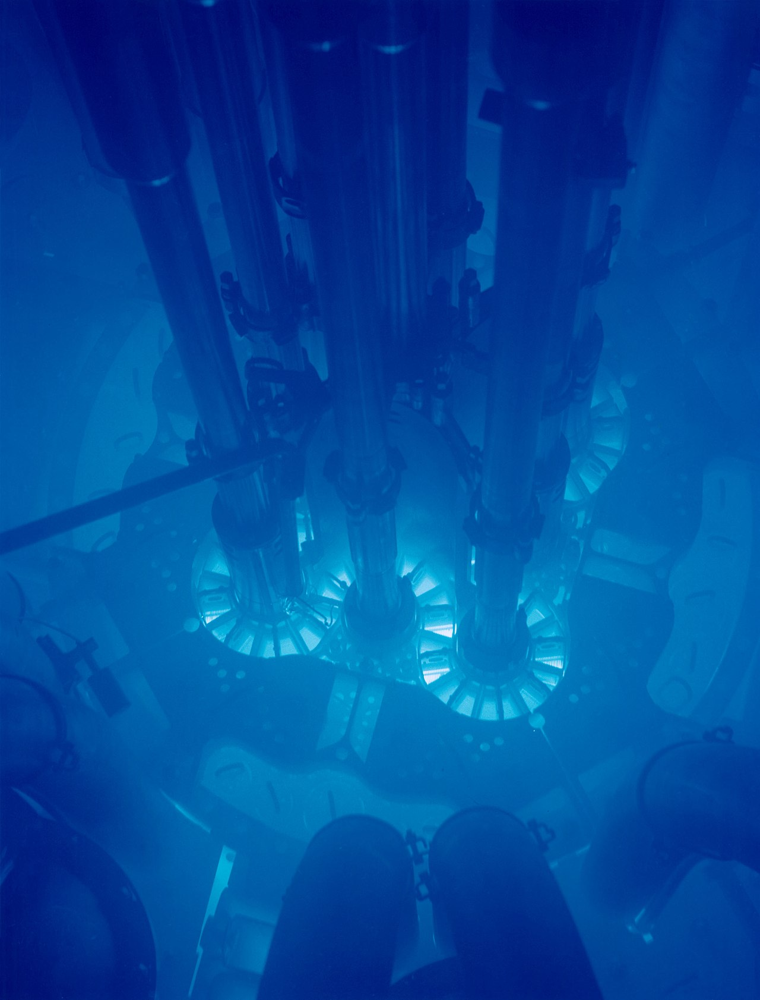

# 5.6 宇宙射线

## 宇宙射线

宇宙射线简称宇宙线（Cosmic Rays, CRs），是太阳系以外唯一的物质样本。自 1912 年赫斯的高空气球实验发现宇宙线以来，围绕其起源、加速、传播这三大基本问题，人类开始了长达 100 多年的探索。

宇宙中到处都是宇宙线，每秒钟每平方米的面积上约有 1000 个宇宙线粒子轰击到地球大气层上。它们都是电离后的原子核，其中有大约 90% 的质子、9% 的 α 粒子，还有其他更重的原子核。在缺少人造粒子加速器的年代，宇宙线为粒子物理与核物理研究提供了唯一的高能粒子源，包括但不限于发现了正电子、π介子、奇异粒子。

宇宙射线包含光子、中微子和其他带电粒子。因历史原因，我们将那些带电粒子称为宇宙线，而将高能光子称作伽马射线。光子占宇宙线总成分的不到 1%。如无特殊说明，宇宙线一词仅指那些带电粒子。

在宇宙空间的粒子源加速出来的宇宙线粒子一般称为“初级宇宙线”（Primary Cosmic Rays），而初级宇宙线与星际空间的物质（星际气体、尘埃、星云等）相互作用产生的粒子成为次级宇宙线（Secondary Cosmic Rays）。由于我们的实验多是地面观测试验，宇宙线在进入大气层的过程中要发生大气簇射，探测器探测到的其实是簇射的次级粒子。所以，我们将初级宇宙线和次级宇宙线合称为“原初宇宙线”，也就是能够到达地球大气层的宇宙线粒子。

我国的宇宙线研究几乎与新中国同龄，详细参见马宇蒨所著的[《我国的宇宙线物理研究六十年》](https://wuli.iphy.ac.cn/en/article/pdf/preview/10.7693/wl20130103.pdf)

### **宇宙线能谱**

宇宙线能谱反映了宇宙线的流强随能量的变化。在低能量（30 GeV以下）时，受太阳活动调制效应影响较大，即流强随太阳活动发生变化（太阳风强大时、宇宙线会被有效的阻止进入太阳邻域）；而高能量的宇宙线受调制效应不明显，能谱呈幂律谱的形式变化（说明宇宙线具有非热谱的性质，且高能粒子更难接收到）。其精细结构具有显著特征：

* 能量在 4 PeV 左右，能谱变软，谱指数由-2.7->-3.1，即“膝”区。
* 能量在 400 PeV 左右，能谱进一步变陡，谱指数由-3.1->-3.3，即“第二膝”。
* 能量在 10 EeV 左右，能谱又变平，谱指数由-3.3->-2.7，称为“踝”区。
* 能量在 60 EeV 附近，能谱发生截断，称为“GZK截断”。

目前对于膝区的成因解释有：银河系内的宇宙线加速源对加速的最高能量有限制；银河系磁场对高能粒子的约束失效；银河系附近的活动星系核贡献；太阳系附近的超新星遗迹（SNR）源的贡献；高能强子的相互作用产生新物理等。

### 宇宙线起源

卫星试验、高空气球实验、地面大气簇射实验对膝区成分的测量存在差异，从逐个天体源直接研究来回答宇宙线基本问题称为直接而有效的手段，目前分为三大领域：伽马天文、高能中微子天文、极高宇宙线天文。<mark style="color:orange;">**伽马和中微子因不带电在宇宙介质中传播而不受磁场影响，所以伽马源和中微子源与宇宙线源位置高度关联（高能宇宙线径迹也几乎不受磁场影响，所超高能宇宙线探测也是研究宇宙线起源的重要手段）。高能伽马射线可以是轻子起源，也可以是强子起源，如果发现强子起源的伽马射线，也就间接发现了宇宙线源。强子过程也伴随中微子的产生（轻子较少产生中微子），如果找到高能中微子源也就直接发现了宇宙线源。**</mark>

宇宙线及伽马射线的来源可能是超新星及其遗物、快速旋转的脉冲星及风云、活动星系核等，这些来源中，伽马射线的产生机制不同，如同步辐射、轫致辐射、逆康普顿辐射等。

### 宇宙线加速

#### 加速机制

目前的加速模型主要有：脉冲星模型、超新星（SNR）爆发、活动星系核（AGN）-河外宇宙线源（人们普遍认为，10^17 eV 的宇宙线应起源于银河系以外，这是因为银河系的体积和磁场有限，不能束缚 10^17 eV 或者更高能量的粒子。近年来实验观测表明，活动星系核在其几个小时、几天甚至几个月的活跃时期有巨大的能量输出，成为了在众多的河外天体中最有可能产生能量 ＞10^17 eV 宇宙的候选天体）。

### 宇宙线传播

宇宙线在星际空间（银河系）传播时主要包括扩散、对流、漂移三个过程。在太阳系内也类似，这主要是因为传播过程受到复杂的星际磁场的作用。

* 箱漏模型：
*

### 宇宙线截断

**GZK截断：**&#x47;ZK cut-off 由Greisen、Zatsepin、Kuzmin三人提出宇宙线能量超过10^20 eV时，将与宇宙微波背景辐射光子（～0.001 eV）相互作用，使高能宇宙射线碎裂并减少自身能量，故在理论上预言宇宙线流强将在10^20 eV以上急剧减少。

### 宇宙线探测

在传播过程中，伽马光子虽然为中性子，但当光子能量较高的时候，伽马光子会与河外背景光碰撞产生正负电子对（EBL吸收），这样探测到的伽马流强就会低于源流强，所以在推算源的流强的时候要加上EBL修正。

由于能谱的幂律属性，越高能粒子越难探测到，在GeV能段，只需要气球或空间飞船搭载小型探测器便足矣区分GeV的宇宙线成分细节。

### 宇宙线各向异性

宇宙线的各向异性的观测有助于获取宇宙线起源及传播的重要信息，对宇宙线的起源及传播理论的确立起关键的作用。

### 宇宙线地磁效应/纬度效应

从外层空间来到地球的原初宇宙线是各向同性的，而且多带正电，由于受地球磁场的影响， 在同一纬度，从西边入射的正粒子（由于截止刚度较小）比从东边入射的正粒子多 。在地磁两极区，从低能到高能粒子均能沿磁力线进入地球，但在低纬地区， 只有能量较高的粒子才能克服地磁场影响进入地球。这就造成了在地表宇宙线通量的东西和南北效应。

#### 磁刚度

$$p_0$$是粒子的动量，磁刚度表作$$B \rho=p_0 / e$$，$$e$$是单粒子的电荷。符号惯例上认为磁刚度$$B \rho$$是正值。刚度越大的粒子越不容易受到地磁场的作用而偏转。

## 伽马射线

伽马射线（Gamma Rays, GRs）的本质是电磁波（习惯上将高能电磁波称为高能粒子、因为其粒子性更加明显，所以伽马射线是用能量而不是波长来表征，E=hν），电磁波能量越高频率越高。

**同步辐射（高能伽马暴光子的主要产生途径之一）**

是速度接近光速的带电粒子在磁场中沿弧形轨道运动时（受到径向的加速度），沿着偏转轨道切线方向发射连续谱的电磁波。由于是1947年在美国通用电气公司的一个电子同步加速器中意外发现的，因此命名为同步辐射。其主要有如下特征：

<mark style="color:orange;background-color:orange;">**同步辐射光的发散集中在一电子运动方向为中心的一个很窄的圆锥内，张角非常小，几乎是平行的。所以具有很好的准直性和反向性。**</mark>

<mark style="color:orange;background-color:orange;">**同步辐射同时是一个联系可调的波谱，从红外到几千KeV能量的硬X射线均有分布。可根据需要，利用单色器选取不同波长的单色光。具有宽波段和连续可调的特征。**</mark>

<mark style="color:orange;background-color:orange;">**而且同步辐射光源与亮度大，并具有脉冲性或时间结构：电子在环形轨道中的分布不是连续的。是一团一团的电子束做回旋运动。因此，同步光为脉冲光，具有时间结构。同时具有光源洁净无污染等特点。**</mark>

**曲率辐射**

在非常强的磁场中，相对论电子延弯曲磁力线运动时产生的辐射。

**韧致辐射**

指电子在与正离子发生碰撞而速度突然改变时发出的辐射。

**逆康普顿散射**

与康普顿效应相反，使低能光子通过与高能电子相互作用而使低能光子获得能量；

#### π0的衰变

高能状态下，质子可以通过与星际介质作用产生π0，π0很快衰变成两个高能γ。

#### 核相互作用和电子对湮灭

宇宙线粒子与星际介质发生核相互作用，是星际物质的核处于激发态，然后退激辐射出γ，这个过程的辐射一般低于100 MeV；正负电子对在飞行过程中发生湮灭，也会辐射出γ，但上述过程对宇宙空间γ的贡献较小。

## 中微子

强子过程会产生高能中微子，轻子过程则匮乏中微子，如果能够找到高能中微子源，也就是找到了宇宙线源。 中微子是弱相互作用粒子，与物质发生相互作用的截面极小，如要捕获中微子则需要庞大的探测介质，这些庞大的探测介质非人力能为，通常取自天然，如南极冰盖（美国的冰立方（ice cube）实验）、海水（欧洲的水立方 KM3 计划）、山体（中国的 CRTNT计划）等。中微子天文学是一个新兴的领域，在未来十年该领域有望得到蓬勃发展。

## 广延大气簇射

Extensive Air Shower, EAS

通过对宇宙线的研究，人们发现了很多新的粒子如缪子、K介子等。

### 电磁级联

高能伽马光子进入大气层之后在大气核子的库伦场中产生正负电子对，而 正负电子又在库伦场中通过轫致辐射产生新的光子。这个过程不断的重复使得 光子和正负电子的数目不断的增加，而其能量也相应的减小。由于在这个过程 中只有对产生和轫致辐射这两个相互作用，且都属于电磁相互作用，所以高能 伽马光子引发的级联又称为电磁级联。

次级粒子的能量随着级联的发展而不断的降低。当正负电子的平均能量降 到阈值 Ec=85 MeV 之下时，电离能损成为了主要的能损过程而不再是轫致辐 射。所以当所有次级粒子的平均能量为Ec 时，级联发展到极大，而后由于电离能损次级粒子的数目不断降低。

### 强子级联

### 切伦科夫辐射

带电粒子在透明介质中的运动速度超过该介质中的光速时所发出的电磁辐射称作切伦科夫辐射（Cherenkov radiation），表现为蓝色辉光。以发现者苏联物理学家切伦科夫的名字命名，他本人因此获得1958年的诺贝尔物理学奖。对这种特殊辐射形式敏感的装置，称为切伦科夫探测器。

根据狭义相对论，具有静质量的物体运动速度不能超过真空中的光速c，但光在介质中的传播速度是小于c的，例如在水中（折射&#x7387;_&#x6E;_≈1.33）光仅以0.75c的相速度在传播，故物体可以被加速到超过介电质中的光相速，加速的来源可以是核反应或者是粒子加速器，亦或者是强烈而复杂的天体活动。

契伦科夫辐射由带电粒子极化介质中的原子与分子并产生脉冲式连续频率谱的光，其主频与带电粒子的运动速度与质量大小有一定的关联性。

切伦科夫辐射角θ=c/nv。当折射率为n，带电粒子的运动速度为v，且v>c/n时，θ才能为大于0的值。也就是只有粒子在介质中的运动速度大于光在介质中的传递速度时，公式才能成立或才有意义。

<figure><figcaption>
爱达荷国家实验室ATR核心发出的切连科夫辐射辉光
</figcaption></figure>

## 点扩散函数

即点光源经过系统后形成的光斑称作点扩散函数（Point Spread Function, PSF）。即便是没有像差的理想系统，由于孔径带来的衍射因素，点光源也不能汇聚成一个无穷小的点。

<figure><figcaption>
由具有负球面像差（顶部）、零球面像差（中心）和正球面像差（底部）的系统成像的点源。左侧的图像向内部散焦，右侧的图像向外部散焦。
</figcaption></figure>

在观测天文学中，由于点源（恒星或类星体）充足，PSF 的实验测定通常非常简单。PSF 的形式和来源可能会根据仪器及其使用环境的不同而有很大差异。

对于射电望远镜和衍射极限空间望远镜，PSF 中的主要项可以从傅里叶域中孔径的配置推断出来。实际上，复杂光学系统中的各个组件可能会贡献多个项。PSF 的完整描述还包括探测器中光（或光电子）的扩散，以及航天器或望远镜中的 跟踪误差。

对于地面光学望远镜来说，大气湍流（称为大气视宁）对 PSF 的贡献占主导地位。在高分辨率地基成像中，经常发现 PSF 随图像中的位置而变化（这种效应称为各向异性）。在地基自适应光学系统中，PSF 是系统孔径与剩余未校正大气项的组合。

## 辐射源人马座A\*, Sgr A\*

人马座A\*是位于银河系中心的超大质量黑洞，是个明亮的射电源，大约每11分钟自转一圈。

因低温的星际尘埃散布在地球视线的方向上，所以无法利用可见光、紫外线或软X射线等波段进行研究，能研究银心的电磁波是γ射线、硬X射线、红外线、次微米波和无线电波等波段。气体（物质）被加速进入黑洞时，可能会在周围形成环绕的吸积盘，释放出来的就是无线电波源的能量。

2022 年 5 月 12 日，事件视界望远镜发布了（拍摄于 2017 年）人马座A\*的黑洞照片。

## 蟹状星云

参见 5.2 天文学章节：


[5.2-tian-wen-xue.md](5.2-tian-wen-xue.md)


## 杰敏卡

杰敏卡（Geminga）是一个距离地球只有 800 光年的 γ射线和 X射线脉冲星源。大约 30 万年前的爆炸使其仅保留如今的核心。人们一度认为，这次的爆炸是造成太阳系附近星际介质密度如此之低的原因，这个低密度区域被称为局部气泡。[参考](https://www.britannica.com/place/Geminga)

***

## 参考

何会海.宇宙线研究进展评述与展望\[J].物理,2013,42(01):33-39.

