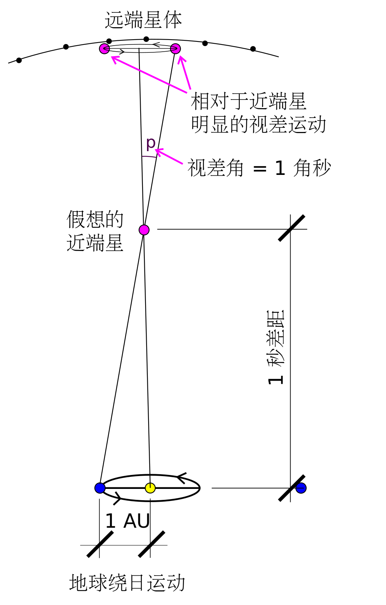
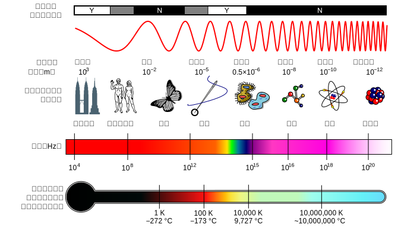
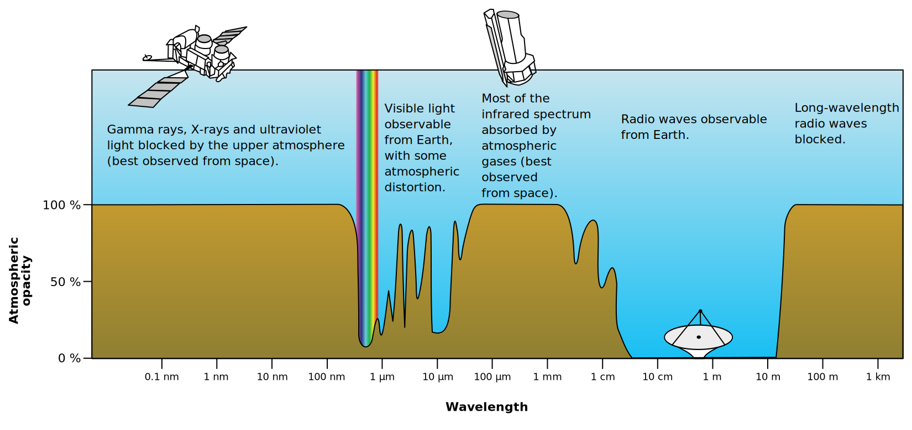
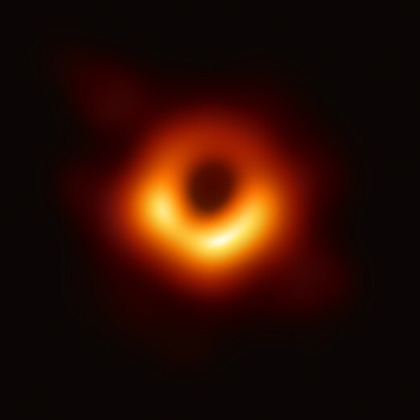

# 4.1 天文学概论

## 天文学长度单位

### 天文单位 AU

以地球与太阳的平均距离定义为1天文单位，1AU。2012年8月，天文学家以无记名投票的方式，把天文单位固定为149,597,870,700米。新的天文单位以米来定义，而米的定义来源于真空中的光速，也就是说，天文单位现在不再与地球与太阳的实际距离挂钩，而且也不再受时间变化的影响。

太阳至银河系中心的距离，大约是1.7×10^9 AU。

### 秒差距 PC

秒差距的定义为1天文单位的对角为1角秒时的距离（太阳/地球距离假想星的距离）。2015年时被重新定义为一个精确值：648000/π天文单位。

<figure><figcaption>
非等比例绘制
</figcaption></figure>

离太阳最近的恒星比邻星，距离大约为1.3秒差距（4.2光年）。绝大多数位于距太阳500秒差距(1630光年)内的恒星，可以在夜空中以肉眼看见。秒差距适用于银河系内的短距离表述，但在描述宇宙大尺度的用途上，会将其加上词头来应用，如千秒差距（kpc）表示银河系内与周围物体的距离。

银河系的直径在 150,000—180,000光年（46—55千秒差距）之间，太阳系位于距离银河中心约 27,000 光年（8.3 kpc）的半径处。1秒差距≈206264.8天文单位≈3.0857×10^16米≈3.26光年。

### **红移 Redshift**

**红移（Redshift）**是指电磁辐射由于某种原因导致波长增加、频率降低的现象。分为：

* **多普勒红移：**因相对运动导致的红移，由多普勒效应引起的。
* **重力红移：**根据广义相对论，光从重力场中发射出来也会发生红移。这种红移称为重力红移。

**宇宙学红移：**20世纪初，美国天文学家维斯托·斯里弗发现，观测到的绝大多数星系的光谱线存在红移现象。这是由于宇宙空间在膨胀，使天体发出的光波被拉长，谱线因此“变红”，这称为宇宙学红移，并由此得到哈伯定律。20世纪60年代发现了一类具有极高红移值的天体：类星体，成为近代天文学中非常活跃的研究领域。**天文学红移习惯使用无量纲的数量**_**z**_**来表示。**在宇宙学研究中，哈勃-勒梅特定律成为宇宙膨胀理论的基础，以方程表示$$v=H_{0}D$$，其中，$$v$$是由红移现象测得的星系远离速率，$$H_0$$是哈勃常数，$$D$$是星系与观察者之间的距离。

<figure><figcaption>
右侧为遥远的星系在可见光波段的光谱，与图左侧太阳的光谱比较，可以看见谱线朝红色的方向移动，即波长增加（频率降低）
</figcaption></figure>

## 电磁波与宇宙图景

电磁波并不神秘，它是在空间中以波动形式传播的电磁场，具有波粒二象性。

通常任何温度在绝对零度（-273.15℃）之上的物质或粒子都能够向外界辐射出电磁波，只是人眼只能感知到频率很窄的电磁波，被称之为可见光。

早在19世纪，麦克斯韦就从理论上预言了电磁波的存在，认为光也是一种电磁波、电磁波的速度与光速相同。1888年，德国物理学家赫兹通过实验证实了麦克斯韦的预言。因为这些成就，赫兹（Hz）被用作国际单位制下频率的单位名称。

频率就是电磁波在单位时间内完成周期振动的次数。根据量子力学，电磁波的波长不能无限短，因此电磁波的频率必然就存在一个上限值。这个极短的长度被叫做普朗克长度，其大小约为1.6x10^-35米。光子的能量用公式E=hv（其中，h为普朗克常数，数值大小为6.6×10^-34js；v为光子的频率）计算。当光子的频率达到上限时，该光子的能量约为1.2×10^10焦耳。能量和质量存在联系，根据质能方程E=mc^2，该光子的能量所对应的质量约为0.00013克。

<figure><figcaption>
电磁波谱
</figcaption></figure>

宇宙中天体发出的无线电波撞击地球的发现完全是偶然的。

#### 射电

1933年，⻉尔实验室的无线电工程师卡尔·扬斯基受命寻找一种无法解释的嘶嘶声的来源，这种嘶嘶声有时会干扰横跨大⻄洋的无线电信息传输。扬斯基发现，虽然这些噪音中的一些来自地球上的来源，比如附近的雷暴，但有一种信号，他的实验天线不断地接收到，似乎来自我们今天所知的银河系中心，也就是人⻢座α\*黑洞所在的区域。此后不久，对射电宇宙的系统探索开始了。

英国格林威治皇家天文台的天文学家AffeliaWibisono说，自那以后，天文学家们发现无线电波是由自旋电子发射的，并且从各种有能力使这些电子自旋的环境中发射出来。“通常，当你探测到无线电波时，你看到的是电子在磁场中运动，”Wibisono说。“但电离气体也可以发射无线电波。”

#### 红外线

红外光擅⻓很多事情。由于它能够穿透尘埃和气体，红外光揭示了恒星形成的厚厚的尘埃和气体云内部发生的事情。在这些云中间出现的恒星还不够热，无法发出可⻅光，但足够热，可以被红外传感器探测到。有了JWST这样的先进技术，天文学家可以观察到只比绝对零度高几度的物质，即零下459.67华氏度(零下273.15华氏度)的温度，原子的运动停止了。

#### 可见光

自17世纪早期的第一批望远镜问世以来，光学天文学取得了巨大的⻜跃。21世纪的光学望远镜增强了人眼超乎想象的自然能力，仍然是天文学研究的支柱。

哈勃太空望远镜是无可争议的光学天文学之王。位于智利的欧洲南方天文台(ESO)运行的甚大望远镜(VLT)是地球上最先进的光学望远镜之一。

#### 紫外线

紫外线被地球大气层中的臭氧层吸收，这对生活在地球上的生物是有益的(因为众所周知，这些波⻓会导致组织损伤和癌症)。然而，对于天文学来说，紫外线穿透大气层的能力有限，这意味着用于研究它的望远镜需要在太空轨道上运行。

<figure><figcaption>
地球大气层对于不同频率电磁辐射的不透明度图
</figcaption></figure>

伟大的哈勃望远镜是世界上主要的紫外线观测者之一，紫外光比可⻅光波⻓更短，携带的能量更高，它为天文学家指明了发生在年轻恒星和年轻恒星形成星系中的热的高能过程。在双星系统中相互环绕的大质量恒星也会发出紫外线，像木星这样的巨大气体行星上的强大极光也会发出紫外线。

#### X射线

X射线来自宇宙中最热的地方，包括黑洞和中子星的吸积盘，那里的物质以极高的速度旋转。星系团中充满星系间空间的高温等离子体也会发射X射线，包括太阳在内的恒星也是如此。

天文学家最近发现彗星可以发射x射线，而木星除了紫外线极光之外，也会产生x射线的极光。

美国宇航局的钱德拉x射线天文台是目前的旗舰x射线望远镜。自1999年以来，钱德拉在太空中沿着椭圆轨道绕地球运行，距离地球表面83000英里(133000公里)，在那里没有残留的大气层阻碍x射线的观察。钱德拉在轨道上运行了20多年，拍摄到了星系中心超大质􏰀黑洞射出的物质射流，甚至还追踪到了星系团中星系碰撞时暗物质与正常物质的分离。

#### 伽⻢射线

伽⻢射线是能量最高的辐射类型。就像x射线一样，它们来自宇宙中极端高温和高能的过程，比如超新星爆炸和黑洞的吸积。伽⻢射线比x射线穿透物质的能力更强，在地球上的核爆炸中也会产生伽⻢射线，在雷暴和放射性衰变中也会产生少量的伽⻢射线。像太阳这样的恒星偶尔也会以太阳耀斑的形式产生伽⻢射线闪光。

就像许多其他类型的天文学一样，伽⻢射线天文学是偶然出现的。20世纪60年代，美国军用卫星在寻找苏联核武器试验的迹象时，发现了令人费解的高能伽⻢射线闪光。这些伽⻢射线暴持续的时间从几秒到几分钟不等，正如人们所知，它们有规律地来自宇宙的各个⻆落。

直到20世纪90年代，天文学家才弄清楚，这些爆发来自巨大的爆炸，这标志着大质􏰀恒星死亡时新黑洞的诞生。较短类型的伽⻢射线爆发是由被称为中子星的超高密度恒星残骸碰撞产生的。

伽⻢射线暴向天文学家指出了这样一个事实：宇宙的某个地方刚刚发生了一场灾难性的事件。通过测量爆发的强度，天文学家可以了解事件的强度和距离。然而，他们随后需要使用其他类型的望远镜来搜索闪光的来源。当他们设法定位到天空中爆发的区域时，他们就可以在电磁波谱的其他部分观察该区域，以更深入地了解所涉及的过程。

&#x20;

## 视星等 apparent magnitude,_m_

最早由古希腊天文学家喜帕恰斯制定，他把自己编制的星表中的1022颗恒星按照亮度划分为6个等级，即1等星到6等星。**1850年英国天文学家普森发现1等星要比6等星亮100倍。根据这个关系，星等被量化。重新定义后的星等，每级之间亮度则相差2.512倍**，1勒克司（亮度单位）的视星等为-13.98。

但1到6的星等并不能描述当时发现的所有天体的亮度，天文学家延展本来的等级──引入“负星等”概念。这样整个视星等体系一直沿用至今。除了太阳之外最亮的恒星天狼星为−1.45，太阳为−26.7，满月为−12.8。现在地面上最大的望远镜可看到24等星，而哈勃望远镜则可以看到30等星。

<mark style="color:orange;">**因为视星等是人们从地球上观察星体亮度的度量，它实际上只相当于光学中的照度；因为不同恒星与地球的距离不同，所以视星等并不能指示出恒星本身的发光强度。**</mark>**例如巴纳德星（9.54等）距离地球仅6光年，却无法被肉眼所见。**

此外，宇宙中大量的星际尘埃也会影响到星星的视星等。由于尘埃的遮蔽，一些明亮的星星在可见光上将变得十分暗淡。而一些逐渐接近地球的恒星将会显著变亮。

## 绝对星等 Absolute magnitude, _M_

在天文学上，绝对星等是指把天体放在指定的距离时（10秒差距）天体所呈现出的视星等（Apparent magnitude, _m_）。此方法可把天体的光度在不受距离的影响下，作出客观的比较。

在定义其绝对星等时，必须指定要测量哪一类型的电磁辐射。如果**按其释出的能量计算，其结果会称为辐射热强度**。**星等值越低，代表天体越亮。绝对星等和视星等，可以通过视差（距离）换算。由于距离较远的原因，许多恒星的绝对星等要比其视星等低（亮）很多；而有些恒星由于距离我们较近的原因，其绝对星等会变大（暗）很多。**

## 光度 luminosity

光度是辐射电磁功率（光）的绝对度量，即发光物体随时间发出的辐射功率。在天文学中，光度是恒星、星系或其他天体在单位时间内发出电磁能量的总量。光度经常与亮度（luminance）弄混。亮度是光源在给定方向上单位面积单位立体角内所发出的的光通量，单位是尼特。

光度是物体每单位时间内辐射出的总能量，即辐射通量，在国际单位制是瓦特（Watt），在厘米克秒制中是“尔格/秒”，天文学常以太阳光度来表示$$L_{{\bigodot }}$$，也就是以太阳的辐射通量为一个单位来表示。太阳的光度是3.846E26瓦特。

## **光与相对论**

[**光速不变原理**](https://zhuanlan.zhihu.com/p/36892415?utm\_id=0)

## 暴胀理论与大爆炸理论

大爆炸的概念是物理学家用来解释宇宙形成的理论。

### 奥伯斯佯谬

德国天文学家奥伯斯于1823年提出：若宇宙是稳恒态而且无限的，则晚上应该是光亮而不是黑暗的（均匀分布的恒星发射出来的光子经过足够长时间都会到达地球）。漆黑一片的夜空印证了宇宙并非稳恒态的，是大爆炸理论的证据之一。奥伯斯佯谬有两种解释：1.宇宙的年龄是有限的；2.红移现象。而后者是最重要的效应。

大爆炸最初提出来的时候，是一个非常粗糙的理论。物理学家在研究银河系以外的星系的时候，发现它们都是在互相远离的，唯一的解释就是我们这个宇宙是在不断膨胀当中的，这说明在更早的时候，我们这个宇宙比现在要小的多，甚至小到成为一个点，而这个点膨胀到现在这么大，不就像是发生了一场爆炸一样？

$$
哈勃常数H=\frac{星系远离速度V}{星系距离D}
$$

银河系以外的星系远离银河系的速度，物理学家发现是与它距离银河系的距离成正比的，这个比值就是著名的哈勃常数$$H$$，表示我们这个宇宙膨胀速度的。根据这个哈勃常数，我们就可以反推，大概算出宇宙的年龄。

$$
T=\frac{1}{H}\approx144亿年
$$

大爆炸理论很好的符合了我们对宇宙的观察，但它还有很多东西不能解释，比如为什么宇宙会膨胀？我们这个宇宙中的物质是如何产生的？在大爆炸前，我们这个宇宙产生前这个宇宙又是什么？

这就需要暴胀理论来完善。首先，我们要先理解宇宙的膨胀意味着什么？

根据哈勃定律，离我们越远的星系远离我们的速度就越大，这样推导下去，我们会发现，当一个星系离我们足够远，大约500亿光年远的时候，它远离我们的速度大于光速了c了，那岂不是违反了狭义相对论？

实际上并没有，宇宙中两个星系之间的距离在不断变大，但是两个星系之间其实可以看做是没有相对速度的，只是因为两个星系之间的空间本身在变大，导致了之间的距离在变大。

还有一个奇怪的现象是，两个星系之间的光在传递过程中会发生红移，就是光的波长变大了。这是因为光在空间中传播的时候，空间在不断膨胀，而光波的波长也随之被拉长了。

但问题是，光波的能量与波长成反比的，那么光的红移中是会损失能量的，而能量守恒算是这个宇宙中比较牢靠的理论了，那么这些损失的能量去了哪里？

<mark style="color:orange;">**这就涉及了暴胀理论提出关于宇宙膨胀原因的解释了。在暴胀理论里，光波损失的能量化作了宇宙膨胀的动力。**</mark>

我们都知道，在一个场中，系统总是会趋向于势能更小的方向发展。这也是为什么物体会下落，正负电荷会互相吸引。

在一个密闭盒子内，我们放入一定数量的原子，它们所拥有的总能量我们可以看做是某种场的能量，假如这个盒子的一边是可以自由活动的，那么由于内部的压强会导致这一边会朝外运动使整个内部空间变大。在这个过程中。盒子内部原子构成的那个场的总能量下降，转化成了盒子壁的动能，动能越大盒子内部空间膨胀越快。类似的道理，当空间中分布有物质的时候，这些物质会倾向于使所处的空间变大，表现出现就是宇宙的膨胀。宇宙中的其他东西：光子，暗物质，暗能量。也会产生同样的效果。

暴胀理论认为，我们这个宇宙中的带能量的物质包括：原子，光子，暗物质，暗能量。原子和光子是我们已知的。而暗物质和暗能量是物理学家通过间接的方式去了解的。

我们知道，万有引力的大小与距离的平方成反比，所以物理学家通过计算认为星系内恒星围绕星系中心旋转，离星系中心越远，恒星运动速度越低。可是进行实际观察的时候，物理学家发现，恒星旋转速度与到星系中心的距离不线性相关。

### 暗物质暗能量

为了解释这一现象，物理学家提出了暗物质的概念，认为暗物质均匀的分布在我们星系的空间中。而且暗物质比我们星系里的可见物质还要多，占星系总能量的80%以上。

而暗能量和暗物质是完全不同的东西，两者除了名字相似，没有任何直接的关系。

<mark style="color:orange;">**暗能量的提出是为了解释宇宙的膨胀的，虽然宇宙中已知的能量（原子，光子，暗物质）可以造成宇宙的膨胀，但是通过计算还远远达不到观察到的宇宙膨胀的速度。**</mark>

<mark style="color:orange;">**于是物理学家提出了暴胀场的概念，认为宇宙中分布着暴胀场，这个暴胀场携带的能量就是暗能量。而暗能量提供了这个宇宙膨胀的大部分动力。**</mark>

暗物质和我们可见的物质其实拥有同样的性质，这里我们就把它们统称为物质。它们携带的能量会随宇宙膨胀小幅下降。而光子的能量会随宇宙膨胀大幅的下降，宇宙每膨胀一倍，光子的能量就缩小为原来的16分之一。而暗能量的能量却不会随着宇宙膨胀而变化。

有了以上的知识，我们可以大概的去了解暴胀理论了。

<mark style="color:orange;">**在大爆炸前，宇宙中还没有任何物质，只有暴胀场（暗能量）存在，而暴胀场的能量越大，宇宙膨胀的速度就越大，于是那时候宇宙以比现在要大的多的速度膨胀。就是所谓的暴胀了。**</mark>

<mark style="color:orange;">**而一个系统会倾向于往场势能较低的方向发展。于是宇宙就会像是滑滑板一样滑到场势能更低的这个位置。这个过程中，暴胀场（暗能量）的能量急剧下降，于是宇宙膨胀的速度也就急剧下降，接近于现在的膨胀了。**</mark>

<mark style="color:orange;">**而暴胀场失去的能量就组成了我们这个宇宙中的物质，这就是所谓的大爆炸的发生。**</mark>

<mark style="color:orange;">**早期的宇宙，由于能量密度很大，导致光子不能自由传播，直到大爆炸后38000年，宇宙膨胀使宇宙冷却到光子可以自由传播。而宇宙微波辐射图观测到的就是那些宇宙中最早开始传播的光子。可以看做是宇宙38000岁时候的照片。**</mark>

<mark style="color:orange;">**那时候光子在宇宙中能量的占比要比现在大的多，由于宇宙的膨胀，宇宙最早时候的光子能量不断下降，到现在就变成了能量很低的微波。**</mark>

## 几个和洛希有关的概念

### 洛希极限

洛希极限（Roche limit）是一个天体对自身的引力与第二个天体对它造成的潮汐力相等时两个天体的距离。当两个天体的距离少于洛希极限，天体就会倾向碎散，继而成为第二个天体的行星环。

#### 潮汐力

对于一个无限小的弹性球体，潮汐力效应会扭曲它的形状但不改变体积，球体会变成椭球体，凸出的两边分别朝向和远离引力源。大一点的物体会被扭曲成卵形，轻微地被压缩，地球上海洋受月球引力影响即是此种状况。地球和月球绕着两者的重心旋转，引力提供两者所需的向心力。地球（物体1）会受到月球（物体2）的引力影响，导致海水的重新分布，在靠近和远离月球的两侧形成凸起。\[3]

当自转的天体受到潮汐力时，内部摩擦力会导致旋转动能以热的形式消耗。以地球和月球为例，旋转动能的损失造成每世纪增加2毫秒。

### 洛希瓣

洛希瓣是包围在恒星周围的空间，在这个范围内的物质会受到该天体的引力约束而在轨道上环绕。如果恒星膨胀至洛希瓣的范围之外，这些物质将会摆脱掉恒星引力的束缚。如果这颗恒星是联星系统，则这些物质会经由内拉格朗日点落入伴星的范围内。

当一颗恒星"超越了洛希瓣"，它的表面扩展至洛希瓣之外，同时超越过洛希瓣的物质会经由L1拉格朗日点_掉落_至伴星的洛希瓣之内。在联星演化的过程中，这种质量传输被称为_洛希瓣溢流（洛希瓣超流）_。

### 洛希球

洛希球，粗略来说，是环绕在天体（像是行星）周围的空间区域，那里被它吸引的天体（像是卫星）受到它的控制，而不是被它绕行的较大天体（像是恒星）所控制。因此，行星若要留住卫星，卫星的轨道必须在行星的希尔球内。同样地，月球也有它的希尔球，任何位于月球的希尔球内的天体将会成为月球的卫星，而不是地球的卫星。

虽然都是与洛希有关的术语，但洛希球绝不能和[洛希极限](https://zh.wikipedia.org/wiki/%E6%B4%9B%E5%B8%8C%E6%A5%B5%E9%99%90)或是[洛希瓣](https://zh.wikipedia.org/wiki/%E6%B4%9B%E5%B8%8C%E7%93%A3)混淆在一起。洛希极限是仅由重力维系的物体受到潮汐力作用开始被破坏的距离；洛希瓣描述的是一个环绕在两个天体周围的轨道，会造成这两个天体竞逐捕获这个天体的距离界限。

## 宇宙及天体

### 坐标系

### 恒星

由引力凝聚在一起的一颗球型发光等离子体，太阳就是最接近地球的恒星。在地球的夜晚可以看见的其他恒星，几乎全都在银河系内。

恒星演化

### 星系

星系（英语：Galaxy）是由恒星、恒星遗骸、星际气体、尘埃和暗物质等组成，并受到引力绑定的系统。例如银河系，仙女座星系。

在星系之间的空间充满了稀薄的气体（星际物质），其平均密度小于每立方米一个原子。大多数星系在引力作用下会组织成星系群、星系团和超星系团。银河系是本星系群的一部分，在宇宙的大尺度中，这些组合通常被排列成星系片和细丝，围绕在空洞的周围。本星系群和室女超星系团都包含在一个更大的宇宙结构中，称为[拉尼亚凯亚](https://zh.wikipedia.org/wiki/%E6%8B%89%E5%B0%BC%E4%BA%9A%E5%87%AF%E4%BA%9A%E8%B6%85%E6%98%9F%E7%B3%BB%E5%9B%A2)。

武仙－北冕座长城的长度为100亿光年（30亿秒差距），是目前在宇宙中发现的最大结构。

### 黑洞

黑洞（英语：black hole）是一种类星体，不反光，且有着极大的引力，所有的粒子与光等电磁辐射都不能逃逸的区域。1916年，卡尔·史瓦西发现了第一个能用来表征黑洞的广义相对论精确解（也就是史瓦西黑洞）。

<figure><figcaption>
事件视界望远镜拍摄的M87星系中心的超大质量黑洞
</figcaption></figure>

黑洞的存在可以透过它与其它物质和电磁辐射（如可见光）的相互作用推断出来。落在黑洞上的物质会因为摩擦加热而在黑洞的两极产生明亮的X射线喷流。吸积物质在落入黑洞前围绕黑洞以接近光速的速度旋转，并形成包裹黑洞的扁平吸积盘，成为宇宙中最亮的一些天体。如果有其它恒星围绕着黑洞运行，它们的轨道可以用来确定黑洞的质量和位置。银河系核心是一个超大质量黑洞，其质量大约是430万太阳质量。

黑洞只有质量、角动量以及电荷三个不能变为电磁辐射的守恒量，其他的信息全都丧失了，几乎没有形成它的物质所具有的任何复杂性质。黑洞不存在如立方体、椎体或其他有凸起的形态，因此称为**黑洞的无毛定理。**

***

## _参考_

[https://zh.wikipedia.org/wiki/Wikipedia:首页](https://zh.wikipedia.org/wiki/Wikipedia:%E9%A6%96%E9%A1%B5)

